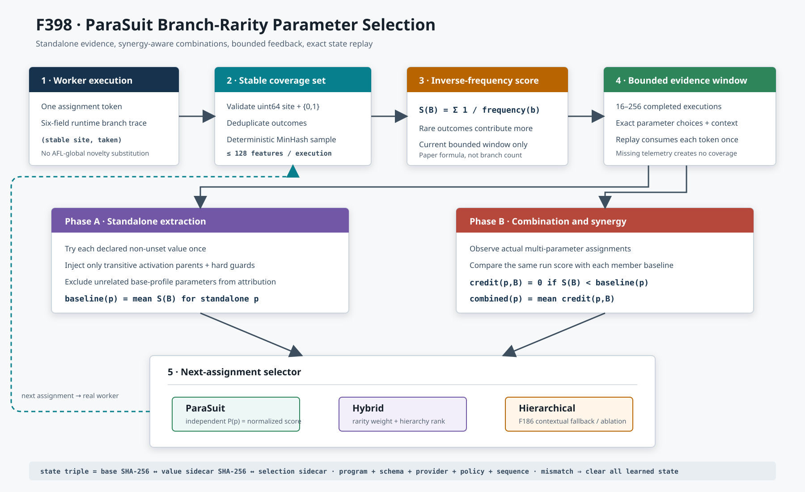

# F398：ParaSuit Branch-Rarity Parameter Selection 与 Synergy-Aware Hybrid Policy

**日期：** 2026-08-13  
**成熟度：** I/T/E-mechanism（生产接线、完整回归、机制实验；尚无公开目标等 CPU 效果结论）  
**上游基线：** ParaSuit ICSE 2026，官方仓库提交
`e991924b827db80b117e1f5389fe07820bad13f0`

## 1. 研究问题与结论

F396 让 coordinator、query solver 和 campaign 参数能够从真实可执行组件发现，并按
生命周期路由；F397 进一步为 task 参数实现了程序绑定的值空间、MeanShift 与 silhouette
门。但“下一次同时打开哪些参数”仍由 F186 的层次化影响分数决定，并没有实现 ParaSuit
论文的 standalone baseline、分支稀有度和组合惩罚。

F398 闭合这一缺口：先隔离执行每个参数的声明值，建立独立覆盖基线；再从真实组合执行
中计算逆频率分支得分，如果组合收益低于某成员的独立基线，就把该成员在本次组合中的
credit 置零；最终用归一化 credit 直接采样参数，或与 F186 hierarchy rank 融合。所有
学习结果都只是调度偏好，不能绕过真实 worker 执行、候选重放或 AFL corpus 接纳。



## 2. 在并行执行流中的准确位置

一次 MPI work item 的相关顺序如下：

1. master 根据 seed、路径上下文和当前策略请求一个 parameter assignment；
2. 在初始 extraction 阶段，assignment 只含一个被测参数、其传递激活父项和执行器硬
   guard；之后进入 iterative 阶段，按 ParaSuit/hybrid/hierarchical 策略选组合；
3. worker 运行目标，runtime 产生六字段 `SolverTelemetry.branch_trace`；
4. master 先完成原有 seed/solver/adaptive reward 计算，再用同一 assignment token 把
   reward、cost、killed 和 branch outcome 归因给参数策略；
5. F397 消费 `(value,reward,cost)`，F398 同时消费该次真实执行覆盖的
   `(stable site,taken)` 集合；同一 token replay 不会重复计数；
6. 下一次 assignment 重新计算 bounded window 内的频率、baseline 和组合 credit。

这里有三种不同的 bitmap/覆盖表示，职责不能互换：

| 表示 | 生成位置 | F398 是否使用 | 目的 |
| --- | --- | --- | --- |
| QSYM branch-interest bitmap | runtime/worker 的分支求解路径 | 否 | 判断分支是否值得再次求解，减少重复 query |
| `branch_trace(site,taken)` 集合 | runtime telemetry，经 master 严格解析 | **是** | 学习参数对动态分支结果的贡献 |
| AFL edge bitmap | AFL-instrumented target concrete replay | 否 | worker 预过滤和 master/global owner 的最终 corpus novelty |

F398 没有使用“AFL 全局新增位数”作为参数覆盖集合。全局 novelty 是并发先到先得的
campaign 状态：同一配置的真实覆盖可能因其他 worker 抢先声明而变成零，不适合估计参数
本身的覆盖贡献。`branch_trace` 则与本次 assignment 同源、可精确归因；AFL bitmap 继续
保持最终接纳权威，不受参数学习器影响。

## 3. 覆盖特征与有界窗口

### 3.1 稳定 branch outcome

每条 telemetry 只投影为：

```text
feature = decimal_uint64_site ":" (taken ? "1" : "0")
```

非法 tuple、零 site、布尔伪装整数、超过 `uint64` 的 site 均丢弃。特征先去重；若一次
运行超过上限，则按 `BLAKE2b-64(feature)` 的稳定顺序做 MinHash 子样本，再按文本排序
保存。相比简单保留低编号 site，MinHash 不系统偏向模块前部，同时在 trace 顺序变化时
仍得到相同集合。

默认每次最多 128 个特征，可配置范围 16--128；历史默认 128 次，可配置范围 16--256。
因此内存与持久化为 `O(window × features)`。合法 site 字符串最多 22 字节，最大窗口仍在
4 MiB 单快照读取门以内。没有 branch telemetry 时只增加 `missing_coverage`，不制造空
覆盖或零收益 baseline。

### 3.2 逆频率得分

令当前窗口全部运行覆盖集合的并集为 `TotalB`，分支结果 `b` 在多少次运行中出现记为
`Frequency(b,TotalB)`，一次运行覆盖集合 `B` 的得分为：

\[
S(B)=\sum_{b\in B}\frac{1}{\operatorname{Frequency}(b,TotalB)}.
\]

同一执行内先去重，所以这是“有多少个执行覆盖该 outcome”，不是循环次数。常见 outcome
的边际权重下降，稀有 outcome 获得更高权重。分母来自同一个 bounded window，最小为 1，
不存在除零或非有限值。

源码审计发现：上述官方提交的 `result_analyze.py` 先计算了 `freq_score=1/value`，但后续
求和实际使用 `branch_count`。F398 遵循论文公式，并加入一个差分反例：两个各覆盖一条
分支的参数若分别覆盖频率 4 和 1，分支个数算法给出相同分数，而 F398 精确给出 0.25 与
1.0，稀有分支参数必须排在前面。此处不把参考实现中的变量替换行为复制为算法语义。

## 4. 两阶段参数贡献估计

### 4.1 Standalone extraction

策略在启动时冻结 provider 声明的 task 参数值；当前生产 registry 自动发现 query solver
时共有 62 项：28 task、23 query-service、11 coordinator-campaign。只有 28 个 task 参数
参与 work-item 采样，当前声明空间共有 88 个非 unset 值。

每个声明值完成一次真实执行前，不进入组合策略。抽取 assignment **不继承无关
base profile**，只包含：

- 当前被测参数和值；
- 为满足 `active_when` 所需的传递父参数；
- `_apply_guards` 强制的 exact/sampling 一致性项。

例如单测 `SYMCC_POLY_RENAME_EXACT_PROBES=2` 时，会补齐 field renaming、exact
projection、projected reuse、cross-prefix、poly cache 和 sampling executor，但不会把输入
base profile 的 Backsolver 或 prefix-context-cache 归因给它。动态值扩展不会重新触发
无穷 extraction，因为遍历的是初始化时冻结的声明值集合。未下发 assignment 可
`abandon` 后重试；完成但缺 telemetry 的值不会伪造 baseline，后续因证据不足回退。

参数 `p` 的独立基线为其 standalone 执行得分均值：

\[
\operatorname{Baseline}(p)=\operatorname{mean}\{S(B_i)\mid i
\text{ is standalone for }p\}.
\]

### 4.2 Combination credit 与 synergy penalty

进入 iterative 阶段后，对一次选择集合 `P_i`、覆盖集合 `B_i` 的运行，为每个
`p∈P_i` 计算：

\[
\operatorname{Credit}(p,B_i)=
\begin{cases}
0,&S(B_i)<\operatorname{Baseline}(p),\\
S(B_i),&\text{otherwise}.
\end{cases}
\]

再对窗口内包含 `p` 的组合样本取平均；没有组合样本时暂用独立 baseline。该惩罚不是
“证明参数有因果贡献”，而是阻止一个在组合中连自身独立表现都达不到的参数继续分享全部
reward。所有参数的 combined score 除以窗口最大值，得到 `[0,1]` 概率尺度。

固定 oracle 有四个 branch outcome：

| 观测 | 参数 | outcomes | 稀有度得分 |
| --- | --- | --- | ---: |
| standalone | A | `11:0,12:1` | 1.5 |
| standalone | B | `13:0` | 0.5 |
| iterative | A+B | `11:0` | 0.5 |
| iterative | B | `13:0,14:1` | 1.5 |

因此 A 的组合得分 0.5 低于 baseline 1.5，被置零；B 的两个 credit 为 0.5 和 1.5，
均值 1.0。最终 normalized score 精确为 `A=0,B=1`。

## 5. 三种可消融选择策略

`SYMCC_SELF_CONFIG_PARAMETER_POLICY` 支持：

- `parasuit`：每个 active 参数按 normalized score 独立 Bernoulli 准入；无人命中时按
  加权无放回选择至少一个，超过 `SYMCC_SELF_CONFIG_PARAMETERS` 时再加权裁剪；
- `hybrid`（默认）：`w_p=α·rarity_p+(1-α)·hierarchy_rank_p`，默认 `α=0.6`；
- `hierarchical`：完整保留 F186 的 impact、全局/上下文不确定性排序，作为消融基线。

当没有 standalone baseline、窗口没有合法特征或所有 normalized score 为零时，
`parasuit/hybrid` 都失败关闭到 hierarchical，不会让空模型随机支配 campaign。F397 仍在
已选参数内部决定值；F398 决定参数集合，两层职责分离。

## 6. 三文件状态一致性

F398 增加 `.self_config_state.json.parameter-selection.json`，形成：

```text
base state ←SHA-256→ value-space sidecar ←SHA-256→ selection sidecar
```

selection sidecar 同时绑定 base/value 字节摘要、sequence、observations、task schema、
provider provenance、program identity 和精确 parameter-policy 配置。F397 记录“实际从同一
描述符认证并导入”的 base/value 摘要；F398 只读取一次 selection 文件并与这两个已导入
摘要比较，不按路径重开 base/value，从而避免三文件 check/use 替换竞态。

以下任一情况都会清空 base posterior、F397 value history 和 F398 coverage history：第三
sidecar 缺失或是 symlink、摘要不一致、程序/registry/策略变化、记录 schema/顺序/界限
非法、计数畸形。in-flight assignment 的 `selection_phase` 以枚举值
`extraction|iterative` 受限恢复，避免重启后把独立样本误标为组合样本。发布使用同目录临时
文件、file `fsync` 和 `replace`；当前没有 directory `fsync` 或跨三文件 generation commit，
所以只声明原子可见与 torn-triple 检测，不声明断电目录项耐久性。

## 7. 验证与结果

### 7.1 正确性和回归

- F398 定向 11 项：provider scope、strict/MinHash 特征、精确论文 oracle、官方替换行为
  差分反例、rarity selection、activation isolation、replay/missing telemetry、控制值总化、
  三文件 torn/missing/symlink、验证后替换、pending phase 恢复、CLI/MPI 接线；
- 自配置相关回归 35 passed；扩展的 MPI/feedback/orchestration 回归为
  272 passed + 116 subtests；
- 完整 capability-closed Python gate 为 **980/980 passed + 235 subtests**，规范 node-ID
  SHA-256 为 `782be6b21572ad366f61de540685b0fccf8be280114a5db3ba8316f386cfc99a`，
  skip/xfail/xpass/deselection/missing/unexpected 均为零；
- LLVM 17/18 定向各 1/1；完整 LLVM 18 lit 为 260 discovered、259 passed、1 个既有
  unsupported；
- 1,000/1,000 随机 analysis 满足有限/非负/归一化/窗口性质，1,000/1,000 随机 trace
  在逆序输入下产生相同 MinHash 集合。

### 7.2 本机机制开销

固定四观测 oracle 上执行 1,000 次：

| 操作 | median | p95 | maximum |
| --- | ---: | ---: | ---: |
| branch-rarity analysis | 3.716 us | 3.786 us | 6.630 us |
| F186 hierarchical parameter selection | 9.274 us | 10.425 us | 78.758 us |
| F398 ParaSuit parameter selection | 22.554 us | 23.215 us | 31.598 us |
| 128 条 branch trace MinHash | 79.099 us | 84.758 us | 92.989 us |
| 绑定三文件状态的冷恢复 | 700.904 us | 791.521 us | 2981.304 us |

1,000 次 analysis 和 selection 各只有一个 digest；恢复 1/1 coverage observation，零状态
拒绝。测试状态大小为 base 15,534 B、value sidecar 923 B、selection sidecar 925 B。
这些数字只量化合成小窗口的 Python 机制成本，没有运行公开目标、solver campaign 或
AFL coverage 试验，**不支持 coverage、solver throughput、bug yield 或端到端 speedup
结论**。

## 8. 创新性、挑战性与剩余边界

1. **把论文参数选择嵌入并行因果边界。** 用 assignment-local branch outcome 估计配置
   表现，同时保留 AFL 全局 novelty 的 corpus 权威，避免并发竞争污染贡献估计。
2. **独立抽取不是“关掉所有父项”。** 条件参数 DAG 要求某些技术只能在 sampling/poly
   上下文生效；传递父项与 hard guard 构成最小可执行环境，而 token 仍只归因目标参数。
3. **值选择与参数选择正交组合。** F397 silhouette 决定值，F398 rarity/synergy 决定集合，
   F186 hierarchy 提供冷启动和消融，不把单一论文机制变成不可回退的全局策略。
4. **确定性有界抽样。** MinHash 解决 trace 截断的低 site 偏差，并使顺序变化不破坏复现；
   triple state binding 防止三个学习层跨目标、跨策略或 torn publication 混用。
5. **参考实现差异有可执行反例。** 论文公式与官方源码变量使用的差异由测试固定，不依靠
   文档口头判断。

仍未闭合的研究工作是：在 ParaSuit 12 个程序和本项目公开/LAVA-M 目标上进行固定版本、
相同初始 corpus、相同总 CPU、至少 5 个种子的 `hierarchical/parasuit/hybrid` 消融；报告
branch coverage AUC、time-to-coverage、accepted/CPU-hour、solver cost、方差和效应量。
另外还需做 sklearn MeanShift cross-oracle、query-service/campaign 配置隔离进程池，以及
目录耐久和跨文件 generation commit。它们不能用本报告的机制测试数字替代。

## 9. 资料

- [ParaSuit, ICSE 2026 官方页面](https://conf.researchr.org/details/icse-2026/icse-2026-research-track/222/Enhancing-Symbolic-Execution-with-Self-Configuring-Parameters)
- [ParaSuit 官方实现](https://github.com/skkusal/ParaSuit)
- [BLAKE2](https://www.rfc-editor.org/rfc/rfc7693)
- [Broder, Min-wise Independent Permutations](https://doi.org/10.1145/258525.258948)
