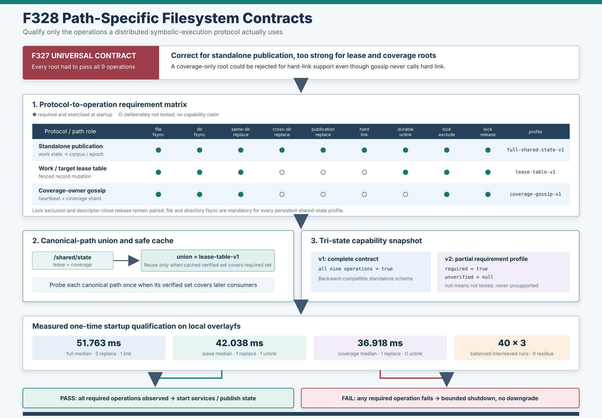

# F328：按路径区分的共享文件系统能力契约

- 日期：2026-08-07
- 功能编号：F328
- 成熟度：I/T/E-mechanism
- 代码范围：分布式状态原语、hybrid MPI frontend、standalone MPI兼容边界
- 证据范围：调用点审计、条件探针、三态快照、故障注入、40×3交错成本实验、完整Python回归

## 1. 研究问题

F327把目录持久化、原子替换、hard link、durable unlink和跨进程`flock`从隐含部署假设变成了
启动前可执行契约。但它对每一个共享根执行同一组九项检查。该策略对standalone的
`hidden work state → public corpus`协议是必要的，对只保存lease record或coverage shard的路径
却过强：一个coverage-only根即使永远不调用hard link，也可能因为hard link不受支持而被拒绝。

这不是“更严格总是更安全”的问题。能力探针的目标是证明**当前协议的必要前提**；检查协议不依赖的
操作会产生false deployment rejection，也会增加同步写、目录元数据操作和一次性启动成本。反过来，
若多个协议共用同一路径，只缓存先执行的较弱结果又会造成漏检。因此F328研究的问题是：

> 如何把共享文件系统准入从单一布尔能力表改为按协议、按路径、可合并、可审计的最小必要契约，
> 同时保持F327的失败关闭和standalone完整验证不退化？



## 2. 技术依据与定位

OSDI'14的研究表明，应用级crash-consistency protocol依赖具体atomicity和persistence ordering，
不能仅凭“POSIX兼容”或文件系统名称推断。
[All File Systems Are Not Created Equal](https://www.usenix.org/system/files/conference/osdi14/osdi14-paper-pillai.pdf)
Linux文档又明确区分文件内容`fsync`与包含该文件的目录项持久化，并限定`rename`跨挂载边界会以
`EXDEV`失败。[fsync(2)](https://man7.org/linux/man-pages/man2/fsync.2.html)、
[rename(2)](https://man7.org/linux/man-pages/man2/renameat2.2.html)

这些事实支持operation-level probe，但不要求所有协议检查相同操作。F328采用类似能力系统的思路：
每个协议声明required operation set；启动资格是`observed ⊇ required`；同一路径承载多个协议时，
要求集合取并集。项目贡献是面向并行符号执行状态协议的工程化组合与证据闭环，不声称发明新的
filesystem primitive，也不把本机探针表述为跨节点或掉电恢复证明。

## 3. 调用点审计

本轮没有从F327的九项列表反推“看起来合理”的子集，而是逐个审计真实writer：

| 路径角色 | 真实状态变更 | 必要操作 | 明确不需要 |
| --- | --- | --- | --- |
| standalone work state + corpus | epoch hard-link、跨目录stage promotion、删除与fenced record | 全部九项 | 无 |
| work/target lease table | temp file-fsync、同目录replace、record删除、稳定inode锁 | file/dir fsync、same-dir replace、durable unlink、lock exclude/release | cross-dir/publication replace、hard link |
| coverage-owner gossip | heartbeat/shard temp file-fsync、同目录replace、稳定inode锁 | file/dir fsync、same-dir replace、lock exclude/release | cross-dir/publication replace、hard link、durable unlink |

审计过程中发现并修复了两个容易遗漏的问题：

1. 初版把lease和coverage合成同一profile，仍对coverage多要求`durable_unlink`；F328最终拆分为
   `lease-table-v1`与`coverage-gossip-v1`；
2. 仅按canonical path缓存单个snapshot存在“弱profile先执行、强profile错误复用”的潜在风险；
   F328在preflight阶段先合并同路径要求，并且运行期只在缓存verified set覆盖新required set时复用。

## 4. Profile模型

新增不可变`SharedFilesystemRequirementProfile`，固定描述九项操作是否必须验证：

| Profile | required数量 | required operations |
| --- | ---: | --- |
| `full-shared-state-v1` | 9 | 全部九项 |
| `lease-table-v1` | 6 | file/dir fsync、same-dir replace、durable unlink、lock exclude/release |
| `coverage-gossip-v1` | 5 | file/dir fsync、same-dir replace、lock exclude/release |

构造期执行四类结构约束：profile名称必须是最多64字符的小写稳定标识；每个operation字段必须是
精确`bool`而不是任意truthy值；持久共享状态必须要求file和directory fsync；lock exclusion与
descriptor-close release必须成对声明。`merge_shared_filesystem_requirements()`遍历唯一权威操作表
计算精确并集，避免前端复制字段列表后随版本漂移。

## 5. 条件探针与三态快照

`probe_shared_state_filesystem(..., requirements=profile)`保留F327的随机私有tree、有限timeout、
内容回读、两个隔离锁child和finally清理，但只执行profile要求的阶段：

```text
always: create durable private tree → file fsync → directory fsync
if required: same-dir replace
if required: cross-dir replace
if required: actual publication-boundary replace
if required: hard-link + inode identity
if required: durable unlink
if required: child A lock exclusion → close(fd) → child B lock release
finally: remove private trees → fsync parents
```

成功快照采用三态而不是二态：

- `true`：该操作在当前真实根上已执行并通过回读或行为判定；
- `null`：该profile不要求，本次没有测试，不产生支持或不支持结论；
- required operation失败：不返回带`false`的成功快照，而是抛出
  `SharedFilesystemCapabilityError`并关闭启动。

完整九项均验证时继续输出F327兼容的
`symcc-shared-filesystem-capabilities-v1`；部分profile输出v2，并额外包含
`requirement_profile`、`required_operations`和`unverified_operations`。因此旧standalone日志和
F327证据语义不变，hybrid日志又能机器可读地区分“已验证”和“未测试”，避免把`null`误写成
unsupported。

## 6. 前端执行流程

### 6.1 Standalone

`_SharedWorkCoordinator`继续在epoch metadata之前使用完整profile，并把实际corpus作为
`publication_root`。F328没有为了减少成本而削弱跨目录publication或hard-link资格。

### 6.2 Hybrid

hybrid master在任何async query service、object store或共享owner启动前执行：

1. 读取multi-master work lease、target lease、coverage gossip开关及其真实配置路径；
2. 对每个路径执行`abspath → realpath`规范化；
3. 将同一canonical path上的profile取operation union；
4. 逐path执行有限能力探针；任一required operation失败时执行bounded STOP/exact ACK并返回失败；
5. 保存每个path的一个或多个snapshot；后续请求只有在`required ⊆ cached.required_operations`时复用；
6. 资格通过后才构造work/target lease table、coverage gossip和其他服务。

当work lease与coverage显式共用`/shared/state`时，并集恰好等于`lease-table-v1`，只探测一次；
coverage-only部署则使用五项profile，不再被durable unlink或hard link能力无关地阻断。

### 6.3 Library调用

`FencedWorkLeaseTable`与继承它的`FencedTargetLeaseTable`默认使用lease profile；
`CoverageOwnerShardGossip`默认使用coverage profile。独立调用者可通过
`verify_filesystem=True`启用constructor gate，也可显式传入更强profile。MPI frontend仍在顶层统一
preflight，避免每个对象重复启动锁child。

## 7. 正确性不变量

| 编号 | 不变量 | 实现方式 |
| --- | --- | --- |
| P1 | 每个协议只跳过经调用点审计确认不使用的操作 | 三个具名不可变profile + 审计表 |
| P2 | skipped不等于unsupported | v2字段为JSON `null`并列入`unverified_operations` |
| P3 | required失败不能降级 | probe直接抛出并进入前置shutdown gate |
| P4 | 同路径多协议不能由弱结果冒充强结果 | preflight取并集；cache执行set-inclusion检查 |
| P5 | profile演进不能漏掉新operation | 合并逻辑与快照遍历同一权威operation tuple |
| P6 | 锁的两个反事实必须一起证明 | profile构造拒绝只声明exclusion或release |
| P7 | standalone的F327保证保持不变 | 默认完整profile仍输出v1并执行九项 |
| P8 | library与frontend默认契约一致 | lease/coverage constructor分别绑定同一常量 |
| P9 | 探针成功后不留测试对象 | 每个profile真实残留检查均为0 |

## 8. 自动化验证

完整证据位于
[`F328 evidence`](../evidence/f328-path-specific-filesystem-contracts-2026-08-07/)。

| 门禁 | 结果 |
| --- | ---: |
| profile/故障/前置gate定向测试 | 17 passed，143 deselected |
| distributed state + MPI lifecycle + AFL profile | 216 passed + 21 subtests |
| 完整`pytest -q -W error test` | 673 passed + 41 subtests，94.04 s |
| Ruff / `py_compile` / `git diff --check` | 全部通过 |

测试覆盖：lease跳过三项操作、coverage再跳过durable unlink、required replace失败关闭、非法profile、
不相交profile精确并集、v1/v2 schema、`true/null`映射、constructor默认profile、三类preflight路径、
同路径去重与强profile保留、hybrid服务前失败及standalone完整契约兼容。

## 9. 真实成本实验

`benchmark_requirement_profiles.py`在Linux 7.0、Python 3.12.3、本机overlayfs上先用wrapper记录
真实helper调用数，再对三个profile各执行2次warm-up和40次计时。计时顺序按三种旋转交错，降低
单向热机或时间漂移偏差；每次仍启动两个全新Python锁child。

### 9.1 确定性操作削减

| Profile | probe file writes | durable replace | hard link | durable unlink | lock child |
| --- | ---: | ---: | ---: | ---: | ---: |
| full | 4 | 3 | 1 | 1 | 2 |
| lease | 3 | 1 | 0 | 1 | 2 |
| coverage | 2 | 1 | 0 | 0 | 2 |

三个instrumented snapshot均通过预期计数，未发现schema错误或probe residue。操作数量减少是由控制流
和调用计数直接证明的实现事实，不依赖计时显著性。

### 9.2 一次性启动延迟

| Profile | 中位 | 均值 | 经验P95 | 最大 | 相对full中位 |
| --- | ---: | ---: | ---: | ---: | ---: |
| full | 51.763 ms | 52.368 ms | 55.370 ms | 57.686 ms | 1.0000 |
| lease | 42.038 ms | 42.343 ms | 44.823 ms | 45.634 ms | 0.8121 |
| coverage | 36.918 ms | 37.461 ms | 41.486 ms | 45.067 ms | 0.7132 |

在该环境中，lease与coverage的中位一次性探针延迟分别比full低9.725 ms（18.79%）和14.845 ms
（28.68%）。这是40次本机交错样本上的observed startup-cost reduction，不是跨机器置信区间，
也不是符号执行、solver、coverage或fuzzing吞吐提升。两个锁child仍是三个profile共有的固定成本；
在高延迟分布式文件系统上，绝对值和各阶段占比都可能不同。

## 10. 先进性、创新性与挑战性

1. **Requirement-aware executable contract。** 准入不再是文件系统类型白名单或统一自测，而是
   协议声明、真实路径执行和机器可读证明三者闭环。
2. **三态证据语义。** `true/null/exception`分别表达已验证、未测试和不满足required，避免二态表
   把缺失证据错误解释为负能力或正能力。
3. **以集合包含约束缓存。** capability cache不只按路径命中，还证明cached verified set覆盖调用者
   required set；这是防止co-location优化破坏正确性的关键。
4. **最小契约与失败关闭并存。** aggressive optimization没有把required错误改成warning，也没有
   削弱standalone publication；优化对象是无关检查，而非一致性保证。
5. **审计驱动的再细分。** 初版lease/coverage profile仍有多余unlink，本轮通过真实writer审计继续
   拆分，说明profile不是静态标签，而是可由调用图和实验证据校正的协议接口。

实现挑战在于同时处理兼容性和组合性：若直接修改v1字段为false，会污染历史语义；若只为每个根
缓存第一个结果，会在路径复用时漏检；若为每个consumer重复探测，又失去去重收益。F328通过v2
三态schema、并集preflight和set-inclusion cache把三者统一起来。

## 11. 局限与有效性威胁

1. 测试仍是同机subprocess，`cluster_lock_verified=false`；未验证第二台NFS/CIFS/Lustre client；
2. 没有server restart、lock-manager failover、network partition、kernel panic或物理掉电；
3. 40次计时来自单台overlayfs主机，没有置信区间、跨主机重复或冷缓存控制；
4. operation wrapper证明helper调用次数，不是kernel syscall trace；目录创建/清理中的fsync未逐次归因；
5. 成功probe只覆盖有限operation trace，不能形式化证明所有并发interleaving；
6. `flock`仍是advisory，非协作writer可以绕过；
7. 本轮没有运行真实target、LAVA-M、solver或coverage campaign，因此不能声称DSE效果提升；
8. 关闭`SYMCC_SHARED_STATE_FS_PROBE`时，运维方仍需自行承担部署资格验证；
9. v2 consumer必须保留JSON `null`语义，不能通过布尔转换把它当成false；
10. profile正确性目前依赖代码审计和测试，未来可从声明式storage protocol自动生成探针与静态检查。

## 12. 后续研究

优先方向不是继续减少本机检查，而是扩大证明范围：由不同hostname的进程对同一inode执行交叉锁
litmus，绑定mount options与server identity；随后注入client pause、server failover与network
partition。另一个方向是借鉴CrashMonkey/B3的bounded crash-state生成，对每个具名profile自动
生成最小operation trace、crash points与恢复oracle，从“调用返回能力”升级为“特定协议的恢复
一致性证据”。[CrashMonkey/B3, OSDI'18](https://www.usenix.org/conference/osdi18/presentation/mohan)

## 13. 结论

F328把F327的统一九项资格测试升级为按协议和真实路径组合的最小必要契约。standalone完整九项保持
不变；lease根验证六项；coverage根验证五项；同路径按并集合并，缓存按集合包含复用。v2三态快照
明确区分“已验证”与“未测试”，required失败仍在服务启动前关闭。新增五项测试使完整回归达到
673 passed加41 subtests；40×3真实交错实验中，lease和coverage相对full分别减少2次replace及
hard-link，并观察到18.79%和28.68%的一次性中位启动成本下降。该结果严格限定为本机启动资格优化，
不外推为符号执行吞吐、coverage提升、跨节点锁正确性或掉电恢复证明。
