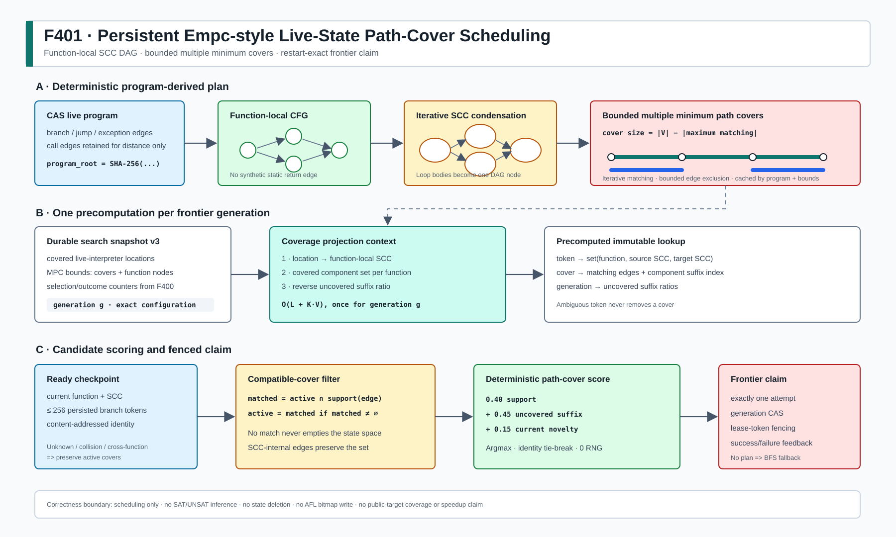

# F401：持久化 Empc 式 Live-State 多重最小路径覆盖调度

- 日期：2026-08-14
- 功能编号：F401
- 状态：`I/T/E-mechanism`
- 工作包：W1 通用原生 continuation 与 live-state search
- 证据目录：[`f401-persistent-empc-live-path-cover-2026-08-14`](../evidence/f401-persistent-empc-live-path-cover-2026-08-14/)
- 配置入口：`SYMCC_LIVE_SEARCH=path-cover`

## 1. 研究问题与完成边界

已有 `MinimumPathCoverPlanner` 根据**执行完成后的 concrete trace**更新 seed/PrefixDAG
优先级。F391 的持久 continuation frontier 则保存真正可恢复、可继续 fork 的 pending
symbolic state。二者的对象、反馈时刻和故障协议不同；把 seed score 直接复制到 ready
checkpoint 既不是 live-state Empc，也不能保证多 worker 重启等价。

F401 完成的切片是：在函数内 CFG 的 SCC condensation DAG 上构造有界的 multiple
minimum path covers（MPC），用 checkpoint 已持久化的 branch-token 前缀筛选兼容 cover，
再以未覆盖后缀收益对 durable ready state 做确定性选择。它已经进入本地 `resume()` 和
`PersistentLiveStateFrontier.claim()` 的生产路径，并由 snapshot、generation CAS 和 lease
fencing 保护。

严格边界如下：

- 已实现 Empc 思想中的 live-state MPC 构造、兼容 cover 收缩和覆盖后缀调度；
- 没有宣称逐行复现 Empc artifact，edge-exclusion 搜索有显式预算，不穷举全部最大匹配；
- 尚未实现 Compatible Branch Coverage（CBC）、Concrete Constraint Guided Selection
  （CGS）和 TopSeed；
- 本报告只有机制正确性和本机开销，没有公开目标 coverage、solver throughput、
  bug-yield 或端到端 speedup 结论。

背景方法参考：[Empc: Effective Path Prioritization for Symbolic Execution with Path
Cover](https://arxiv.org/abs/2505.03555)。本地实现以项目的 content-addressed continuation
和事务 frontier 为约束，不把论文结论直接外推到本项目。

## 2. 生产执行流程



一次选择按以下顺序执行：

1. worker 从 CAS 读取 program 与 ready checkpoint descriptor；
2. `LiveProgramGraph` 只在策略包含 `path-cover` 时构造 MPC；
3. 对每个函数提取本地 CFG，call edge 只保留给全局距离分析，不进入函数内 cover；
4. 迭代 SCC 算法折叠循环，得到 DAG；
5. DAG 的 split-node 二分图执行最大匹配，最小路径覆盖大小为
   `|V| - |maximum matching|`；
6. 对匹配边做有界、确定性的 exclusion，保留至多 N 个不同最小 cover；
7. 当前 frontier generation 的 location coverage 一次性投影到函数 SCC，并反向预计算
   每个 cover、每个 component 的未覆盖 suffix ratio；
8. 每个 checkpoint 的 `search_branch_path` 解析为稳定 decision token，逐步收缩与该动态
   前缀兼容的 cover 集；
9. policy 对 candidate score 做确定性 argmax；若没有可用 plan，严格退化为 BFS；
10. F400 selection transition 原子记录一次 attempt，frontier 再用 generation CAS + lease
    token 提交 claim。执行完成或失败仍走 F400 的 observation transaction。

因此 MPC 不参与 SAT/UNSAT 判定、不删除 symbolic state、不写 AFL bitmap，也不改变
checkpoint 内容身份；它只改变同一 ready 集合中的领取次序。

## 3. 图模型与算法细节

### 3.1 为什么必须使用函数内 cover

当前 continuation program 的 call edge 指向 callee entry，但 CFG 图没有一条静态唯一的
return edge：返回点存于动态 frame。若在这个不完整的 interprocedural graph 上求 cover，
会把“进入 callee 后无法返回”错误当作静态路径事实。F401 因而维护两张图：

- `adjacency`：保留 call edge，供 target/uncovered distance 使用；
- `local_adjacency[function]`：只含 branch、jump、exception 和 normal continuation edge，
  专用于 SCC/MPC。

checkpoint 位于哪个函数，就只消费该函数的 cover。来自 caller、callee 或历史调用实例的
token 若不能在当前函数唯一解释，均不缩小 active set。

### 3.2 循环折叠与迭代实现

路径覆盖要求 DAG。F401 先把强连通分量折叠为单个 component；component 内的循环选择不
被误当成必须反复覆盖的无限路径。初版审查发现原 CFG SCC 使用递归 Tarjan，合法的 1500
块深链可能超过 Python recursion limit。最终实现改为确定性的迭代 Kosaraju；独立
reachability oracle 对 1--5 节点图验证了“同 SCC 当且仅当互相可达”，1500 块生产图也
有直接回归。

### 3.3 多重最小路径覆盖

对 SCC DAG `G=(V,E)` 创建左右两份节点，求最大二分匹配 `M`。匹配边首尾相接形成
vertex-disjoint paths，cover 大小为 `|V|-|M|`。单一最大匹配可能武断偏好 diamond 的一
条臂，因此 F401 复用 seed planner 的同一个公共纯函数：

```text
M0 = maximum_matching(G)
queue = {禁止 M0 中某条边的约束集}
while queue 非空且 cover 数量/搜索预算未耗尽:
    Mi = maximum_matching(G, forbidden_edges)
    仅当 |Mi| = |M0| 时接纳为另一个 minimum cover
```

最大匹配的 augmenting path 也由递归改为迭代 BFS。所有不超过 5 节点的 DAG 已用穷举
matching-size oracle 对拍；1500 节点线性 DAG 验证不会递归溢出。搜索预算为
`max(32, 16 * max_covers)` 次 forbidden state，避免唯一 cover 的 4096 节点函数做 O(V)
次无收益重匹配。这是**有界 alternatives 搜索**，不是全部 maximum matching 枚举。

### 3.4 稳定 branch token 与保守解释

executor 在 symbolic branch/`throw_if` 分叉时已经把下式的前 64 位存入 checkpoint：

```text
token = uint64_be(SHA256(str(site) || NUL || str(choice))[0:8])
```

F401 将 token 映射为 `(function, source_component, target_component)`。映射只有在当前函数
恰好唯一时才可收缩 active cover：

```text
supporting = {cover | selected_edge in cover.edges}
matched = active intersect supporting
if matched is not empty:
    active = matched
```

未知 token、同一 site 重用、64 位摘要碰撞、另一个函数的选择、SCC 内边以及不属于保留
cover 的边都不会清空 active set。这种处理可能少用一条启发信息，但不会因歧义错误丢弃
可执行状态。

### 3.5 候选得分

对每个 checkpoint 计算三个 `[0,1]` 信号：

- `support`：最近可解释边在当前 active cover 中的支持比例；
- `remaining`：active covers 中，从当前 component 到所在 cover path 末端的最大未覆盖
  component 比例；
- `current_uncovered`：当前 SCC 是否尚未在 live interpreter location set 中观察到。

当前工程先验为：

```text
score = 0.40 * support + 0.45 * remaining + 0.15 * current_uncovered
```

这是独立、可消融的 `path-cover` policy，不与 F400 的 multi-objective learned outcome
公式混合。相同 score 用 checkpoint identity 稳定打破平局；策略不消耗随机流。没有 plan
时保留 ready 顺序并选择第一个候选，即 BFS fallback。

### 3.6 Frontier-generation 预计算

直接对 C 个 candidate 分别扫描 L 个 covered location，会产生 `O(C*L)` 调度开销。F401
改为每个 generation 只做一次：

1. `O(L)` 把 location 投影到函数 component；
2. `O(K*V)` 反向计算 K 个 cover 上每个 component 的 uncovered suffix ratio；
3. 每个 candidate 只扫描至多 256 个持久 token 和至多 K 个 active cover。

cover path 的 component-to-suffix 索引也在 program graph 构造时固定。program graph cache
键包含 program root、两个 MPC bound 和 enable flag，不会把不同策略配置的图混用。

## 4. 持久化、并发与恢复

F401 把 search snapshot 从 v2 升为 v3，新增：

- `path_cover_max_covers`；
- `path_cover_max_function_nodes`。

v1 恢复为空 outcome history，v2 保留 outcome history；二者都用 `8/4096` 默认 MPC
边界升级为 v3。两个边界进入 `_configuration()`，所以中途修改环境会被 frontier
transition verifier 识别为配置漂移。集成测试让第一个 worker 用 `2/32` 建立 frontier，
第二个 worker 故意以 `8/4096` 启动；恢复后仍使用持久的 `2/32`，随机 draw 保持 0，且
完成同一 ready partition。

cover plan 本身不写 snapshot：它是 `program_root + bound` 的确定性派生物。这样避免把
大图复制到每次 frontier transaction，又能由 CAS program 在重启后重建同一 plan。

普通和持久执行结果都公开 `state_search.path_cover_graph`，包含 enable 状态、函数总数、
准入/超限函数数、SCC component、retained cover、decision token 和歧义 token 数量。
这些字段使实验可以区分“策略被配置”“实际建出 plan”和“因边界退化为 BFS”；它们只是
确定性派生 telemetry，不进入 snapshot，也不改变 lease/CAS 正确性状态。

## 5. 实现映射

| 文件 | 作用 |
| --- | --- |
| `util/path_cover.py` | 公共 MPC 枚举、迭代最大匹配、固定 exclusion 预算 |
| `util/live_state_search.py` | 函数内图/SCC/MPC、token 解释、coverage context、`path-cover` policy、snapshot v3 |
| `util/live_continuation.py` | 生产 graph cache、一次/generation context、候选 feature、persistent claim 与公开 graph telemetry 接线 |
| `test/test_path_cover.py` | diamond、循环、恢复、1500 节点迭代 matching |
| `test/test_persistent_live_state_frontier.py` | v1/v2/v3、排序、歧义、超限、深 CFG、确定性恢复 |
| `test/test_persistent_live_continuation.py` | 两个环境不同 worker 的生产持久 frontier 恢复 |
| `benchmark/benchmark_live_path_cover.py` | CFG/MPC、context、batch guidance 与 policy 开销 |

## 6. 配置与失败模式

| 配置 | 默认值 | 范围 | 语义 |
| --- | ---: | ---: | --- |
| `SYMCC_LIVE_SEARCH` | `bfs` | 最多 8 个策略 | 包含 `path-cover` 才构造 live MPC |
| `SYMCC_LIVE_MPC_COVERS` | 8 | 1..256 | 每函数保留的 minimum covers 上限 |
| `SYMCC_LIVE_MPC_FUNCTION_NODES` | 4096 | 16..262144 | 单函数 SCC/MPC 节点准入上限 |

无 plan、超限函数和不可解释 token 是正常 fallback，不是执行错误。非法配置、损坏
snapshot、NaN/越界 candidate score 和 frontier 中途配置漂移失败关闭。
`path_cover_graph` telemetry 可直接审计上述 fallback 是否发生，但不作为恢复输入。

## 7. 测试与结果

### 7.1 正确性门禁

| 门禁 | 结果 |
| --- | --- |
| F401 定向 Python | 37 passed + 6 subtests |
| live/path-cover/persistent/ConDPOR 相关 Python | 199 passed + 57 subtests |
| 完整 capability-closed Python | 1003/1003 passed + 235 subtests |
| pytest identity | 1003/1003，零 missing/unexpected |
| LLVM 17 lit | 261 discovered；259 passed；2 个既有 unsupported；0 failed |
| 静态检查 | Ruff、py_compile、`git diff --check` 通过 |

额外独立 oracle：1099 个全部 1--5 节点 DAG 的迭代 maximum-matching size 与穷举
matching 一致；4626 个有向图的 SCC partition 与双向 reachability 定义一致。

### 7.2 31 样本机制开销

环境：AMD Ryzen Threadripper PRO 9995WX、Python 3.12.3、Linux 7.0.0。每个规模是串联
diamond CFG，保留 8 个 covers。

| CFG 节点 / 候选 | MPC 构建 median / P95 | coverage context median / P95 | 全候选 guidance median / P95 | policy select median / P95 |
| --- | ---: | ---: | ---: | ---: |
| 49 / 32 | 0.607 / 0.712 ms | 0.029 / 0.035 ms | 0.077 / 0.081 ms | 0.009 / 0.019 ms |
| 193 / 128 | 2.898 / 2.957 ms | 0.115 / 0.129 ms | 0.318 / 0.343 ms | 0.023 / 0.027 ms |
| 769 / 512 | 14.992 / 17.843 ms | 0.455 / 0.477 ms | 1.222 / 1.264 ms | 0.075 / 0.080 ms |

disabled graph 构建中位分别为 0.123、0.483、1.889 ms，说明 MPC 有一次性额外构建
成本；它只在显式启用时发生，之后由 bounded LRU program graph cache 复用。该实验未
执行 target、solver、MPI、AFL map 或 fuzzing campaign，不能据此推导覆盖提升。

## 8. 多轮 Review 修复项

1. **语义 review**：拒绝在缺 return edge 的全局调用图上构造 cover，改为函数内图；
2. **恢复 review**：MPC 边界进入 snapshot v3 和 cache key，阻止跨 worker 环境漂移；
3. **正确性 review**：token 一对多时保守忽略，不把 64 位摘要当无碰撞证明；
4. **栈深 review**：递归 matching 与 SCC 均改为迭代实现；
5. **复杂度 review**：唯一 cover 的 exclusion 从随函数节点数增长改为固定预算；
6. **frontier review**：coverage projection/suffix 从每 candidate 重算改为每 generation
   预计算；
7. **公共 API review**：公共 MPC 枚举器增加迭代拓扑检查，环图失败关闭；
8. **声明 review**：live location coverage 与 AFL bitmap 严格区分，不形成 R 级结论；
9. **可观测性 review**：公开实际函数准入、cover/component 和 token 歧义统计，避免只凭
   strategy selection counter 误判生产 plan 已经生效；
10. **配置审计 review**：交付级唯一名称计数暴露了 F144 文档中的陈旧、未实现环境变量
    `SYMCC_CONTINUATION_MAX_HEAP_OBJECT`，按生产源码更正为既有的
    `SYMCC_LIVE_HEAP_OBJECT_LIMIT`，恢复 449 个真实接口的闭合集合。

## 9. 尚未关闭的研究问题

- 用 CBC 的 branch compatibility 替代“匹配边属于 cover”的局部近似；
- 接入 CGS 的 concrete constraint distance，比较其与 MPC 的互补和冲突；
- TopSeed 的从零 seed/state learning，且必须保持 proposal 与 correctness oracle 隔离；
- recursive invocation 目前只有函数过滤，没有 call-instance token；需要 frame-sensitive
  path signature 才能更精确利用递归前缀；
- 在公开 benchmark 上按相同 CPU/corpus/seed 做 BFS、F400、F401 和组合策略消融。

因此 F401 关闭 W1 中“Empc 式 live-state MPC”这一独立切片，W1 整体仍未关闭。
