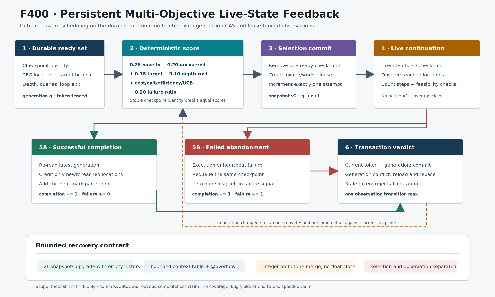

# F400：持久多目标 Live-State 反馈调度

> 日期：2026-08-14  
> 等级：I/T/E-mechanism（生产接线、完整回归、机制开销；没有公开目标覆盖率结论）  
> 代码：`util/live_state_search.py`、`util/live_state_frontier.py`、
> `util/live_continuation.py`  
> 图：[`persistent-multi-objective-live-state-f400.svg`](../diagrams/persistent-multi-objective-live-state-f400.svg)
> / [`PNG`](../diagrams/persistent-multi-objective-live-state-f400.png)  
> 证据：[`f400-persistent-multi-objective-live-state-2026-08-14/`](../evidence/f400-persistent-multi-objective-live-state-2026-08-14/)

> 版本注：本报告记录 F400 封存时的 search snapshot v2。F401 已把当前写入版本升级为
> v3，以绑定 live MPC 构造边界；v2 仍可读取，其 outcome 语义没有改变。

## 1. 研究问题与定位

F391 已经让 continuation checkpoint 进入可恢复的 `ready / leased / done` 前沿，
F59--F390 则逐步补齐可执行状态、内存、异常和 writer graph 语义。但原有持久调度仍有
一个关键断点：一次进程内执行可以使用路径深度、未覆盖距离或随机路径等搜索器，worker
完成后，这些决策的**效果和成本不会形成可恢复的跨 claim 反馈**。重启或多 worker
竞争时，调度器看不到某类状态过去产生了多少新位置、消耗多少步和求解查询、是否重复
失败。

这不是把一个 Python 打分函数接到队列即可解决的问题。持久前沿已有 generation CAS、
lease token 和 observation rebase；若反馈绕过这些边界，两个 worker 可能重复认领同一
份 novelty，迟到结果可能污染新一代策略，或一次 claim 被记成多次学习样本。

F400 的目标是先关闭 W1 的公共接线基础：

1. 让多目标策略直接选择**当前可执行的 continuation state**；
2. 把一次 claim 和一次 outcome 建模为两个可验证的持久事务；
3. 在并发完成时相对最新 generation 重算 location gain；
4. 把执行异常和 heartbeat 失效也变成原子失败反馈，而不是只归还 lease；
5. 保持旧快照可恢复、统计有界、正确性验证边界不变。

研究思想与 [KLEE 的 interleaved search](https://www.usenix.org/legacy/event/osdi08/tech/full_papers/cadar/cadar_html/paper.html)、
[Cloud9 的分布式符号状态调度](https://doi.org/10.1145/1966445.1966475) 和
bandit 式探索/利用平衡有关，但当前实现不是这些系统的实验复现，也不冒充完整
Empc/CBC/CGS/TopSeed。它是为本项目 content-addressed continuation 和 F391 事务协议
定制的工程研究增量。

## 2. 执行架构



一次持久执行的精确次序如下：

1. 从 frontier 最新 snapshot 取至多 `candidate_window` 个 ready checkpoint；
2. 恢复每个 checkpoint 的当前 frame、路径、目标分支和累计执行成本；
3. `LiveProgramGraph` 计算当前位置到未覆盖块、目标 branch 和循环出口的结构特征；
4. `LiveStateSearchPolicy.select_index()` 确定性选出一项，并把该 context 的
   `attempts` 加一；
5. `frontier.claim()` 在同一 selection transition 中验证“恰好一次选择、恰好一次
   attempt”，再创建 owner/worker-bound lease；
6. `LiveContinuationExecutor.resume()` 真实执行该状态，产生 halt 或新的 checkpoint；
7. 成功时重读最新 snapshot，把本次实际到达的位置逐项合并，并只计算相对最新
   `covered_locations` 的增量；
8. `frontier.complete()` 验证 token、generation 和 observation transition，原子加入
   children、移动 parent 到 done、增加一次 outcome；
9. generation 冲突时回到第 7 步重新计算，不能复用旧 worker 的 coverage delta；
10. 执行或 heartbeat 失败时，通过带 observation 的 `abandon()` 原子记录失败并把
    checkpoint 放回 ready；token 已过期时，整个更新返回 `stale` 且零写入。

本地 `resume()` 内部的状态选择和外层 durable claim 分属两个尺度。对外的持久统计只
记录 claim；不能把 claim 内部短期选择次数误报成跨 worker 历史。

## 3. Context 身份与输入特征

每个候选的 outcome context 为：

```text
ctx:SHA256(function:block || NUL || target_branch)
```

其中 location 和 target 共同参与身份，避免“到同一块但追逐不同目标”的成本被错误
混合。当前 context 不是完整调用栈或 heap shape；这是后续结构化 live-state 任务要扩展
的边界。

调度输入包括：

| 特征 | 来源 | 用途 |
| --- | --- | --- |
| `location` | 当前 continuation frame | location novelty 与覆盖距离 |
| `path_depth` | branch decision chain | 避免只追逐深而昂贵的状态 |
| `solver_queries` | state 累计求解数 | query-cost 抑制 |
| `distance_to_uncovered` | live CFG 图 | 引导到尚未执行的 block |
| `distance_to_target` | branch-site 反向距离 | 仅在存在目标 branch 时生效 |
| `exits_cycle` | CFG SCC 与 recent path | 提升离开循环的候选 |
| outcome stats | 持久 snapshot v2 | 学习 location gain、成本和失败率 |

这里的 `coverage_gain` 是 **live interpreter 已执行 CFG location 的集合增量**，不是 AFL
edge bitmap，也不是 native target concrete replay 的 coverage。普通 fuzzing corpus 的
接纳仍由独立 AFL 全局 bitmap 决定。

## 4. 多目标分数

F400 采用确定性 scalarization，先把各信号归一化，再计算：

```text
score = 0.26 * novelty
      + 0.20 * distance_to_uncovered^-2
      + 0.18 * distance_to_target^-2
      + 0.10 * depth_cost
      + 0.08 * solver_cost
      + 0.08 * loop_exit
      + 0.08 * min(4, learned_efficiency)
      + 0.02 * min(4, UCB_uncertainty)
      - 0.20 * min(1, failure_ratio)
```

具体定义为：

```text
novelty           = 1 / (1 + location_visits)^2
depth_cost        = 1 / (1 + log(1 + path_depth))
solver_cost       = 1 / (1 + solver_queries)
completed_cost    = total_steps + 8 * total_solver_queries
learned_efficiency= total_location_gain / sqrt(max(1, completed_cost))
UCB_uncertainty   = sqrt(log(1 + total_attempts) / max(1, context_attempts))
failure_ratio     = failures / max(1, completions)
```

目标距离只在 state 带目标 branch 时进入分数。选择使用最大分数，平分时按稳定 checkpoint
identity 排序，不消费随机数，所以同一 snapshot 在 fresh process 中给出相同结果。
系数是当前工程先验，尚未经过公开 benchmark 的调参或确认性统计；后续 Empc/CBC/CGS/
TopSeed 策略应作为独立可消融 policy，而不是继续向这一公式无限加项。

## 5. 持久状态机与并发不变量

### 5.1 Selection transition

`validate_selection_transition(previous, updated)` 强制：

- 策略、seed、subpath length 和 counter budget 不变；
- `selection_round` 恰好增加一；
- 只有当前 interleaved strategy 的选择计数增加一；
- coverage/subpath observation 不变；
- 全部 context 合计恰好增加一个 attempt；
- BFS/DFS/multi-objective 不得消费 RNG，其他策略只允许各自预算内的 draw。

因此 worker 不能提交“claim 了一项但暗中训练两项”的 snapshot。

### 5.2 Observation transition

`validate_observation_transition(previous, updated)` 强制：

- selection round、strategy counters 和 RNG 完全不变；
- coverage 集合只能单调增加；有界 counter 只能单调增加或按既定容量淘汰；
- attempt 不变，全部 context 合计至多增加一个 completion；
- gain、steps、queries、failures 只能非负增加；
- failure 增量只能是 0 或 1，且必须属于这次 completion。

成功完成和失败归还都使用这一验证器。旧 token 在应用 transition 前被拒绝，因此迟到
worker 不能写入结果。

### 5.3 为什么完成时必须 rebase

假设 worker A、B 都从未见过 `main:target`，且分别执行到该位置。如果直接使用各自开始
时计算的 delta，两者都会得到 gain 1。F400 在每次 CAS 重试中重新读取当前 policy：先
提交者获得 gain，后提交者相对最新集合得到 0。这不会删除后者真实完成、成本或路径
观测，只消除重复 novelty credit。

### 5.4 失败必须和归还 lease 同事务

初版审查发现 `failure_penalty` 虽已存在，但生产异常路径只调用无观测 `abandon()`；结果
是 attempts 增加而 failures 永远不增加，高不确定度反而会反复吸引失败状态。修复后：

```text
execution/heartbeat failure
  -> reload latest snapshot
  -> observe_outcome(gain=0, steps=0, queries=0, failed=true)
  -> abandon(expected_generation, updated_search)
  -> conflict: reload/retry; stale token: reject; success: requeue+feedback
```

无观测的旧 `abandon(lease)` 仍保留给恢复和随机状态机测试，API 兼容。

## 6. Snapshot v2 与资源上界

新写入 schema 为 `symcc-live-state-search-snapshot-v2`，每个 context 保存七元组：

```text
[key, attempts, completions, location_gain, steps, solver_queries, failures]
```

所有计数为 `0..2^63-1` 的整数，必须满足：

```text
failures <= completions <= attempts
```

v1 snapshot 仍可读取，恢复时得到空 outcome history，下一次提交自动写 v2。context 表
容量沿用 `counter_limit`；实现预留一个 `@overflow` 聚合槽，在普通 key 到达
`limit-1` 时就转入该槽。这个“提前预留”修复了首个 overflow 产生 `limit+1` 项、导致
刚写出的 snapshot 自己无法恢复的反例。调用者不能提交保留 key。

## 7. 生产接线与配置

通过以下配置启用：

```bash
export SYMCC_LIVE_SEARCH=multi-objective
```

也可以与已有策略组成最多八项的 interleaving，例如：

```bash
export SYMCC_LIVE_SEARCH=bfs,multi-objective,nurs:qc,loop-exit
export SYMCC_LIVE_SEARCH_SEED=17
export SYMCC_LIVE_SUBPATH_LENGTH=2
```

默认仍为 `bfs`，便于消融和兼容旧运行。F400 只改变 pending state 的选择顺序，不授权
SAT/UNSAT、state merge、候选接纳或 AFL corpus admission。

## 8. 测试与结果

### 8.1 自动化验证

| 门禁 | 结果 |
| --- | ---: |
| F400 定向 Python | 27 passed + 6 subtests |
| 全部 live/persistent/path-cover/ConDPOR 相关回归 | 131 passed + 57 subtests |
| capability-closed 完整 Python | 995/995 passed + 235 subtests |
| skip / xfail / deselect / identity drift | 0 / 0 / 0 / 0 |
| LLVM 17 完整 lit | 261 discovered，259 passed，2 unsupported |
| Ruff lint / `py_compile` / whitespace | PASS / PASS / PASS |

两个 LLVM unsupported 是既有工具链 capability 条件，完整日志中无 failure。新增反例
覆盖：v1 升级、确定性反馈选择、bounded overflow、保留 key、double attempt、double
completion、generation conflict、失败 outcome 与 requeue 原子性、执行异常、heartbeat
失效、fresh-process restart 和双 executor 并发完成。

### 8.2 机制开销

环境为 AMD Ryzen Threadripper PRO 9995WX、Python 3.12.3；每组 31 次，时钟为
`perf_counter_ns`。固定 257 种反馈 context，测量**一次纯策略选择和随后 snapshot 大小**；
不包含 claim I/O、solver 或目标执行。

| candidates | BFS median / p95 | multi-objective median / p95 | v2 snapshot |
| ---: | ---: | ---: | ---: |
| 64 | 0.000841 / 0.001672 ms | 0.128764 / 0.142005 ms | 1,872 B |
| 1,024 | 0.000801 / 0.001201 ms | 2.164946 / 2.172848 ms | 6,692 B |
| 4,096 | 0.000871 / 0.001332 ms | 8.027188 / 8.548484 ms | 6,693 B |

结果验证了实现符合 `O(candidate_count + bounded_context_count)` 的设计，并在生产默认
`candidate_window=4096` 下给出约 8.03 ms 的本机中位选择成本。它没有证明 coverage 或
端到端速度提升；BFS 的常数时间是因为只取 ready 序列首项，二者不应被写成同算法
speedup 对照。

## 9. 多轮 Review 记录

1. **资源上界审查**：发现 overflow 首次插入可超过容量，改为预留聚合槽，并加入 40
   context / limit 16 的 round-trip 反例；
2. **复杂度与命名空间审查**：把 total attempts 从每候选全表求和移到每轮一次，避免
   `O(candidates * contexts)`；拒绝调用者伪造 `@overflow`；
3. **事务 oracle 审查**：把“两个 completion”反例改成两个不同 context，证明 validator
   检查的是跨表总变化而非单 key；
4. **生产失败路径审查**：发现 failure penalty 没有真实写入者，新增 generation-bound
   observation-abandon 事务及执行/heartbeat 故障测试；
5. **声明边界审查**：把早期文案中的 concrete-replay coverage 改为 live-interpreter
   location gain；保留 AFL bitmap 和 native replay 的独立权威边界。

## 10. 能说与不能说的结论

当前可以准确表述为：

> 项目已把 outcome-aware 多目标选择接入真实持久 continuation frontier，并在 claim、
> 成功完成、失败归还、并发 rebase、重启和 bounded snapshot 上形成可验证事务；完整
> Python 和 LLVM 17 回归通过，4096 候选的纯 Python 选择中位成本约 8.03 ms。

当前不能表述为：

- “已完整实现 Empc/CBC/CGS/TopSeed”；
- “F400 提高了 LAVA-M 或公开目标覆盖率/错误发现数”；
- “location gain 等于 AFL edge novelty 或 concrete target coverage”；
- “该固定权重已被统计证明优于其他 search policy”；
- “W1 已关闭”，因为 general heap/points-to、alias-aware MemorySSA、native adapter 和
  多种论文策略仍在路线图中。

## 11. 复现命令

```bash
PYTEST_DISABLE_PLUGIN_AUTOLOAD=1 PYTHONWARNINGS=error \
  python3 -m pytest -q \
  test/test_live_state_scheduler.py \
  test/test_persistent_live_state_frontier.py \
  test/test_persistent_live_continuation.py

python3 benchmark/benchmark_live_state_policy.py \
  --counts 64,1024,4096 --samples 31

python3 util/python_test_gate.py \
  --output /tmp/f400-gate.json --min-collected 995 \
  --max-skips 0 --max-xfails 0 --max-xpasses 0 --max-deselected 0 \
  --max-missing-nodeids 0 --max-unexpected-nodeids 0 \
  --require-nodeid-manifest test/pytest-nodeids.json \
  -- -q -W error -p no:cacheprovider

ninja -C build-llvm17 check
```

完整 capability 前检参数、原始测试日志、源码摘要、环境和微基准 JSON 见 evidence
目录。下一实现切片将扩展结构化 pending-state 表示和一般 heap/points-to 支持域，而不是
把 F400 的 scalar score 当作整个 W1 的完成证明。
