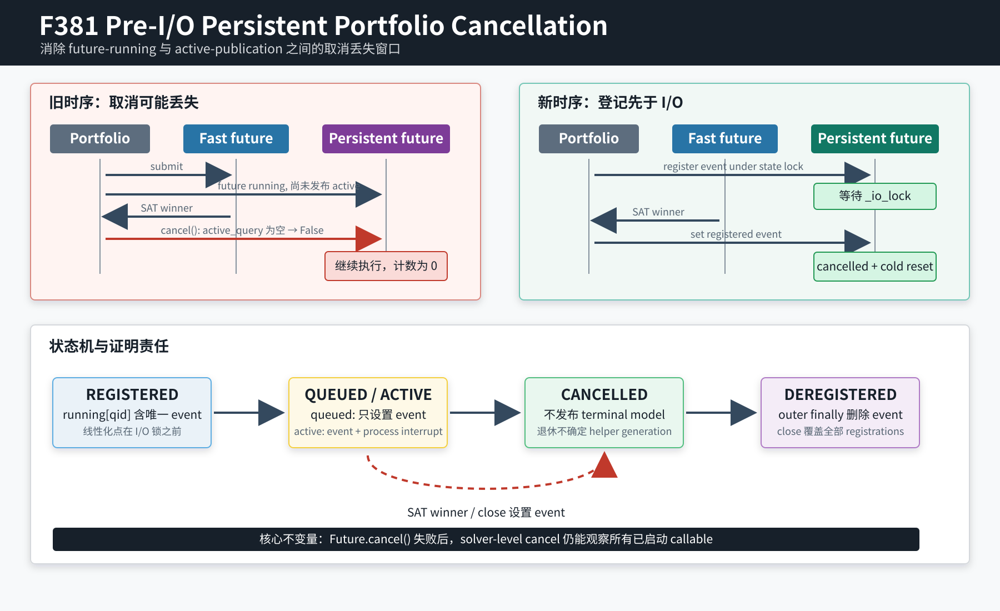

# F381：持久求解器 Portfolio 的 Pre-I/O 取消登记

- 日期：2026-08-12
- 实现：`util/query_store.py`
- 回归：`test/test_query_store.py`、`test/test_qf_bv_backend.py`
- 成熟度：I/T/E-mechanism；并发正确性与资源关闭机制，不是求解算法或 campaign 加速结论

## 1. 问题来源

F380 完整 LLVM/Python 门禁并发执行时，`test_cancelled_incremental_qfbv_context_recovers_cold`
出现一次稳定可解释的失败：fast solver 已返回 SAT，但 persistent QF_BV attempt 的
`cancelled_attempts` 为 0，并出现未关闭 pipe 的 `ResourceWarning`。隔离重跑可以通过，说明问题不是
QF_BV 模型，而是由线程调度暴露的时序窗口。

旧实现只在 persistent worker 取得 `_io_lock` 后设置 `_active_query` 与 `_active_cancelled`。portfolio
提交 future 后，该 future 可能已经是 `running`，却还没有取得 I/O 锁或获得 Python 调度。此时：

1. fast future 返回 SAT；
2. `Future.cancel()` 因 slow future 已运行而失败；
3. `PersistentSubprocessSolver.cancel()` 又因 `_active_query` 尚未发布而返回 `False`；
4. portfolio 等待 slow future 正常完成，取消请求永久丢失。

这不是“测试等待时间太短”能够从根本解决的问题。增大 marker deadline 只缩小窗口，不能建立
happens-before 关系。



## 2. 修复设计

### 2.1 取消登记先于串行 I/O

每次调用先创建独立 `threading.Event`，随后在 `_state_lock` 下执行：

```text
running[query_id].add(cancel_event)   <-- cancellation linearization point
acquire(_io_lock)
publish active query/event/deadline
spawn/admit/write/read
```

只有登记完成后才竞争 `_io_lock`。因此，一个已开始执行但仍等待 I/O 锁的 future 已经可以被取消；
portfolio 不再依赖 solver thread 是否恰好运行到 `_active_query` 赋值。

### 2.2 active 与 queued 的分离

`cancel(lease)` 在 `_state_lock` 下取得该 query ID 的 event 集合并全部 `set()`。进程信号仍有更严格的条件：

- 当前 `_active_query` 必须等于目标 query ID；
- `_active_cancelled` 必须属于刚取得的 registered event 集合；
- helper process 仍在运行。

所以 queued request 只接收逻辑取消，不会误杀另一个正在使用同一 persistent helper 的 query；active request
同时接收 event 与 process-group interrupt。`cancel()` 返回 `True` 表示至少一个请求实例已登记并收到取消，
不表示子进程一定需要或已经收到信号。

### 2.3 注销、关闭与冷恢复

外层 `finally` 在成功、取消、协议错误和异常路径上都从 `running[query_id]` 删除本次 event，空集合随即删除。
`close()` 在标记 solver closed 后设置所有 registered events，再关闭 active helper 和 descriptor channel。

已取消请求进入 I/O 临界区后在任何 request admission 前检查 event。当前策略仍退休整个 helper generation，
以保持 F368-F371 的保守原则：只要取消与代次状态可能交错，就不复用该代上下文；下一次调用从 cold helper
恢复。对“尚未写入任何字节”的 queued cancel 来说这可能多一次进程重启，但不会冒险复用不确定上下文。

## 3. 不变量

实现维持以下可审计不变量：

1. **Registration-before-I/O**：任何已进入 solver callable 的请求，在等待或持有 `_io_lock` 时都存在唯一 event。
2. **Exact active interrupt**：仅当 active event 属于目标 query 的当前 registration set 时才发送进程信号。
3. **No lost cancellation**：`Future.cancel()` 失败后，只要 callable 已开始登记，solver-level cancel 就能设置 event。
4. **Cleanup totality**：所有 Python 退出路径注销 event；`close()` 覆盖 queued 与 active registrations。
5. **Cold recovery**：被取消代次不进入后续 prefix-context reuse，下一请求由 fresh helper 处理。

锁顺序保持为短期 `_state_lock` 更新后释放，再执行可能阻塞的 `_interrupt_process`；不会持 `_state_lock`
等待子进程退出。I/O 仍由单一 `_io_lock` 串行化。

## 4. 反事实测试

新增测试主动持有 persistent solver 的 `_io_lock`，让 slow future 完成 registration 后确定地阻塞在 I/O
admission 前；fast future 观察到 registration 后返回 SAT。旧实现没有 pre-I/O registration，因而该场景无法
被 solver-level cancel 线性化。新实现要求：

- `cancel_requested == true`；
- persistent attempt 的 `cancelled == true`；
- `cancelled_attempts == 1`；
- 释放 gate 后 cold request 返回 SAT 和预期 assignment。

该反事实连续重复 20 次全部通过。随后 QF_BV 与 QueryStore 联合回归为 38 passed、22 subtests passed，
并以 `-W error` 验证没有 `ResourceWarning`。最终完整门禁的权威结果记录在
[`evidence/f381-pre-io-persistent-cancellation-2026-08-12/`](../evidence/f381-pre-io-persistent-cancellation-2026-08-12/)。

最终完整 LLVM lit 为 238 passed、1 unsupported、0 failed（239 discovered，204.20 秒）；完整
capability-closed Python gate 为 877 passed、229 subtests passed（124.95 秒），零
skip/xfail/xpass/deselection，877 个规范 node ID 与实际集合完全一致。

## 5. 多轮 review

1. **时序 review**：排除 QF_BV 语义错误，定位 future-running 与 active-publication 之间的窗口。
2. **锁 review**：登记与查询集合变更只持 `_state_lock`；进程终止在锁外，避免等待/关闭路径互锁。
3. **身份 review**：不能只按 query ID 杀 active process，必须验证 active event 属于对应 registration set。
4. **清理 review**：检查 normal/error/cancel/close 四类出口；outer `finally` 负责 registration，inner `finally`
   负责 active fields，职责不重叠。
5. **测试结构 review**：首次插入新用例时发现锚点位于既有长测试中段；在执行前移动到原方法结束后，确保旧
   hardening 场景的作用域和临时目录生命周期不变。

## 6. 结论边界

F381 证明的是一个本地 `ThreadPoolExecutor` portfolio 与 persistent helper 之间的取消可达性和资源生命周期。
它不提供线程公平性、实时取消上界、跨进程分布式取消、solver 内部可抢占性，也不证明吞吐、coverage、
求解成功率或漏洞发现率提升。进程重启成本需要在真实 solver portfolio campaign 中另行测量。
