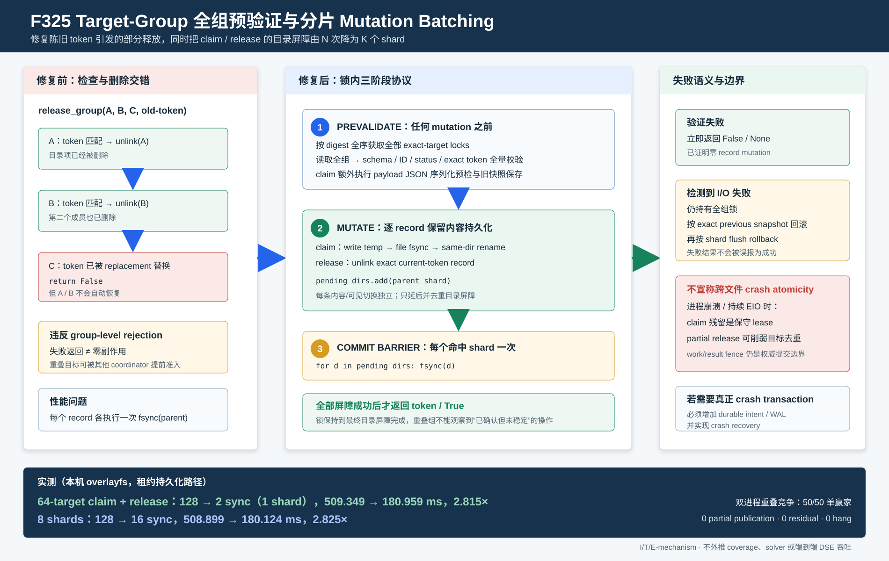

# F325：Target-Group 全组预验证与分片 Mutation Batching

- 日期：2026-08-07
- 功能编号：F325
- 成熟度：I/T/E-mechanism
- 代码范围：共享 target lease 的 `claim_group()`、`release_group()` 与目录持久化批次
- 证据范围：7项新增故障/同步测试、13项 target-table 定向回归、完整 Python 回归、
  64-target 微基准、50轮双进程重叠竞争

## 1. 研究问题与审查结论

F311为多个 coordinator 引入了target-group fencing：一个directed replay任务可能同时包含主目标和
多个S2F action目标，调度前需要把整组目标作为一个准入单元。F324又把target heartbeat的目录屏障
按shard合并，但本轮深度审查发现claim和release仍有两个问题。

### 1.1 `release_group()`存在真实的部分释放错误

旧实现对target逐条执行“读取、验证、删除”：</n+
```text
for target in digest_order:
    record = read(target)
    if token matches:
        durable_unlink(record)
        matched += 1
return matched == group_size
```

设全组为`(A,B,C)`，A/B仍属于`old-token`，C已由过期接管切换为`new-token`。旧调用
`release_group(group, old-token)`会先删除A/B，遇到C时跳过，最后返回`False`。调用方看到失败，
但前缀已经产生副作用；其他coordinator可能重新取得A/B，因而“组级拒绝”并不成立。

这不是理论风险。新增回归特意替换digest顺序最后一条record的token，并对调用前后所有record
字节做快照比较；旧控制流会删除匹配前缀，新实现以零变更返回`False`。

### 1.2 claim/release仍有目录同步写放大

F323要求每次rename/unlink后同步parent directory，避免只持久化文件内容而丢失名称更新。旧
target-group claim和release对每条record调用一次目录`fsync`。若`N`条target分布在`K`个shard，
一次claim加release共有`2N`个目录屏障，而同一shard内前序目录更新可以由一个末尾屏障覆盖。

### 1.3 序列化错误也可能形成部分claim

旧claim在循环内逐条执行`dict(payload)`和JSON写入，只捕获`OSError`。若后续record遇到不支持的
JSON值或排序失败，Python异常可能在早期成员发布后直接离开，绕过I/O回滚。本轮把payload快照和
JSON序列化预检移到首次publication之前；非法输入仍显式抛出`TypeError`，但不会创建任何record。

## 2. 技术定位



本轮组合了三个成熟思想，但严格限制其保证范围：

1. **全序加锁与全组预验证。** 所有target ID按摘要全序获取锁，避免重叠组出现锁顺序环；先读完并
   验证整个集合，再执行第一个mutation。它类似严格两阶段锁的工程化子集，但没有数据库隔离级别。
2. **自然批次上的group commit。** 同一次API调用本来就携带整个target group，因此无需人为等待；
   每条file data仍独立`fsync`，只把parent-directory屏障按shard去重。PostgreSQL和RocksDB的
   group commit同样用一个持久化屏障覆盖多个已经到达提交点的更新，但本实现没有共享WAL。
   [PostgreSQL WAL Configuration](https://www.postgresql.org/docs/current/wal-configuration.html)，
   [RocksDB Overview](https://github.com/facebook/rocksdb/wiki/RocksDB-Overview)
3. **补偿式回滚。** 可检测的write/unlink/directory-sync错误发生后，仍在全组锁内用调用前快照恢复
   已修改成员，再同步恢复涉及的shard。该机制是best-effort compensation，不是ARIES/SQLite式
   durable intent、undo/redo或crash recovery。
   [SQLite Atomic Commit](https://www.sqlite.org/atomiccommit.html)

Linux明确指出，只同步文件本身不能保证包含该文件名称的目录项已经落盘，因此本轮不能通过删除
directory `fsync`获得性能，只能安全合并其覆盖范围。
[Linux `fsync(2)`](https://man7.org/linux/man-pages/man2/fsync.2.html)

## 3. 新协议

### 3.1 Phase A：全组预处理和预验证

`claim_group()`依次执行：

1. 规范化、去重并限制最多64个正target；
2. 验证`now`是有限非负Unix时间，固定owner、worker和payload快照；
3. 在任何锁或record创建之前用最终JSON参数预检payload；
4. 按target摘要全序获取全部exact-target锁；
5. 读取所有旧record；现存但不可解析、schema/ID/token/time非法的record失败关闭；
6. 任意成员仍处于TTL内的`leased`状态时，全组返回`None`且不修改record；
7. 根据每个旧record一次性构造新record，并再次预检完整record JSON。

`release_group()`同样先持有全组锁、读取全组，并要求每个成员同时满足：

```text
valid schema and authoritative id
status == leased
record.token == supplied token
```

任一条件失败会立即返回`False`，此时尚未调用`unlink`。这直接关闭了旧实现的部分释放路径。

### 3.2 Phase B：逐record mutation

claim对每条record保留F323的内容持久化顺序：

```text
write canonical JSON temp
flush + fsync(temp file)
same-directory atomic replace(temp, record)
pending_dirs.add(parent shard)
```

release对每条已验证record执行`unlink`，并把parent shard加入同一个pending set。新
`_DirectorySyncBatch.unlink()`只有在`os.unlink`成功后才登记目录；replace仍拒绝source/destination
跨目录，避免破坏F323的public-first跨目录顺序。

### 3.3 Phase C：按shard提交目录屏障

完成全部record mutation后：

```text
for directory in insertion_ordered_unique_pending_dirs:
    fsync(directory)
```

所有目录屏障成功后，claim才返回新fencing token，release才返回`True`。全组锁保持到最后一个
屏障完成；重叠coordinator不能在成功确认之前进入同一target的更新临界区。

## 4. 失败语义

| 故障位置 | 返回 | 已执行动作 | 当前处理 |
| --- | --- | --- | --- |
| payload JSON预检 | 抛出`TypeError/ValueError` | 0 record mutation | 直接离开，无rollback需要 |
| schema/token/状态验证 | `None`或`False` | 0 record mutation | 保持全部旧record |
| 第i条write/rename失败 | `None` | 可能发布前i-1条 | 按旧快照恢复已发布成员，批量flush |
| 第i条unlink失败 | `False` | 可能删除前i-1条 | 重写被删除成员，批量flush |
| 最终directory fsync失败 | `None`或`False` | 全部mutation当前可见，耐久性未知 | 恢复全组快照并再次flush |
| rollback也持续失败 | 失败 | 可能剩余部分状态 | 不误报成功；进入明确的跨文件故障边界 |

必须区分两种“部分状态”：

- **claim残留**是保守的额外lease，最多降低可用性，TTL会使其过期；
- **release残缺**可能缺失部分target record，削弱target级重复调度抑制。target lease只是调度优化，
  work lease、dispatch generation和result commit fence仍决定任务与结果是否被接受，但可能增加冗余执行。

因此F325保证：正常冲突/陈旧token路径零mutation；检测到且rollback存储可用的I/O失败恢复调用前
状态；任何错误不返回成功。它**不保证**进程在多文件mutation中途崩溃后的原子可见。若要升级为
crash-atomic target transaction，需要先持久化group intent/decision，并在重启时执行幂等redo/undo。

## 5. 正确性不变量

| 编号 | 不变量 | 实现手段 |
| --- | --- | --- |
| M1 | 重叠group不因锁顺序死锁 | 所有target按SHA-256 ID全序获取锁 |
| M2 | rejected release不产生前缀删除 | 全组schema/status/token验证先于首个unlink |
| M3 | 不可序列化claim不产生前缀发布 | payload和完整record在首个write前预检 |
| M4 | 每条claim内容独立耐久 | 每条temp file在rename前执行file fsync |
| M5 | 同shard mutation共享一个目录屏障 | 绝对parent path的ordered set去重 |
| M6 | 成功确认覆盖所有mutation目录 | pending set完全flush后才返回成功 |
| M7 | 检测到失败时使用exact旧状态补偿 | 持锁保存每个record快照和已修改索引 |
| M8 | rollback的目录更新也必须持久化 | restore replace/unlink进入同一batch并再次flush |
| M9 | 跨目录发布顺序不被batch混用 | batch replace只接受same-directory source/destination |

## 6. 成本模型

设一组有`N`条target record，落入`K`个实际shard；`F`为单条JSON/file-fsync成本，`R`为
rename或unlink及锁成本，`D`为一次directory fsync成本。claim加release近似为：

```text
scalar: 2N * (F_or_unlink + R + D)
batch:  record_cost(N) + 2K * D
saved directory barriers: 2(N - K)
```

release没有file data写入，但故障回滚会重写旧record；成功热路径不支付该补偿成本。目录系统调用
减少比例仍为`1-K/N`。file fsync、JSON、锁和进程调度没有被消除，因此墙钟加速不能按目录调用
减少倍数外推。

## 7. 实现范围

- `util/distributed_state.py`
  - `_DirectorySyncBatch.unlink()`：删除成功后登记唯一parent目录；
  - `claim_group()`：payload/record序列化预检、全组快照、batched replace、失败补偿；
  - `release_group()`：全组预验证、batched unlink、exact snapshot补偿。
- `test/test_distributed_state.py`
  - 不可序列化payload零发布；
  - claim/release每shard一次同步；
  - claim目录屏障失败全组回滚；
  - stale末成员导致零mutation；
  - 第二次unlink失败恢复首成员；
  - release目录屏障失败恢复全组；
  - 旧publication故障测试适配batched write接口。

MPI/AFL helper不需要改调用契约：它已通过`claim_group()`/`release_group()`使用target table，因此
自动获得新语义。F325没有新增配置或benchmark schema。

## 8. 自动化验证

原始日志与可执行脚本位于
[`F325 evidence`](../evidence/f325-failure-atomic-target-mutations-2026-08-07/)。

| 门禁 | 结果 |
| --- | ---: |
| FencedTargetLeaseTable定向 | 13 passed，0.44秒 |
| 新增F325测试 | 7项 |
| distributed state全文件 | 109 passed + 4 subtests，14.02秒 |
| MPI lifecycle + AFL profile orchestration | 77 passed + 14 subtests，0.78秒 |
| 完整`pytest -q test` | 643 passed + 38 subtests，92.26秒 |
| Ruff / `py_compile` / `git diff --check` | 通过 |

故障注入不把mock调用次数当作持久化证明。测试同时检查最终record字节、返回值和无残留文件，确保
“调用了rollback”与“恢复了原状态”不会混为一谈。

## 9. 64-target微基准

基准脚本用当前同一份claim/release协议构造两条路径：reference path让每次replace/unlink立即执行
directory fsync；batch path使用F325按shard去重。二者都执行相同的group validation、JSON、每条
file fsync、rename/unlink和锁，只改变目录屏障聚合。每个场景预热，随后scalar/batch交错运行7轮，
报告中位数和样本最大位置的经验P95。

| 配置 | 每周期record mutation | scalar目录sync | batch目录sync | 减少 | scalar中位 | batch中位 | 中位加速 |
| --- | ---: | ---: | ---: | ---: | ---: | ---: | ---: |
| 1 configured/active shard | 128 | 128 | 2 | 98.438% | 509.349 ms | 180.959 ms | 2.815x |
| 8 configured/active shards | 128 | 128 | 16 | 87.500% | 508.899 ms | 180.124 ms | 2.825x |

8-shard样本略快于1-shard属于7轮本机样本噪声，不能解释为更多同步更快。可成立的结论是同步次数
精确符合`2K`，并且在本机overlayfs上该租约持久化路径的中位耗时显著下降。它不是DSE吞吐、
solver throughput、coverage或LAVA-M time-to-bug数据。

## 10. 独立进程重叠竞争

`verify_multiprocess_target_fencing.py`每轮启动两个独立OS进程：

```text
coordinator A targets = 1..32
coordinator B targets = 17..48
overlap = 16 targets
shared table = 8 shards
rounds = 50
```

结果为50/50轮恰好一个claim成功，赢家分布37/13；每轮只存在赢家的32条record，release后record
为0，且没有hang。37/13不是公平性指标：进程唤醒与本地文件锁竞争未做随机公平调度，本实验只验证
安全性质“重叠组至多一个赢家”和活性性质“有限时间内结束”。

| 指标 | 结果 |
| --- | ---: |
| single-winner rounds | 50 / 50 |
| partial publications | 0 |
| residual records after release | 0 |
| hangs | 0 |
| 总耗时 | 5090.370 ms |

## 11. 创新性与挑战性

F325的单个构件不是新的数据库算法。项目价值在于并行符号执行调度的组合语义：

1. **把target group从“循环处理的列表”提升为真正的准入单元。** 冲突判断、token验证和拒绝副作用
   使用同一全组临界区，避免部分释放反向破坏F309-F311的跨lane/跨coordinator去重。
2. **把可靠性成本和热路径优化同时纳入。** 没有撤销F323的file/directory双层持久化，而是证明同一
   shard中哪些目录更新可以共享屏障。
3. **序列化异常纳入事务边界。** 不只注入磁盘错误，也审查Python对象到持久JSON之间的失败点，
   防止非I/O异常绕过补偿逻辑。
4. **证据覆盖返回语义、持久状态和真实进程竞争。** 单元故障注入、系统调用计数、墙钟样本和多进程
   竞争分别回答不同问题，不用单一throughput数字替代正确性证明。
5. **明确拒绝过度声明。** 当前是prevalidated/batched multi-file protocol，不是WAL数据库、共识租约
   服务或全局exactly-once execution。

难点在于“失败返回”并不天然等于“无副作用”：必须追踪第几个record已经rename/unlink、哪些目录
已经成功flush、rollback本身又产生了哪些目录更新，并确保这些更新在释放全组锁之前完成屏障。

## 12. 已知边界与后续研究

1. 未执行kill-at-every-instruction、主机掉电、EIO持续失败、ENOSPC、NFS或Lustre实验。
2. 多文件record仍可在最终屏障前被非协作reader观察；所有框架writer遵循同一锁协议，但这不是快照隔离。
3. release rollback若也因持久存储故障失败，target级去重可能暂时弱化；work/result fencing防止陈旧结果
   提交，但不能消除额外solver工作。
4. 多进程测试运行在单机overlayfs和`fork`模型，不代表跨节点锁服务、公平性或网络分区行为。
5. 微基准只有7轮，不含置信区间，不构成真实目标的科研性能结论。
6. 尚未在能稳定产生S2F target-group的真实hybrid campaign中测量claim/release命中率、组大小分布、
   `N/K`和调度冗余；这是端到端归因所需的下一层证据。
7. 若真实存储故障模型要求crash atomicity，下一步应增加content-addressed group intent、单调decision、
   重启recovery scanner和幂等成员reconciliation，再执行kill-point/reboot campaign。

## 13. 结论

F325修复了一个会在失败返回后留下部分删除的target-group release错误，并把claim/release升级为
“全组预处理/预验证、逐record durable mutation、每shard一次commit barrier”的三阶段协议。
可检测I/O失败在仍持有全组锁时按exact快照补偿；非法payload和陈旧token在首个mutation前被拒绝。

完整Python 643项及38个subtest通过，50轮独立双进程重叠竞争全部保持单赢家且无残留；本机
64-target持久化微基准把claim+release目录同步由128次降至2或16次，中位耗时约从509 ms降至180 ms。
这些证据支持“修复了组级拒绝语义并降低了target lease持久化开销”，不支持“已实现跨文件崩溃事务”
或“符号执行覆盖率已因此提升”。
