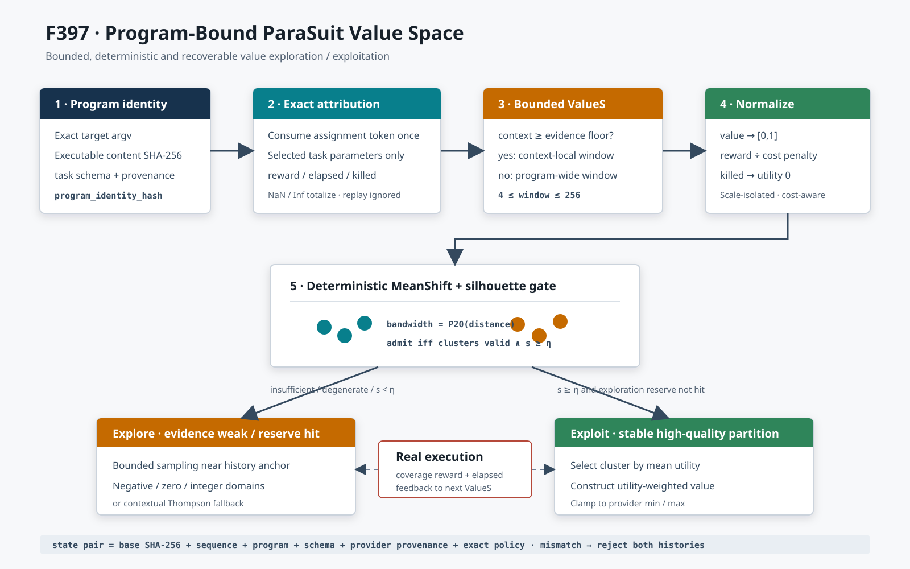

# F397：Program-Bound ParaSuit Value Space 与 Silhouette 策略

**日期：** 2026-08-13  
**成熟度：** I/T/E-mechanism（实现、回归、机制实验；不是公开目标覆盖率结论）  
**上游基线：** ParaSuit ICSE 2026，官方仓库提交
`e991924b827db80b117e1f5389fe07820bad13f0`

## 1. 研究问题

F186 已建立条件参数图、上下文后验和交互后验，F396 又解决了可执行参数发现、
provider 原子合并以及 task/query-service/campaign 生命周期误归因。但是，候选值仍主要
来自离散 registry 或局部扩展：不同目标程序共享同一种取值倾向，且“已有取值是否形成
稳定的高收益区域”没有显式统计判据。

F397 解决的是 ParaSuit Algorithm 2 的核心问题：对每个目标程序、每个 task 参数保存
`(value, reward, cost)` 观测；仅当 MeanShift 聚类形成高质量分区时利用高收益簇，否则
继续探索。它不是把聚类结果当正确性判据，所有参数最终仍由真实 concolic 执行产生反馈。



## 2. 上游算法与证据边界

### 2.1 ParaSuit 的 value sampling

论文先用分支稀有度为一次参数配置覆盖的分支集合评分：

\[
\operatorname{Score}(B, TotalB)=\sum_{b\in B}
\frac{1}{\operatorname{Frequency}(b,TotalB)}.
\]

对某参数收集 `ValueS={(value, Score)}`，使用无需预设簇数的 MeanShift 聚类，再以平均
silhouette coefficient 判断分区是否足够清晰。证据不足或系数不高时探索；论文初始阈值
为 0.7。数值参数围绕随机历史值构造约 `[0.5v, 1.5v]` 的空间，布尔/字符串参数从候选
集合采样。进入利用阶段后，簇的抽样概率为：

\[
P(C_i)=\frac{\operatorname{mean}\{s\mid(v,s)\in C_i\}}
{\sum_k\operatorname{mean}\{s\mid(v,s)\in C_k\}},
\]

簇内新值使用 score 加权均值：

\[
v'=\frac{\sum_{(v,s)\in C_i}v\cdot s}
{\sum_{(v,s)\in C_i}s}.
\]

论文 Algorithm 2 写作 `Silhouette(C) <= threshold` 时探索，官方实现
`value_sample.py` 在 `>= threshold` 时利用；两者只在恰好等于阈值的边界不同。F397
选择与官方实现一致的 `score >= threshold` 利用，并用测试固定这个边界。

### 2.2 不能转移的上游实验数字

ParaSuit 在 KLEE 2.1 上对 12 个 GNU C 程序做 24 小时、5 次重复实验；论文报告总分支
覆盖相对 Symtuner 高 25.8%，并报告 11 个独特缺陷、其中 4 个仅由 ParaSuit 找到。
value sampling 消融在 5 个程序上相对次优 CMA-ES 平均高 11.0%，相对 RandV 平均高
21.5%。这些是论文作者在其硬件、目标、版本和预算下的结果，不是本项目实验结果，不能
写入 SymCC 的提升列。

## 3. F397 的工程设计

### 3.1 程序身份与生命周期

MPI master 在 campaign 启动时构造规范 program key：

```text
schema = symcc-self-config-program-key-v1
argv   = 完整目标命令参数向量
image  = 可执行文件内容 SHA-256
```

策略再对该 JSON 求 SHA-256。只比较路径不足以识别原地替换的二进制，只比较文件内容又
会漏掉影响行为的 argv；二者联合后，一个 campaign 的值模型不会无声迁移到另一个目标。
五个 F397 控制参数声明为 `coordinator-campaign`，不会成为逐 seed arm，也不会把已启动
master 的无效配置归因到某个输入。

### 3.2 有界 ValueS 构造

每个实际完成且 token 尚未消费的 assignment 才生成观测：

```text
(rendered value, bounded reward, bounded elapsed, killed, context, sequence)
```

- `reward` 限制到 `[0,1]`，非有限值归零；`elapsed` 限制到
  `[0.001,86400]` 秒，避免 NaN/Inf 污染 F396 后验；
- 同一 token 的 replay 不重复计数；只记录本 assignment 实际选择的参数；
- context 样本达到 evidence floor 时使用 context-local window，否则回退到当前程序的
  parameter-wide window；
- 分析窗口硬限制为 4--256，持久历史每参数最多 512，sidecar 最多 4 MiB。即使输入
  iterable 很长，聚类内存仍为 `O(window)`。

原始数值值域先归一化到 `[0,1]`，避免“字节数”和“秒数”等量纲支配欧氏距离。第二维
不是论文的裸 branch-rarity score，而是调度器真实 reward 的成本校正版：

\[
u_i=\operatorname{clamp}_{[0,1]}
\left(\frac{r_i}{\sqrt{\operatorname{clamp}_{[0.25,4]}
(t_i/\operatorname{median}(t))}}\right),
\]

被 kill 的执行取 `u_i=0`。这是面向并行 SymCC 的明确适配：覆盖收益相同时，长期占用
worker 的配置不应与快速配置等价。

### 3.3 确定性 MeanShift 与 silhouette gate

实现不新增 sklearn 运行依赖。带宽为两两非零距离的 20% 分位数；每个样本最多做 32
轮 mean shift，收敛阈值 `1e-7`，shift 后中心按规范顺序合并并重编号。以下情况全部
fail closed 到探索：

- 有效样本不足、值恒定或带宽为零；
- 只有一个簇，或每个样本各成一簇；
- malformed/non-finite 观测；
- silhouette 低于配置阈值。

标准 silhouette 对样本 `i` 使用簇内平均距离 `a(i)` 与最近其他簇平均距离 `b(i)`：

\[
s(i)=\frac{b(i)-a(i)}{\max(a(i),b(i))}.
\]

`SYMCC_SELF_CONFIG_VALUE_POLICY` 提供三种可消融模式：`thompson` 保留 F396；
`silhouette` 在 gate 前执行 ParaSuit 式探索；`hybrid` 在 gate 前保留上下文 Thompson，
gate 后才进入 cluster exploitation。即使 gate 已通过，默认仍保留 10% exploration，
防止早期分区永久锁死。

### 3.4 探索、利用和域约束

利用时按簇平均 utility 抽簇，再计算簇内 utility 加权均值；总权重接近零时回退到普通
均值。分类参数按 utility 加权抽取已有值。探索时以历史随机值或高 reward 值为 anchor，
在有界邻域采样。

论文的 `[0.5v,1.5v]` 对负值会反转上下界，对零值没有宽度。F397 对负值、零值和整数域
做了保守扩展：半径至少为 1（整数）或 0.5（连续），再钳制到 provider 声明的
`minimum/maximum`；整数候选始终重新取整。因此这是语义兼容的工程适配，不声称与
sklearn/上游随机序列逐位一致。

## 4. 持久化与错误恢复

值模型 sidecar schema 为 `symcc-parasuit-value-space-v1`，绑定：

- 基础 F396 state 的字节级 SHA-256、sequence 和 observations；
- task parameter schema hash 与完整 registry provenance hash；
- program identity hash；
- value policy、threshold、window、evidence floor 和 exploration reserve。

sidecar 通过同目录临时文件、文件 `fsync` 和原子 `replace` 发布。读取使用一个
`O_NOFOLLOW|O_CLOEXEC` 描述符，要求 regular file、限制字节数，并从同一份字节同时
得到 JSON 和 SHA-256。F397 还把 F396 反序列化拆为 `_load_mapping`：通过基础 state
哈希后直接导入刚才验证的映射，不再按路径二次打开，从而关闭 check/use 之间的替换
竞态。程序、策略、registry、哈希对或记录任一不一致时，本地 posterior 与 value
history 一并拒绝。当前实现没有目录 `fsync`，因此只声明原子可见和 torn-pair 检测，
不宣称断电后的目录项耐久性。

## 5. 验证结果

### 5.1 正确性与反例

- F397 定向测试 9 项：provider scope、双簇 oracle、阈值拒绝、退化/长流输入、整数
  值构造、assignment/replay、NaN/Inf、跨程序/策略/torn/symlink 拒绝、验证后替换
  竞态、负值域、CLI 与 MPI 接线；
- 相关回归：210 passed + 84 subtests；完整 capability-closed Python gate 为
  969/969 passed + 235 subtests，零 skip/xfail/xpass/deselection，node-ID 清单精确一致；
- 1,000 组随机输入均满足窗口上界、有限 silhouette、label 数量一致等性质；
- 已知 8 样本 oracle 稳定得到标签 `00001111` 和 silhouette `0.914156472`。

LLVM 17/18 原生 provider 定向测试各 1/1；完整 LLVM 18 lit 发现 259 项，258 passed、
1 个既有 unsupported。

完整 Python identity gate 与 LLVM lit 结果以
[`F397 evidence`](../evidence/f397-parasuit-value-space-2026-08-13/) 中最终封存日志为准。

### 5.2 本机机制开销

`benchmark_parasuit_value_policy.py` 在固定 8 样本双簇上执行 1,000 次：

| 操作 | median | p95 | maximum |
| --- | ---: | ---: | ---: |
| MeanShift + silhouette 分析 | 75.033 us | 78.788 us | 225.970 us |
| F397 adaptive value selection | 85.779 us | 89.404 us | 123.936 us |
| F396 Thompson value selection | 6.050 us | 6.630 us | 10.966 us |
| 绑定 state pair 的冷载入 | 668.729 us | 691.378 us | 3723.974 us |

1,000 次决策只有一个 digest；201 个阈值点中 192 个通过固定 gate；8/8 历史观测可恢复，
基础 state 15,585 B，sidecar 1,376 B。以上只衡量 Python 策略机制与小样本持久化成本，
没有执行目标程序、solver、AFL showmap，也不支持 coverage、solver throughput、
bug yield 或端到端 speedup 结论。

## 6. 创新性与挑战性

1. **论文策略与层次化调度融合。** 不是替换既有 Thompson，而是把 silhouette 作为
   “何时相信局部值空间”的 admission gate，并保留 context fallback 与探索储备。
2. **程序级身份闭包。** argv、可执行内容、task schema、provider provenance 和策略
   参数共同决定状态可复用性，解决二进制原地更新与跨目标 posterior 污染。
3. **成本感知 value space。** 将并行 worker 占用引入 utility，使覆盖收益与资源成本
   在聚类前统一，而不是事后才由 scheduler 惩罚。
4. **验证字节即导入字节。** 单描述符 hash/parse 加 `_load_mapping` 消除了状态验证后的
   二次打开竞态；symlink、超限、torn pair 和非有限数据均有主动反例。
5. **可复现的无依赖实现。** 确定性带宽、中心合并和 canonical labels 适合科研消融与
   证据封存，同时避免在 coordinator 热路径增加大型 Python 依赖。

## 7. 尚未闭合的工作

- 复现 ParaSuit 完整 parameter-selection stage：standalone baseline、branch-rarity score、
  synergy penalty 与按归一化分数选择参数，并与 F186 层次化策略做等 CPU 消融；
- 对 sklearn MeanShift 做离线 cross-oracle，量化确定性适配与官方实现的决策差异；
- 为 query-service/campaign 参数建立按配置隔离的进程池和受控重启，当前五个控制参数
  只在 campaign 启动时读取；
- 按论文 12 程序或本项目公开目标做固定版本、等 CPU、至少 5 个随机种子的确认实验，
  报告 branch coverage、time-to-coverage、solver throughput、方差和置信区间；
- 增加目录 `fsync` 与跨文件 generation commit，若需要把状态合同提升到断电耐久级。

## 8. 资料

- [ParaSuit, ICSE 2026 官方页面](https://conf.researchr.org/details/icse-2026/icse-2026-research-track/222/Enhancing-Symbolic-Execution-with-Self-Configuring-Parameters)
- [ParaSuit 官方实现](https://github.com/skkusal/ParaSuit)
- [Mean Shift, Fukunaga and Hostetler](https://doi.org/10.1109/TIT.1975.1055330)
- [Silhouettes, Rousseeuw](https://doi.org/10.1016/0377-0427(87)90125-7)
