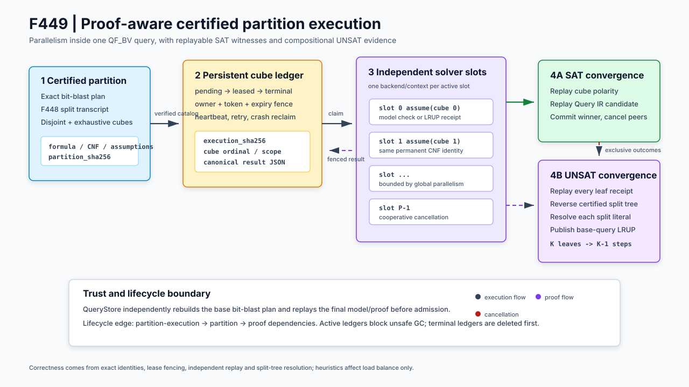

# F449：证明感知的可认证 QF_BV 分区执行

## 1. 交付结论

F449 关闭了 F448 明确保留的主路径缺口：F448 已能生成可证明“不重不漏”的 cube
目录，但主 query service 尚未执行这些 assumptions，也不能把所有叶级 UNSAT 结果合成为
原查询结论。F449 将分区证书、持久任务账本、独立 CaDiCaL 求解槽、SAT 抢先取消、UNSAT
分辨率聚合和 F429 生命周期连接为一个可恢复、可审计的查询内并行闭环。

- 功能编号：F449；
- 当前等级：I/T/E-mechanism；
- 核心实现：`util/qfbv_partition_execution.py`；
- 生产入口：`util/symcc_query_service.py`；
- 专项测试：`test/test_qfbv_partition_execution.py`；
- 机制 oracle：`benchmark/check_qfbv_partition_execution_oracles.py`；
- 正式证据：`docs/codex/evidence/f449-proof-aware-partition-execution-2026-08-25/`；
- 结论边界：已证明执行、恢复、取消和证明聚合机制闭合；未从该机制实验推导公开目标
  speedup、fuzzing coverage 或 defect yield。



## 2. 研究问题与技术依据

输入级并行只能同时处理多个 QueryStore 项。如果一个高成本 QF_BV 查询本身成为长尾，增加
输入 worker 不会缩短它的完成时间。Cube-and-Conquer 与可塑分布式 SAT 的共同思路是把一个
搜索空间拆成互斥子空间，再把计算资源动态分配给子任务；现代 proof-producing 系统进一步要求
分布式结果可以被独立检查。

F449 参考但不声称复刻以下主线：

1. Cube-and-Conquer 的 cube 搜索空间分解；
2. MallobSat 的可塑任务资源分配与并发求解；
3. LRAT/LRUP 的小可信核证明重放；
4. 分布式增量 SAT 中 assumptions、checked clause sharing 与实时证明检查的组合。

本项目的区别在于：分区不是匿名 SAT 任务，而是与 Query IR、确定性 bit-blast、base
assumptions、F448 split transcript 和 F429 制品图共同绑定；任何启发式只影响先解哪个 cube，
不能改变覆盖性证明或最终准入。

## 3. 端到端执行顺序

1. query-service 从 QueryStore 领取一个带 owner/token/expiry 的父查询租约，并立即续租；
2. 本地重建 Query IR 的确定性 `BitBlastPlan`，得到 formula、CNF、base assumptions 和
   input-literal map；
3. F448 构造并独立复核 `K` 个互斥且完备的 cube，发布内容寻址 partition；
4. F449 用 `query + plan + partition + execution policy` 计算稳定 execution identity；
5. `PartitionExecutionStore` 在 SQLite 中为每个 ordinal 建立一条任务，状态从 `pending`
   经 `leased` 进入 `sat/unsat/cancelled/exhausted`；
6. 每个 solver slot 取得带 token 和 expiry 的精确 lease，启动独立 backend/context，并通过
   heartbeat 续租；崩溃后过期任务按最大 attempt 预算重新领取；
7. backend 保持永久 CNF identity 不变，仅把 cube literals 作为本次 assumptions 注入；
8. SAT 结果必须显式满足全部 base/cube assumptions，并由 Query IR 重新执行候选；第一条有效
   SAT 原子提交为 winner，其他 pending/leased cube 被取消；
9. UNSAT 结果必须带 assumption-scoped LRUP receipt，且 failed-assumption core 必须精确覆盖
   当前 cube 的全部 assumptions；
10. 所有叶均 UNSAT 后，协调者沿 F448 split tree 反向执行 resolution。每个二叉节点消去一个
    split literal，`K` 个叶最终形成 `K-1` 个聚合步骤；
11. 根记录只留下 base assumptions 的否定，生成普通 base-query UNSAT receipt；QueryStore
    再次从本地 Query IR 重建计划并重放 final proof；
12. 终态 ledger 进入生命周期图。GC 按 `partition-execution -> partition/sat-proof` 的
    dependent-first 顺序删除；任何 active execution 都使 inventory 不完整并阻止不安全 GC。

## 4. 正确性与并发不变量

| 不变量 | 实现方式 | 失败行为 |
| --- | --- | --- |
| 查询和分区身份不可漂移 | execution digest 封存 formula、base assumptions、bit-blast certificate、partition 与 policy digest | 摘要、policy 或 cube inventory 不一致即拒绝 |
| 一个 cube 同时只有一个有效 owner | `status + owner + monotonically increasing token + expiry` 共同作为更新条件 | 旧 token、错误 owner、过期 completion 返回 stale |
| SAT 不跨 cube 误接纳 | 完整模型显式满足 assumptions；输入字节满足 cube polarity；Query IR 独立 replay | 任一检查失败，不提交 winner |
| UNSAT 不跨 assumption scope 重放 | signed assumption identity、完整 failed core、proof receipt 和 clause digest 联合复核 | 缺少或改变任一 assumption 即拒绝 |
| 并发聚合收敛为同一证明 | aggregate source identity 只由 execution digest 决定，epoch/sequence 固定 | 两协调者生成相同 CAS digest，数据库单赢家提交 |
| 重启不信任宽松 JSON | policy、cube、result、receipt 必须是 ASCII、无重复 member、无 NaN/Infinity 的 canonical JSON | 非规范持久状态失败关闭 |
| 生命周期无悬挂引用 | terminal execution 指向 partition 和证明依赖，active inventory 阻断 GC | 先删 ledger，再删依赖；缺边或活动任务不收集 |

## 5. 软件模块与工程边界

| 模块 | F449 职责 |
| --- | --- |
| `qfbv_partition_execution.py` | policy、execution identity、SQLite ledger、lease/heartbeat/retry、结果复核、并行 executor、UNSAT 聚合、服务 wrapper |
| `qfbv_incremental_sat.py` | immutable assumption extension；严格 DIMACS assignment 解析 |
| `cadical_qfbv_backend.py` | one-shot/persistent `solve_with_assumptions`；SAT assumption 检查；同 scope 独立 LRAT 确认 |
| `qfbv_incremental_proof.py` | signed assumptions；通用 imported-LRUP record；聚合 proof 和 receipt 重放 |
| `qfbv_proof_wire.py` | signed failed assumptions 的 ICNF/LIDRUP 往返 |
| `query_store.py` | 父租约原子续租；F449 telemetry/status/proof 一致性；独立 commit-time replay 与统计 |
| `qfbv_artifact_lifecycle.py` | `partition-execution` artifact kind、4097 引用上界和旧 metadata 迁移 |
| `symcc_query_service.py` | 配置门禁、全局并行预算切分、per-slot backend/context、stats 和 GC 路由 |

执行默认关闭。启用后只接受一个 bitblast-CaDiCaL portfolio backend；proof、partition 和
execution store 缺失时启动失败，而不是静默退化到未认证分区。

## 6. 配置与使用

```bash
python3 util/symcc_query_service.py \
  --store /shared/query-store \
  --portfolio /shared/cadical-portfolio.json \
  --qfbv-incremental-proof-store /shared/qfbv-proofs \
  --qfbv-partition-store /shared/qfbv-partitions \
  --qfbv-partition-execution-store /shared/qfbv-executions \
  --qfbv-partition-cubes 64 \
  --qfbv-partition-parallelism 16 \
  --qfbv-partition-max-attempts 3 \
  --qfbv-partition-cube-timeout-ms 30000 \
  --qfbv-partition-task-lease-ms 60000 \
  --jobs 4
```

`--qfbv-partition-parallelism` 是服务总 cube-slot 预算；每个外层 query worker 获得
`floor(total/jobs)` 个槽，且 `jobs` 不得大于总槽数。task lease 必须覆盖 cube timeout。
对应环境变量为同名大写形式：`SYMCC_QFBV_PARTITION_CUBES`、
`SYMCC_QFBV_PARTITION_PARALLELISM`、`SYMCC_QFBV_PARTITION_MAX_ATTEMPTS`、
`SYMCC_QFBV_PARTITION_CUBE_TIMEOUT_MS`、`SYMCC_QFBV_PARTITION_TASK_LEASE_MS` 和
`SYMCC_QFBV_PARTITION_EXECUTION_STORE`。

## 7. 测试与多轮审查

专项测试覆盖：

- assumption/certificate identity、正负 cube、SAT polarity 和 Query IR replay；
- K=4 叶证明到根 receipt 的真实 LRUP resolution；
- 并发唯一领取、stale token、heartbeat、崩溃 lease 回收和 attempt exhaustion；
- SAT 首胜时所有 active peer 的 cooperative cancellation；
- 双协调者同时聚合时的单一 proof CAS 收敛；
- symlink、metadata、cube inventory、重复 JSON member、proof digest、非有限时间和类型篡改；
- 生命周期 active fail-closed、依赖闭合和 dependent-first GC；
- 一次性外部 CNF solver 的 query-service SAT/UNSAT 真正端到端路径；
- persistent native CaDiCaL stub 的 permanent formula 复用与正负 assumption 隔离；
- CLI 配置反例和 executable oracle。

审查按五个视角执行：证明作用域、任务状态机、并发/崩溃恢复、持久协议/生命周期、生产服务
资源预算。审查中实际修复了 signed assumption 缺口、persistent UNSAT base-only 误确认、
父租约过期、并发聚合非确定性、非有限时间、宽松 JSON 重放、结果 scope 二次复核和 GC 悬挂引用。

最终门禁为：F449 专项 22 passed；耦合回归 143 passed、50 subtests passed；完整
capability-closed Python gate 为 1419 passed、310 subtests passed，16/16 外部能力存在，且
skip、xfail、xpass、deselect、collection error、missing nodeid 和 unexpected nodeid 均为零。
原始结果见 evidence 目录的 `focused-tests.log`、`broad-tests.log`、`full-python-gate.json` 和
`static-checks.txt`；历史 F448 的 1396 项门禁不用于替代 F449 当前门禁。

## 8. 正式机制实验

正式 oracle 对 `K = 2, 4, 8, 16, 32, 64` 各执行 5 轮 UNSAT 构造、叶 proof replay、
split-tree 聚合和根 receipt replay，并执行一个 64-cube SAT 首胜场景。

| K | 叶证明 | 聚合步骤 | 构造与聚合中位数 | 根证明重放中位数 |
| ---: | ---: | ---: | ---: | ---: |
| 2 | 2 | 1 | 219.360 ms | 40.094 ms |
| 4 | 4 | 3 | 377.501 ms | 70.130 ms |
| 8 | 8 | 7 | 699.040 ms | 129.544 ms |
| 16 | 16 | 15 | 1326.808 ms | 247.864 ms |
| 32 | 32 | 31 | 2662.578 ms | 491.150 ms |
| 64 | 64 | 63 | 5394.938 ms | 956.365 ms |

SAT 场景中，输入 `byte[0]=0` 的首个有效 cube 完成后，`completed_cubes=1`，其余
`cancelled_cubes=63`。这些数字验证任务取消和证明复杂度关系；wall time 包含 Python
测试 proof 构造、SQLite 同步与重复 replay，不能解释为 solver speedup 或覆盖提升。

## 9. 已知边界与下一步研究

1. 主服务当前用 deterministic static input-literal ordering 构造分区；F448 已支持 checked
   activity-guided 排序，但在线 result 到下一查询 partition 的生产级关联仍需独立策略；
2. 当前调度优先级主要按 cube depth/ordinal，未用经过验证的历史 solve cost 做负载预测；
3. proof replay 随叶数增长，是 64-cube 机制中的主要可见成本之一；后续 cache 必须绑定 plan、
   checker policy 和完整 import closure；
4. 当前执行池是同进程多线程、多独立 backend；尚未把 cube lease 映射到跨节点 F438/F447
   worker catalog；
5. 尚无公开 QF_BV benchmark 上同 CPU、长时、多轮的 unpartitioned/static/activity-guided
   对照，因此 F449 保持 I/T/E-mechanism，不标记 R。

## 10. 主要资料

- Heule et al., *Cube and Conquer: Guiding CDCL SAT Solvers by Lookaheads*；
- Schreiber and Sanders, *MallobSat: Scalable SAT Solving by Clause Sharing*，JAIR 2024；
- Cruz-Filipe et al., *Efficient Certified RAT Verification*，TACAS 2017/2018 LRAT 工作；
- *Real-time Proof Checking for Distributed Incremental SAT Solving*，TACAS 2026；
- 本地 F448 报告：[`Proof_Prefix_Guided_Certified_Partitioning_F448_2026-08-25.md`](Proof_Prefix_Guided_Certified_Partitioning_F448_2026-08-25.md)。

论文中的性能与扩展性结论属于原论文；F449 只声明本仓库证据直接支持的实现和机制结果。
