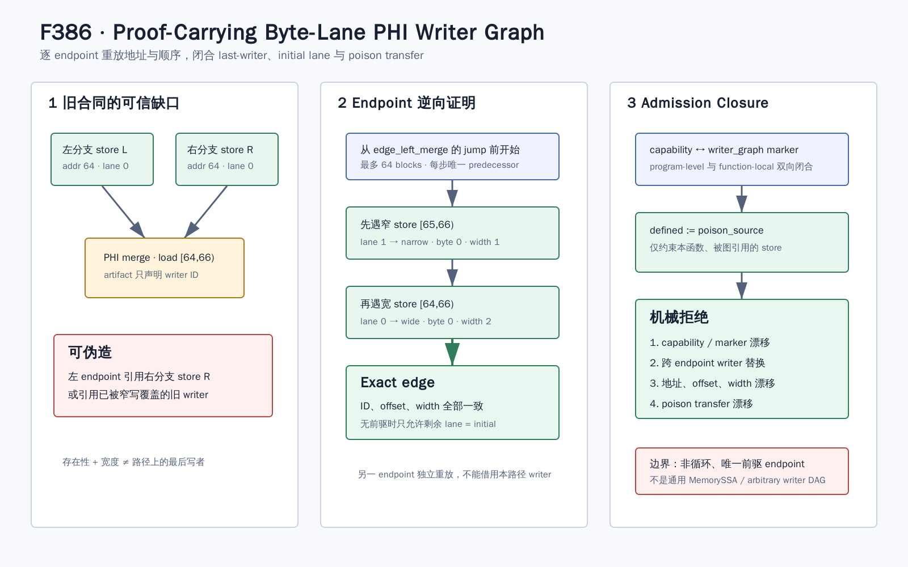

# Proof-Carrying Byte-Lane PHI Writer Graph（F386）

- 日期：2026-08-13
- 范围：普通、非循环的 byte-lane PHI memory-definedness
- 新 capability：`bounded-byte-lane-phi-writer-graph`
- 前置 capability：`bounded-byte-lane-memory-definedness-phi`
- 成熟度：实现、定向反例、LLVM17/18对拍、完整双门禁与证据闭环

## 1. 研究问题

F385 已经把单路径 byte-lane 合同从“声称某 lane 来自某 store”升级为地址闭合的 last-writer
证明。然而普通 PHI 合流仍保留一个可信缺口：artifact 虽列出每个 endpoint 的 store ID、store
byte 和 width，runtime 只检查该 ID 在函数中存在、宽度相等以及 endpoint 跳向 merge，并没有证明
该 store 位于对应 endpoint 的可达前缀上，更没有证明它没有被后续覆盖。

这会允许三类结构上合法但语义错误的制品进入执行：

1. 用另一个分支中同地址的 store 替换当前 endpoint 的 writer；
2. 引用当前路径上已经被窄写覆盖的旧 store；
3. 保留正确 `byte_lane_defined` 名称，却把 identity sidecar 绑定到另一个 poison predicate。

F386 的目标不是增加一种新的执行启发式，而是把 compiler 端已经完成的有限 MemorySSA 扫描转化为
portable、可复核的证明合同，使恢复端能独立拒绝上述篡改。



## 2. 合同设计

每个普通 PHI 合同新增：

```json
{
  "writer_graph": true,
  "incoming": [{
    "block": "edge_left_merge",
    "lanes": [{
      "lane": 1,
      "source": "store",
      "store": "byte_lane_store_6",
      "store_byte": 0,
      "store_bytes": 1,
      "defined": "byte_lane_store_defined_7"
    }]
  }]
}
```

`writer_graph` 与 program-level capability 双向等价：有 capability 的每个普通 PHI 合同都必须携带
marker，marker 存在时 capability 也必须存在。这样旧手写 artifact 在未声明 capability 时保持兼容，
新 compiler artifact 则不能静默退回声明式来源列表。

图引用且可能产生 deferred poison 的 store 同时输出：

```json
"byte_lane_poison_source": "llvm_signed_defined_14"
```

紧随 store 的 1-bit identity 必须满足：

\[
  defined_{store} := poisonSource_{store}
\]

这证明 producer 声明的 poison condition 确实沿该 sidecar 进入 endpoint 的 definedness 合取。

## 3. 恢复端算法

对 load 起始地址 \(L\)、endpoint \(e\) 和每个 lane \(i\)，runtime 执行：

1. 从 endpoint terminal jump 之前开始逆序扫描；
2. 对每个常量地址 store \([S,S+w)\)，找到尚未解析且满足 \(S\le L+i<S+w\) 的 lane；
3. 第一个覆盖该 lane 的 store 必须同时满足：
   \[
   id=id_i,\quad storeByte_i=L+i-S,\quad storeBytes_i=w
   \]
4. 若当前 block 未闭合全部 lane，只允许沿唯一 predecessor 继续；
5. 若没有 predecessor，剩余 lane 必须全部声明为 `initial`；
6. block 重访或累计超过 64 个 block 时失败关闭。

算法按 endpoint 分别执行。因此来自另一个分支、即使地址和宽度相同的 store，也不在当前 endpoint
的逆向路径上；扫描会先遇到真实 writer 并在 ID 不等时拒绝。

## 4. Compiler 实现

`ContinuationLowering.cpp` 在 `context.byteLanePhis` 非空时：

- 输出 `bounded-byte-lane-phi-writer-graph`；
- 为每个普通 PHI 合同写入 `writer_graph: true`；
- 为该函数的 PHI graph 所引用 store 写入 `byte_lane_poison_source`；
- 继续使用函数局部 `byteLaneStoreIds`，不把 ID 当成程序全局名字。

这里特意没有把 poison 字段要求扩散到其他函数或 cyclic 合同。capability 是 program-level，合同和
store ID 却是 function-level；三函数混合 artifact 用来防止再次出现 F385 首轮审查发现的跨函数
namespace 错误。

## 5. Runtime 与 Checker 实现

`live_continuation.py` 复用 F385 的地址解析和逆向 writer oracle，但把起点参数化为 endpoint block
与 terminal boundary。PHI 定义组合验证之前先执行 writer replay，使 shadowed-writer 反例得到精确的
`last-writer edge` 诊断，而不是被较弱的 definedness 组合错误掩盖。

`check_live_continuation_lowering.py` 新增 `--expect-byte-lane-phi-writer-graph`，并实际构造四类负例：

- 移除 capability；
- 移除 contract marker；
- 用同址的另一路 store 替换 writer，若制品不存在替代 store 则移动真实 store 地址；
- 漂移 graph-local poison source。

checker 的 store 收集始终限定在函数和该函数图引用 ID 内，避免不同函数中临时 ID 重名导致误判。

## 6. 测试与结果

| 层次 | 结果 | 说明 |
| --- | ---: | --- |
| 新增定向 Python | 5 passed | endpoint、地址/offset、shadowing、poison、capability闭包 |
| 全部 live Python | 69 passed + 51 subtests | continuation相关交叉回归 |
| LLVM18 普通 PHI | PASS | 1 graph、2 endpoints、4 poison-bound stores |
| LLVM17 普通 PHI | PASS | 与LLVM18语义计数一致 |
| LLVM18 initial PHI | PASS | 2 store lanes + 2 initial lanes |
| LLVM18 三函数混合 | PASS | F385图1个、F386图1个，函数局部ID不串扰 |
| 完整 Python gate | 898 passed + 229 subtests | 零退化、898/898身份精确匹配 |
| 完整 LLVM lit | 243 passed + 1 unsupported | 244 discovered，受控`-j32`，209.41秒 |
| LLVM 构建 | 18 / 17 PASS | 两套warnings-as-errors兼容构建 |

原始制品、日志和哈希见
[`f386-byte-lane-phi-writer-graph-2026-08-13`](../evidence/f386-byte-lane-phi-writer-graph-2026-08-13/)。

## 7. 审查中修复的问题

1. **诊断优先级**：最初 shadowed writer 会先触发 PHI composition 错误；现把图重放移到 legacy
   composition 之前，保持错误定位精确。
2. **initial endpoint 反例**：checker 起初假设总能找到同址替代 store；现提供地址漂移后备反例，
   覆盖只有一个 store source 的 endpoint。
3. **F385/F386 共存**：移除一个 capability 时，另一个 capability 仍可合法解释 poison 字段；marker
   校验因此改为合同专用诊断，混合 artifact 已验证。
4. **函数局部 ID**：图引用 store 的收集不跨函数合并，三函数 artifact 保留该回归。

## 8. 结论边界与下一步

F386 证明的是“每个普通 PHI endpoint 的有限、唯一前驱前缀上，每个 load byte 的最后写者与 poison
transfer 和 artifact 一致”。它仍不等价于：

1. 通用 MemorySSA 或完整 alias analysis；
2. endpoint 内再次出现控制流 join 的 writer DAG；
3. loop-carried/cyclic byte-lane writer graph；
4. 从原始 LLVM flags 独立重建所有 poison predicate；
5. coverage、吞吐、漏洞数或公开 benchmark 提升。

下一步应把相同地址/顺序 oracle 引入 cyclic byte-lane 合同：分别验证 initial、store、carry 边，
并用共享 edge discriminator 或迭代域证明回边 writer 的选择关系。
