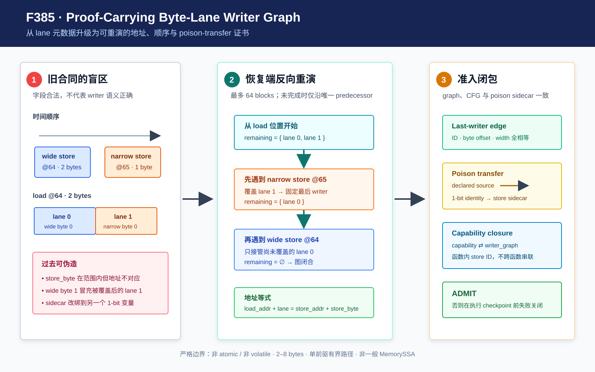

# F385：Proof-Carrying Byte-Lane Writer Graph 与 Poison Transfer 绑定

- 日期：2026-08-13
- 编译器：`compiler/ContinuationLowering.cpp`
- artifact 准入与恢复端：`util/live_continuation.py`
- 独立检查器：`util/check_live_continuation_lowering.py`
- 回归：`test/live_continuation_lowering.ll`、`test/test_live_byte_lane_writer_graph.py`
- capability：`bounded-byte-lane-writer-graph`
- 成熟度：I/T/E-mechanism；有界、单前驱、逐字节 last-writer 证书

## 1. F384 之后仍存在的内存证明缺口

已有 byte-lane lowering 能把一个宽 load 的不同字节分别归因到不同 store，并把各 store 的 deferred-poison
sidecar 合成为 load 的 definedness。例如先向地址 64 写 16 bit，再向地址 65 写 8 bit，则最终 load 的低字节来自
第一次写，高字节来自第二次写。旧 runtime 会检查 lane 数、store ID、宽度、sidecar 名称和布尔合成，但不会从
artifact 中的真实地址和 CFG 顺序重新求出 last writer。

因此，一个结构上自洽的篡改可以把 `store_byte=0` 改成 1，或把已经被覆盖的旧 store 声称为 lane 1 的最终
writer。字段仍在界内、sidecar 仍存在，但语义已经错误。F385 的目标不是增加新的 LLVM 模式，而是把已有 producer
结论升级为恢复端可独立复核的 proof-carrying writer graph。



## 2. 编译器合同

### 2.1 显式 capability 和 graph contract

每个非 PHI `byte_lane_memory_definedness` contract 新增 `writer_graph: true`，程序声明
`bounded-byte-lane-writer-graph`。二者双向闭包：新字段没有 capability、capability 没有 graph contract，或同一
程序中普通 composition 漏掉 graph marker 均在执行前拒绝。

原有 lane 元数据直接构成图边：

```text
load lane L -> initial
load lane L -> (store ID, store byte, store width, defined sidecar)
```

编译器还在 graph 所涉及的 store 上输出 `byte_lane_poison_source`。紧随 store 的 1-bit identity sidecar 必须从
这个 source 取值，防止只修改 sidecar 输入或只修改 producer 声明。

### 2.2 覆盖写的精确结果

对 `store i16 @64`、随后 `store i8 @65`、最后 `load i16 @64`，合同为：

```text
lane 0 (@64) -> wide store,   store_byte 0
lane 1 (@65) -> narrow store, store_byte 0
```

宽 store 的 byte 1 虽然地址匹配，但已经被较新的 narrow store 覆盖，不能再作为 lane 1 的 source。
LLVM 17 和 LLVM 18 生成相同的 lane 关系。

## 3. 恢复端的 last-writer oracle

恢复端不信任 producer 给出的 lane 选择，而是从 load 所在位置反向扫描：

1. load 必须具有规范的常量地址，宽度限制为 2--8 bytes；
2. 在当前 block 中按逆程序序检查 store；
3. 对仍未覆盖的每个 lane，若 `store_addr <= load_addr + lane < store_addr + store_bytes`，该 store 就是该 lane
   的唯一 last writer；
4. 合同中的 store ID、store byte 和宽度必须与重算结果完全一致；
5. 当前 block 未覆盖完时只能沿唯一 predecessor 继续，最多访问 64 个 block；
6. 到达无 predecessor 的入口后，剩余 lane 必须明确标记为 `initial`；环、分叉、动态相关地址和不完整覆盖失败关闭。

形式化地，在本功能的有界路径 `P` 上，每个 load lane `l` 的 source 是：

```text
R(l) = first_reverse({s in P | addr(s) <= addr(load)+l < addr(s)+width(s)})
```

若集合为空，只有入口初始内存可以成为 source。因为 oracle 使用“逆序第一个覆盖 store”，shadowed writer 即使地址
相等也不能通过。

## 4. Poison transfer 的闭包与边界

对 graph 引用的每个带 definedness 的 store，runtime 要求：

- store 的 `byte_lane_defined` 与 lane contract 的 `defined` 相同；
- store 紧后的指令是 1-bit `identity`，destination 正是该 defined sidecar；
- identity 的唯一 variable operand 等于 `byte_lane_poison_source`；
- 没有 deferred-poison sidecar 的 store 也不得伪造 poison-source 字段。

该闭包证明“producer 声明的 poison condition经过哪条边进入 store/load definedness”。它不声称 runtime 已从原始 LLVM
flags 重新推导每一种 overflow/shift/div poison predicate；predicate 本身仍由已有 `llvm-defined-value-guards` lowering
产生并受 SSA/schema 检查。报告明确保留这一 producer-trust 边界，避免把 transfer 完整性夸大为 LLVM poison
语义的独立形式化验证。

## 5. 三轮审查与修复

### Review 1：地址与覆盖顺序

- `store_byte` 漂移、store 地址漂移和 shadowed-wide-store 冒充 last writer 均由 graph oracle 拒绝；
- overlapping 正例、initial lane 正例和 LLVM 17/18 artifact 均通过；
- checker 会实际篡改 capability、graph marker、last-writer edge 和 poison source，而非只检查字段存在。

### Review 2：跨 capability 作用域

初版把 poison-source 要求施加到程序中所有 byte-lane store。由于 capability 是程序级，而 contract/store ID 是函数级，
当函数 A 有普通 writer graph、函数 B 只有 PHI byte-lane 时会误拒绝 B。最终实现按“graph contract 所引用的函数内
store ID”校验 poison transfer；新增三函数 reachable artifact，同时保留 1 个 writer graph 和 1 个 PHI contract，
执行结果为 2/3/3/3/4/4，证明两类合同可以共存。

### Review 3：门禁稳定性

首次 192-worker lit 中，F385 相关测试均通过，但一个既有 polyhedral exact-projection 测试在系统过订阅时得到一次
solver unknown：243 项中 242 通过、1 失败。未删除测试或放宽断言；该测试随后独立 10/10 通过，并在 32-worker
完整套件中通过。最终门禁为：

- LLVM lit：243 discovered，242 passed，1 unsupported；
- canonical Python gate：893 passed + 229 subtests；
- skipped/xfailed/xpassed/deselected、missing/unexpected node ID 均为 0；
- LLVM 17/18 Werror build、Ruff、py_compile、whitespace、artifact checker 和 SHA-256 manifest 通过。

保留首次日志很重要：最终结果证明受控资源下的正确性门禁通过，同时提示未来 benchmark/CI 不应把 192 个 SMT 密集
worker 当作默认稳定配置。

## 6. 研究价值与严格边界

F385 将部分写、覆盖写和 initial bytes 从“producer 给出的 lane 表”提升为可执行的 last-writer 证书。这类细粒度
内存 provenance 是继续扩展 alias-aware MemorySSA、对象图和 live-state 恢复的必要基础，也使 artifact 篡改能在
恢复前被定位到 address、ordering 或 poison-transfer 层。

当前边界为：

1. 仅覆盖 2--8 byte、非 atomic、非 volatile、静态可定址的普通 composition；
2. 反向路径最多 64 blocks，未覆盖完时必须为单 predecessor；
3. byte-lane PHI、conditional/cyclic writer graph 仍使用既有专用合同，尚未统一到本图 oracle；
4. 不替代 LLVM MemorySSA/AA，不处理 arbitrary symbolic pointer、线程间写入或一般 heap object graph；
5. poison transfer 被绑定，但 poison predicate 的 LLVM 级独立重建仍是后续工作；
6. 本功能只提供机制正确性证据，不提供 coverage、吞吐、漏洞数或公开 benchmark 提升结论。

下一步是把相同的 address/order/source oracle 扩展到分支 PHI 和 cyclic byte-lane contracts，形成统一的有界
MemorySSA writer DAG，再与 F383/F384 的 alias relation 证书合并。
