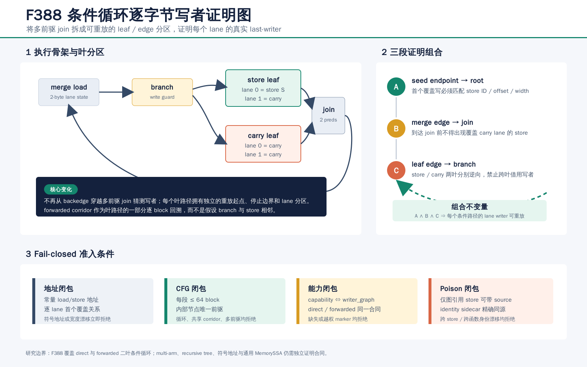

# F388：Proof-Carrying Conditional Cyclic Byte-Lane Writer Graph

## 1. 研究问题

F387 已能对基础循环合同逐 endpoint 回溯，验证每个 load byte 的首个覆盖 store。但是条件循环的
backedge 前存在一个多前驱 join：store leaf 与 carry leaf 在 join 汇合。若验证器直接从 backedge
逆向，它必须在多前驱处猜测路径；若仅相信 producer 给出的 `conditional_transfers`，又只能证明
元数据形状正确，不能证明声明的 store 确实是该 leaf 上的 last-writer。

F388 将 direct 和 forwarded 二叶条件循环提升为 proof-carrying writer graph。核心不是把 F387 的
单路径规则放宽为“允许两个前驱”，而是把路径证明显式分区，再组合三个局部可验证事实。该功能是
continuation IR 的机制正确性增强，不是 coverage、吞吐、求解速度或漏洞发现数量的 benchmark 结论。



## 2. 合同与形式化不变量

程序级能力为：

```text
bounded-conditional-cyclic-byte-lane-writer-graph
```

它要求 direct 或 forwarded conditional cyclic byte-lane PHI 能力存在，并与两类合同上的
`writer_graph=true` 双向闭合。程序只声明 capability 而没有合同、合同越权带 marker、或同一程序中的
条件合同漏标 marker，都会 fail closed。

设 load 地址为 `a_L`，lane 为 `i`；路径上候选 store 的地址、宽度为 `a_S,w_S`。store 覆盖 lane
当且仅当：

```text
a_S <= a_L + i < a_S + w_S
```

逆向扫描遇到第一个满足覆盖关系的 store 时，合同必须同时满足：

```text
declared.source      == store
declared.store       == actual.byte_lane_store
declared.store_byte  == a_L + i - a_S
declared.store_bytes == w_S
```

地址必须是固定宽度常量，store 宽度限制为 1--8 byte。符号地址、非法宽度、ID 漂移、offset 漂移和
路径上更晚的覆盖写均被拒绝。

## 3. 从多前驱图到三段证明

### 3.1 Seed endpoint 到 root

非 backedge 的 seed endpoint 继续使用 F387 的完整逆向证明：从 edge terminal 之前开始回溯，首个
覆盖写必须与 lane 声明相同；到达无前驱 root 后，尚未覆盖的 lane 只能是 `initial`。

### 3.2 Merge edge 到 join

条件 join 跳转到 cyclic PHI 的 backedge endpoint。F388 从该 endpoint 逆向到 join 边界，并要求
所有未覆盖 lane 为 `carry`。因此 join 与 merge 之间不能隐藏覆盖写，backedge 的 carry 也不能被
用作任意“未找到 store”的兜底。

### 3.3 Leaf edge 到 branch

store leaf 和 carry leaf 分别从自己的 edge block 逆向到同一 branch 边界：

- store leaf 按 `conditional_transfers[].lanes` 验证 store/carry 分区；
- carry leaf 构造全 carry 分区，任何覆盖 load lane 的写都会被拒绝；
- forwarded 模式把 `store_successor -> ... -> store_arm` 和 carry 对应 corridor 纳入同一回溯；
- 两条 corridor 必须不相交，每个内部 block 必须恰有一个前驱；
- 每段最多访问 64 个唯一 block，既有 topology gate 还将 forwarded corridor 限制为 16 个 block。

三个局部事实的组合避免了在 join 处进行路径猜测，也禁止一个 leaf 借用另一个 leaf 的 store 证明。

## 4. Poison 与身份闭包

有 LLVM poison 条件的 graph-referenced store 输出：

```json
{
  "byte_lane_store": "byte_lane_store_1",
  "byte_lane_defined": "byte_lane_store_defined_2",
  "byte_lane_poison_source": "llvm_signed_defined_12"
}
```

紧随 store 的 identity sidecar 必须从同一个 `byte_lane_poison_source` 取值。runtime 使用函数局部
`writer_graph_referenced_byte_lane_stores` 集合进行最终闭包：只有被基础、PHI、循环或条件循环图
实际引用的 store ID 才能携带 poison source。单纯存在 capability 不会授权未重放的 store，也不会
把一个函数的 store ID 权限泄漏到另一个函数。

## 5. 实现细节

### 5.1 LLVM producer

`compiler/ContinuationLowering.cpp`：

- 新增 `usesConditionalCyclicByteLaneWriterGraph`；
- direct/forwarded conditional 合同输出 `writer_graph=true`；
- 输出 `bounded-conditional-cyclic-byte-lane-writer-graph` capability；
- 仅扫描 `conditionalTransfers[].lanes` 中实际引用的 store；
- 仅为其中有 poison 条件的 store 输出 `byte_lane_poison_source`；
- multi-arm 与 recursive transfer 不借用该能力，仍维持独立边界。

### 5.2 Runtime verifier

`util/live_continuation.py`：

- 验证 capability 依赖和 capability/marker 等价关系；
- 新增 `verify_conditional_cyclic_byte_lane_writer_path`；
- 对 seed、join-prefix、store leaf、carry leaf 分段逆向重放；
- 对每个覆盖 store 验证地址推导的 byte offset、宽度和 function-local ID；
- 对 graph store 的 poison source 与 identity sidecar 做精确同源验证；
- 最终拒绝 capability 无合同、poison store 未被图引用等悬空状态。

### 5.3 Checker 与反例

`util/check_live_continuation_lowering.py` 新增
`--expect-conditional-cyclic-byte-lane-writer-graph`。除检查实物结构外，checker 会主动构造并要求拒绝：

1. 删除 capability；
2. 删除合同 marker；
3. 漂移 graph store 地址；
4. 漂移 poison source 身份。

`test/test_live_conditional_cyclic_byte_lane_writer_graph.py` 另有五个独立测试，覆盖 direct 与 forwarded
正例、store leaf 后置覆盖写、carry leaf 非法写、poison 身份漂移和 capability/marker 闭包。

## 6. 可执行验证结果

### 6.1 跨 LLVM producer 实物

同一个 `test/live_continuation_lowering.ll` 分别由 LLVM 18 与 LLVM 17 producer 降低：

| 实物 | 图 | endpoint | 条件 transfer | transfer store/carry lane | 结果 |
|---|---:|---:|---:|---:|---|
| direct / LLVM 18 | 1 | 2 | 1 | 1 / 1 | PASS |
| direct / LLVM 17 | 1 | 2 | 1 | 1 / 1 | PASS |
| forwarded / LLVM 18 | 1 | 2 | 1 | 1 / 1 | PASS |

三个实物均含 2 个函数局部图引用 store ID，其中 1 个 transfer store 具有精确 poison 绑定。checker
对每个实物执行 capability、marker、地址和 poison 主动篡改；全部反例均被拒绝。

### 6.2 Python 门禁

| 范围 | 结果 |
|---|---:|
| F388 模型测试 | 5 passed |
| F385--F388 writer graph 联合测试 | 20 passed |
| 所有 `test_live_*.py` | 79 passed + 51 subtests |
| 完整能力闭合 Python gate | 908 passed + 229 subtests |

完整 gate 的 collection error、failed、skip、xfail、xpass、deselect、missing nodeid 和 unexpected nodeid
均为 0；规范身份清单为 908 项，node-list SHA-256 为
`49d6231f270889eb88f37d7d9bcb13153ee037f69da7c9907a83fdc77d117435`。

### 6.3 LLVM lit 与静态门禁

受控 `-j32` 全量 lit 共发现 246 个测试，245 passed、1 个平台声明的 unsupported、0 failed，耗时
210.58 秒。双 LLVM 构建、Ruff、`py_compile`、whitespace 与 delivery verifier 输出保存在
`evidence/f388-conditional-cyclic-byte-lane-writer-graph-2026-08-13/`。证据目录使用独立 SHA-256
manifest，顶层交付 manifest 再绑定报告、图和证据 manifest。

## 7. 正确性边界与后续工作

F388 证明 direct 与 forwarded 二叶条件循环在固定地址、受限 CFG 下的逐 lane last-writer 关系。
它不证明：

- multi-arm transfer 的三个或更多 leaf；
- recursive condition tree、grouped/repeated-source/multicarry 变体；
- 多 latch、多前驱 corridor、一般 SCC 或通用 MemorySSA 关系；
- 符号指针、动态别名、并发内存或任意宽度 store；
- producer 自身生成 LLVM poison predicate 的语义正确性；
- coverage、吞吐、求解耗时或漏洞发现指标提升。

下一阶段应把相同的“leaf 分区 + 边界重放”原则扩展到 multi-arm transfer，再对 recursive tree 使用
显式 branch-to-leaf path witness。不能仅因 F388 capability 已存在就为更复杂合同打开 marker。
