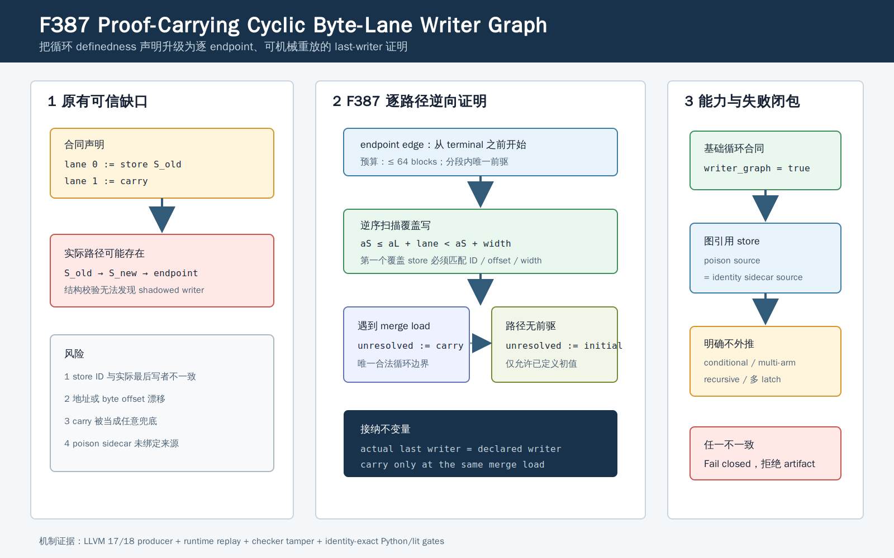

# F387：Proof-Carrying Cyclic Byte-Lane Writer Graph

## 1. 研究问题

F385 和 F386 已分别把普通基本块与普通 PHI 的 byte-lane definedness，从“生产者声明了某个
store”升级为可重放的 last-writer 证明。但循环版合同此前仍只检查边上的布尔状态传递：

- `store` lane 的 ID、宽度和 definedness sidecar 在结构上有效；
- `carry` lane 在回边上自赋值；
- seed endpoint 为循环提供非 carry 初始状态。

这些条件不足以证明声明的 store 是从当前 endpoint 回溯到循环 load 时，覆盖该字节的第一个写者。
同地址旧 store、地址偏移漂移或宽度错误仍可能形成结构合法、语义错误的证明记录。F387 为基础循环
byte-lane PHI 增加独立能力 `bounded-cyclic-byte-lane-writer-graph`，把每个 seed/backedge endpoint
变为可由 runtime 独立重放的有界写者路径。

本功能是 continuation IR 的机制正确性增强，不是通用 MemorySSA、性能优化或 benchmark 结果。



## 2. 合同与语义

一个基础循环合同包含 load `L`、宽度 `n`、lane 状态 `D_0...D_{n-1}`，以及每个进入 merge 的
endpoint `e`。F387 要求合同与程序级能力双向闭合：

```text
bounded-cyclic-byte-lane-writer-graph in capabilities
    iff every base cyclic byte-lane contract has writer_graph = true
```

条件、multi-arm 和 recursive 循环合同不属于该等价式；它们继续使用各自的能力族，也不得借用 F387
标记。对 endpoint `e` 和 lane `i`，runtime 从 endpoint terminal 之前开始逆序扫描。设
`a_L` 是 load 的常量地址，`a_S,w_S` 是候选 store 的地址和字节宽度，则 store 覆盖 lane 的条件为：

```text
a_S <= a_L + i < a_S + w_S
```

逆序遇到的第一个覆盖 store 必须同时满足：

```text
declared.store       == actual.byte_lane_store
declared.store_byte  == a_L + i - a_S
declared.store_bytes == w_S
```

如果尚有未覆盖 lane：

1. 路径无前驱时，只允许这些 lane 声明为 `initial`；
2. 逆向到达 merge block 中同一 load 指令时，只允许声明为 `carry`；
3. 其他位置必须只有一个前驱，否则 fail closed；
4. 路径最多访问 64 个 block，重复 block 或超预算均拒绝。

因此 `carry` 不是任意“没有找到 store”的兜底值，而是一个明确的循环边界：当前迭代未覆盖该
lane，definedness 从上一迭代的 lane 状态继承。

## 3. Poison transfer 闭包

对可能产生 LLVM poison 的图引用 store，compiler 输出：

```json
{
  "byte_lane_store": "byte_lane_store_0",
  "byte_lane_defined": "byte_lane_store_defined_1",
  "byte_lane_poison_source": "llvm_signed_defined_10"
}
```

紧随 store 的 identity sidecar 必须精确读取 `byte_lane_poison_source`。runtime 还维护函数局部的
`writer_graph_referenced_byte_lane_stores`：只有被 F385、F386 或 F387 已验证图实际引用的 ID 才能
携带 poison source。程序中仅出现某个图 capability，不会授权 legacy、conditional 或其他函数中的
store 输出未经图重放的 poison 元数据。

## 4. 实现

### 4.1 LLVM producer

`compiler/ContinuationLowering.cpp` 新增：

- `usesCyclicByteLaneWriterGraph` 全局能力登记；
- 基础 `CyclicByteLaneMemoryPhi` 的 `writer_graph: true`；
- 仅从非 conditional、非 multi-arm、非 recursive 合同收集图引用 store；
- 仅为这些图引用且具有 poison 条件的 store 输出 `byte_lane_poison_source`。

生产者仍沿用既有保守分析：2--8 byte load、最多 64 个 predecessor、常量基址/偏移、非
atomic/volatile、函数级 alias closure，并要求至少一个 carry、一个 seed endpoint 和一个潜在 poison
来源。F387 没有扩大这些识别边界，而是提高已识别合同的可审计性。

### 4.2 Runtime admission

`util/live_continuation.py` 新增 `verify_cyclic_byte_lane_writer_graph()`：

- 从 endpoint edge 的 terminal 之前开始；
- 对 store 做常量地址、宽度、ID、byte offset 和 last-writer 校验；
- 将 merge load 作为唯一 carry 截止点；
- 复用 64-block、无环、唯一前驱预算；
- 校验 store definedness sidecar 与 poison source 的 identity 绑定；
- 在全部函数处理后检查 capability/contract 及图引用/poison 的双向闭包。

### 4.3 Checker 与回归

`util/check_live_continuation_lowering.py` 新增
`--expect-cyclic-byte-lane-writer-graph`，检查真实 producer 产物，并主动构造：

- 删除 capability；
- 删除 `writer_graph` marker；
- 移动图引用 store 地址；
- 漂移 `byte_lane_poison_source`。

`test/test_live_cyclic_byte_lane_writer_graph.py` 另有五项最小模型测试，覆盖 seed 路径、backedge
store+carry、offset/address 漂移、把 carry 伪装为 initial、poison 绑定和 capability/marker 闭包。
大型 `test/live_continuation_lowering.ll` 则在真实 LLVM 17/18 producer 上执行完整 checker。

## 5. 验证结果

| 门禁 | 结果 |
|---|---:|
| F387 最小模型 | 5 passed |
| F385/F386/F387 联合定向 | 15 passed |
| 全部 live-state Python | 74 passed + 51 subtests |
| LLVM 18 构建 | PASS |
| LLVM 17 构建 | PASS |
| 大型 lowering 单测 | 245 discovered，244 excluded，1 passed |
| 完整 Python capability gate | 903 passed + 229 subtests，零 skip/xfail/xpass/deselection/身份漂移 |
| 完整 lit（受控 `-j32`） | 245 discovered，244 passed，1 unsupported |

LLVM 18 与 LLVM 17 的基础循环实物均含 1 个 graph、2 个 endpoint、1 个 carry lane、2 个函数局部
store ID；条件循环对照实物不含 F387 capability/marker。完整结果与命令输出保存在
[`f387-cyclic-byte-lane-writer-graph-2026-08-13`](../evidence/f387-cyclic-byte-lane-writer-graph-2026-08-13/)。

## 6. 正确性边界与下一步

F387 证明的是“基础循环、唯一前驱分段、常量地址”的逐 lane last-writer 关系。它不证明：

- conditional、multi-arm、recursive transfer 内每个叶子的完整 writer path；
- 多个循环 latch 的一般 MemorySSA fixed point；
- symbolic pointer、跨对象别名或并发内存模型；
- compiler 自身生成 LLVM poison predicate 的独立语义等价性；
- coverage、吞吐、求解速度或漏洞发现数量提升。

后续若扩展条件树，必须给每个 leaf/edge 单独绑定重放起点、join 边界和 writer partition，不能仅因
F387 已存在就复用程序级能力。更一般的多 latch/多前驱循环则需要显式 SCC/MemorySSA witness，避免
把单路径逆向扫描错误外推为通用循环内存证明。

> 后续状态（2026-08-13）：direct/forwarded 二叶条件循环已由 F388 以独立 capability 和三段
> leaf/edge writer proof 闭合；multi-arm、recursive tree 与通用 SCC/MemorySSA 边界仍然保留。
