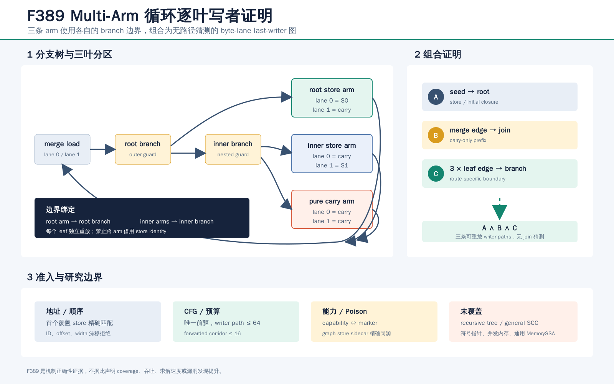

# F389：Proof-Carrying Multi-Arm Cyclic Byte-Lane Writer Graph

## 1. 问题与贡献

F388 解决了二叶条件循环，但 multi-arm transfer 由外层 root branch 和内层 branch 形成三叶树。若把三条
arm 都回溯到 root，会把 inner branch 之前的状态错误归入 inner leaf；若在 join 处统一回溯，又重新引入
多前驱猜测。F389 为 direct/forwarded multi-arm 合同建立 route-specific writer proof：root arm 截止于
root branch，inner-true/inner-false arm 分别截止于 inner branch。

该功能增强 continuation IR 机制正确性，不代表 coverage、吞吐、求解速度或漏洞发现指标提升。

## 2. 能力合同

新增 `bounded-multiarm-cyclic-byte-lane-writer-graph`。它依赖 direct 或 forwarded multi-arm cyclic
byte-lane PHI capability，并要求所有对应合同精确带 `writer_graph=true`。capability 无合同、漏 marker、
或其他合同越权使用 marker 均失败关闭；recursive 合同不能借用 F389。

每个 artifact 保留现有三路结构约束：

- route 集合精确为 `root`、`inner_true`、`inner_false`；
- 两个 arm 含一个 store source 和至少一个 carry source；
- 一个 arm 为全 carry；
- 三条 corridor 不相交，edge block 唯一并精确汇入 join；
- direct corridor 长度为 1，forwarded corridor 最大 16 blocks。

## 3. 五类局部证明

F389 将完整 writer relation 分解为：

1. seed endpoint 到无前驱 root；
2. merge backedge 到 multi-arm join 的 carry-only prefix；
3. root arm edge 到 root branch；
4. inner-true arm edge 到 inner branch；
5. inner-false arm edge 到 inner branch。

每条路径最多访问 64 个唯一 block，内部每步必须只有一个 predecessor。设 load 地址为 `a_L`，lane 为
`i`，store 地址和宽度为 `a_S,w_S`，首个满足 `a_S <= a_L+i < a_S+w_S` 的 store 必须精确匹配
函数局部 ID、`store_byte=a_L+i-a_S` 和 `store_bytes=w_S`。未解析 lane 只有在指定 branch/join 边界
才能成为 carry；因此纯 carry arm 中的覆盖写、store arm 中位于声明 store 之后的 shadow writer 均被拒绝。

## 4. Poison 与实现

LLVM producer 在 `compiler/ContinuationLowering.cpp` 中：

- 仅扫描 `multiArmTransfers[].arms[].lanes` 中的实际 store；
- 输出 F389 capability 与合同 marker；
- 仅为图引用且有 poison 条件的 store 输出 `byte_lane_poison_source`。

runtime 在 `util/live_continuation.py` 中复用分段逆向 oracle，但按 route 选择停止边界，并将 arm store ID
加入函数局部 `writer_graph_referenced_byte_lane_stores`。紧邻 identity sidecar 必须读取同一个 poison
source。checker 新增 `--expect-multiarm-cyclic-byte-lane-writer-graph`，主动删除 capability/marker、漂移
地址和 poison identity，并要求全部反例被拒绝。

## 5. 可执行结果

| 范围 | 结果 |
|---|---:|
| F389 独立模型 | 5 passed |
| F385--F389 writer graph 联合 | 25 passed |
| 所有 live-state Python | 84 passed + 51 subtests |
| 完整 Python gate | 913 passed + 229 subtests |
| 完整 LLVM lit | 247 discovered；246 passed，1 unsupported；207.21 s |

完整 Python gate 的 skip、xfail、xpass、deselect、collection error、missing/unexpected nodeid 均为 0；913
项规范 node-list SHA-256 为 `d62194357f56ecbad518ae977691029e67147f17437d7012d356e079e577060b`。

LLVM 18/17 direct 与 LLVM 18 forwarded 三份实物均含 1 graph、2 cyclic endpoints、1 transfer、3 arms、
2 store arms、1 carry arm、3 个图引用 store ID（含 seed）和 2 个 poison-bound arm stores。三份实物
均通过 capability、marker、地址和 poison 主动篡改。完整 lit 与静态门输出保存在
[`f389-multiarm-cyclic-byte-lane-writer-graph-2026-08-13`](../evidence/f389-multiarm-cyclic-byte-lane-writer-graph-2026-08-13/)。

## 6. 边界与下一步

F389 不证明 recursive condition tree、grouped/repeated-source/multicarry 变体、一般 SCC、多 latch 或通用
MemorySSA；也不覆盖符号指针、并发内存或 producer poison predicate 的独立推导。下一步需要为 recursive
tree 输出显式 branch-to-leaf path witness，并验证每个 leaf 的祖先分支序列与 writer partition 一致。
