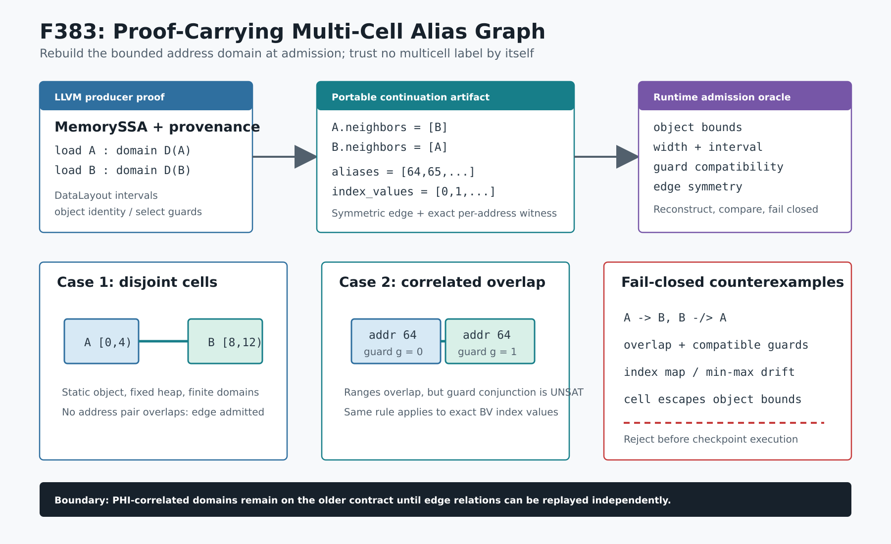

# F383：可执行复核的 Multi-Cell Alias Graph

- 日期：2026-08-12
- 编译器：`compiler/ContinuationLowering.cpp`
- artifact 准入与执行器：`util/live_continuation.py`
- 独立检查器：`util/check_live_continuation_lowering.py`
- 测试：`test/live_continuation_lowering.ll`、`test/test_live_multicell_alias_graph.py`
- 能力：`bounded-multicell-alias-graph`
- 成熟度：I/T/E-mechanism；有界 alias 证书，不等价于一般 pointer analysis

## 1. 问题与审查结论

F142--F148 已能在编译期证明同一 merge block 中多个 MemorySSA definedness PHI 对应不同 cell，覆盖
constant subobject、identified static object、fixed heap object、finite pointer domain、select guard correlation、
PHI correlation 与 symbolic-index interval。然而旧 artifact 只保存每个合同的 `multicell=true` 和证明类别；
运行时主要检查“同一 block 至少有两个 marker”，无法从实际 load 的地址域重新验证二者是否真的独立。

这形成一个跨信任边界缺口：artifact 若把 load 地址、alias case 或 index interval 篡改为重叠，标签仍可能保持
自洽。F383 不替换 LLVM AA/MemorySSA，而是把编译器结论缩减为可移植、可执行复核的有限图证书。



## 2. Artifact 图合同

每个能够独立复核的 multi-cell load 合同新增 `alias_graph_neighbors`。若 A 与 B 被证明独立，则必须同时满足：

```text
B in neighbors(A)  and  A in neighbors(B)
block(A) == block(B)
multicell(A) == multicell(B) == true
```

程序声明 `bounded-multicell-alias-graph` 后，至少必须存在一条有效无向边。capability 没有合同、合同没有
capability、自环、重复邻居、跨 block 边、非对称边或不存在的 load 都在执行前拒绝。

编译器当前为以下证明生成图边：

1. 常量区间互不相交，包括同一对象的不同 subobject；
2. identified static object 或 fixed-size heap allocation identity 不同；
3. 有限 pointer domain 的笛卡尔积互不相交；
4. select guard 使所有重叠地址对互斥；
5. symbolic-index interval 在同一 index expression 下逐地址不可同时到达。

PHI-correlated pointer domain 暂不生成 F383 图边。其互斥关系来自 edge block 对两个 pointer-tag 的联合赋值，
仅比较 load-local alias cases 不足以独立证明；因此保留原 F147 合同，避免把不完整 oracle 宣称为完整验证。

## 3. 运行时重建算法

准入器在 canonical JSON 副本上定位 `contract.block` 中唯一的目标 load，并重建有限 cell 集：

```text
Cell = (address, address + bytes, conjunction(guards))
```

地址来源可以是 constant address、`aliases` 或 `alias_cases[].addresses`，每项均重新验证：

- `bits` 为 1--64、`bytes` 为 1--8，且 `bits <= bytes * 8`；
- cell 完整落入且只落入一个声明 memory object；
- 单个 load 最多 256 个 cell、单个 case 最多 64 个 guard；
- guard operand 使用 canonical JSON identity，位宽与 expected BV 值均有界；
- 同一 guard 出现冲突值时该 case 本身无效，不允许用矛盾元数据伪造证明。

对图边 `(A,B)`，运行时枚举 `D(A) x D(B)`。区间不重叠则安全；若区间重叠，只有当联合 guard 中存在
同一个 BV operand 的不同等值约束时才视为不可同时满足。任何“区间重叠且 guard 相容”的 pair 都以
`contains a feasible overlap` 拒绝。

## 4. Symbolic-index 精确映射

首轮整文件回归暴露了一个保守误报。两个 symbolic GEP 可产生相同枚举地址集合，但地址与 index 的对应关系
不同。例如：

```text
A: addresses [64,65,66,67] <-> index [ 0, 1, 2, 3]
B: addresses [64,65,66,67] <-> index [-2,-1, 0, 1]
```

只看地址集合会错误认定 64/65 重叠可行；实际同一个 index 在 A/B 中选择的地址不同。F383 因而新增
`alias_index_values`，与 `addresses` 逐项对应，并与 `alias_index_bits/min/max` 共同验证。运行时把每个 cell
附加 `index == exact_value` 的 BV guard，既保留负索引的二补码语义，也拒绝 values 长度、范围或 min/max
摘要漂移。

这一修复同时改进所有带 symbolic index 的 load/store/alias case schema；旧 artifact 没有该可选字段仍可
兼容读取，但只有携带精确映射的 F383 图边才能获得新 capability。

## 5. 多轮验证

### Review 1：生产/消费双向闭包

- 编译器只为实际证明过的不相交 pair 生成对称边；
- runtime 要求 capability、multi-cell marker 与图边相互蕴含；
- 独立 checker 删除 capability、删除单向邻接或改写 load 地址，均要求失败关闭。

### Review 2：重叠与关系证明

- fixed heap 两个 allocation site 的 alias cases 通过；
- 相同地址但 `guard==0` / `guard==1` 的 select-correlated pair 通过；
- 相同地址且 guard 相容的反例拒绝；
- PHI-correlated pair 不产生图 capability，原精确结果 `1,1,2` 保持。

### Review 3：symbolic interval 回归修复

- 第一次完整 `live_continuation_lowering.ll` 运行发现地址集合误报；
- 加入逐地址 `alias_index_values` 后，symbolic interval 正例与 tamper 反例通过；
- 该大型 lit 文件二次运行 1/1 通过，覆盖 470 余条 RUN 管线；
- LLVM 17 与 LLVM 18 均完成 Werror 构建，symbolic interval artifact 都声明并通过 F383 合同。

新增独立 Python 测试为 5 passed，覆盖 constant、guard、index、capability/symmetry 和 feasible-overlap 五类合同。
更新后的完整 LLVM lit 为 240 passed、1 unsupported；canonical Python capability gate 为 883 passed +
229 subtests，且 skipped/xfailed/xpassed/deselected、missing/unexpected node ID 均为 0。LLVM 17/18 Werror
构建、Ruff、py_compile、diff whitespace 与文档 verifier 全部纳入哈希证据。上述数字证明本快照的机制与回归
门禁通过，不应外推为 fuzzing coverage 或吞吐提升。

## 6. 创新性与严格边界

F383 的研究价值在于把“编译器说两个 cell 不相交”提升为 proof-carrying portable artifact：LLVM 端负责利用
DataLayout、ConstantRange 和 provenance 发现关系；恢复 worker 不需要 LLVM，但能从有限地址域和 BV guard
独立否证伪造的独立性声明。它把 alias analysis 结果转成跨进程、跨版本可审计的执行合同。

当前仍不是一般 heap graph 或完整别名分析：

1. 不证明 unbounded heap、递归数据结构、任意 pointer arithmetic 或整数转指针；
2. 不求解一般 guard SMT，只识别同一 canonical BV operand 的冲突等值；
3. PHI edge correlation 尚未携带完整联合赋值证书；
4. 图只验证已声明 pair，不声称对未连边 load 的 must-alias/no-alias 结论；
5. 本功能证明 mechanism correctness，不提供 coverage、吞吐或公开 benchmark 提升结论。

下一步可把 edge-block pointer-tag relation 降为相同的有限关系证书，再把图节点扩展到 byte-lane overlap writer
graph；任何扩展都必须保留有界枚举、对称边和 admission-time fail-closed 三项不变量。
