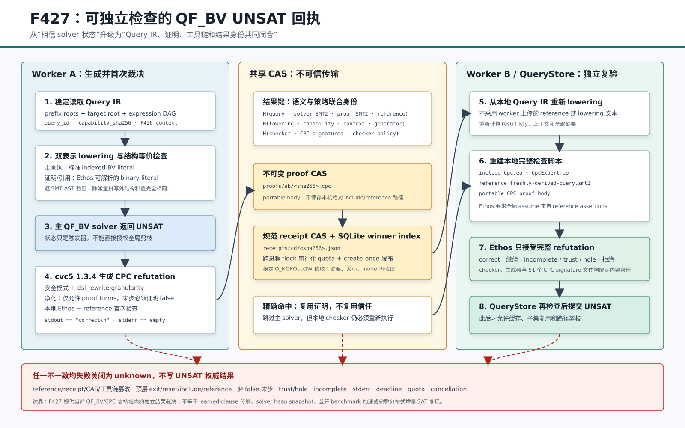

# F427：可独立检查的 QF_BV UNSAT 证明回执

- 日期：2026-08-17
- 功能编号：F427
- 状态：I/T/E-mechanism；W4 第二阶段完成
- 支持域：SymCC Query IR 可精确降低的 QF_BV，cvc5 CPC，Ethos/Eunoia 独立检查
- 主要实现：`util/qfbv_proof_receipt.py`、`util/qf_bv_backend.py`、
  `util/query_store.py`、`util/symcc_query_service.py`
- 测试与 oracle：`test/test_qfbv_proof_receipt.py`、
  `benchmark/check_qfbv_proof_receipt_oracles.py`
- 可复现工具链：`benchmark/install_cvc5_cpc_ethos_1_3_4.sh`

## 1. 研究问题

F426 已经能够让不同 worker 对同一个规范 QF_BV 前缀建立内容身份，并在本地重建增量 solver。
它仍然不能回答更关键的问题：worker A 报告的 `UNSAT` 能否被 worker B 独立裁决？如果只缓存
solver 返回的字符串，一个错误配置、版本漂移、传输损坏或错误查询绑定都可能把并非当前查询的
结论升级为全局剪枝事实。

F427 将 UNSAT 从状态字符串提升为携带完整身份的**证明回执**：

\[
R = H(Q, Q_p, Q_r, L, C, X, G, V, S, P, \pi, \texttt{correct})
\]

其中：

- `Q` 是主 solver 使用的 SMT2；
- `Q_p` 是 CPC generator 使用的完整查询；
- `Q_r` 是 Ethos `reference` 使用的 declaration/assertion 问题；
- `L` 是 Query IR lowering certificate；
- `C` 是 backend capability；
- `X` 是 F426 prefix context identity；
- `G/V/S/P` 分别是 generator、verifier、CPC signature tree 与 checker policy 身份；
- `π` 是可移植 CPC proof body；
- `correct` 必须是 Ethos 的逐字节完整裁决结果。

只有这些身份一致，且本地 Ethos 对从**本地 Query IR 新鲜生成**的 reference 返回精确
`correct\n`，结果才允许进入 QueryStore。proof store 是不可信传输层；它保存证明，但不授予信任。



## 2. 技术来源与准确定位

cvc5 从 1.3.0 开始把 safe mode 定义为只允许具备完整 proof/model 支持的功能，并显著扩充 CPC
证明覆盖；其 CPC 文档说明，Ethos 在证明含 trust step 时输出 `incomplete`，只有完整证明才输出
`correct`。F427 因而固定使用 cvc5 1.3.4 safe mode、CPC 与 Ethos，而不再使用项目早期实验中对
QF_BV 会产生 `hole` 的 Alethe 1.1.2 路径。

TACAS 2026 的 *Real-time Proof Checking for Distributed Incremental SAT Solving* 进一步说明，
分布式增量求解中的 formula increment、assumption、任务身份和可检查结果必须共同绑定，learned
clause 也必须携带可验证依赖。F427 借鉴其“传输不可信、checker 独立裁决”的原则，但没有宣称
复现 MallobSat/LIDRUP、实时 clause sharing 或论文的多达 1216 核实验。

| 维度 | TACAS 2026 工作 | F427 |
| --- | --- | --- |
| 逻辑/格式 | 分布式增量 SAT 与 LIDRUP 类信息 | Query IR 降低的 QF_BV 与 CPC |
| 验证对象 | 增量任务、共享 clauses、最终结果 | 完整 QF_BV closed refutation |
| checker | 实时分布式 SAT checker | 本地 Ethos/Eunoia |
| 已共享 | clauses 与 proof checking 信息 | 可移植 proof body 与结果回执 |
| 未实现 | 不适用 | learned-clause 依赖、solver heap、实时流式 proof |

权威来源：

- [cvc5 CPC/Ethos 文档](https://cvc5.github.io/docs/cvc5-1.3.1/proofs/output_cpc.html)
- [cvc5 版本说明](https://github.com/cvc5/cvc5/blob/main/NEWS.md)
- [Ethos checker](https://github.com/cvc5/ethos)
- [TACAS 2026 论文](https://doi.org/10.1007/978-3-032-22752-2_18)
- [TACAS 2026 实验制品](https://zenodo.org/records/18330441)

## 3. 端到端执行次序

### 3.1 首次求解和发布

1. QueryStore 稳定读取 Query IR 的 prefix roots、target root 与 expression DAG。
2. QF_BV backend 生成主 SMT2、CPC proof query、reference SMT2、offsets、lowering
   certificate 和 F426 context identity。
3. 普通与 proof lowering 使用两种标准 BV literal 拼写。实现把两者解析为 SMT AST，并逐节点将
   `(_ bvN W)` 与同值同宽的 `#b...` 归一；除这种表示差异外，任一结构、宽度或值偏差都会失败。
4. backend 在 proof store 中按完整 result key 查找已有回执。没有命中才启动主 solver。
5. 主 solver 返回 SAT 时仍走原有 model replay；返回 UNKNOWN 时停止；返回 UNSAT 仅触发证明阶段。
6. 独立 cvc5 进程以 `--safe-mode=safe --proof-granularity=dsl-rewrite
   --dump-proofs` 重新求解 proof query。cvc5 1.3.4 的 safe mode 已强制 CPC；显式重复设置 expert
   `--proof-format-mode=cpc` 会被该版本拒绝，因此只在配置 schema 中绑定`format: "cpc"`。
7. generator 输出必须以唯一 `unsat` 状态和唯一 CPC wrapper 开始。proof body 经过有界 ASCII
   解析和顶层 form 白名单净化。
8. verifier 在私有临时目录重建检查脚本：加入本机内容一致的 `Cpc.eo`、`CpcExpert.eo`，加入指向
   新鲜 reference SMT2 的 `(reference ...)`，最后拼接 portable proof body。
9. Ethos 必须返回 return code 0、stdout 精确等于 `correct\n`、stderr 精确为空。`incomplete`、
   warning、trust、hole、非 false 末步或任何额外输出均不授权 UNSAT。
10. verifier 构造规范 receipt，以 SHA-256 绑定证明、查询、策略和上下文，并在 store-wide `flock`
    下完成配额检查、create-once CAS 发布和 SQLite winner index 提交。
11. backend 返回 receipt telemetry，但这仍不是最终提交。
12. QueryStore 从自己的不可变 Query IR 再次 lowering，重新计算所有摘要，从本地 CAS 读取证明并
    再启动一次 Ethos。只有二次检查通过，才写入 `store_unsat_proof_verified=true` 并提交结果。

### 3.2 跨 worker 精确复用

worker B 处理同一 query/capability/context/tool-policy 时，在启动主 solver 前计算相同 result key。
若 CAS 命中，它仍然执行以下步骤：

1. 规范化并复算 receipt SHA-256；
2. 复核 generator、checker 和完整 CPC signature tree 的内容身份；
3. 从本地 Query IR 重建 reference；
4. 稳定读取 CAS proof 并校验大小和摘要；
5. 本地 Ethos 再检查；
6. QueryStore 在提交时再检查一次。

因此“复用”只跳过主 solver 和 proof generator，不跳过 checker。若 checker 或 signature 版本发生
变化，result key 不同；若同一进程初始化后文件发生变化，policy drift 检查立即失败。

### 3.3 未启用证明时

没有配置 `unsat_proof` 时，一次性 backend 继续调用原 `lower_qfbv_query`，persistent backend 继续
调用单次 `_lower_qfbv_query_plan`；不会生成 binary proof terms、不会扫描 CPC signature tree，也不会
访问 proof store。原有显式 `accept_unsat=true` 合同保持兼容。配置 verifier 后，proof check 优先于
`accept_unsat`，没有完整证明的原始 UNSAT 会降级为 `unknown`。

## 4. Receipt 与结果身份

receipt schema 为 `symcc-qfbv-unsat-proof-receipt-v1`，协议为
`symcc-qfbv-cpc-ethos-reference-v1`。主要字段如下：

| 字段 | 作用 |
| --- | --- |
| `query_id` | 绑定 QueryStore 中的不可变查询 |
| `smt2_sha256` | 主 solver 查询身份 |
| `proof_query_smt2_sha256` | generator 查询身份 |
| `reference_smt2_sha256` | Ethos reference 身份 |
| `lowering_certificate_sha256` | 绑定 Query IR lowering 语义与统计 |
| `capability_sha256` | 隔离 operator、宽度、增量与 UNSAT 能力 |
| `context` | F426 terminal/parent/formula/depth 身份 |
| `generator_identity` | executable、argv template 与 trusted artifacts 内容身份 |
| `checker_identity` | 独立 checker 的内容与参数身份 |
| `signature_identity` | 全部相对 `.eo` 路径、大小和 SHA-256 |
| `checker_policy_sha256` | 将协议、工具链和 proof 大小合同汇总为本地策略 |
| `proof_sha256` / `proof_bytes` | portable CPC body 内容身份 |
| `checker_stdout_sha256` | 固定为 `SHA256("correct\n")` |
| `result_key_sha256` | 查询与策略联合键，用于跨 worker 精确查询 |
| `receipt_sha256` | 除自身外所有规范字段的最终摘要 |

路径不进入 executable 内容身份，允许不同节点把内容相同的二进制挂载在不同根目录；argv 中除第一个
executable 外的参数仍然参与身份，防止不同 proof mode 被误认为同一策略。signature tree 使用相对路径
和内容摘要，任何内部 symlink、文件增删或内容变化都会隔离或拒绝回执。

## 5. Proof 闭合与失败关闭

### 5.1 为什么需要 `reference`

仅证明某个公式不可满足不够，还必须证明它就是当前 Query IR 的公式。Ethos 的 `reference` 机制
要求 proof 的全局 assumptions 来自 reference 中的 assertions。F427 不保存 generator 机器上的
reference 路径，而是在每次检查时写入本地新鲜 reference。这阻止一个对其他矛盾公式有效的 proof
授权当前查询。

### 5.2 Portable proof 白名单

净化后的顶层只允许：

```text
declare-const · define · assume · assume-push · step · step-pop
```

input declarations必须与 Query IR offsets 一一对应，并在持久化前移除，由 reference 的 declarations
提供权威声明。`include`、`reference`、`exit`、`reset` 或未知顶层 form 均被拒绝，避免 proof body
提前终止或替换本地检查上下文。最后一个顶层 form 必须是显式证明 `false` 的 `step`。

### 5.3 Reference 限制

reference 只允许 declaration/assertion problem；空输入、NUL、非 ASCII、超 64 MiB，以及
`exit/reset/push/pop/check-sat/get-*` 均失败关闭。生产 reference 由 lowering 生成，公开
`check_proof_body` API 也应用同一限制。

### 5.4 时间和取消

proof reuse、generator、checker 与竞争 winner 重检共享一个绝对 deadline。每个子阶段只能获得剩余
预算；不能让 generator 和 checker 各消耗一份完整 timeout。CAS publication lock 使用有界非阻塞
`flock` 重试。portfolio 出现 SAT winner 时，活动 generator/checker 进程组会被终止并报告取消，不能
留下授权结果。

同步文件哈希和文件系统调用本身没有内核级可取消接口；当前合同对外部进程等待与锁等待有界，对
本地稳定读取设置严格字节上界。网络文件系统资格与 hostile namespace 不属于 F427 已证明范围。

## 6. Proof store 并发和持久化

QfbvProofStore 将 proof 与 receipt 分开保存：

```text
<root>/proofs/ab/<proof-sha256>.cpc
<root>/receipts/cd/<receipt-sha256>.json
<root>/index.sqlite3
<root>/.publish.lock
```

发布流程在跨进程锁内先检查现有 winner 和 SQLite 配额，之后才写 CAS 文件；因此正常并发下不会因
两个进程同时 miss 而越过 `max_objects`。文件采用临时文件完整写入、`fsync`、hard-link no-replace、
目录 `fsync`。竞争发布者必须读回完全相同字节。

读取使用 `O_NOFOLLOW`，要求 regular inode，并比较读取前后 `dev/inode/size/mtime` 与路径项身份。
proof/receipt 摘要、索引相对路径、编码大小和 result key 均再次验证。进程若在文件发布后、SQLite
commit 前崩溃，可能留下最多本次 proof/receipt 两个未索引对象；F427 不把它们当作命中。跨作业
orphan GC 属于后续 CAS lifecycle 工作。

## 7. 配置与可复现工具链

安装固定工具链：

```bash
benchmark/install_cvc5_cpc_ethos_1_3_4.sh
```

默认安装到 `$HOME/.local/share/symcc-cpc-1.3.4`。脚本固定 cvc5 tag/commit、release archive
SHA-256，并使用该 commit 自带的 `get-ethos-checker` 获取匹配 Ethos 与 CPC signatures。CI 对目录
做版本化缓存，并要求 cvc5、Ethos、`Cpc.eo` 和 `CpcExpert.eo` 均存在。

服务 portfolio 示例：

```json
{
  "solvers": [{
    "kind": "smtlib-qfbv",
    "name": "cvc5-proof",
    "command": ["cvc5", "--lang=smt2", "--produce-models", "{query}"],
    "unsat_proof": {
      "format": "cpc",
      "generator_command": [
        "/opt/cpc/bin/cvc5", "--lang=smt2", "--safe-mode=safe",
        "--proof-granularity=dsl-rewrite",
        "--dump-proofs", "{query}"
      ],
      "checker_command": ["/opt/cpc/bin/ethos", "{proof}"],
      "signature_root": "/opt/cpc/share/cpc",
      "timeout_ms": 30000
    }
  }]
}
```

共享 store 的用户可见配置：

```text
SYMCC_QFBV_PROOF_STORE=/shared/symcc/qfbv-proofs
SYMCC_QFBV_PROOF_MAX_OBJECTS=1000000
SYMCC_QFBV_PROOF_MAX_BYTES=67108864
```

未显式设置 store 且 portfolio 含 proof 配置时，服务使用
`<query-store>/qfbv-unsat-proofs`，只提供同 QueryStore 根目录内的复用。多节点部署应显式配置经过
共享文件系统资格验证的路径。

## 8. 验证矩阵

### 8.1 单元与关联回归

| 门禁 | 结果 |
| --- | ---: |
| F427 定向 pytest | 14 passed + 7 subtests |
| QF_BV/QueryStore/F426/F427 关联 pytest | 63 passed + 32 subtests |
| capability-closed 全量 Python | 1,167 passed + 260 subtests |
| Python skip/xfail/xpass/deselected | 0 / 0 / 0 / 0 |
| pytest node-ID missing/unexpected | 0 / 0；发现 1,167 |
| LLVM 17 F427 定向 lit | 1/1 passed |
| LLVM 18 F427 定向 lit | 1/1 passed |
| LLVM 17 全量 | 309 passed + 2 expected unsupported / 311 |
| LLVM 18 全量 | 310 passed + 1 expected unsupported / 311 |

测试覆盖：首次生成与双重检查、另一 worker 在无主 solver 命令时复用、真实 persistent backend、
receipt/CAS/policy/reference 篡改、缺少本地 checker、trust/hole/incomplete/stderr/额外空白、非 false
结论、顶层 exit、签名 symlink、单一 deadline、portfolio cancellation、8 线程同结果发布、两个独立
进程争抢只能容纳一个结果的配额，以及 proof-disabled one-shot/persistent 零 proof lowering。

### 8.2 真实 cvc5/Ethos oracle

固定工具链身份：

| 项 | 观察值 |
| --- | --- |
| cvc5 | `1.3.4 [git f3b21c4]` |
| cvc5 SHA-256 | `7562a8b0b835e3eaad5f1a7b4616cd762350cf567b6be03d7e8ee24fa5ced5ee` |
| Ethos SHA-256 | `7f73a7e8a584cabb9b50c3a57d6f222661f184cc323fb661a3ec78092c201c5d` |
| CPC signature files | 51 |

两次独立 oracle 均得到：1 个 generated checked UNSAT、5/5 跨 worker reuses、1 个唯一 receipt、
reference tamper 1/1 拒绝、CAS tamper 1/1 拒绝、`false_authorizations=0`。proof body 为 356 bytes，
store 最终为 1 proof、1 receipt、1 result key。

封存运行的机制时间如下：

| 指标 | run 1 | run 2 |
| --- | ---: | ---: |
| proof generation | 7,719 us | 7,681 us |
| backend Ethos checker | 31,826 us | 31,737 us |
| fresh-worker reuse total median | 538,953 us | 542,303 us |

`reuse_total` 包含新 QueryStore/SQLite 初始化、三类工具链内容哈希、backend checker、QueryStore
checker 和进程启动；它不是“相对重新求解的 speedup”。该矛盾样例的主求解本身很便宜，不能用来
宣称性能提升。数据用于确定协议成本量级和复现稳定性。

## 9. 四轮 review 及修复

### Review 1：逻辑闭合

1. 发现普通与 binary literal 两次 lowering 只有统计比较；增加 SMT AST 结构化等价验证。
2. 发现 checker 曾用 `.strip()` 接受裁决；改为 stdout 精确 `correct\n`、stderr 精确为空，并在
   receipt normalization 中固定 verdict digest。
3. 增加 proof 顶层 form 白名单、显式 false 末步与 reference command 限制，拒绝提前 `exit`。
4. 拒绝 signature root 和 tree 内部 symlink，完整绑定 51 个 `.eo` 文件。

### Review 2：资源、并发与兼容性

1. 修复 generator/checker 各自获得完整 timeout 的问题，改为单一绝对 deadline。
2. 把配额检查移到 CAS 写入之前，并用稳定 regular lock inode 的跨进程 `flock` 串行化发布。
3. 增加两进程低配额反例，证明只产生一组已索引 proof/receipt 和零第二结果 CAS 文件。
4. 修复 proof-disabled 路径无条件执行双 lowering 的回归；测试直接把 proof lowering 替换为异常，
   one-shot 和 persistent 旧路径仍通过。
5. pre-solve receipt 损坏时不再伪报 `backend_status=unsat`，因为主 solver 尚未运行。

### Review 3：证据与声明边界

1. 将固定 cvc5/Ethos 安装纳入零-skip CI，而不是依赖开发机已有工具。
2. 更新 canonical pytest node-ID manifest，从 1,153 增至 1,167，完整门禁精确匹配。
3. 独立运行真实 oracle 两次，并分别封存原始 JSON；双 LLVM 运行机器可读全量结果。
4. 将协议成本与性能收益分离；不从一个 1-byte 矛盾样例外推 coverage、吞吐或 time-to-bug。

### Review 4：固定工具链命令兼容性

1. 最终快照复跑发现cvc5 1.3.4在`--safe-mode=safe`下拒绝再次显式设置expert选项
   `--proof-format-mode=cpc`，即使目标值正是safe mode已经选择的CPC。
2. 从真实测试、oracle和配置示例删除该重复CLI选项；receipt/config schema仍固定
   `format: "cpc"`，generator输出仍必须通过CPC wrapper解析和Ethos检查，证明语义未放宽。
3. 修复后的定向测试14/14、7个subtests和两次真实oracle全部通过，证明文档命令与固定工具链行为一致。

## 10. 创新性与挑战性

1. **Query IR 到外部 proof 的身份闭环**：主 SMT2、proof query、reference、lowering、能力和 F426
   context 共同进入结果键，避免把“同一 UNSAT 字符串”误作“同一语义任务”。
2. **可移植 proof 与本地 reference 解耦**：CAS 不携带生成节点路径；每个检查者用本地内容一致的
   signatures 和自己从 Query IR 派生的 reference 重建闭合脚本。
3. **复用计算而不复用信任**：跨 worker 命中可以跳过昂贵求解，但不能跳过独立 checker；这为后续
   verified lemma sharing 提供了明确准入原则。
4. **证明语义与系统资源统一建模**：deadline、取消、配额、create-once、稳定读取和 policy drift
   均成为可测试协议状态，而不是文档外的运维假设。
5. **兼容性隔离**：proof 功能显式启用，旧 backend 既不改变 SMT2，也不承担第二次 lowering 和
   signature hashing 成本。

## 11. 明确未完成的边界

F427 关闭 W4 的 proof-carrying result receipt 阶段，但不表示所有分布式 solver SOTA 已完成：

1. 尚未传输或验证 learned clause/SMT lemma 的依赖闭包；
2. 尚未证明一个 lemma 在偏离的 prefix/assumption 下可蕴含，也没有跨 solver version capability
   negotiation；
3. 没有 solver-native snapshot、fork server、preprocessing/search-state transport；
4. CAS 尚无跨作业引用追踪、两阶段 mark、grace period 和 orphan GC；
5. 没有固定硬件、多节点、公开 benchmark 上的 disabled/local/shared/proof 20 轮等 CPU R 级实验；
6. 当前 CPC 支持域以 cvc5 safe-mode 实际完成检查为准，不能外推到任意 SMT theory 或任意 solver。

下一阶段应实现**可验证 lemma 共享**：每个 lemma 携带产生 context、依赖 closure、目标 context、
proof fragment 与 checker capability；只有本地 proof/entailment 检查通过才允许注入 solver。完整
solver heap transport 应在 lemma 协议和 CAS 生命周期之后研究。

## 12. 可复现命令与证据

```bash
benchmark/install_cvc5_cpc_ethos_1_3_4.sh
python3 -m pytest -q test/test_qfbv_proof_receipt.py -ra
python3 -m pytest -q \
  test/test_qf_bv_backend.py test/test_query_store.py \
  test/test_cross_worker_context.py test/test_qfbv_proof_receipt.py -ra
python3 benchmark/check_qfbv_proof_receipt_oracles.py --repetitions 5
lit -sv --path=/usr/lib/llvm-17/bin build-llvm17/test
lit -sv --path=/usr/lib/llvm-18/bin build/test
```

证据目录：
[`docs/codex/evidence/f427-qfbv-proof-receipts-2026-08-17/`](../evidence/f427-qfbv-proof-receipts-2026-08-17/README.md)。
