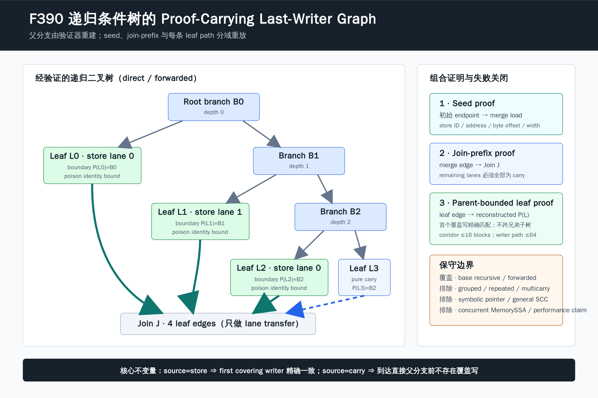

# F390：Proof-Carrying Recursive Cyclic Byte-Lane Writer Graph

## 1. 研究问题

F389 已能验证两级、三叶 multi-arm 条件树，但不能把证明直接外推到递归条件树。基础 recursive cyclic
byte-lane 合同包含深度 2--6 的二叉决策树、4--8 个叶子、一个多前驱 join，以及可选的 forwarded
corridor。若只校验 `branches/leaves/lanes` 的结构，artifact 仍可能把旧 store 声明为最后写者、在纯 carry
叶插入覆盖写，或把某个叶错误地回溯到祖先分支，从而混合兄弟子树的写者作用域。

F390 将基础 direct/forwarded recursive tree 升级为 proof-carrying writer graph。它不是通过信任 producer
提供的父节点标签来完成验证，而是在 runtime 已验证的树遍历中重建每个叶的 immediate parent branch，再以
该父分支作为叶路径证明边界。



## 2. 能力合同与保守签发

新增 capability：

```text
bounded-recursive-cyclic-byte-lane-writer-graph
```

它要求 artifact 同时具有 direct 或 forwarded 基础 recursive cyclic byte-lane PHI capability，并要求对应
合同精确携带 `writer_graph=true`。反向亦成立：缺 capability 的 marker、缺 marker 的 capability、把 marker
放入 grouped/repeated-source/composed/multicarry/multigroup/trigroup 合同，均失败关闭。

当前签发域有意限定为：

- 基础 `recursive` 与 `forwarded_recursive`；
- 3 个 branch、4 个 leaf 的当前 LLVM producer 形状，同时 runtime 保留既有 2--6 深度和 4--8 叶结构门；
- 普通、非 atomic/volatile、常量地址、1--8 byte store；
- 每段 writer path 最多 64 blocks，forwarded corridor 最多 16 blocks，内部路径只有一个 predecessor。

复杂递归共享写者会把 store 放在内部 branch，不能沿用“leaf 到 parent branch”的局部最后写者定理，因此
F390 不为这些变体签发能力。这是证明域隔离，不是功能遗漏的伪装。

## 3. 组合证明

对每个循环合同，runtime 将 writer relation 分解为三类互不猜测前驱的子证明：

1. **Seed proof**：从非 backedge endpoint 逆向到 merge load；第一个覆盖 lane 的 store 必须匹配函数局部
   store ID、常量地址导出的 byte offset 与 store width。
2. **Join-prefix proof**：从 merge incoming edge 逆向到 recursive join。该段只允许 carry，不跨入任一叶，
   因而不需要在多前驱 join 猜测来源。
3. **Leaf proof**：从每个 leaf edge 逆向到运行时重建的 immediate parent branch。逆序遇到的第一个覆盖
   store 必须精确匹配该叶 lane 元数据；到达父分支时仍未解析的 lane 必须是 carry。

令 `P(l)` 为树遍历恢复的叶 `l` 的直接父分支，`W(l,i)` 为从叶边到 `P(l)` 逆序扫描时覆盖 byte lane
`i` 的第一个写入，则基础不变量为：

```text
source(l, i) = store(s, offset, width)  =>  W(l, i) = (s, offset, width)
source(l, i) = carry                    =>  W(l, i) does not exist before P(l)
```

`P(l)` 只有在 branch successor 经唯一前驱 jump corridor 到达唯一 leaf 时才登记。共享叶、环形 corridor、
重复 leaf、越过 join、深度不一致或 producer 自报 `successor` 与重建首节点不一致都会先被树门禁拒绝。

## 4. Poison 身份闭包

对图中实际引用且具有 defined sidecar 的 leaf store，compiler 输出 `byte_lane_poison_source`。runtime 要求：

- store 后紧邻 `unary identity` sidecar；
- sidecar destination 等于合同 `defined`；
- sidecar value 是唯一字段 `{var: poison_source}`，不接受常量、表达式或别名变量；
- 所有携带 poison source 的 byte-lane store 必须出现在已验证 writer graph 引用集合中。

因此 program-level capability 不能替 legacy 或 specialized recursive store 越权背书。F390 证明 producer
声明的 poison 变量与 transfer sidecar 同源，但不独立重建 LLVM poison predicate 本身。

## 5. 实现位置

- `compiler/ContinuationLowering.cpp`：基础递归域识别、capability/marker 签发、叶 store poison source 输出；
- `util/live_continuation.py`：capability 双向闭包、父分支重建、seed/join/leaf 组合验证、poison 引用闭包；
- `util/check_live_continuation_lowering.py`：真实 producer artifact 的 capability、marker、地址和 poison 主动篡改；
- `test/test_live_recursive_cyclic_byte_lane_writer_graph.py`：direct/forwarded 模型、shadow writer、pure-carry
  覆盖写、poison 改绑、capability/marker 与 specialized borrowing 反例；
- `test/live_continuation_lowering.ll`：LLVM 18/17 direct 与 LLVM 18 forwarded 生产链回归。

## 6. 验证结果

| 验证层 | 结果 |
|---|---:|
| F390 独立模型 | 6 passed |
| F385--F390 writer-graph 联合 | 31 passed |
| LLVM 18 direct / forwarded | 各 1 graph、2 endpoints、1 recursive transfer、3 branches、4 leaves |
| LLVM 17 direct | 与 LLVM 18 direct 同构 |
| 每份基础 producer artifact | 3 store leaves、1 pure-carry leaf、3 poison-bound leaf stores |
| grouped 对照 | 0 F390 capability、0 marker、0 graph poison source |
| 完整 Python gate | 919 passed + 229 subtests，919/919 node identity 精确匹配 |
| 完整 lit | 248 discovered，247 passed，1 unsupported |

主动反例覆盖 capability 删除、marker 删除、store 地址漂移、poison source 漂移、leaf 后置 shadow writer、
pure-carry leaf 覆盖写和 specialized recursive 合同借用基础证明。所有反例均在执行 continuation 前拒绝。

## 7. 学术意义、创新点与边界

该工作把 compiler 生成的 byte-lane MemorySSA 摘要从“可消费元数据”提升为“可独立重放的局部证明”。其
关键创新不是增加一种树形标签，而是把多前驱递归树分割成 seed、join-prefix 与 parent-bounded leaf proofs，
从结构验证得到的父关系决定证明边界。这避免一般 CFG 逆向搜索在 join 处猜测前驱，也阻止兄弟子树写者串扰。

F390 是机制正确性成果，不据此声明 coverage、吞吐、求解速度、漏洞发现或 LAVA-M 提升。它仍不是通用
MemorySSA、一般 SCC/多 latch fixed point、符号指针别名证明、并发内存模型或 LLVM poison 语义的独立推导。
下一阶段若扩展 grouped/repeated-source 等共享写者递归图，需要为 branch-scoped writer 建立独立支配域和
跨后代叶的一致性定理，不能简单打开 F390 的签发条件。

## 8. 可复核证据

机械证据位于
[`f390-recursive-cyclic-byte-lane-writer-graph-2026-08-13`](../evidence/f390-recursive-cyclic-byte-lane-writer-graph-2026-08-13/)，
包含 LLVM 17/18 artifacts、主动篡改、定向/联合/完整测试、静态门和 SHA-256 清单。
