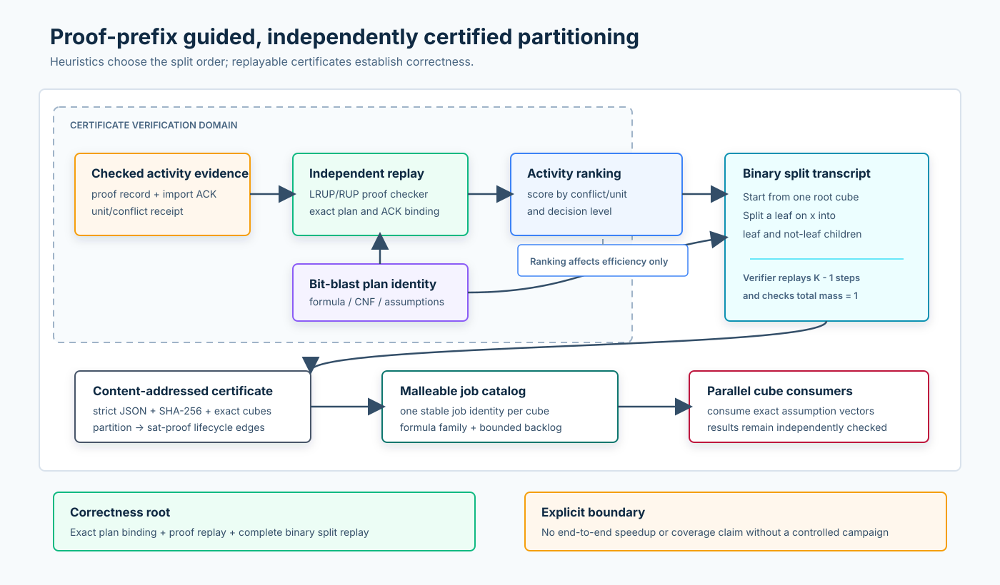

# F448：Proof-Prefix 引导的可认证 QF_BV 分区

## 1. 交付结论

F448 将 F432--F437 已有的确定性 bit-blast、可检查 proof DAG、实时 import ACK 和
clause-activity receipt，转化为可供并行求解器消费的 **cube 分区证书**。系统用已复核的
unit/conflict 活动为变量排序，但不信任该排序来保证正确性；独立 verifier 从根 cube 开始
重放每一次二叉切分，确认最终叶子两两互斥、并集覆盖原问题，并精确检查概率质量之和为 1。

- 功能编号：F448；
- 当前等级：I/T/E-mechanism；
- 生产入口：`util/symcc_qfbv_partition.py`；
- 核心实现：`util/qfbv_proof_prefix_partition.py`；
- 正式证据：`docs/codex/evidence/f448-proof-prefix-certified-partition-2026-08-25/`；
- 明确边界：当前证明“分区机制正确、可重放、可并发发布并可接入 malleable job
  catalog”，不从机制 oracle 推导求解加速、fuzzing 覆盖或缺陷发现提升。



## 2. 为什么引入该技术

已有并行 solver 能把 worker 动态分给多个任务，也能交换经过检查的 learned clause，但如果
一个困难 QF_BV 查询始终以单个不可分任务存在，malleable worker pool 只能增加同题 portfolio，
不能显式拆分搜索空间。F448 解决的是“如何把一个精确查询转换为若干可独立调度、且能证明不重不漏
的子任务”。

本实现参考三条最新研究主线：

1. [Mallob CAV 2026 tool paper](https://satres.kikit.kit.edu/papers/2026-cav-mallob.pdf)
   将 proof checking、incremental solving 和 flexible rescheduling 组合在同一分布式平台；
2. [Real-time Proof Checking for Distributed Incremental SAT Solving, TACAS 2026](https://link.springer.com/chapter/10.1007/978-3-032-22752-2_18)
   说明不同 assumption/increment 任务之间的 checked clause sharing 与动态资源重调度可以共存；
3. [MallobSat, JAIR 2024](https://dominikschreiber.de/papers/2024-jair-mallobsat.pdf)
   和 [Mallob 源码](https://github.com/domschrei/mallob)提供 malleable distributed SAT
   的系统背景。

F448 不是 Mallob 或 Cube-and-Conquer 的完整复刻。其研究贡献是把项目已经存在的
proof-activity 证据、Query IR/bit-blast 身份、F429 生命周期和 F438 malleable catalog
连接成一个最小、可独立复核的分区边界。

## 3. 执行流程

### 3.1 生成

1. 从 QueryStore 读取并验证 `query_id` 对应的 roots 和 reachable Query IR；
2. 确定性 bit-blast，得到 formula、CNF、base assumptions、input literals 和 bit-blast
   certificate；
3. 读取先前实时求解结果中的 activity receipts 与 import ACK；按 `ack_sha256` 做一一关联，
   拒绝重复、缺失、超预算和不稳定输入；
4. `IncrementalProofChecker` 重放每条 proof record，并复核 ACK 的 formula、generation、
   delivery ordinal、native signature 和 checker policy；
5. 对已授权 clause 中的候选变量计分。conflict 权重大于 unit，较浅 decision level 权重更高；
6. 若证据变量不足且策略允许，按确定性 input-literal 顺序补足。启发式来源被明确记录为
   `checked-proof-activity`、`checked-proof-activity-plus-static-fallback` 或
   `static-input-fallback`；
7. 从空路径开始，每次选择最浅、字典序最小的叶子，用下一变量生成 `-x` 和 `x` 两个子叶；
   重复 `K-1` 次，因此支持任意 `K`，不限于 2 的幂；
8. 为每个 cube 封存 literals、完整 assumptions、cube/assumption SHA-256 和精确质量
   `1 / 2^depth`；
9. verifier 独立重放后，证书进入 descriptor-anchored CAS，并登记
   `partition -> sat-proof` 生命周期边；
10. 每个 cube 投影为稳定 `qfbv-cube:<partition>:<ordinal>` job，携带 formula-family
    和 bounded backlog，供 F438 slot allocator 使用。

### 3.2 独立验证

验证器不接受“生成器说分区正确”作为证据，而是重新执行以下检查：

- 证书必须是严格、无重复 member 的 canonical JSON，所有整数必须真的是 JSON integer；
- `query_id`、formula、CNF、base assumptions 和 bit-blast certificate 必须与当前计划完全相同；
- 存在 activity evidence 时必须提供 checker，并重新计算 receipt 集合、变量分数和排序；
- 每个 split 的 parent 必须仍是叶子，children 必须精确等于 `parent + [-x]` 与
  `parent + [x]`；
- 最终 cube 列表必须等于重放所得 canonical leaves；每条 assumption、摘要和质量必须重算一致；
- 所有叶子质量用有理数精确相加，结果必须等于 1。

由此，排序策略错误最多影响负载均衡，不会造成搜索空间遗漏或重叠。真正的正确性根是“精确计划
身份 + proof/ACK 重放 + 完整二叉切分重放”。

## 4. 软件工程实现

| 模块 | 职责 |
| --- | --- |
| `qfbv_proof_prefix_partition.py` | 策略封印、activity 排名、任意 K 切分、证书生成/复核、CAS、生命周期和 job catalog |
| `symcc_qfbv_partition.py` | 从 QueryStore 生成或按 digest 重放证书，严格读取 activity JSON，原子输出 scheduler jobs |
| `qfbv_artifact_lifecycle.py` | 增加独立 `partition` artifact kind 和旧 schema 精确迁移 |
| `symcc_query_service.py` | `--qfbv-partition-store`、stats、启动 GC inventory 和独立删除路由 |
| `test/test_qfbv_proof_prefix_partition.py` | 正向、反例、并发、故障、CLI、服务 GC 与 oracle 回归 |
| `benchmark/check_qfbv_proof_prefix_partition_oracles.py` | 多 cube 数、反事实、枚举、CAS、malleability、GC 和多轮成本 oracle |

关键工程约束包括：单证书最多 4,096 条 activity receipt、4,096 个 cube、深度最多 64、
对象最多 64 MiB；关闭 `input_variables_only` 时变量域按需迭代，不物化最多 2,000 万项的集合；
store 将生命周期 registry 身份持久写入 SQLite metadata，旧实例在升级后不能绕过受管模式，另一
registry 也不能接管同一 CAS。

## 5. 使用方式

先让 persistent CaDiCaL realtime stream 开启 `track_clause_activity`，把一次求解结果保存为
`result.json`。随后运行：

```bash
python3 util/symcc_qfbv_partition.py \
  --query-store /shared/query-store \
  --query-id QUERY_ID \
  --proof-store /shared/qfbv-incremental-proofs \
  --partition-store /shared/qfbv-partitions \
  --lifecycle-store /shared/qfbv-lifecycle \
  --activity-result result.json \
  --cubes 128 --max-depth 7 \
  --backlog-per-cube 1 \
  --output partition-jobs.json
```

没有 activity 结果时可生成确定性静态分区。独立重放已有对象：

```bash
python3 util/symcc_qfbv_partition.py \
  --query-store /shared/query-store --query-id QUERY_ID \
  --proof-store /shared/qfbv-incremental-proofs \
  --partition-store /shared/qfbv-partitions \
  --verify-digest PARTITION_SHA256 \
  --output verified-jobs.json
```

Query service 做 stats 或 artifact GC 时，应同时传入
`--qfbv-partition-store /shared/qfbv-partitions`；也可用
`SYMCC_QFBV_PARTITION_STORE` 配置。

## 6. 测试与多轮审阅

聚焦门禁累计 51 项通过，覆盖：

- 1、3、4、5、8 等任意 cube 数的确定性、覆盖与互斥；
- 真实 RUP proof record、checked ACK、unit activity receipt 的完整重放；
- receipt、ACK、排序、policy、split child、leaf、assumption、load 和 plan 篡改；
- 32 路并发 CAS 收敛、symlink shard、非 canonical object、duplicate/non-finite JSON；
- 非字符串摘要拒绝、新建 shard 父目录耐久化、合法临时文件与非法条目区分；
- active lease 保护、proof dependency 自动建边、dependent-first GC 和 lifecycle inventory 重建；
- inventory 在单次 operation 中先确认 proof 依赖再登记 partition，缺失依赖保持零部分状态；
- 旧 lifecycle schema 迁移、受管 store 防绕过、不同 registry 拒绝；
- QueryStore 生产 CLI 的生成/独立重放，以及 query service 的真实 GC 路由；
- executable oracle 的任意 K、反事实、malleable slot 守恒和生命周期闭环。

完整 capability-closed Python 门禁为 **1396 passed + 310 subtests**（234.83 s）；10 个命令、
5 个 Python 模块和 Z3 动态库共 16 项能力全部存在，skip/xfail/xpass/deselection、collection
error 及 missing/unexpected node ID 均为 0。原始结果见
[`full-python-gate.json`](../evidence/f448-proof-prefix-certified-partition-2026-08-25/full-python-gate.json)。

审阅修订经过五类迭代：

1. **证据自包含性**：初版只保存 evidence digest，无法独立恢复排序；改为封存原 receipt/ACK，load
   时强制 checker 重放；
2. **生命周期正确性**：初版复用 `proof` kind，会与 UNSAT proof 删除路由冲突；改为独立
   `partition` kind，并自动建立/触摸 `sat-proof` 依赖，补服务 GC 与旧 schema 迁移；
3. **规范与资源界限**：拒绝字符串/浮点伪整数，消除全 CNF 变量集合物化，持久绑定 lifecycle
   registry，并补 32 路并发、CLI 和故障回归；
4. **输入与耐久性**：摘要必须是 JSON string，activity 输入拒绝 `NaN/Infinity`，stdout 同样执行
   64 MiB 上限；新建 shard 后同步父目录，补齐崩溃恢复所需目录项耐久性；
5. **并发库存闭包**：扫描只忽略严格匹配发布协议的临时对象，其他条目继续失败关闭；inventory
   在 lifecycle operation 内先触摸全部 `sat-proof` 依赖，依赖缺失时不登记 partition 或边。

## 7. 正式机制实验

正式 oracle 使用 2-byte QF_BV 计划、12 条已检查 activity receipt，测试
`K = 1, 3, 5, 8, 32, 128, 512`，每个计时档重复 10 轮。原始文件为
[`oracle.json`](../evidence/f448-proof-prefix-certified-partition-2026-08-25/oracle.json)，
运行环境和总时间见同目录 `environment.txt`、`time.txt`。

| K | 枚举赋值 | 构建并内置重放中位数 | 独立重放中位数 | 结论 |
| ---: | ---: | ---: | ---: | --- |
| 5 | 8 | 118.358 ms | 58.652 ms | 非 2 次幂分区无遗漏、无重叠 |
| 8 | 8 | 119.689 ms | 59.415 ms | 同深度完整分区通过 |
| 32 | 32 | 119.005 ms | 59.795 ms | cube 增长尚未主导总成本 |
| 128 | 128 | 123.066 ms | 61.798 ms | 证明重放仍是主要固定成本 |
| 512 | 512 | 139.881 ms | 68.033 ms | 大证书增加约 21.5 ms 构建中位成本 |

其他结果：32 个并发 publisher 收敛为 1 个新对象；3 个逻辑 job 的 6 个 slot 全量守恒；
生命周期图在 GC 前有 19 个对象、84 条边，最终删除 19/19，且所有 partition 均先于其
sat-proof dependency 删除。总 wall time 为 14.381 s。

这些时间包含 12 条 proof receipt 的独立重放和持久存储同步，不能与纯内存切分算法直接比较。
数据支持“机制可用且成本有界”，不支持“端到端求解更快”。

## 8. 未完成边界与下一步

1. 本报告封存时，CLI 已输出精确 cube assumptions 和 malleable job catalog，但主
   query-service 尚未把 cube 自动注入 CaDiCaL 多任务执行循环；该边界现已由
   [F449](Proof_Aware_Certified_Partition_Execution_F449_2026-08-25.md) 关闭；
2. activity receipt 与精确 bit-blast plan 绑定，不能跨不同 formula 或 assumption scope 直接复用；
3. 当前质量估计是结构性的 `1/2^depth`，不是学习得到的真实求解难度；后续可用已验证的 solve
   cost 更新调度优先级，但不能改变覆盖证书；
4. 尚无公开 benchmark 的同 CPU、长时、多轮 static-vs-guided-vs-unpartitioned 求解对照，因此
   不声明 speedup、coverage 或 defect-yield；
5. 512-cube 实验显示 proof replay 是固定成本中心，后续应做 proof-aware incremental replay cache，
   但 cache 命中仍需绑定 checker policy、plan 和 record closure。
