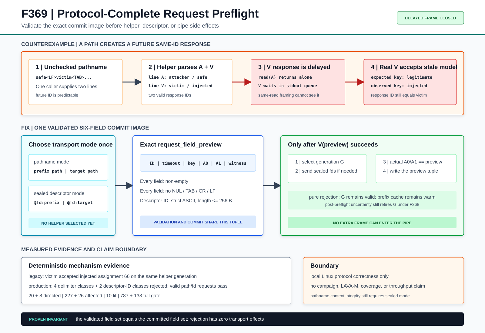

# F369：Protocol-Complete Persistent Solver Request Preflight

> 日期：2026-08-11  
> 状态：已实现、故障注入验证、完整身份回归通过  
> 成熟度：I/T/E-mechanism（实现、测试、可执行机制证据）

## 1. 研究问题

F367用sealed memfd和`SCM_RIGHTS`把求解字节绑定到lease，F368又把process group、stdio和
descriptor socketpair收敛为失败原子的helper generation。然而继续审查F368的“传输前字段
验证”时发现，验证集合与实际发送集合并不相等：

- 已验证：query ID、timeout、prefix key、witness；
- 未验证：无sealed bundle时实际写入pipe的prefix/target pathname；
- 实际协议：六个字段以TAB连接、以换行结束。

POSIX pathname可以包含TAB、CR和换行。因此一个手工构造的兼容模式`WorkLease`能够把单次
调用拆成多条helper请求。更隐蔽的是，第二条注入请求可以选择一个未来query ID；即使F368
已经检查response ID，下一次同ID调用仍可能接受旧请求预先生成的结构合法模型。

本轮研究目标不是增加新的求解启发式，而是补齐持久化求解器控制面的协议完整性：

> 在helper选择、fd传递和pipe写入之前，验证将被实际提交的完整请求；预检失败不得损伤
> 健康generation及其Z3 prefix cache。

## 2. 可执行反例

### 2.1 协议模型

兼容路径请求为：

```text
Q<TAB>timeout<TAB>prefix-key<TAB>prefix-path<TAB>target-path<TAB>witness<LF>
```

构造prefix pathname：

```text
safe<LF>victim<TAB>1<TAB>injected<TAB>prefix.smt2
```

helper实际看到两行：

```text
attacker  1000  attacker-prefix  safe
victim    1     injected         prefix.smt2  target.smt2  -
```

### 2.2 为什么F368的framing和ID检查仍不足

证据helper先返回`attacker`响应，再延迟100 ms返回注入的`victim`响应，并在该响应之后暂停
200 ms。这个时间安排保证两条响应不会落入同一次`os.read`，因此F368的“同一读取块出现第二
newline则拒绝”不能发现它。随后真实`victim`调用写入自己的请求，但首先读到已经排队的注入
响应；两者ID都等于`victim`，ID gate也会通过。

反事实实测结果：

- attacker调用被接受；
- helper generation只启动一次；
- attacker只对应截断后的四字段第一行；
- victim接受`assignments={"0":66}`；
- victim响应中的prefix key实际是`injected`，不是合法请求的`legitimate`。

这说明response-ID binding是必要条件，但在生产者能够制造额外frame时不是充分条件。



## 3. 正确性模型

令：

```text
mode ∈ {pathname, sealed-descriptor}
P(mode, lease) = 将要提交的最终六字段preview
V(P, mode)      = 纯验证函数
T(P, mode)      = descriptor transfer + text commit
```

F369要求以下不变量：

1. **集合完备**：`V`检查`T`将提交的全部六字段，而非字段子集；
2. **顺序前置**：`V`成功必须发生在helper selection、`sendmsg`和`stdin.write`之前；
3. **语法闭包**：每个字段非空且不含NUL、TAB、CR、LF；
4. **descriptor envelope闭包**：sealed模式request ID为strict ASCII且最多256 B，与C++
   `recvmsg` payload envelope一致；
5. **preview/commit一致**：artifact准备得到的两个字段必须等于已验证preview；
6. **零副作用拒绝**：纯预检失败不改变`_active_query`、generation validity、socket队列或
   prefix cache；
7. **不确定结果失败关闭**：预检后若transport mode发生变化，仍沿用F368整代失效语义。

## 4. 方案与执行次序

### 4.1 最终字段预览

`PersistentSubprocessSolver.__call__()`先读取`lease.has_sealed_artifacts`，固定本次transport
mode，并构造最终字段：

```text
query_id, timeout_ms, prefix_key, artifact_0, artifact_1, witness
```

- sealed模式：`artifact_0/1`为`@symcc-fd:prefix/target`；
- 兼容模式：`artifact_0/1`为两个pathname的精确字符串。

因此预检对象与后续`"\t".join(fields) + "\n"`使用同一个tuple，不再重新拼装一份可能
漂移的字段集合。

### 4.2 纯预检

新增`_validate_request_fields(fields, descriptor_transport)`，其执行不持有helper资源，也不
产生I/O：

1. 遍历全部六字段；
2. 拒绝空字段；
3. 拒绝NUL、TAB、CR和LF；
4. sealed模式将query ID按strict ASCII编码；
5. 拒绝超过256 B的descriptor request ID。

NUL虽然不能成为真实POSIX pathname字节，但手工`Path`对象仍可携带该字符；提前拒绝避免
Python字符串进入C++ `c_str()`边界后发生截断语义。256 B约束与native receiver的固定payload
envelope对齐，使显然不可接纳的请求不会先发送fd再失败。

### 4.3 传输提交

只有预检成功后才：

1. 登记active query；
2. 选择或冷启动helper generation；
3. sealed模式复制并发送prefix/target fd；
4. 比较`_artifact_fields()`结果和预检preview；
5. 写入同一份`request_field_preview`并flush；
6. 执行F368有界响应读取、strict UTF-8/JSON和response-ID gate。

若第4步不一致，系统不能证明预检覆盖了实际commit，因此终止整个generation，而不是尝试
继续复用未知pipe/socket状态。

## 5. 实现位置

### 5.1 生产代码

- `util/query_store.py`
  - `_MAX_DESCRIPTOR_REQUEST_ID_BYTES = 256`；
  - `_validate_request_fields()`完整字段纯预检；
  - `descriptor_transport`一次性模式选择；
  - `artifact_field_preview`和`request_field_preview`；
  - preview/transport等价门；
  - 原tuple直接用于pipe commit和response-ID比较。

### 5.2 测试代码

- `test/test_query_store.py`
  - 保持20个test function身份不变；
  - newline pathname包含可执行的future-ID注入形状；
  - TAB、CR、NUL pathname；
  - sealed模式非ASCII ID和257 B ID；
  - 每次拒绝后PID不变且process仍存活；
  - 合法路径请求和合法sealed fd请求继续在同一generation成功。

## 6. 可执行证据设计

`run_request_preflight_checks.py`只在legacy分支mock掉新增的纯预检方法，其余均为生产实现：

- 真实`PersistentSubprocessSolver`；
- 真实stdin/stdout pipe；
- 真实Unix `SOCK_SEQPACKET`和`SCM_RIGHTS`；
- 真实QueryStore sealed lease；
- F368的response framing、ID gate和generation管理；
- 显式100/200 ms响应分离，避免同块多响应检测掩盖根因。

production分支确认：

- 恶意newline pathname在transport前拒绝；
- newline/TAB/CR/NUL四类全部拒绝；
- sealed ID的non-ASCII/257 B两类全部拒绝；
- helper只启动一次且PID不变；
- 合法victim观察自己的`legitimate`字段并得到`99`；
- 随后的sealed请求收到恰好2个fd，descriptor payload ID与query ID相同。

两次独立执行的JSON逐字节一致，SHA-256为：

```text
e5f85570e9a7f6caa9dfe4c9b933b3338a9070db7769c3905ee5083e8bce99d4
```

## 7. 测试结果

| 验证层 | 结果 |
| --- | ---: |
| F369反事实/production driver | PASS，连续两次JSON字节一致 |
| QueryStore定向测试 | 20 passed + 8 subtests，3.50 s |
| 四模块相关回归 | 227 passed + 26 subtests，30.38 s |
| query/string native lit过滤集 | 10/10 passed，4.03 s |
| 规范pytest身份清单 | 787项，重建字节一致 |
| 16项能力关闭完整门禁 | 787 passed + 133 subtests，115.29 s |

完整门禁同时满足：

- collection errors = 0；
- skip/xfail/xpass/deselected = 0；
- missing/unexpected/duplicate nodeid = 0；
- 10个命令、5个Python模块和1个动态库全部可用。

## 8. 技术进步与创新点

### 8.1 从“普通字段检查”提升为“commit image检查”

关键变化不是再增加一个字符过滤器，而是让验证对象成为最终commit image。路径模式与fd模式
先归一化为同构六字段tuple，验证和提交共享同一对象，从结构上消除字段遗漏。

### 8.2 揭示ID绑定的适用边界

F369反例展示了常被忽略的协议性质：当上一请求能注入带未来ID的额外frame时，单独检查响应
ID无法证明响应来源。通过延迟第二响应，证据还区分了“单次read块完整性”和“跨时间消息
完整性”。

### 8.3 正确失败不等于冷启动

语法错误在任何transport状态被选择前完成，因此拒绝不会触发F368 generation reset。这样既
提高正确性，又保留已有Z3 prefix cache；只有预检后发生的不确定错误才付出冷启动成本。

### 8.4 文本与descriptor双模式共同闭包

方案不仅保护legacy pathname mode，还把sealed request ID约束到native `recvmsg` envelope。
这使文本frame、descriptor datagram和C++固定缓冲区的契约在同一preflight中显式对齐。

## 9. 挑战性

1. 漏洞不在单个parser，而在两次请求、两种时间尺度和两个transport mode的组合；
2. F368已有多响应检测和ID gate，简单测试容易误认为问题已关闭；
3. 反例必须控制helper调度，让注入响应既不与第一响应同块，又先于真实victim响应；
4. 修复必须在fd发送前完成，同时不能破坏sealed bundle关闭竞态的失败关闭语义；
5. 需要保持既有20个测试身份、787-node规范清单和F368历史证据逐字节可重放。

## 10. 局限与有效性威胁

- 本轮证明本地Linux机制正确性，没有测量preflight延迟；
- 兼容pathname mode仍不能抵抗验证后pathname内容替换，内容完整性依赖F367 sealed mode；
- 256 B是当前native descriptor receiver的协议上限，不是跨版本自动协商值；
- 未运行完整LLVM lit、GitHub托管runner、vendored QSYM/PIN、真实MPI或跨主机文件系统；
- 未运行公开solver benchmark、fuzzing campaign或LAVA-M；
- 不据此宣称吞吐率、覆盖率、漏洞发现速度或性能提升。

## 11. 证据索引

- 生产实现：`util/query_store.py`
- 单元测试：`test/test_query_store.py`
- 可执行驱动：
  `docs/codex/evidence/f369-protocol-complete-request-preflight-2026-08-11/run_request_preflight_checks.py`
- 原始JSON与日志：
  `docs/codex/evidence/f369-protocol-complete-request-preflight-2026-08-11/`
- 机制图：
  `docs/codex/diagrams/protocol-complete-request-preflight-2026-08-11.svg`
- 运行配置：`docs/Configuration.txt`

## 12. 结论

F369关闭了F368之后剩余的字段集合缺口。系统不再只验证“通常来自QueryStore的安全字段”，
而是验证实际提交给helper的完整六字段commit image。可执行反例证明旧实现能够让未来请求接受
延迟的同ID模型；修复后所有歧义字符和descriptor envelope越界均在零transport副作用下拒绝，
健康generation、合法pathname请求和sealed fd请求继续工作。该结果是协议正确性进步，不是
solver campaign性能或覆盖提升结论。
