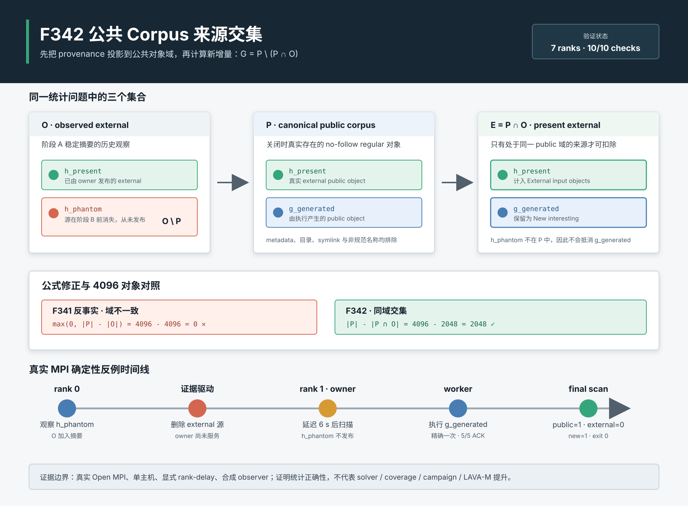

# F342：公共 Corpus 来源交集与精确新增量统计

> 日期：2026-08-10  
> 状态：已实现、已回归、已完成真实 MPI 机制验证  
> 成熟度：`I/T/E-mechanism`，不宣称求解器、覆盖率或漏洞发现提升

## 1. 研究问题

F341 将关闭时统计从启动 seed 快照改为完整的 `external_hashes`，解决了运行中晚到 AFL queue 输入被误报为
符号执行新增样例的问题。但进一步审查发现，旧公式隐含了一个没有被协议保证的前提：

```text
所有曾被 master 稳定观察到的 external 内容，最终都必须存在于公共 corpus。
```

两阶段 input admission 恰恰允许该前提不成立。阶段 A 完成稳定摘要并记录 external provenance；只有内容的
rendezvous owner 才执行阶段 B exact-identity 发布。源文件若在两阶段之间被原子替换、删除或变得不可读，阶段 B
必须拒绝旧 snapshot。此时旧摘要是合法的历史观察，却从未成为公共对象。

若直接执行：

```text
new = max(0, canonical_public_count - len(external_hashes))
```

这个“phantom external”会错误抵消一个真正的 generated object，使项目进展报告、消融实验和调度收益统计少报。

## 2. 集合语义

定义：

- `O`：本次运行稳定观察到的 external content hash 集合；
- `P`：关闭时公共目录中名称规范且 no-follow 类型为 regular 的 corpus 对象集合；
- `E = P ∩ O`：确实存在于公共 corpus 的 external 对象；
- `G = P \ E`：公共 corpus 中非 external 的新增对象。

旧公式 `|P| - |O|` 仅在 `O ⊆ P` 时成立。F341 的失败关闭协议允许 `O \ P`，因此正确公式必须是：

```text
external_present = |P ∩ O|
new_interesting  = |P| - |P ∩ O|
```

最小反例为 `P={g}`、`O={h}` 且 `g != h`。旧公式得到 `max(0,1-1)=0`；F342 得到
`E=∅`、`G={g}`，即 1。



## 3. 方案设计

### 3.1 单遍、同域计数

`_count_public_corpus_objects(shared_dir, external_hashes)` 使用一个 context-managed `os.scandir`，对每个目录项：

1. 要求名称是 64 位小写十六进制 SHA-256；
2. 通过 `entry.stat(follow_symlinks=False)` 要求真实 regular inode；
3. 增加 `public`；
4. 仅当同一个规范名称属于 `external_hashes` 时增加 `external`。

函数返回不可变 `_CorpusProvenanceCounts(public, external)`，其 `generated` 属性严格定义为
`public - external`。因为 external 在 public 分支内部增加，天然保持：

```text
0 <= external <= public
generated >= 0
public = external + generated
```

不再需要 `max(0, ...)` 掩盖集合域错误。

### 3.2 为什么保留完整 observed set

不能等到发布成功后才把摘要加入 `external_hashes`。在多 master 模式中，非 owner 也需要知道随后从 shared corpus
发现的对象来源于外部输入，否则会把 owner 发布的 seed 误记为 generated。因此 F342 不改变热路径 provenance
采集，只在关闭时把 observed 域投影到 public 域。

### 3.3 统计字段语义

- `External input objects`：关闭时公共 corpus 内实际存在的 external 对象数 `|P∩O|`；
- `New interesting test cases`：公共 corpus 内非 external 对象数 `|P|-|P∩O|`；
- 启动信息改为 `Observed ... initial inputs`，避免把非 owner 的阶段 A 观察误称为已经发布。

最终扫描仍不会物化公共名称列表。它复用既有 external hash set 做均摊 `O(1)` membership，因此时间复杂度为
`O(|namespace|)`，扫描额外内存为 `O(1)`；campaign 级 `external_hashes` 本身仍为 `O(|O|)`。

## 4. 实现范围

生产修改位于 [`util/mpi_concolic_execution.py`](../../../util/mpi_concolic_execution.py)：

- 新增 `_CorpusProvenanceCounts`；
- 将 `_count_public_corpus_objects` 从标量计数升级为同域 provenance 计数；
- root final statistics 使用 `corpus_counts.external/generated`；
- 启动日志由 `Imported` 改为严格的 `Observed`。

回归测试位于 [`test/test_mpi_lifecycle.py`](../../../test/test_mpi_lifecycle.py)。测试同时创建：

- 一个实际 public external；
- 一个实际 public generated；
- 一个只在 observed set 中的 phantom external；
- metadata、canonical-looking directory 和 canonical-looking symlink。

它验证 `public=2, external=1, generated=1`，并显式证明旧公式返回 0。

## 5. 自动化验证

| 范围 | 结果 |
| --- | ---: |
| F342 反例单测 | `1 passed` |
| MPI lifecycle 定向 | `49 passed + 40 subtests`，0.90 s |
| 六模块相关回归 | `338 passed + 67 subtests`，16.58 s |
| 全部 `test/test_*.py`，warnings as errors | `731 passed + 87 subtests`，94.03 s |

相关范围包含 distributed state、filesystem qualification、MPI lifecycle、hybrid feedback、AFL profile orchestration
和 adaptive components。完整日志保存在
[`F342 evidence`](../evidence/f342-public-provenance-intersection-2026-08-10/) 中。

## 6. 真实 MPI 反例验证

### 6.1 配置

- Open MPI 4.1.6，真实 `mpirun -np 7` transport；
- 2 masters、5 workers，单物理主机 local overlayfs；
- rank 0 观察 external hash，其 HRW owner 明确为 rank 1；
- 证据 wrapper 将 rank 1 的 `master_loop` 延迟 6 秒；
- 驱动在看到 rank 0 的 `Observed 1` 后删除 external 源；
- 公共 corpus 预置一个 synthetic generated object；
- synthetic observer target 只记录实际执行输入的 SHA-256。

延迟是显式、可审计的证据注入，不属于生产调度机制；它将罕见竞态变为确定性测试。

### 6.2 结果

| 指标 | 结果 |
| --- | ---: |
| 返回码 | 0 |
| 耗时 | 7.876 s |
| external owner | rank 1 |
| rank 0 observed phantom | 是 |
| phantom 发布 | 否 |
| public regular 对象 | 1，且精确为 generated hash |
| target 执行 | generated hash 恰好一次 |
| `External input objects` | 0 |
| `New interesting test cases` | 1 |
| worker ACK | 3/3 + 2/2 |
| active/retired epoch | 0/1 |
| staging residue | 0 |

全部 10 个结构化检查通过。该结果证明生产 final-statistics 路径在真实 MPI 生命周期中处理了 phantom external，
而不只是 helper 单元测试正确。

## 7. 机制成本实验

### 7.1 方法

在本地临时目录创建 4096 个空 regular corpus 对象：2048 个标记为 present external，2048 个为 generated；
另向 observed set 加入 2048 个不存在于 public 的 phantom external。旧 F341 count-only 路径与生产 F342
intersection 路径每轮随机交错，先做 5 次 warm-up，再各保留 30 个原始样本。

### 7.2 正确性与时间

| 方法 | public | external | generated | 中位 | P95 |
| --- | ---: | ---: | ---: | ---: | ---: |
| F341 反事实 `public-len(observed)` | 4096 | 4096（错误域） | 0（错误） | 10.384 ms | 14.124 ms |
| F342 `public ∩ observed` | 4096 | 2048 | 2048 | 10.567 ms | 11.058 ms |

F342/旧路径中位时间比为 `1.01766`，即约 1.77% 的本机 metadata-hot 扫描成本；它换取的是统计正确性，
不是吞吐加速。全部 60 个 retained timing 样本均保存在 JSON 中。

## 8. 先进性、创新性与挑战

F342 的价值不是提出新的集合运算，而是把 provenance 的语义域嵌入并行符号执行的失败原子协议：

- 两阶段稳定 input admission 允许观察与发布解耦；
- HRW owner 使观察者与发布者可能属于不同 master；
- exact-identity 拒绝是正确性要求，却会自然产生 `O\P`；
- 最终统计必须与 content-addressed public namespace 处在同一域，才能用于可信实验汇报。

这种问题通常不会造成崩溃，单 master 正常路径也几乎不触发，却会静默污染长期 campaign 的实验结论。通过
确定性 rank delay 将低概率分布式竞态变为可复现实验，是本轮实现的主要工程挑战。

## 9. 局限与有效性威胁

- 真实 MPI 证据仍在单主机上，不证明跨主机共享存储语义；
- final scan 信任此前 content-addressed admission，不在关闭时重新哈希每个 public 对象；
- `external_hashes` 和 filename-to-identity cache 仍为观察数量线性空间；
- metadata-hot 空文件基准不能外推到冷缓存、远端存储或大对象 hash 成本；
- 显式 rank delay 和 synthetic observer target 只证明机制，不调用 SymCC solver；
- 没有据此宣称 DSE 吞吐、约束求解、覆盖率、campaign、bug discovery 或 LAVA-M 提升。

## 10. 后续方向

1. 为跨 master provenance 建立可恢复的 durable origin summary，避免依赖每个 master 都观察同一外部目录；
2. 研究有界、可合并的 provenance sketch，但实验统计需要保留 exact mode，不能用 Bloom false positive 少报；
3. 在真实 NFS/Lustre/GPFS 多节点环境复现实源 replacement/deletion，而非注入 master delay；
4. 将 exact provenance 结果接入 benchmark schema，使 coverage 与 bug-discovery 报告自动拒绝集合守恒失败。

## 11. 证据索引

- 生产代码：[`util/mpi_concolic_execution.py`](../../../util/mpi_concolic_execution.py)
- 测试：[`test/test_mpi_lifecycle.py`](../../../test/test_mpi_lifecycle.py)
- 真实 MPI JSON：[`provenance-intersection-mpi.json`](../evidence/f342-public-provenance-intersection-2026-08-10/provenance-intersection-mpi.json)
- 机制成本 JSON：[`provenance-intersection-cost.json`](../evidence/f342-public-provenance-intersection-2026-08-10/provenance-intersection-cost.json)
- 完整证据说明：[`README.md`](../evidence/f342-public-provenance-intersection-2026-08-10/README.md)
- 机制图：[`public-provenance-intersection-2026-08-10.svg`](../diagrams/public-provenance-intersection-2026-08-10.svg)
