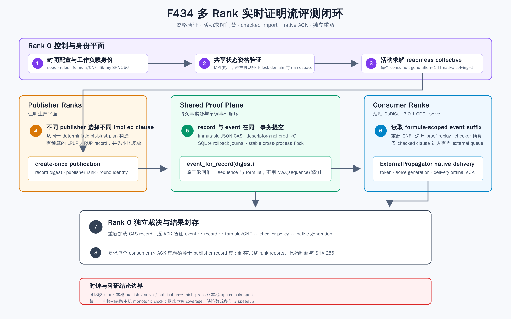

# F434：有资格门禁的多 Rank 实时证明流评测

- 功能编号：F434
- 日期：2026-08-18
- 研究主题：多 rank proof-stream 实验协议、活动求解因果门禁、共享状态资格验证、独立 ACK 裁决
- 当前等级：I/T/E-local；真实 CaDiCaL、本机 MPI 多进程与共享 CAS 已完成
- 严格边界：尚未完成 8/32/128 worker 真实多节点、公开目标、等 CPU、20 轮统计的 R 级实验



## 1. 为什么 F433 后还需要 F434

F433 已证明单进程 session 能把经过 LRUP/RUP 检查的子句交给活动 CaDiCaL solve，并以
`token + solve_generation + delivery_ordinal` 形成 native ACK。但它的 512-case oracle 和
64-round 成本实验都在一个进程内预置 proof record，不能回答以下分布式问题：

1. 多个 publisher 并发发布时，某个 record 对应哪一个唯一事件，而不是谁碰巧读到
   `MAX(sequence)`；
2. consumer 是否在 publication 发生时真的处于 CDCL solve，而不是先收齐子句、后调用 solver；
3. 不同 rank 是否使用同一公式、CNF、native library、proof root 和角色分配；
4. 所有 consumer 是否精确 ACK 全部 publisher record，且没有重复、漏收、背压或超时；
5. 跨主机文件锁和 namespace 未经资格验证时，实验是否会错误地产生“成功”结果；
6. 不同主机的 monotonic clock 不能直接相减时，传播时延应如何报告。

F434 的贡献不是宣称已经获得集群 speedup，而是建立可把 F433 从本地机制实验推进到真实集群
R 级实验的**资格验证、执行、裁决和封存协议**。只有先关闭这些测量漏洞，后续流控优化和论文
对照才有可信基础。

## 2. 完整执行流程

### 2.1 角色和配置身份

`MultirankConfig` 把 `world_size` 个 rank 划分为三个互斥集合：

```text
rank 0                         coordinator
rank 1 .. publisher_count     publishers
其余 rank                     consumers
```

至少需要 3 个 rank、1 个 publisher 和 1 个 consumer。配置同时绑定随机 seed、round 数、
3-SAT 变量/子句数、active/preloaded 模式、solve deadline 和 poll interval，规范 JSON 的
SHA-256 是所有 rank report 的共同身份。各 rank 还必须加载相同绝对路径、相同文件 SHA-256 和
相同 CaDiCaL signature 的 realtime shim。

每轮由固定 seed 生成新的随机 3-SAT Query IR。每个布尔变量来自一个 8-bit symbolic read 的
bit extract，再通过项目 F432 的 deterministic bit-blaster 生成 activation-guarded CNF。默认
`200 variables / 860 clauses` 接近随机 3-SAT 相变区域，目的是提供足够长的真实 CDCL 窗口；它
不是应用 benchmark。所有 rank 用 `(formula_sha256, cnf_sha256, max_variable, clause_count)`
执行 collective 一致性检查。

### 2.2 共享文件系统资格

Proof CAS 依赖原子 publication、目录 fsync、hard link 和 advisory lock。F434 默认在每个 rank
上运行 `probe_shared_state_filesystem()`，随后进入 MPI lock qualification：

- `MPI.COMM_TYPE_SHARED` 证明所有 rank 物理共址时，同机 subprocess probe 足以准入；不能仅凭
  hostname 相同推断共址；
- 有多个 shared-memory domain 时，必须由 F351 的跨主机 lock/namespace protocol 形成 clean、
  verified、全 rank 一致的 proof transcript；
- 任一本地能力、成员拓扑、锁竞争、释放或 namespace identity 不闭合，整个实验失败。

F432/F433 proof store 原来强制 SQLite WAL。SQLite WAL 依赖共享内存 sidecar，不适合作为网络
文件系统协议。F434 将其改为 `DELETE` rollback journal；数据库访问本来已由稳定 `flock`
串行化，因此保持 `synchronous=FULL` 的同时避免把 WAL 当作跨节点能力。新增
`event_for_record(digest)` 在锁内精确返回 `(sequence, formula)`，并发 publisher 不再以全局最大
序号猜测自己的事件。

### 2.3 active 模式因果门禁

每个 consumer 先创建 native context、加入永久 CNF/assumptions，并启动 proof polling session。
随后在独立 Python thread 中调用真正的 `CaDiCaL::Solver::solve()`。C++ shim 新增只读
`solving` 统计位；主线程只有同时观察到：

```text
solve_generation == 1 AND solving == 1
```

才报告 ready。所有 rank 通过 `allgather` 形成 readiness collective；任一 consumer 已经结束、
尚未开始或超时，publisher 都不得提交 record，run 失败关闭。成功后多个 publisher 并发执行：

1. 从同一 plan 选择不同的 implied base clause；
2. 独立生成有预算的 RUP hints；
3. 原子发布 immutable record 和 monotonic event；
4. 查询自己 record 的精确 event sequence；
5. 将 `(rank, digest, event, elapsed)` 作为 publication evidence collective。

consumer 的 session 读取当前 formula 的 event suffix，重新构造 CNF 和 proof DAG；只有 checker
通过的 clause 才进入有界 native queue。CaDiCaL 的 `ExternalPropagator` 逐 literal 消费完并读到
终止 `0` 后才产生 ACK。active 成功要求 publication collective 返回时 `solving` 仍为 1，并且最终
每个 consumer 的 delivered/ACK record 集与 publisher 集合精确相等。

`preloaded` 模式使用同一条 proof/CAS/ACK 链路，但先等待全部 import 入队再启动 solve。它是协议
基线，不会被计作 mid-solve delivery；结果中的 `active_delivery_rate` 应为 0。

### 2.4 独立裁决与指标

rank 0 收集完整 rank reports 后，不信任 consumer 的 delivered 计数。它为每轮重建 bit-blast plan，
用独立 checker 重放每个 ACK，并要求：

```text
event_at(ack.event_sequence)
  == (authorization.formula_sha256, authorization.record_sha256)

每个 consumer ACK records == 当轮 publisher records
imports_expected == imports_delivered == ACK count
timeout == false; stream_error == ""; solve_error == ""; backpressure == 0
```

跨主机 monotonic clock 没有全局可比性，因此 F434 禁止用 publisher 的时间戳减 consumer 的
时间戳。报告只保留以下同一时钟域指标：

| 指标 | 时钟域 | 含义 |
| --- | --- | --- |
| `publish_elapsed_us` | publisher 本地 | CAS object、DB transaction 和 event 查询总耗时 |
| `solve_elapsed_us` | consumer 本地 | native solve wall duration |
| `notification_to_finish_us` | consumer 本地 | publication collective 返回到 session 完成 |
| `checker_elapsed_us` | consumer 本地 | proof checker 累计 CPU/elapsed 近似 |
| `epoch_makespan_us` | rank 0 本地 | readiness 到全 rank 完成 barrier 的轮次 wall time |

每组样本报告 min、median、nearest-rank p95、max 和 total。完整结果带规范 SHA-256 和明确
`claim_boundary`，不能从这些机制时延推导 coverage、缺陷数或多节点 speedup。

## 3. 实现映射

| 文件 | 责任 |
| --- | --- |
| `util/qfbv_multirank_evaluation.py` | 配置/角色、确定性 3-SAT plan、exchange clause、percentile、完整 rank 聚合与拒绝条件 |
| `benchmark/run_qfbv_realtime_multirank.py` | MPI 控制面、文件系统资格、真实 CaDiCaL active/preloaded 执行、root ACK replay |
| `benchmark/check_qfbv_realtime_multirank_oracles.py` | 重复启动独立 MPI jobs，校验 sealed result identity，保留 stdout/stderr 与总摘要 |
| `util/qfbv_incremental_proof.py` | rollback journal 和 `event_for_record()` 精确事件反查 |
| `util/qfbv_cadical_realtime.cpp` | native `solving` lifetime 状态 |
| `util/qfbv_realtime_stream.py` | Python ABI 中暴露 `solving` 统计项 |
| `test/test_qfbv_realtime_multirank.py` | 配置、workload、store、统计、聚合、tamper 和 oracle artifact 单元测试 |
| `test/test_qfbv_realtime_stream.py` | fake native solve lifetime 的并发握手测试 |

## 4. 本机真实实验结果

固定配置为 5 个 MPI rank、2 publishers、2 consumers、2 rounds、seed `0xF434`、每轮
`200 variables / 860 clauses`。同一真实 shim 运行一次 preloaded 和两次相互独立的 active job：

| Trial | 模式 | 期望/交付/独立重放 | active rate | publish median | solve median | epoch median |
| --- | --- | ---: | ---: | ---: | ---: | ---: |
| 1 | preloaded | 8 / 8 / 8 | 0.0 | 27,095 us | 699,198 us | 774,580 us |
| 2 | active | 8 / 8 / 8 | 1.0 | 27,100 us | 692,084 us | 698,241 us |
| 3 | active | 8 / 8 / 8 | 1.0 | 27,319 us | 694,693 us | 698,626 us |
| 合计 | 3 jobs | **24 / 24 / 24** | - | - | - | - |

两个 active job 中，每个 consumer 在 publication 返回时都仍处于 native solve，且 16/16
active imports 全部获得 native ACK。三次 job 的 result artifact identity 均不同，说明没有复用
旧 run 输出。

反向故障实验将 workload 缩为 `8 variables / 8 clauses`，solver 在 readiness collective 前结束。
4-rank job 以非零状态退出并报告 `consumer readiness or publisher cardinality failed`，没有把快速
结束的预加载行为误报为 active delivery。

软件回归采用三层门禁。F434/F433/proof-receipt 专项测试为 **33 passed + 7 passed subtests**；
完整 Python capability 与精确 node-ID 门禁为 **1,255 passed + 291 passed subtests**，无 skip、
xfail、deselection 或 collection error；LLVM 17 与 LLVM 18 各完整发现 **324** 个 lit tests，
均无 FAIL 或 UNRESOLVED（平台能力差异分别产生 2 和 1 个 unsupported）。这些回归数据证明本次
协议和存储修改没有破坏当前测试清单内的既有行为，不等同于应用层效果提升。

这些数字只证明本机多进程机制的正确性和可测量性。active 两次 epoch median 小于本次 preloaded
数字，但样本仅 3 个 job、执行顺序未随机化且没有等 CPU 公开目标，**不能据此报告性能提升**。

## 5. Review 中修复的问题

1. **SQLite WAL 跨节点假设错误**：改为 rollback journal + 已有外层 stable flock；保留 FULL sync。
2. **并发 event 归属竞态**：新增 digest 精确查询，不使用 `latest_event_sequence()` 归因。
3. **hostname 假共址**：改用 MPI shared-memory communicator 判定物理共址。
4. **“线程已启动”等同 active solve**：native 暴露 `solving`，readiness 同时绑定 generation。
5. **线程终止后的 use-after-free 风险**：timeout 后 terminate + bounded join；线程仍存活时禁止释放 context。
6. **跨主机时钟误差**：删除跨 rank timestamp subtraction，只保留同一进程或 rank 0 的 duration。
7. **弱聚合器接受部分成功**：现在拒绝漏 ACK、重复 ACK、错误 record set、backpressure、timeout、
   stream/solve error、非单调跨轮 event 和 active publication miss。
8. **事件顺序错误假设**：同轮并发 publisher 不按 rank 排序；只要求唯一，并要求下一轮事件区间严格前进。

## 6. 复现

构建固定 CaDiCaL 3.0.1 realtime shim 后，运行单个 active trial：

```bash
mpiexec -n 5 python3 benchmark/run_qfbv_realtime_multirank.py \
  --library /path/to/libsymcc_qfbv_cadical_realtime.so \
  --publishers 2 --rounds 2 --variables 200 --clauses 860 \
  --mode active --output /tmp/f434-active.json
```

运行一轮 preloaded 加两轮独立 active oracle：

```bash
python3 benchmark/check_qfbv_realtime_multirank_oracles.py \
  --library /path/to/libsymcc_qfbv_cadical_realtime.so \
  --output-dir /tmp/f434-oracles \
  --processes 5 --publishers 2 --rounds 2 --active-repetitions 2
```

原始结果、stdout/stderr、故障输出、图和完整 SHA-256 manifest 位于
[`../evidence/f434-multirank-proof-evaluation-2026-08-18/`](../evidence/f434-multirank-proof-evaluation-2026-08-18/README.md)。

## 7. 下一步与未完成边界

F434 完成了 P0 第 1 项的**可执行实验基础和本机机制资格**，但没有完成该项的 R 级效果结论。
下一步仍必须在真实共享存储和独立主机上运行 8/32/128 workers，至少 20 次随机化等 CPU trial，
接入公开长查询/混合 fuzzing workload，并报告 coverage AUC、有效 import、checker CPU、CAS/网络
放大和 solve tail。上述数据出来后，才能据观测实现 P0 第 2 项的 proof-aware 自适应流控、worker
配对和动态重调度。
