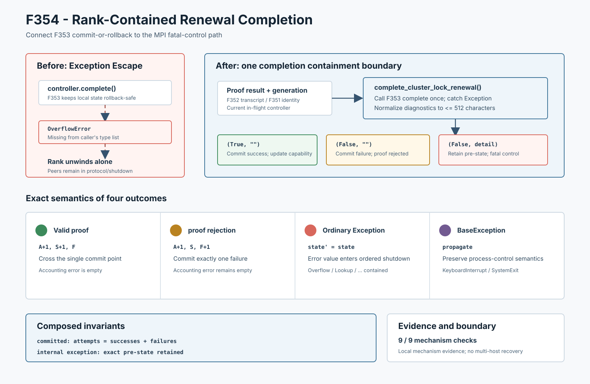

# F354：Rank-Contained Renewal Completion

- 功能编号：F354
- 日期：2026-08-10
- 状态：已实现、已进行机制验证
- 范围：MPI运行期共享锁资格续期的异常隔离边界



## 1. 研究背景与真实缺陷

F353使`ClusterLockRenewalController.complete()`满足强异常安全：验证器、调度器或累计算术抛出异常时，
generation、in-flight typestate和全部metrics保持原快照。但是继续沿生产调用链审查发现，局部状态原子性
并不自动等于分布式运行时异常闭合。

`complete()`显式检查`total_elapsed + elapsed`是否仍为有限binary64；溢出时抛出`OverflowError`。生产调用方
`execute_runtime_lock_renewal()`却只捕获`RuntimeError`、`TypeError`和`ValueError`。可执行反例是把累计值与
本次elapsed都设为最大有限binary64：

```text
controller.complete(...) -> OverflowError: cluster lock renewal elapsed total overflow
controller snapshot       -> unchanged (F353 is effective)
runtime exception policy  -> OverflowError is not caught
```

因此一个rank可能在其他rank仍处于MPI资格协议或有序关闭过程时单边展开Python栈。控制器没有半提交，但作业
失去了统一的`fatal_control_error`收敛路径、结构化诊断与既有shutdown协议。这是典型的**跨层异常契约不完整**：
callee已经提供rollback，caller却没有把rollback后的失败转换为分布式控制结果。

## 2. 技术定位

F354引入一个显式的completion containment boundary。其思路接近并发/分布式系统中的fault containment：
内部组件可以失败，但普通异常不得越过rank边界破坏外层协议状态机。Python官方异常层次把
[`BaseException`](https://docs.python.org/3/library/exceptions.html#BaseException)作为所有内建异常的根，
而通常由程序处理的错误继承`Exception`；`KeyboardInterrupt`、`SystemExit`等进程控制异常不属于
`Exception`。

本实现据此采用精确分层：

- 捕获`Exception`，将其变成有界错误值并交给MPI运行时的统一fatal-control路径；
- 不捕获`BaseException`，保留用户中断与解释器退出语义；
- 不把proof rejection伪装成内部异常，也不把内部异常记成一次已完成failure。

这不是ULFM communicator repair、rank replacement、分布式异常传播或新的共识协议；它是F353本地事务与
现有MPI有序停止之间的适配层。

## 3. 结果代数与状态语义

新的生产API为：

```text
complete_cluster_lock_renewal(controller, generation, result, completed_at)
    -> (successful: bool, accounting_error: str)
```

返回空间刻意区分三种普通结果：

| 返回值 | 控制器状态 | 运行时含义 |
|---|---|---|
| `(True, "")` | 提交一次success | 更新capability并继续运行 |
| `(False, "")` | 提交一次failure | proof/资格失败，使用result.error诊断并失败关闭 |
| `(False, detail)` | 完整pre-state不变 | completion内部异常，进入accounting fatal-control路径 |

设F353提交前快照为`S0`，边界函数`B`和控制器状态转换`C`满足：

\[
B(C(S_0,r)) =
\begin{cases}
(\mathrm{true}, \epsilon, S_{success}) & r\text{通过证明门}\\
(\mathrm{false}, \epsilon, S_{failure}) & r\text{被证明门拒绝}\\
(\mathrm{false}, e, S_0) & C\text{抛出Exception}
\end{cases}
\]

其中`epsilon`为空错误串。空串不是信息缺失，而是proof rejection与基础设施异常之间的tag；调用方只有在
`accounting_error`非空时才输出“accounting failed”。

## 4. 实现细节

### 4.1 单一可测试边界

`util/mpi_filesystem_qualification.py`新增`complete_cluster_lock_renewal()`：

1. 精确检查controller类型，错误对象不调用任何方法；
2. 只调用一次F353的`controller.complete()`；
3. 正常返回时原样保留success/proof-failure语义；
4. 捕获普通`Exception`并返回`(False, bounded_detail)`；
5. 诊断经既有`_bounded_text`删除NUL/换行并截断到512字符；即使异常自身`__str__`再次失败，也退化为异常
   类型名；
6. 不捕获`BaseException`。

边界自身不修改控制器字段。异常时的零状态变更由F353 validate/derive/commit不变量提供；F354只消费这个
保证并把异常值化。

### 4.2 生产调用链接入

`util/mpi_concolic_execution.py`的运行期续期不再直接调用controller method，也不再维护易遗漏的异常类型
元组。所有完成操作统一通过新API：

1. `accounting_error != ""`：报告未变快照，设置统一fatal control error，返回False；
2. `accounting_error == "" and successful is False`：按资格失败路径输出proof错误；
3. `successful is True`：更新work coordinator的filesystem capability。

这使异常策略成为共享模块的显式契约，未来controller新增新的普通异常类型时不会再次要求调用方同步枚举。

### 4.3 成本与兼容性

成功路径只增加一次Python函数调用、tuple构造和空串判断；不增加hash、payload读取、文件系统操作或MPI轮次。
request、proof transcript、capability、metrics和磁盘schema均不变，也没有新增配置开关。

## 5. 测试与机制证据

| 验证层次 | 结果 |
|---|---:|
| F354定向 | 1 passed，33 deselected |
| 资格模块 + MPI生命周期 | 93 passed + 75 subtests |
| 六模块相关回归 | 376 passed + 101 subtests |
| 生产控制器/边界机制集成 | 9/9 checks |
| 完整warnings-as-errors Python | 769 passed + 121 subtests，97.05 s |

机制driver使用真实本地filesystem capability probe、生产capability upgrade、F352 transcript、F353 controller
和F354 completion boundary，验证：

1. 有效proof提交一次success且错误串为空；
2. proof rejection提交一次failure且错误串仍为空；
3. 真实binary64累计溢出被转换为错误值，逐字段快照不变；
4. 注入`LookupError`被转换为错误值，逐字段快照不变；
5. 4096字符异常被稳定截断为512字符；
6. 非controller对象无副作用拒绝；
7. `KeyboardInterrupt`不被吞掉，且F353仍保持pre-state。

固定epoch为`1f8c0992925f1453fa45d4e53e0c9535831bc426bdd50ed7a869ba52e33a05f6`，对应proof
transcript为`67d5323ac533dbaa405691aa5fabe3e0d8a1fbab893ef00a1e39490d1390d2b3`。JSON与log
字节一致，并由目录级SHA-256清单覆盖。

## 6. 先进性、创新性与挑战性

1. **从局部rollback推进到rank containment**：F353解决对象状态安全，F354把它接入MPI作业级控制流，形成
   `proof protocol -> local transaction -> exception value -> ordered shutdown`的连续错误语义；
2. **可判别失败，而非一律False**：proof失败与基础设施异常共享bool时容易混淆，本实现用错误串作为正交
   discriminant，避免错误记账和错误诊断；
3. **未来异常类型闭包**：使用Python异常层次而不是人工枚举，避免controller演进后再次出现callee/caller
   契约漂移；
4. **保留进程控制语义**：不捕获`BaseException`，避免为了“稳健”而屏蔽用户中断或退出；
5. **确定性故障注入覆盖跨层组合**：真实算术溢出、注入内部异常、proof rejection和process-control signal
   在同一driver中验证，且每个结论同时检查返回代数与状态快照。

创新点是把异常安全与MPI控制面失败收敛组合成可执行、可审计的rank-local契约，不声称发明fault
containment、Python异常层次或分布式恢复理论。

## 7. 局限与有效性威胁

1. 机制证据使用本地进程和真实本地filesystem probe，不是实际多机MPI/NFS/Lustre运行；
2. F354把普通异常送入已有fatal-control路径，但不提供ULFM revoke/shrink、rank replacement或失败后继续计算；
3. `Exception`被值化后依赖调用方立即失败关闭；将来新增调用方若忽略非空错误串，会重新引入语义缺口；
4. 512字符诊断适合有界控制日志，但可能截断深层异常上下文；完整traceback没有跨rank持久化；
5. `MemoryError`属于`Exception`，边界会尝试值化；内存耗尽后的进程可用性仍不能由本机制保证；
6. 没有运行solver、target、coverage、fuzzing campaign、漏洞或LAVA-M实验，不提供性能、覆盖率或漏洞提升结论；
7. 9/9是不同机制断言，不是9次独立实验样本，没有统计置信区间。

## 8. 后续研究

1. 在真实双主机MPI环境注入completion arithmetic/validator故障，确认所有rank到达同一shutdown/Abort分类；
2. 为fatal-control error增加generation、rank和proof transcript关联ID，形成跨rank诊断join；
3. 审查资格函数调用本身在进入completion之前的普通异常是否也需要同类containment boundary；
4. 用小型TLA+/PlusCal模型组合F352 transcript、F353 commit和F354 error-value传播，验证不存在已提交结果丢失或
   单边继续执行；
5. 评估ULFM可用环境下把“统一失败关闭”扩展为communicator revoke/shrink后的有界恢复，但不能在没有真实
   deployment证据时宣称已经支持容错续跑。

## 9. 结论

F354修复了一个已执行复现的跨层异常遗漏：`OverflowError`不再从单个master的续期记账路径逃逸。新的统一
completion boundary保持有效proof、proof rejection和内部异常三种语义互不混淆；普通异常变成有界错误并
进入现有fatal-control路径，process-control `BaseException`仍可传播。当前证据严格支持机制正确性，不外推
MPI容错恢复或符号执行性能。
