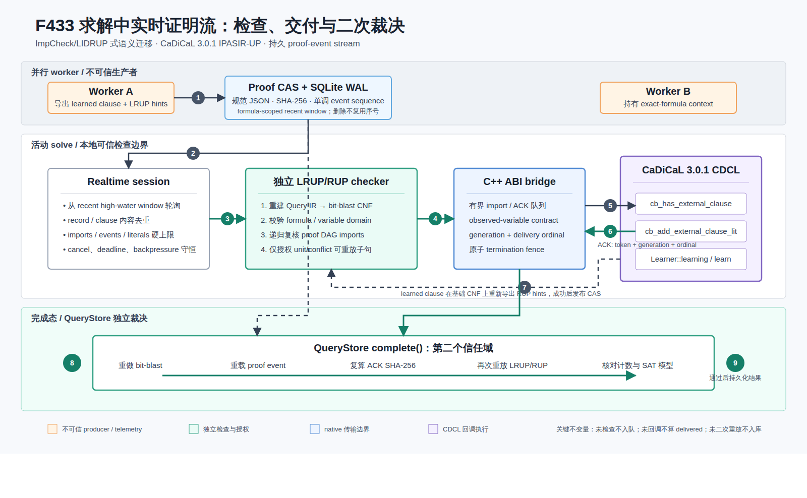

# F433：求解中实时 QF_BV 证明流与 checked-import ACK

- 功能编号：F433
- 日期：2026-08-18
- 研究主题：ImpCheck/LIDRUP 式实时证明检查、CaDiCaL IPASIR-UP 外部子句、可持久 proof-event stream
- 实现状态：生产路径、严格配置、独立二次裁决、随机 oracle、机制基准与示意图均已完成
- 启用方式：显式 opt-in；未配置 `realtime_stream` 时继续使用 F432 的普通 C/IPASIR 路径
- 证据边界：I/T/E-mechanism；没有把本功能数据解释成 fuzzing coverage、漏洞数或多节点扩展性结果



## 1. 结论先行

F432 已经实现可验证的 bit-blasted QF_BV clause exchange，但消费发生在 solve 边界：worker 在调用 CaDiCaL 前查询 CAS、重放 LRUP，然后永久加入本地 context。F433 关闭了这一时间窗口，使另一个 worker 在目标 solve **正在执行时**发布的新证明可以完成以下闭环：

1. 证明记录原子进入共享 CAS，同时获得数据库单调事件序号；
2. 活动 session 读取 formula-scoped event suffix；
3. 本地独立 checker 从 Query IR 重建 CNF，递归重放 proof DAG；
4. 只有通过 LRUP/RUP 检查的子句才能进入有界 native import queue；
5. CaDiCaL 3.0.1 在 CDCL loop 的 `cb_has_external_clause` / `cb_add_external_clause_lit` 回调中逐 literal 消费子句；
6. C++ bridge 在最后一个 `0` 被取走后生成 `token + solve_generation + delivery_ordinal` ACK；
7. worker 将 ACK 与 formula、CNF、proof event、proof record、checker policy 和 native signature 绑定；
8. CaDiCaL `Learner` 回调导出的短 learned clause，在基础 CNF 上重新推导 RUP hints；只有本地复核成功才发布到 CAS；
9. QueryStore `complete()` 在第二个信任域重做 bit-blast、重载 event/record、重算 ACK 摘要并再次重放证明。

两轮固定 seed 的 512-case 真实 CaDiCaL oracle 均为 **0 mismatch**，每轮 **512/512** 子句得到 native delivery ACK 并由独立 checker 重放，篡改 ACK 均被拒绝。两轮 64-round 机制基准中，checked-import cold path 相对相同公式的普通 native cold path 总成本比分别为 **1.499x** 和 **1.488x**。这是为低延迟并行交换支付的本地成本，不是小公式单机加速。

## 2. 研究依据与准确边界

### 2.1 直接依据

| 来源 | 原始能力 | F433 的迁移 |
|---|---|---|
| Schreiber 等，TACAS 2026，*Real-time Proof Checking for Distributed Incremental SAT Solving* | ImpCheck 在增量分布式 SAT 中实时检查导入子句和最终结果 | 活动 solve 期间检查候选；只有 checked clause 才可入 native queue；最终结果仍由 QueryStore 独立裁决 |
| ImpCheck `incremental` 分支 | `B/L/E` 公式流、`a` 本地子句、`i` 导入、`d` 删除、`V/M/T` 结果及 ACK/error | 迁移“单调公式状态、导入前检查、显式 ACK、结果失败关闭”的语义 |
| Pollitt 等，SAT 2026，*CaDiCaL 3.0* | 完整增量 SAT、assumption、proof hints、IPASIR-UP external propagator / learner | 固定 CaDiCaL 3.0.1；使用 C++ `ExternalPropagator` 和 `Learner`，保留独立 CLI LRAT UNSAT 路径 |
| Götz、Dörr、Schreiber，SAT 2026，PalRUP | 并行 proof fragments 与小型顺序可信核 | proof CAS 继续使用 F432 的持久 LRUP DAG；F433 在其上增加单调 event stream 和 native delivery receipt |

权威入口：

- TACAS 2026：https://doi.org/10.1007/978-3-032-22752-2_18
- ImpCheck incremental：https://github.com/domschrei/impcheck/tree/incremental
- CaDiCaL 3.0：https://doi.org/10.4230/LIPIcs.SAT.2026.40
- CaDiCaL 3.0.1 固定提交：https://github.com/arminbiere/cadical/commit/c60730422e758ef1cebe7aeddf2dda31c996bf04
- PalRUP：https://doi.org/10.4230/LIPIcs.SAT.2026.17

调研日期为 2026-08-18。当日重新核对的 ImpCheck `incremental` head 为 `b5f37b21385ee802ce015103b23aff62f92b1734`；CaDiCaL 固定为公开 3.0.1 tag 对应提交 `c60730422e758ef1cebe7aeddf2dda31c996bf04`。

### 2.2 没有夸大的部分

F433 是 **ImpCheck/LIDRUP 式语义迁移**，不是 ImpCheck 二进制 wire format 的逐字兼容实现。项目内协议为：

```text
symcc-qfbv-monotonic-proof-event-stream-v1
symcc-qfbv-realtime-lidrup-stream-v1
symcc-qfbv-checked-import-ack-v1
```

载荷仍是 F432 的规范 JSON LRUP proof record 和 SHA-256 CAS。这样可以直接复用 QueryStore、artifact lifecycle 和 proof DAG；代价是当前不能把项目的 SQLite event stream 直接接到 ImpCheck 的原生 pipe 而不做 adapter。

“实时”精确定义为：子句由 CaDiCaL external-clause callback 在某一活动 `solve_generation` 中消费。Python 线程完成 proof check 或 `enqueue()` 成功都不算 delivered；只有 native ACK 才算。

## 3. 完整执行次序

### 3.1 服务启动

1. `_load_portfolio()` 解析 `bitblast-cadical-qfbv` 条目。
2. 只有 `persistent:true` 才允许 `realtime_stream`；对象采用字段白名单和严格整数边界，Boolean 不能冒充整数。
3. 加载普通 `libcadical.so` 并读取 `ccadical_signature()`。
4. 加载 `libsymcc_qfbv_cadical_realtime.so`，要求协议完全匹配，并要求其嵌入的 CaDiCaL signature 与普通 C library 一致。
5. 未配置实时 shim 时不创建 session，F432 路径和结果协议保持不变。

### 3.2 建立 exact-formula context

1. Query IR 确定性 bit-blast 为 activation-guarded CNF。
2. C++ bridge 创建 CaDiCaL `Solver`，连接 `ExternalPropagator`、`Learner` 和 `Terminator`。
3. 永久 CNF 只添加一次。
4. 由于 CaDiCaL 要求 external clause 中的变量已经 observed，context 建立时注册 `1..max_variable`。
5. context 由 exact `formula_sha256` 索引并进入 LRU；淘汰和 `close()` 都持有 solve lock，活动指针不会被释放。

### 3.3 solve 前准备

1. F432 边界导入仍先运行：查询当前 formula 及 ancestor 的 proof records，逐个独立重放。
2. context 记录已永久外部导入的 record 和 clause，跨 solve 不重复加入；总量受 `max_imported_clauses` 限制。
3. 清除上一轮 cancellation/timeout；该清除发生在 context 对外登记为 active **之前**。
4. 设置 activation assumptions。
5. session 从每个适用 formula 的最新事件高水位向前保留 `max_events` 窗口，避免大型 CAS 每轮从序号 0 重扫。
6. 启动轮询线程后，context 才进入 native `solve()`。

### 3.4 活动 solve 中的导入

1. session 按 formula 从精确公式到 ancestors 读取单调事件。
2. record digest 和规范 clause 内容分别去重。
3. checker 校验 record schema、formula ordinal、CNF prefix、变量域、import DAG、ordered LRUP hints 和最终共享子句。
4. 校验失败只拒绝候选，不影响 solver；native ABI 或队列协议错误会请求终止当前 solve。
5. 校验成功生成非零 64-bit token，并进入有界队列；满队列返回 backpressure，不做隐式重试，也不把它计作 authorized。
6. CaDiCaL 在 CDCL loop 查询 external clause，bridge 返回 `forgettable=false`，因此导入成为不可遗忘的原始子句。
7. CaDiCaL 逐 literal 拉取，bridge 在终止 `0` 被消费时才：移除 pending token、递增 delivered、分配本代次连续 ordinal、写入 ACK queue。
8. Python 收到 native ACK 后，构造 hash-bound checked-import ACK；未 ACK 的队列项保持 pending，solve 结束后显式清空，不进入 context 的永久 proof telemetry。

### 3.5 learned clause 回写

1. `Learner::learning(size)` 先执行长度和队列容量检查。
2. `Learner::learn(literal)` 累积到终止 `0`；长度不一致或容量耗尽计入 dropped。
3. Python 取出 candidate 后，不信任“CaDiCaL 说它是 learned”这一事实。
4. `make_rup_clause_record()` 在稳定基础 CNF 上重新推导 RUP hints，并受单候选 checker deadline 限制。
5. 本地 checker 再重放一次；成功后才进入 CAS 和 proof event stream。
6. learned record 是可供其他 context 消费的交换制品，不被错误计作本 context 的“外部导入”。

### 3.6 solve 结束与二次裁决

1. deadline timer 与 portfolio cancel 都调用同一个 atomic termination fence；重复终止不会重复进入 CaDiCaL 异步 API。
2. session 停止后最后清空 ACK、learned queue，核对 native counters 与 Python counters。
3. SAT 只读取 input variables，恢复输入并用 Query IR evaluator 重放。
4. native UNSAT 仍不能直接授权，必须走 F432 的独立 CLI LRAT production/lifting/replay。
5. QueryStore 重新 bit-blast；对每个 ACK 重算 SHA-256、检查 native signature/generation/连续 ordinal，并查 `event_at(sequence)`。
6. QueryStore 再加载 record、递归重放 LRUP/RUP；SAT telemetry 必须包含所有实际 delivered external imports。
7. 任一关系不一致都拒绝完成；只有 store-side verification 成功才设置 `store_realtime_stream_verified:true`。

## 4. 协议与核心不变量

### 4.1 单调事件流

`proof_events` 使用 `INTEGER PRIMARY KEY AUTOINCREMENT`：

```text
sequence | digest UNIQUE | formula_sha256
```

proof record 与 event 在同一 SQLite transaction 发布。旧 F432 store 第一次打开时，按 `created,digest` 为已有 records 补建事件；GC 删除 record 时同步删除 event，但 AUTOINCREMENT 序号不回收。session 读取公式限定 suffix，QueryStore 可用 ACK 中的序号反查精确 `(formula,digest)`。

### 4.2 checked-import ACK

ACK 绑定：

```text
stream_id, token, event_sequence,
solve_generation, delivery_ordinal,
formula_sha256, cnf_sha256,
record_sha256, clause_sha256,
checker_policy_sha256, native_signature,
authorized_monotonic_ns, ack_sha256
```

它不声称给出全局分布式时钟顺序；`authorized_monotonic_ns` 只在本进程内用于诊断。跨 worker 身份依靠 event sequence、内容摘要和 native generation，而不是比较不同机器的 monotonic clock。

### 4.3 计数守恒

QueryStore 强制：

```text
delivered + pending = authorized
native_enqueued = authorized
native_delivered = delivered
native_rejected = backpressure
learned_published + learned_rejected = learned_candidates
len(ACKs) = len(delivered_record_ids) = delivered
delivery_ordinals = 1..delivered
```

所有摘要必须是 64 字符小写 SHA-256；空字符串、大小写归一化后的伪匹配、重复 token/event/record、错误 generation 或非连续 ordinal 均失败关闭。

### 4.4 资源边界

- 每 solve imports：0--4096；
- 每 solve observed events：1--1,000,000；
- native import literal queue：1--16,777,216；
- learned candidates：0--65,536；
- learned clause length：0--65,536；
- poll interval：1--1000 ms；
- 单候选 checker budget：1--60,000 ms；
- ACK/native signature/error text 均有独立长度限制。

`0` 是真正禁用 imports 或 learned export 的配置，不会在 native 层被偷偷提升为 1。

## 5. 实现映射

| 文件 | 职责 |
|---|---|
| `util/qfbv_cadical_realtime.cpp` | CaDiCaL C++ IPASIR-UP bridge；external clause、learner、terminator、有界队列和 native ACK |
| `util/qfbv_realtime_stream.py` | strict ctypes ABI、session、ACK 构造/复核、event poll、learned RUP 回写和 telemetry |
| `util/qfbv_incremental_proof.py` | `proof_events` 建表/迁移/发布/删除、suffix/high-water/event lookup、RUP deadline |
| `util/cadical_qfbv_backend.py` | opt-in 双路径、context lifetime、timeout/cancel、stream 与 SAT/UNSAT 结果合并 |
| `util/query_store.py` | 静态协议规范化、计数守恒、ACK/event/proof 独立二次验证、聚合指标 |
| `util/symcc_query_service.py` | portfolio 严格配置和 solver 构造接线 |
| `benchmark/install_cadical_3_0_1.sh` | 固定 CaDiCaL 提交并同时构建/验证 C library 与 realtime shim |
| `test/test_qfbv_realtime_stream.py` | hermetic fake ABI、迁移、并发发布、ACK 篡改、背压、deadline 和完整 QueryStore 闭环 |
| `test/qfbv_realtime_stream_oracle.py` | 真实 CaDiCaL 随机差分与 ACK replay |
| `test/qfbv_realtime_stream_benchmark.py` | native cold/warm、空流和 checked-import cold 的同进程机制成本 |

## 6. 配置与安装

安装脚本固定源码提交并构建两个 shared libraries：

```bash
bash benchmark/install_cadical_3_0_1.sh
```

产物：

```text
$PREFIX/bin/cadical
$PREFIX/lib/libcadical.so
$PREFIX/lib/libsymcc_qfbv_cadical_realtime.so
```

脚本检查 `ccadical_solve`、`ccadical_failed`、realtime solve/enqueue/dequeue-ACK/clear-termination 符号，并为三项产物输出 SHA-256。shim 的 RPATH 为 `$ORIGIN`，因此与固定 `libcadical.so` 同目录部署。

显式配置示例：

```json
[
  {
    "name": "cadical-3.0.1-realtime",
    "kind": "bitblast-cadical-qfbv",
    "persistent": true,
    "native_library": "/opt/cadical-3.0.1/lib/libcadical.so",
    "command": [
      "/opt/cadical-3.0.1/bin/cadical",
      "--plain", "--lrat", "--no-binary", "{cnf}", "{proof}"
    ],
    "capabilities": {"incremental": true},
    "max_imported_clauses": 64,
    "context_cache": 8,
    "realtime_stream": {
      "library": "/opt/cadical-3.0.1/lib/libsymcc_qfbv_cadical_realtime.so",
      "max_imports": 64,
      "max_events": 4096,
      "max_learned": 64,
      "max_learned_length": 32,
      "poll_interval_ms": 2,
      "checker_budget_ms": 100,
      "native_queue_literals": 65536
    }
  }
]
```

不写 `realtime_stream` 即回到 F432。该选择是兼容性和实验消融所需的明确控制变量。

## 7. 测试与实验结果

### 7.1 定向回归

当前定向组合结果：

| 门禁 | 结果 |
|---|---:|
| F433 + F432 + QueryStore | 49 passed + 38 passed subtests |
| 完整 Python identity/capability gate | 1242 passed + 291 passed subtests |
| 规范 node ID | 1242/1242，0 missing，0 unexpected |
| LLVM 17 / LLVM 18 lit | 各 323 discovered，0 failure/unresolved |
| Python compile / Ruff / Bash syntax | 通过 |
| C++17 `-Wall -Wextra -Werror` against pinned CaDiCaL | 通过 |
| 真实 shim SAT / UNSAT / ACK / capacity-0 / pre-cancel | 全部通过 |

专项 6 个测试覆盖：16 次并发发布幂等、旧 store 事件迁移、event lookup/high-water、native queue backpressure、learned RUP 回写、ACK 篡改、真实 backend 延迟发布、QueryStore 二次验证、配置白名单、短 deadline。

### 7.2 两轮 512-case 真实 oracle

固定 seed `0xF433 = 62515`。每个 case 构造 8-bit 输入等于随机常量的 SAT QF_BV 公式，分别运行：

1. imports/learned 都关闭的真实 CaDiCaL baseline；
2. 预先独立验证一个公式蕴含子句，通过 session 和 external callback 交付的真实 CaDiCaL solve。

两条路径都恢复输入模型；oracle 还重放每个 ACK、反查事件，并篡改一个 record digest 验证拒绝。

| 指标 | Run 1 | Run 2 |
|---|---:|---:|
| cases | 512 | 512 |
| status/model mismatch | 0 | 0 |
| native checked imports delivered | 512 | 512 |
| ACKs independently replayed | 512 | 512 |
| tampered ACK rejected | true | true |
| pre-solve cancel / clear 后结果 | 0 / 10 | 0 / 10 |
| proof records / events | 512 / 512 | 512 / 512 |
| elapsed | 9,698,677 us | 10,224,779 us |

两轮使用的 shim SHA-256 为 `5afef95ef6744d9a5aed36a4cd4375b9268dcbe256439634f9999f6412a8cb06`，native signature 为 `symcc-qfbv-realtime-v1|cadical-3.0.1-c607304`。

### 7.3 两轮 64-round 机制成本

公式为已有 38-operator SAT matrix。`native_cold` 每轮新建 context、添加 CNF、observe variables 并求解；`realtime_checked_import` 使用同样的 cold context，再增加 CAS poll、proof replay、队列和 callback ACK。`native_reuse` 与 `realtime_idle` 共享已建立 context，用于量化无候选时的 session 固定成本。

| 指标 | Run 1 | Run 2 |
|---|---:|---:|
| rounds / delivered | 64 / 64 | 64 / 64 |
| native cold median | 24,353 us | 24,306 us |
| checked-import cold median | 36,352 us | 36,095 us |
| checked-import cold total ratio | 1.499x | 1.488x |
| native warm median | 110 us | 116 us |
| realtime idle median | 2,367 us | 2,339 us |
| realtime idle total ratio | 25.600x | 24.196x |

对极短 warm solve，2--3 ms 的 SQLite/session/thread 固定成本占比很高。因此当前默认关闭实时模式是正确选择；它适合并行 worker 确实能在长 solve 中产生高价值子句的场景。后续公开多节点实验应以 time-to-coverage、有效 checked-import rate 和被缩短的 solve tail 为主要指标，而不是期待微小 SAT query 的单机延迟下降。

## 8. 多轮 review 修复记录

1. 修复 ctypes enqueue 实参和 C ABI 对齐检查。
2. `forgettable=false` 在每次 external-clause 回调都显式赋值。
3. imports/learned 容量 0 在 C++ 与 Python 两层都保持真正禁用。
4. solver 异常不跨 C ABI 展开；返回非法结果后 Python 失败关闭。
5. 队列分配异常转换为有界 native error code。
6. event batch 在多公式间按剩余预算重算；达到 import/event 上限后在内层立即停止。
7. event cursor 从 recent high-water window 开始，避免大型 CAS 的历史前缀饥饿。
8. learned record 与 external import 分开记账，避免把 solver 自身推导误报为外部输入。
9. session 启动/finish/abort 的所有失败路径先停止线程再释放 native pointer。
10. 任一 realtime 异常后淘汰可能含未登记子句的 context，禁止隐藏状态复用。
11. termination reset 从 `solve()` 移到 active registration 之前，关闭 pre-solve cancel 丢失竞态。
12. 多线程 cancel/deadline 通过 atomic exchange 合并为一次异步 CaDiCaL terminate。
13. QueryStore 对空摘要、大小写漂移、ACK 摘要、计数、代次、ordinal 和 event relation 全部独立检查。
14. context telemetry 报告全部实际永久 external imports，而不是只报告本轮候选。
15. realtime shim signature 必须与普通 C library signature 逐字一致；拒绝过长后截断的伪身份。
16. 原生累计计数若小于 session 基线立即失败，禁止用饱和差值掩盖 counter reset/rollback。
17. 所有可能抛异常的 CaDiCaL C++ 调用均在 C ABI 内捕获，异常不会跨语言栈展开。
18. LLVM 18 首轮全量门禁暴露固定 sleep 的时序脆弱性；fake ABI 改为原子 solve-start 握手，修复后双 LLVM 全量各 323/323 通过。

## 9. 创新性与挑战性

F433 的创新不在于重新发明 SAT clause sharing，而在于把论文中的实时检查思想嵌入现有并行符号执行制品体系，并补齐三个工程上经常缺失的闭环：

1. **瞬时回调与持久证据统一。** Native ACK 证明某个 solve generation 实际消费了子句；proof event 和 CAS 使同一事实可在任务结束后重放。
2. **双信任域。** worker-side checker 决定能否注入，QueryStore-side checker决定结果能否持久化；共享内存 telemetry 不构成最终授权。
3. **跨 solve 状态审计。** 不可遗忘 external clause 会改变缓存 context 的永久状态，系统显式维护 record/clause 集合和生命周期总上限。
4. **learned 反向证明。** CaDiCaL learner 只是候选生产者，项目重新从基础 CNF 推导 RUP hints，避免把 solver 内部事件直接升级为跨节点可信制品。
5. **取消与证明流一致性。** deadline、portfolio winner、session fatal error、native solve 和 context eviction 共享一个可证明无悬空线程/指针的状态机。

主要挑战来自两个不同并发域的组合：Python/SQLite/CAS 的持久并发，以及 CaDiCaL callback/C++ queue 的 solve 内并发。任何“检查完成”“入队成功”“solver 已消费”“结果已持久化”的混淆都会产生错误 telemetry，严重时形成未审计的永久 solver 状态。

## 10. 当前限制与后续 SOTA 缺口

F433 完成后，仍不能声称整个实时分布式 SAT 方向结束。明确未完成项为：

1. **P0：公开多节点 R 级评测。** 需要 8/32/128 节点的 throughput、有效导入率、proof-check CPU、CAS/网络放大、p95/p99 solve tail、coverage 和缺陷发现速度。
2. **P1：ImpCheck 原生 wire adapter。** 当前协议语义兼容但格式不同；二进制/pipe adapter 有助于与论文工具做同源对照。
3. **P1：自适应流控。** 当前 poll、batch、clause length 和 import budgets 静态配置；可根据 checker queue、solve age、LBD/size 和近期收益动态调整。
4. **P1：真正网络事件传输。** 当前共享 CAS/SQLite 适合共享文件系统部署；大规模集群应增加带反压和重放游标的消息层，同时保留 CAS 为事实源。
5. **P2：形式化 checker 核。** ordered-LRUP checker 已有差分 oracle，但尚未迁移到 CakeML、Isabelle/HOL 或同等级形式化可信核。
6. **P2：proof-aware scheduling。** 当前 scheduler 尚未把 checked-import rate、proof age、target distance 和 solve tail 联合用于 worker 配对。

因此，准确状态是：**求解中 project-native checked clause exchange 已实现并验证；论文工具线协议互操作、公开多节点效果和形式化可信核仍未完成。**

## 11. 复现命令与证据

```bash
pytest -q \
  test/test_qfbv_realtime_stream.py \
  test/test_qfbv_incremental_sat.py \
  test/test_query_store.py

python3 test/qfbv_realtime_stream_oracle.py \
  --library /path/to/libsymcc_qfbv_cadical_realtime.so \
  --cases 512 --seed 62515 --output oracle.json

python3 test/qfbv_realtime_stream_benchmark.py \
  --library /path/to/libsymcc_qfbv_cadical_realtime.so \
  --rounds 64 --output benchmark.json
```

仓库内原始 JSON、哈希、专项说明和图像位于：

```text
docs/codex/evidence/f433-realtime-proof-stream-2026-08-18/
docs/codex/diagrams/solver-context/f433_realtime_proof_stream.svg
docs/codex/diagrams/solver-context/f433_realtime_proof_stream.png
```
