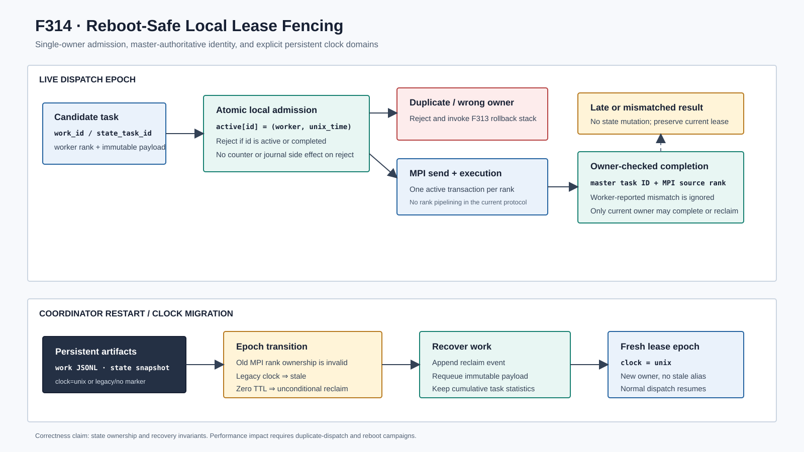

# F314：重启安全的本地 Lease Fencing 与单所有者派发

- 日期：2026-08-07
- 范围：本地 work journal、state-shard lease、MPI result identity
- 成熟度：I/T；尚无真实主机重启和 MPI 晚到消息 campaign

## 1. 审查发现

F313 为一次 MPI 派发建立了统一补偿事务，但其底层两个本地 lease 容器仍有独立的正确性
缺口。

第一，`WorkLeaseJournal.lease()` 只拒绝已经完成的 work ID，不拒绝仍在执行的同一 ID。
第二个 worker 因而可以覆盖第一个 worker 的 `worker/updated` 字段；任一晚到 completion 或
rollback 又可以无条件删除当前记录。这既造成重复求解，也使恢复日志失去真正的所有者。

第二，`StateShardCoordinator.lease()` 同样会覆盖活动 worker。即使 exact-work payload 不同，
相同 input/focus/target/action/schedule/continuation 所代表的 state task 也可能被多个 worker
同时占用；旧结果可以完成或撤销新 worker 的状态。

第三，两类状态把 `time.monotonic()` 数值持久化。monotonic clock 只适合一个 boot epoch 内的
间隔测量，跨系统重启没有共同原点。旧 uptime 较大而新 uptime 较小时，`now - updated` 为负，
甚至 `lease_ttl=0` 的恢复也无法取回未完成任务。

第四，结果处理优先采用 worker 回传的 `state_task_id`。master 已经保存了派发时的权威 ID，
允许回传值覆盖它会使错误或旧协议消息完成另一状态，或者让真正的 lease 悬挂。

## 2. 协议不变量

| 编号 | 不变量 |
| --- | --- |
| L1 | 一个本地 work/state ID 同一时刻至多有一个活动 worker |
| L2 | completion、abandon 和 discard 只有在 worker 与当前 owner 一致时才能修改状态 |
| L3 | 拒绝重复 lease 不得增加 attempts、leases、failure 或持久化事件 |
| L4 | 持久化 expiry 使用跨重启可比较的 Unix clock，并显式记录 clock domain |
| L5 | 无 clock 标记的旧 monotonic record 必须可迁移，不能形成永久 future lease |
| L6 | coordinator restart 使旧 MPI rank ownership 失效；统计可恢复，执行所有权不可继承 |
| L7 | result 中的 state ID 不能覆盖 master 派发时保存的权威 ID |

## 3. 实现

### 3.1 Work journal 单所有者准入

`WorkLeaseJournal.lease()` 现在先验证 64 位十六进制 work ID，并同时检查 `completed` 与
`leases`。活动重复请求直接返回 `False`，不追加 JSONL，也不覆盖 owner。

`complete()` 与 `abandon()` 增加可选 `worker` fence。MPI 路径始终传入 result source rank；
owner 不一致或记录缺失时返回 `False`，不写 `done/reclaim`。不传 worker 的旧调用保持兼容，
用于离线维护和已有测试工具。

### 3.2 Clock-domain 迁移

新 `lease/done/reclaim` 记录包含 `"clock":"unix"`，默认时间来自 `time.time()`。compaction
保留每个活动 entry 原有的 clock 标记，避免把旧 monotonic 数值误标为 Unix 时间。

恢复规则为：

1. `lease_ttl == 0` 无条件回收全部活动记录；
2. 无 `clock=unix` 的 legacy record 视为跨 epoch 遗留并回收；
3. 新记录使用 `now - updated >= ttl`；
4. torn/corrupt JSONL tail 仍按原协议忽略。

因此现有 `.work_leases.jsonl` 无需离线迁移。第一次 resume/recover 会追加 `reclaim`，后续新
lease 自动进入 Unix clock domain。

### 3.3 State-shard owner fencing

`StateShardCoordinator.lease()` 改为返回 `bool`，已有活动 task 时拒绝第二个 worker。
`complete()` 增加 worker 校验；既有 `abandon/discard` 已具备同类校验。MPI 派发把 state lease
拒绝接入 F313 的 `_reject_dispatch()`，使此前占用的 target/parameter/algorithm reservation
一并逆序撤销。

state snapshot 新增 `clock=unix`。重启恢复时保留累计 reward、completion、failure 和成本统计，
但把活动 lease 时间归零；新 coordinator 第一次 `recover_expired()` 即清除旧 MPI rank 所有权。
真正未完成的 work 由 work journal 重建，因此不会依赖已经不存在的 rank。

### 3.4 Master 权威结果身份

结果处理通过 `_authoritative_state_task(active, reported)` 选择 ID：存在 master-side active ID
时始终使用它；worker 值仅用于检测 mismatch 并输出告警。只有兼容旧状态、master 没有活动 ID
时才采用 worker 报告。state completion 同时携带 `MPI.Status.Get_source()` 得到的 rank，形成
`(task_id, worker)` 双条件提交。

## 4. 自动化证据

新增 6 项回归：

1. 活动 work ID 的第二次 lease 被拒绝，错误 worker 不能 complete/abandon；
2. legacy future monotonic record 可恢复，零 TTL 对 future Unix record 也无条件生效；
3. 默认 work 时间戳来自 Unix clock，并带显式标记；
4. 活动 state task 不可被第二个 worker 覆盖，错误 owner completion 无副作用；
5. state snapshot 跨 coordinator epoch 后 lease 变为 stale，legacy统计时间不混入新clock；
6. master active state ID 覆盖不一致的 worker report，旧协议空 active 情况仍可回退。

直接相关的分布式状态/MPI定向门禁为 `123 passed + 12 subtests`（5.69 秒）；加入self-config、
SMT algorithm、hybrid feedback和verified proposal后的F313/F314组合为
`219 passed + 12 subtests`（6.23 秒）。完整 Python 为 `580/580`（测试计时 81.846 秒，
shell 墙钟 82.385 秒），Ruff 与 `py_compile` 通过。上述测试证明准入、owner fencing 和
clock迁移状态机，不证明吞吐或覆盖收益。

## 5. 预期影响与实验边界

F314直接减少默认单 coordinator 内的同状态重复执行，并消除晚到结果删除新owner状态的窗口；
这应降低冗余 solver CPU 并提高恢复可信度，但当前没有把这种机制预期写成实测性能结论。

后续实验应注入相同 work/state 的并发候选、主机 reboot、wall-clock rollback、worker延迟消息和
journal compaction，测量 duplicate dispatch、wrong-owner rejection、recovered work、恢复延迟、
solver CPU 与 coverage AUC。当前 owner fence 使用 MPI rank 而不是随机 generation token；
master 保证同一 rank 仅有一个活动事务，因此对现有协议充分。若未来允许 rank pipeline 或消息
跨任务乱序，应把 owner 扩展为 `(rank, dispatch_generation)`。
