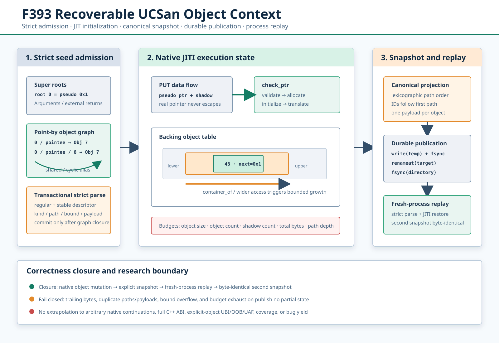

# F393：UCSan 可恢复对象上下文与严格快照

> 日期：2026-08-13  
> 状态：机制已实现、LLVM 17/18 原生集成与全量回归已通过；未形成公开 benchmark 的覆盖率或漏洞发现提升结论  
> 权威代码：`runtime/src/UCSanRuntime.cpp`、`runtime/include/UCSanRuntime.h`、`util/ucsan_seed.py`  
> 自动化验证：`test/ucsan_snapshot.c`、`test/test_ucsan_seed.py`  
> 可执行证据：[`f393-ucsan-recoverable-object-context-2026-08-13/`](../evidence/f393-ucsan-recoverable-object-context-2026-08-13/)  
> 机制示意图：[`ucsan-durable-object-context-f393.svg`](../diagrams/ucsan-durable-object-context-f393.svg)



## 1. 研究背景与准确定位

[UCSan（OSDI 2026）](https://www.usenix.org/system/files/osdi26-yin.pdf)把 under-constrained
execution 从解释器迁移到 LLVM 编译期插桩和 native runtime。论文的核心 JITI（Just-In-Time
Initialization）在 pseudo pointer 即将被访问时完成验证、对象分配、初始化和真实地址翻译，并以
point-by/dereference chain 保持跨输入的对象关系。论文还强调真实地址不能逃逸到 PUT 数据流，否则对象
动态扩容后会出现 stale pointer。

项目 F11 已实现函数入口 harness、pseudo pointer shadow、访问前翻译、负 lower bound、对象扩容、结构化
seed、alias/cycle、外部调用策略和对象图 dump。F393 不把这些已有能力重新命名为新技术，而是解决此前没有
闭合的执行上下文问题：

1. dump 由 unordered runtime state 直接输出，ID 和顺序不稳定；
2. seed loader 遇到中途损坏会保留已经写入全局状态的前缀，形成部分恢复；
3. 重复 path、同一 object 的多个 payload、尾随字节和整数边界没有统一失败关闭；
4. 只有单对象大小限制，没有对象数、shadow 数和总物化字节预算；
5. dump 直接截断目标文件，进程中止或写失败可能留下可见的半文件；
6. 没有“执行修改对象 → 快照 → 新进程重放 → 再快照”的字节级闭环证据。

因此 F393 的准确名称是**可恢复 UCSan 对象上下文**。它保存 UCSan 的 root、point-by path、alias class、
对象 bounds 和已物化字节，不保存 CPU 寄存器、native stack、程序计数器或任意系统资源；它不是通用 native
process checkpoint，也不替代项目现有的 content-addressed symbolic continuation。

## 2. 与论文语义的对应关系

| 论文机制 | F11/F26 已有实现 | F393 增量 | 当前边界 |
| --- | --- | --- | --- |
| pseudo/real pointer 分离 | pointer shadow 与访问前 `_sym_ucsan_check` | 修复 pointer 差值溢出与 stale logical base | 不是 DFSan 固定映射 shadow memory |
| JITI 对象 provision | 按访问大小分配、负 lower bound 与扩容 | 全局对象/字节预算，扩容前失败关闭 | GEP 本身不按类型 eager provision |
| point-by dereference chain | root/pointee/field-offset path | path 唯一性、最新绑定与规范排序 | path 深度有界，不是一般 points-to analysis |
| structured seed | root/object/alias 二进制 v1 | 严格闭合解析、稳定 regular-file 读取、`verify` | 没有论文完整 Thoroupy 调度器复现 |
| deterministic execution | seeded object 按 path 恢复 | ID 规范化、原子耐久发布、跨进程字节一致 | root 保存初始值，不是任意可变栈槽快照 |
| 内存检查器 | 尚未完整实现 | 本功能不宣称 UBI/OOB/UAF | 后续必须单独实现和验证显式对象语义 |

这一区分很重要。论文报告的 Linux kernel 结果属于论文系统，不能转移为本项目结果；F393 的本地数据只证明
当前代码路径的恢复确定性、失败关闭和机制成本。

## 3. 完整执行顺序

### 3.1 编译与入口生成

1. `compiler/UCSan.cpp` 从配置选择 entry 和 scope；
2. 原 `main` 被改名，新 `main` 调用 `_sym_ucsan_initialize`；
3. 每个入口参数由 `_sym_ucsan_root_value(root_id, ...)` 从 root seed 恢复；
4. pointer 参数建立 `(root_id, POINTEE)` path 的 shadow，并通过线程局部 argument shadow 传入 entry；
5. scoped function 的 load/store/memory intrinsic/atomic/call 获得翻译或 shadow 维护插桩。

F393 没有改变这个 pass 顺序，因而不会改变正常未启用 UCSan 的编译路径。

### 3.2 Seed 准入

`ensureInitialized()` 先读取所有预算，再准入 seed：

1. 以 `O_RDONLY|O_CLOEXEC|O_NOFOLLOW` 打开；
2. `fstat` 要求 regular file，大小不超过 64 MiB；
3. 从同一 descriptor 读取确定长度，读后复核 device、inode、size 和 mtime；
4. 非 `SYMUCS1\0` 输入保持历史兼容并视为没有结构化 seed；
5. 一旦识别 v1 magic，header、entry、path、payload 或尾部不完整即失败关闭；
6. 所有 root/object/path 先进入临时容器；
7. 全图通过后一次性替换 `roots/seedObjects/seedPaths/nextObjectId`。

这使恢复成为事务：合法图完整可见，非法图完全不可见，不再出现“前几个对象已加载、后一个对象损坏”的混合
状态。

### 3.3 JITI 执行

对一次 pointer load/store，执行次序为：

1. PUT 继续携带 pseudo pointer 和同数据流传播的 shadow；
2. `_sym_ucsan_check` 计算 `current_pseudo - logical_base`，使用无溢出的分支式差值算法；
3. 未物化对象按实际 access width 分配，seed payload 放到其 logical lower bound；
4. container-of 或更宽访问扩展 `[lower, upper)`；旧 concrete bytes、SymCC shadow 和 pointer shadow 一起迁移；
5. 扩容前计算 `total_materialized - old_size + new_size`，超过预算即在改状态前终止；
6. 返回的 real pointer 只供紧随其后的 memory instruction 使用；PUT 数据流仍保留 pseudo pointer；
7. pointer load 根据 containing object 和 logical offset 形成下一段 point-by path；pointer store/copy/clear
   同步维护 shadow memory。

同一 path 再次出现且 pseudo base 未变时复用 shadow。base 改变时产生新 shadow，并更新该 path 的当前绑定；旧
shadow 仍存活，避免既有 pointer 数据流悬空。快照只输出每个 path 的**当前绑定**。

### 3.4 显式或退出时快照

`_sym_ucsan_snapshot()` 允许运行中建立一致对象上下文；设置 `SYMCC_UCSAN_DUMP` 时退出钩子还会写最终状态。
快照持有 runtime recursive mutex，执行：

1. root 按 root ID 升序输出；
2. 当前 point-by paths 按 `tuple<int64>` 字典序输出；
3. 对象 ID 不复用进程内分配序号，而按每个对象第一次出现的规范 path 依次编号 `1..N`；
4. 每个对象仅在第一个 path 携带一次 `[lower, upper)` 和 payload，其他 path 为空 payload alias；
5. 输出仍是向后兼容的 `SYMUCS1` v1，不引入隐式 schema 分叉；
6. 序列化大小再次受 64 MiB 上限约束。

### 3.5 耐久发布与重放

发布在目标目录内完成：

```text
openat(directory, unique-temp, O_EXCL | O_NOFOLLOW)
write-all → fsync(temp) → close
renameat(temp, target) → fsync(directory)
```

任何前置错误都会删除临时文件并保留旧 target。`renameat` 成功而 directory `fsync` 失败时函数仍报告错误；此时
新名称可能已经可见，但不虚构掉电耐久性。新进程以 3.2 的严格 loader 消费快照，并由同一 JITI 机制重新物化
对象。

## 4. 二进制对象图不变量

v1 header 为 `<8sII>`，entry 为 `<IIQqQ>`，path component 为 little-endian signed 64 bit。F393 对图实施：

| 不变量 | 拒绝条件 |
| --- | --- |
| kind total | flags 只能精确为 root 或 object，不能未知或组合 |
| root identity | path 长度 1、lower=0、path bit pattern 与 object ID 相同 |
| path identity | object ID 非零、path 至少含 root 与 `POINTEE` marker、path 全局唯一 |
| payload ownership | 一个 object ID 最多一个非空 payload |
| bounds | `lower + size` 必须在 signed 64 bit 内 |
| serialization closure | entry 数量精确，末尾不能有额外字节 |
| resource closure | entry/path/单对象/累计 payload 不能越过预算 |

Python `validate_seed()`、runtime loader 和 native lit 负例共同覆盖这些合同。`canonicalize()` 只接受合法图，不再
以“忽略坏 entry”方式静默修复输入；这保证 `verify --require-canonical` 的含义可审计。

## 5. 配置与接口

| 接口/环境变量 | 默认值 | 语义 |
| --- | ---: | --- |
| `_sym_ucsan_snapshot()` | 无 | 将当前对象上下文发布到 `SYMCC_UCSAN_DUMP`；成功 0，失败 -1/errno |
| `SYMCC_UCSAN_MAX_OBJECT` | 1 MiB | 单个 JITI 对象最大跨度 |
| `SYMCC_UCSAN_MAX_OBJECTS` | 65,536 | runtime object table 最大对象数 |
| `SYMCC_UCSAN_MAX_SHADOWS` | 65,536 | 存活 pointer shadow 最大数量 |
| `SYMCC_UCSAN_MAX_TOTAL_OBJECT_BYTES` | 64 MiB | 同时物化的 backing object 总字节 |
| `SYMCC_UCSAN_INPUT` | 无 | 结构化 seed；未设置时回退 `SYMCC_INPUT_FILE` |
| `SYMCC_UCSAN_DUMP` | 无 | 显式/退出快照目标 |
| `ucsan_seed.py verify` | 非 canonical 也可报告 | 输出 SHA、root/object/path/byte 计数；可要求 canonical |

所有数字型预算仅接受正的、完整十进制、可表示 `size_t` 的值；无效配置保持默认值。

## 6. 多轮审查与修复

### 第一轮：输入事务与输出持久性

- 发现旧 loader 在 parse 尾部失败前直接写全局 map；改为临时图整体提交；
- 发现旧 dump 直接 `trunc` target；改为同目录临时文件、file fsync、rename、directory fsync；
- 发现 unordered map/vector 顺序会把运行历史写入 corpus identity；改为 path 驱动规范 ID。

### 第二轮：整数与 shadow 生命周期

- 发现 `current - logicalBase` 的 signed `intptr_t` 减法可能溢出；改为 unsigned magnitude 分支并显式检查
  `int64_t` 可表示性；
- 发现 `accessSize=0` 被 provision 为 1 byte，但旧 overflow guard 仍按 0 检查；统一使用 effective size；
- 发现同 path、不同 pseudo base 直接复用旧 shadow 会错误翻译；改为保留旧实例并更新当前 path binding；
- 发现跨 `INT64_MIN..INT64_MAX` 计算对象跨度可能 signed overflow；改用 unsigned difference。

### 第三轮：闭环与声明审查

- native 测试同时覆盖 alias cycle、对象修改、显式快照、退出快照和 fresh-process 重放；
- 第二份快照与第一份均为 184 bytes、SHA-256
  `b613578c31eace9f06a25b3346f12e71ee11225a72f2c7080d484e8b6be5466b`；
- 损坏 seed 和对象预算负例必须由 runtime 自身拒绝，不能只由 Python 工具拒绝；
- 文档删除“完整 UCSan”或“native continuation”措辞，并列出论文尚未覆盖的 checker/ABI 差距。

## 7. 验证结果

### 7.1 定向与跨版本

| 验证 | 结果 |
| --- | --- |
| `test/test_ucsan_seed.py` | 10 passed |
| warnings-as-errors unittest | 10 tests, OK |
| LLVM 18 UCSan lit | 5/5 passed |
| LLVM 17 UCSan lit | 5/5 passed |
| native snapshot → replay → snapshot | 两个 184-byte 文件逐字节相等 |
| malformed/budget native negatives | trailing byte 与 `MAX_OBJECTS=1` 均失败关闭 |
| Python static gate | py_compile、Ruff、format、diff-check 全通过 |

### 7.2 全量门禁

- canonical pytest inventory：954 IDs，node-ID digest
  `80c32424bfce762836a8b728e7ce69ad4bb513745bc56c02a7e0ac3182412c31`；
- capability-closed Python：**954 passed + 235 subtests**，0 skip/xfail/xpass/deselect，954/954 identity；
- 完整 LLVM lit：**252 discovered，251 passed，1 既有 unsupported，0 failed**；
- LLVM 17 与 LLVM 18 runtime 均重新构建通过。

### 7.3 机制成本

在本机 overlay 文件系统、31 个独立 native 进程样本上，每个样本执行目标逻辑并做两次耐久发布（显式调用和
退出钩子）：

| 样本 | 输入/输出 | 输出确定性 | median | P95 | min--max |
| ---: | --- | --- | ---: | ---: | ---: |
| 31 | 184 B / 184 B | 1 个 digest，全部 canonical | 16.850 ms | 17.863 ms | 14.221--19.203 ms |

这是 whole-process 小对象机制测量，包含进程启动、两次写入、两次 file fsync、两次 rename 与两次 directory
fsync。它不能与论文 Linux kernel TTF、fuzzing exec/s 或 solver time 直接比较，也不代表快照会提高覆盖率。

## 8. 先进性、创新点与挑战

1. **把 JITI object graph 提升为可迁移执行上下文。** 原论文 seed composition 关注路径探索输入；F393 进一步
   要求运行态 mutation 能形成规范、耐久、可重新准入的状态闭环，适合并行 worker 之间移交对象上下文。
2. **对象身份与进程分配历史解耦。** canonical ID 由 point-by path 的确定顺序导出，而不是 malloc/object
   counter；alias class 保留，但 worker 启动顺序不进入 corpus identity。
3. **恢复正确性与资源正确性统一。** 单对象 bounds、对象数量、shadow 生命周期和全局物化字节在同一 runtime
   状态机中预检；超限不能产生半个 snapshot。
4. **挑战位于跨表示一致性。** pseudo address、real allocation、symbolic byte shadow、pointer shadow、object
   bounds 和 serialized path 必须在扩容、copy、alias、快照和重放中同时保持关系。
5. **证据强调闭环而非单点断言。** Python parser、两代 LLVM compiler、native runtime、文件发布和 fresh
   process replay 使用同一实例互证，降低 mock-only 测试掩盖 ABI/链接问题的风险。

这些是当前项目相对既有 F11 的工程与科研增量，不宣称是 UCSan 论文之外已经发表的新算法。

## 9. 尚未完成的 UCSan 论文语义

F393 完成后，仍不能把当前实现标记为论文系统的完整复现：

1. 显式 stack/heap allocation 的 bounds metadata 与 OOB checker；
2. free/function-exit lifecycle、alias dangling propagation 与 UAF checker；
3. 显式对象逐字节 UNINIT tag、pointer dereference/branch 两类 UBI sink；
4. global root 自动纳入 Super Object；
5. sanitizer-addressed shadow mapping 和大规模并发访问成本；
6. YAML custom wrapper 的参数重映射、返回映射和 effect contract；
7. out-of-scope IR 的完整裁剪，以及 Linux kernel module 兼容性验证；
8. Thoroupy/SymSan 同口径调度与论文 nbench/kernel/UBITect 实验复现。

这些项目必须分别获得实现、native 正反例、全量回归和公开实验数据，不能由 F393 的快照闭环推定完成。

## 10. 复现命令

```bash
pytest -q test/test_ucsan_seed.py
lit -v -j8 --filter='ucsan' build/test
lit -v -j8 --filter='ucsan' build-llvm17/test

python3 util/ucsan_seed.py verify \
  docs/codex/evidence/f393-ucsan-recoverable-object-context-2026-08-13/snapshot-1.ucsan \
  --require-canonical

cmp \
  docs/codex/evidence/f393-ucsan-recoverable-object-context-2026-08-13/snapshot-1.ucsan \
  docs/codex/evidence/f393-ucsan-recoverable-object-context-2026-08-13/snapshot-2.ucsan

python3 benchmark/benchmark_ucsan_snapshot.py \
  build/test/Output/ucsan_snapshot.c.tmp \
  build/test/Output/ucsan_snapshot.c.tmp.seed \
  --samples 31
```

## 11. 参考文献

1. Yin, M. et al. [A Compilation-Based Under-Constrained Execution Engine](https://www.usenix.org/system/files/osdi26-yin.pdf), OSDI 2026.
2. Ramos, D. A., Engler, D. [Under-Constrained Symbolic Execution: Correctness Checking for Real Code](https://www.usenix.org/system/files/conference/usenixsecurity15/sec15-paper-ramos.pdf), USENIX Security 2015.
3. LLVM. [DataFlowSanitizer Design](https://clang.llvm.org/docs/DataFlowSanitizerDesign.html).
4. POSIX. [`fsync`](https://pubs.opengroup.org/onlinepubs/9799919799/functions/fsync.html) and [`rename`](https://pubs.opengroup.org/onlinepubs/9799919799/functions/rename.html).
