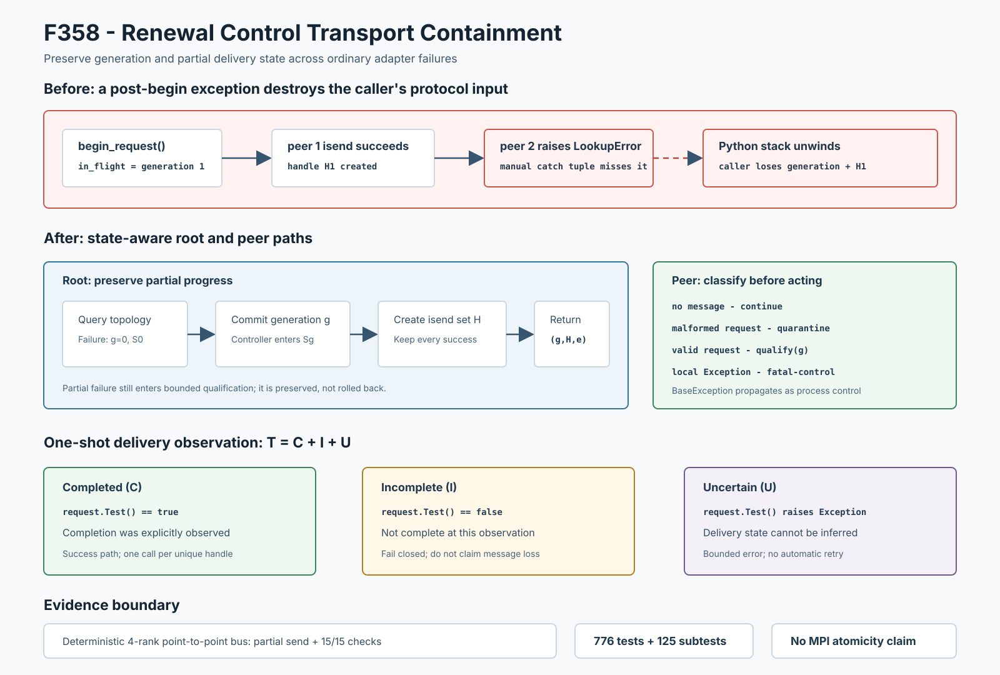

# F358：Renewal Control Transport Containment

- 功能编号：F358
- 日期：2026-08-10
- 状态：已实现、已完成机制验证与完整回归
- 范围：MPI运行期共享锁资格续期的begin、peer poll和nonblocking send completion控制传输边界



## 1. 研究背景与真实缺陷

F353-F357已依次闭合renewal result准入、rank-local completion、qualification生产、qualification输入、heartbeat
和完成时钟，但继续从生产调用链向外审查发现，请求传输仍使用人工异常元组：

```text
Get_rank/Get_size  except (AttributeError, MPI.Exception, OSError, ...)
isend/iprobe/recv  except (AttributeError, MPI.Exception, OSError, RuntimeError)
request.Test()     caller-side同类异常元组
```

这不是纯粹的错误消息遗漏。最小反例让root的`comm.isend()`在`controller.begin_request()`之后抛出
`LookupError`，旧实现直接展开Python栈，同时controller已经进入`in_flight_generation = 1`：

```text
LookupError adapter lookup failed
generation = 0
in_flight_generation = 1
```

调用方拿不到generation和已创建的send句柄，因而无法执行“即使部分发送失败也进入有界qualification”的既有
补偿路径。已经收到请求的peer可能进入协议，而root在协议外退出，最终只能依赖peer deadline收敛。send完成检查
也存在同类`LookupError`出口，并把`Test()==False`与`Test()`自身失败混为一个非成功状态。

## 2. 技术目标与失败模型

F358建立六条不变量：

1. `begin/poll/delivery observation`中的普通`Exception`必须成为不超过512字符的错误值；
2. begin前失败返回generation 0且controller保持pre-state；
3. begin后任一peer发送失败仍返回非零generation和此前成功创建的全部send句柄；
4. 每个send completion句柄最多调用一次`Test()`，不在不确定副作用后自动重试；
5. completion明确区分`completed`、`incomplete`和`uncertain`，三者总数守恒；
6. `BaseException`继续传播，不把进程控制信号伪装成可恢复协议错误。

这里的失败模型是Python适配器、mpi4py包装层或测试替身抛出普通异常。它不覆盖进程崩溃、永久阻塞、网络分区、
MPI communicator失效后的修复，也不假设nonblocking send具有事务回滚能力。

## 3. Begin阶段的状态保持

令`S0`为调用前controller状态，`Sg`为`in_flight_generation = g`，`H`为已经创建的send handle集合：

\[
B(S_0)=
\begin{cases}
(0, \varnothing, e), S_0 & \text{communicator或begin前失败}\\
(g, H, e), S_g & \text{generation建立后部分发送失败}\\
(g, H, \epsilon), S_g & \text{全部isend成功创建}
\end{cases}
\]

实现先记录`prior_in_flight`，然后在同一ordinary-exception边界内执行`begin_request()`和generation提取。如果
控制器从非在途状态转为有效非零generation后发生普通异常，返回该generation；如果调用前已经在途，仍返回0，
避免把旧操作误判为本次新请求。

peer发送循环继续尝试其余目标，并保留此前创建的句柄。生产调用方因此仍执行有界lock qualification：已经收到
请求的peer不会因root提前跳过协议而被直接遗留；未收到请求的peer则不会伪造accept。资格超时或送达错误随后进入
统一fatal-control。此策略是partial-progress preservation，不是发送原子性。

## 4. Peer Poll与错误分类

`poll_cluster_lock_renewal()`分别闭合以下阶段：

1. communicator拓扑查询；
2. `iprobe()`与`recv()`；
3. `controller.accept_request()`准入。

返回三元组仍保持兼容：`(generation, error, observed)`。语义细分为：

| 场景 | generation | observed | 运行时处理 |
|---|---:|---:|---|
| 无消息 | 0 | false | 继续事件循环 |
| 消息安全接收、格式/代次非法 | 0 | true | quarantine该控制消息 |
| 本地查询、接收或admission代码异常 | 0 | false | 设置fatal-control |
| 合法请求 | g | true | 进入generation g qualification |

admission异常时消息虽然可能已从队列取出，但并未被安全分类，因此不能伪装成普通畸形消息；`observed=false`在运行时
契约中表示“没有可安全消费的请求”，使该本地控制故障立即进入fatal-control，而不是仅增加quarantine计数。

## 5. Nonblocking Send完成状态代数

新增冻结结果：

```text
ClusterLockRenewalDeliveryObservation {
    total_count,
    completed_count,
    incomplete_count,
    uncertain_count,
    error <= 512 chars
}
```

对每个唯一句柄只执行一次`Test()`：

- `completed`：`Test()`明确返回真；
- `incomplete`：`Test()`明确返回假，仅表示本次非阻塞观察尚未完成；
- `uncertain`：`Test()`抛普通异常，无法确认其传输状态；
- duplicate：在任何`Test()`之前拒绝，防止同一句柄被重复消费。

结果始终满足：

\[
T = C + I + U
\]

生产路径对`incomplete > 0`或`uncertain > 0`均失败关闭，但保留二者诊断差异。尤其不能由`uncertain`推导“消息
没有发送”：底层操作可能已完成，只是完成状态的观测失败。因此本功能采用at-most-once observation，不自动重试
`Test()`或`isend()`。

## 6. 生产执行流程

root运行期续期顺序现在是：

```text
due(now)
  -> begin request and create per-peer isend handles
  -> preserve generation + successful handles on partial failure
  -> execute bounded qualification for that generation
  -> observe every retained handle exactly once
  -> success, incomplete, uncertain or transport error
  -> any delivery anomaly enters fatal-control
```

peer顺序是：

```text
safe event-loop point
  -> iprobe / recv
  -> accept and fence generation
  -> valid request: execute bounded qualification
  -> malformed request: quarantine
  -> local transport/admission exception: fatal-control
```

发送完成观测故意位于qualification之后。begin阶段不能等待所有send完成，否则会把本来非阻塞的控制广播转为
root-side barrier；先进入有界qualification能够服务已经收到请求的peer。之后的完成观测负责报告送达异常，而不是
证明全体peer原子接收。

## 7. 实现位置

主要变更位于：

- `util/mpi_filesystem_qualification.py`
  - `ClusterLockRenewalDeliveryObservation`；
  - `_bounded_exception_message()`统一前缀与异常细节的总长度上限；
  - `begin_cluster_lock_renewal()`保留post-begin generation和部分send；
  - `poll_cluster_lock_renewal()`闭合query/receive/admission普通异常；
  - `observe_cluster_lock_renewal_delivery()`一次性分类send状态。
- `util/mpi_concolic_execution.py`
  - root续期调用结构化delivery observer，合并partial-send、incomplete和uncertain诊断；
  - peer沿用`observed/error`分类进入qualification、quarantine或fatal-control。
- `test/test_mpi_filesystem_qualification.py`
  - 新增begin、poll和delivery三组异常/状态机测试。

MPI tag、renewal request schema、configuration fingerprint、proof transcript、磁盘格式和成功路径qualification轮数均
未改变。

## 8. 测试与可重算证据

| 验证层次 | 结果 |
|---|---:|
| F358定向transport测试 | 5 passed（36 deselected） |
| 资格模块 + MPI生命周期 | 100 passed + 79 subtests |
| 六模块相关回归 | 383 passed + 105 subtests |
| 生产API机制集成 | 15/15 checks |
| 完整warnings-as-errors Python `test/` | 776 passed + 125 subtests（97.41秒） |

定向测试覆盖`LookupError`发生在rank查询、generation已提交的request preparation、post-begin isend、iprobe、
recv、admission和`Test()`；覆盖generation类型/状态一致性、512字符上限、
NUL/换行清洗、异常`__str__`再次失败、duplicate handle零调用拒绝，以及begin/poll/delivery三个`KeyboardInterrupt`
透传路径。

确定性driver构造4-rank合成点到点bus：root向rank 1发送成功、rank 2注入失败、rank 3继续发送成功。证据显示：

```text
root generation = 1, in_flight_generation = 1, retained sends = 2
rank 1 = accepted generation 1
rank 2 = no request observed
rank 3 = accepted generation 1
delivery = completed 2, incomplete 0, uncertain 0
```

另一个三句柄观测得到`completed=1, incomplete=1, uncertain=1`，每个调用计数精确为1。driver连续两次输出的
JSON逐字节一致，15项断言全部通过。

## 9. 成本、兼容性与先进性

成功路径对每个master仍创建一次`isend`并调用一次`Test()`，时间为`O(M)`，结果统计为`O(1)`额外字段；唯一性
预验证使用`O(M)`临时identity集合。与原有逐send循环相比，没有新增网络轮次、collective或文件系统I/O。

技术进步体现在：

1. **状态感知的异常值化**：异常处理不只catch错误，还根据异常发生在generation提交前后返回不同状态；
2. **部分进度保真**：保存generation和已创建句柄，使补偿协议拥有真实输入，而不是把半完成操作压缩为全失败；
3. **三值完成语义**：把not-complete与cannot-observe分开，避免分布式系统中常见的“异常等于未执行”错误推断；
4. **一次性副作用观察**：duplicate预验证和at-most-once `Test()`约束防止不透明MPI request被重复消费；
5. **连续控制链闭包**：与F353-F357组合后，renewal从请求传输、heartbeat/input、qualification到completion的直接
   普通异常路径均进入显式结果或fatal-control。

创新点是把post-begin typestate preservation、partial handle retention和三值send observation组合到现有有界续期协议；
不声称发明nonblocking communication、exception-as-value或三值逻辑。

## 10. 局限与有效性威胁

1. 15/15证据使用合成点到点bus，不是实际mpi4py传输、collective或多主机运行；
2. 部分发送不可回滚，当前策略是继续有界qualification后失败关闭，不支持在原communicator上透明续跑；
3. `Test()==False`只观察一次，可能把稍后会完成的请求报告为incomplete；这是有意的事件循环失败关闭策略；
4. Python异常边界无法处理永久阻塞、进程终止、内核/MPI库崩溃或网络分区；
5. `BaseException`传播时controller可能已在途且部分消息可能已发送，假定上层执行进程级终止语义；
6. 当前没有ULFM revoke/shrink、rank replacement、request cancel/free或持久发送意图日志；
7. 没有运行solver、coverage、fuzzing campaign、漏洞测试或LAVA-M，因此不提供性能与覆盖率提升结论；
8. 仓库根目录无范围`pytest`会收集未构建的vendored QSYM测试并缺少独立`qsym`扩展；权威Python回归范围是
   明确记录的`test/`，不能把前者的collection failure描述为F358功能回归。

## 11. 后续研究

1. 在真实两机/三机MPI环境分别注入root partial send、peer recv错误和request completion错误；
2. 研究基于ULFM revoke/shrink的communicator级失败收敛，替代仅靠deadline与最终关闭；
3. 为generation request增加持久send-intent和peer ACK，使送达状态从本地request观察提升为端到端确认；
4. 用TLA+/PlusCal建立F352-F358状态模型，验证partial delivery、qualification timeout和fatal shutdown的活性；
5. 将结构化`stage/rank/generation/category/counts`错误写入独立审计事件，而不是只保留拼接文本。

## 12. 结论

F358修复了运行期cluster-lock续期请求传输中的真实typestate漏洞：普通post-begin异常不再丢失generation和部分
send句柄，peer查询/接收/admission异常不再逃逸，send完成被精确分为completed、incomplete和uncertain并逐句柄
最多观察一次。完整Python回归通过，确定性机制证据15/15。当前证据支持本地异常闭包和部分传输保真，不支持MPI
原子广播、故障恢复或符号执行性能提升结论。
