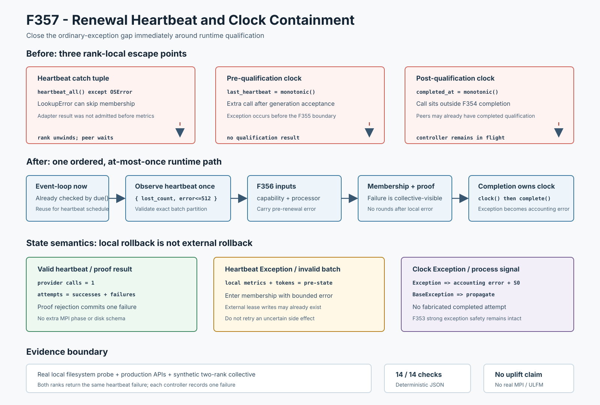

# F357：Renewal Heartbeat and Clock Containment

- 功能编号：F357
- 日期：2026-08-10
- 状态：已实现、已完成机制验证与完整回归
- 范围：MPI运行期共享锁资格续期前的work-lease heartbeat与完成时钟异常边界



## 1. 研究背景与缺陷

F353-F356依次闭合renewal result准入、completion调用、qualification生产和qualification输入观测，但继续沿
生产调用链审查发现，运行期续期仍有三个位于这些边界之外的普通异常出口：

```text
heartbeat_all()                         只在调用方捕获 OSError
last_lease_heartbeat = time.monotonic() qualification 前再次采时
completed_at = time.monotonic()         F354 completion 边界外采时
```

精确反例是让heartbeat adapter或完成时钟抛出`LookupError`。前者发生在某个master已接受generation之后、进入
membership之前；后者发生在所有master完成qualification之后、controller记账之前。两者都会让一个rank展开
Python栈，而peer可能仍在collective或等待有序关闭。`_SharedWorkCoordinator.heartbeat_all()`本身也只把
`OSError`计入`heartbeat_failures`，且在确认batch结构之前就更新内存指标，畸形adapter结果可能产生部分记账。

## 2. 技术目标与失败模型

F357建立以下不变量：

1. 每次heartbeat provider最多调用一次；普通`Exception`和畸形返回成为有界错误值；
2. heartbeat失败仍经F356输入观测进入membership，不让peer只能依赖deadline猜测；
3. 资格前不再重复读取时钟，复用已经通过`due()`检查的事件循环`now`；
4. 完成时刻由F354公共completion API内部读取，普通时钟异常返回accounting error且controller保持pre-state；
5. `BaseException`继续传播，不屏蔽`KeyboardInterrupt/SystemExit`；
6. heartbeat可能已经完成的外部文件系统副作用不重试，避免重复续租或错误累计。

这是rank-local failure containment与collective negative evidence的组合，不是MPI原子提交、ULFM恢复或分布式
事务。尤其“失败原子”只适用于本地controller/metrics提交；外部heartbeat在异常前可能已经更新部分lease文件。

## 3. 结果代数

新增冻结结果：

```text
WorkLeaseHeartbeatObservation {
    lost_lease_count: int,
    error: str <= 512 chars
}
```

heartbeat边界`H`满足：

\[
H(f)=
\begin{cases}
(|L|, \epsilon) & f()=L,\;L\text{为无重复的规范SHA-256 tuple}\\
(0, e) & f\text{抛出Exception或返回畸形值}\\
\uparrow b & f\text{抛出BaseException }b
\end{cases}
\]

completion边界从`complete(..., completed_at=t)`扩展为可选内部时钟：

```text
complete_cluster_lock_renewal(..., completed_at=None, monotonic=clock)
    -> (successful, accounting_error)
```

若`clock()`抛普通异常，返回`(False, bounded_error)`，F353保证controller全部字段保持`S0`；若得到有效时刻，
仍保持F354三分语义：proof success提交success、proof rejection提交failure、内部异常保留pre-state。

## 4. 实现细节

### 4.1 Heartbeat一次性观测

`util/mpi_filesystem_qualification.py`新增`observe_work_lease_heartbeat()`：

- provider只调用一次，只捕获`Exception`；
- 返回必须是精确tuple，每项必须是规范64位小写十六进制摘要，且不得重复；
- 非tuple、重复摘要、非法摘要、不可哈希嵌套值均归一化为同一非法结果错误；
- 异常文本、换行、NUL、异常`__str__`失败和动态类型名均复用F355/F356的有界渲染原语；
- 错误总长度不超过512字符。

验证顺序先确认精确字符串，再进行`set`重复检查，避免“非法返回校验”自身因不可哈希对象抛异常。

### 4.2 Coordinator批结果准入

`_SharedWorkCoordinator.heartbeat_all()`在修改内存metrics和token表之前验证生产
`LeaseHeartbeatBatch`：类型、tuple字段、非负精确整数sync计数、摘要规范性、无重复、renewed/lost不相交，且
二者并集必须精确等于调用前lease集合。任何普通异常统一增加一次`heartbeat_failures`并重新抛给外层观测边界；
`heartbeat_batches/renewals/directory_syncs/tokens`保持原快照。

该验证不能回滚`FencedWorkLeaseTable.heartbeat_many()`已经完成的文件替换或目录sync，因此生产路径不自动
重试失败heartbeat，而是进入fatal-control关闭。

### 4.3 生产续期顺序

新的顺序为：

```text
event-loop now
  -> begin/accept generation
  -> observe heartbeat once
  -> F356 capability/processor/local_error observation
  -> membership and bounded qualification
  -> F354 completion boundary calls monotonic once
  -> success / proof failure / accounting failure
```

heartbeat错误增加`pre-renewal`上下文并经F356清洗后设置本地fatal-control，同时仍调用公开qualification API。
`last_lease_heartbeat`直接使用调用`handle_runtime_lock_renewal()`时已有的`now`，删除资格前的额外时钟读取。
普通周期heartbeat也复用同一观测器，消除另一处人工`except OSError`策略漂移。

## 5. 正确性与副作用语义

设controller pre-state为`S0`，heartbeat外部存储状态为`D`：

- provider异常：本地`S0`不变，`D`可能已变化，错误进入membership；不重试；
- heartbeat畸形返回：coordinator本地metrics/token保持原值，失败关闭；
- qualification失败：所有参与rank获得同一负结果，proof计数为零；
- completion clock异常：`controller.complete()`未被调用，状态严格为`S0`；
- proof rejection：completion clock调用一次，提交恰好一次failure；
- process-control信号：传播，不伪装为协议失败。

这里选择at-most-once而非自动重试，是因为heartbeat不是纯函数。异常不证明其外部写入未发生；盲目重试会把
不确定完成扩大为重复操作，并使诊断与I/O成本更难界定。

## 6. 测试与可重算证据

| 验证层次 | 结果 |
|---|---:|
| F357定向 heartbeat/clock/coordinator | 3 passed + 4 subtests（94 deselected） |
| 资格模块 + MPI生命周期 | 97 passed + 79 subtests |
| 六模块相关回归 | 380 passed + 105 subtests |
| 生产API机制集成 | 14/14 checks |
| 完整warnings-as-errors Python | 773 passed + 125 subtests（97.16秒） |

定向测试覆盖`LookupError`、非法list、重复摘要、错误摘要、不可哈希嵌套值、512字符上限、异常文本渲染失败、
heartbeat/clock两个`KeyboardInterrupt`、clock调用一次、clock失败完整pre-state，以及coordinator的
`LeaseHeartbeatBatch`准入和失败指标。

机制driver使用真实本地filesystem capability probe和线程安全双rank message bus。rank 1 heartbeat抛
`LookupError`后，两个rank均得到：

```text
members = ((0, "node-0"), (1, "node-1"))
clean = verified = false
rounds = contention = release = identity = 0
error = master 1 local probe failed: pre-renewal work lease heartbeat failed: ...
```

随后两个独立controller都提交恰好一次failure；单独注入的completion clock异常则保持全部字段原快照。
driver固定epoch，不输出临时路径，两次执行JSON逐字节一致。

审查还发现F356两个测试日志的命令行误写了不存在的测试文件名，虽然保存的计数来自真实回归。现已修正为实际
`test_mpi_lifecycle.py`及六模块组合，并重算目录级和顶层SHA；这是证据可复现性修复，不改变F356实验结果。

## 7. 成本与兼容性

成功heartbeat新增结果类型/字段/集合一致性检查；复杂度为`O(n)`时间和`O(n)`临时集合，其中`n`是当前master
持有lease数。原实现已经复制token字典并在table中排序处理相同规模记录，因此渐进复杂度不变。空lease路径仍
直接返回，不增加I/O。续期前删除一次`time.monotonic()`调用，完成后仍只采时一次。

MPI tag、phase、capability/proof schema、磁盘lease格式、配置项和成功路径文件I/O次数均不变。错误消息保持
`work lease heartbeat failed`前缀，新增`pre-renewal`阶段标签。

## 8. 先进性、创新性与挑战性

1. **连续异常闭包**：把F353-F356的`result -> completion -> protocol -> inputs`链继续前推到有副作用heartbeat，
   后推到completion clock，形成连续的普通异常值化路径；
2. **不确定副作用下的at-most-once策略**：明确区分本地状态rollback与外部存储可能已提交，避免错误宣称全局
   failure atomicity；
3. **结构化结果准入后提交**：coordinator先验证完整partition不变量再更新metrics/token，防止adapter契约漂移
   导致半记账；
4. **复用已验证时刻**：资格前使用已通过调度门的`now`，同时减少异常面和一次冗余热路径调用；
5. **collective-visible失败**：heartbeat失败不是本地catch-and-return，而是经F356转换为全master可消费的负证据。

创新点是将有副作用heartbeat的不确定完成语义、条件式collective负证据和本地completion强异常安全组合成一条
可执行契约；不声称发明at-most-once、exception-as-value或failure containment。

## 9. 局限与有效性威胁

1. 双rank证据使用合成message bus，不是实际MPI transport或多机共享存储；
2. heartbeat外部副作用无法由本地异常边界回滚，当前策略是失败关闭而非恢复续跑；
3. provider永久阻塞、进程终止、OS hang不会产生可捕获Python异常；
4. 主事件循环其他`time.monotonic()`和MPI调用仍有各自异常边界，本功能只闭合续期协议直接相邻的两处时钟；
5. 没有ULFM revoke/shrink、rank replacement、跨rank异常广播或结构化多错误数组；
6. 14/14是机制断言而非独立实验样本；没有运行solver、coverage、campaign、漏洞或LAVA-M，不提供提升结论。

## 10. 后续研究

1. 用真实双主机MPI分别注入heartbeat和completion clock故障，验证统一Abort/shutdown分类；
2. 为可能部分完成的heartbeat引入持久operation ID与read-after-error reconciliation，而不是直接重试；
3. 将`stage/rank/generation/category/detail`结构化错误记录纳入proof transcript旁路审计；
4. 对provider永久阻塞使用独立可取消进程或watchdog，避免Python异常模型无法覆盖的hang；
5. 建立F352-F357小型状态模型，验证所有普通失败要么形成一致negative result，要么保持本地pre-state。

## 11. 结论

F357关闭了运行期cluster-lock续期直接相邻的heartbeat与完成时钟普通异常出口。heartbeat现在以一次性、有界、
可验证结果进入F356 collective；coordinator只在完整batch准入后提交本地指标；completion API内部拥有时钟，
时钟失败保持F353 pre-state。当前证据严格支持本地与合成collective机制正确性，不外推真实MPI容错、共享存储
恢复或符号执行性能提升。
