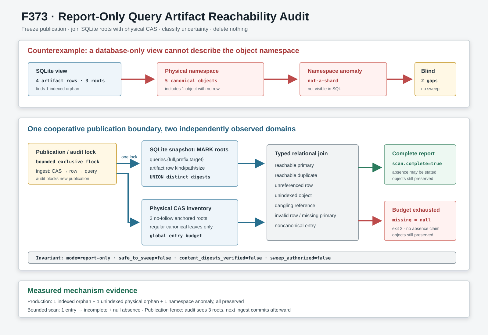

# F373：Report-Only Query Artifact Reachability Audit

## 摘要

F365--F368反复保留了同一存储正确性缺口：QueryStore在主查询事务之前先发布full、prefix和target
SMT2内容对象；如果后续artifact-row写入或query事务失败，CAS中会留下SQLite不可达对象。只查询
`artifacts`表还不完整，因为CAS成功、artifact-row失败会形成**没有任何数据库行的物理对象**，损坏或
非规范目录项也不在SQL视图中。

F373实现第一阶段、严格只读的reachability audit。它在一个crash-released协作式发布锁内冻结QueryStore
ingest，读取SQLite引用快照，并以descriptor-anchored、no-follow、regular-only方式有界遍历三个物理CAS根。
审计随后执行一个typed relational join，区分reachable primary、reachable duplicate、unreferenced row、
unindexed object、dangling reference、invalid row、missing primary、primary-size mismatch和noncanonical entry。扫描不完整时，缺失对象
结论为JSON `null`而不是`false`；所有输出都固定声明`report-only`、`safe_to_sweep=false`和
`sweep_authorized=false`。



## 1. 研究背景

### 1.1 内容寻址存储为什么仍会产生垃圾

内容寻址只保证“相同内容得到相同身份”，不保证该身份最终被元数据引用。当前入库时序是：

```text
CAS.put(full)   → artifact row(full)
CAS.put(prefix) → artifact row(prefix)
CAS.put(target) → artifact row(target)
BEGIN IMMEDIATE → query / witness / clause / literal commit
```

在任一箭头后失败都可能留下两类对象：

1. **indexed orphan**：`artifacts`已有行，但三个query引用列都不再指向该摘要；
2. **unindexed orphan**：物理CAS leaf存在，但`artifacts`写入本身没有完成。

同一摘要还可能先后作为不同role发布。`artifacts.hash`是全局主键，当前规范row只选择一个kind/path；其他kind下
相同摘要的精确副本不影响求解正确性，但属于`reachable duplicate`，必须与真正不可达对象分开报告。

### 1.2 与成熟内容存储GC的关系

F373采用“root set + physical inventory + reachability classification”的经典mark思想，但不把内存GC的并发证明
直接套用到文件系统。Dijkstra等人的on-the-fly GC强调collector与mutator并发时必须合作维护可达性不变量；F373
当前选择更保守的短期stop-the-world发布边界，而不是声称已经实现write barrier或并发tri-color collector：
[Dijkstra et al., *On-the-Fly Garbage Collection*](https://www.microsoft.com/en-us/research/publication/fly-garbage-collection-exercise-cooperation/)。

工程上，Git把`--dry-run`和expiration window作为删除前的独立语义，并明确说明不可达对象不能立即删除，否则可能
与正在到达的新引用竞争；Nix也把live/dead定义为从GC roots的可达/不可达集合，并提供只打印dead set的模式：
[Git prune](https://git-scm.com/docs/git-prune.html)、
[Git cruft packs](https://git-scm.com/docs/gitformat-pack)、
[Nix GC](https://releases.nixos.org/nix/nix-2.24.2/manual/command-ref/nix-store/gc.html)。
F373只落地这些设计中的**观察阶段**，没有借用它们的删除安全性结论。

## 2. 修复前的确定性反例

证据驱动先正常入库一个query，得到3个query引用、3个artifact row和3个物理对象；随后注入：

- 一个只写入`artifacts`但没有query引用的indexed orphan；
- 一个直接完成CAS publication但没有artifact row的unindexed orphan；
- 一个CAS root下的`not-a-shard`异常entry。

最终真实状态为：

| 视图 | 实测 |
| --- | --- |
| query引用摘要 | 3 |
| artifact rows | 4 |
| SQL可见indexed orphan | 1 |
| 物理规范对象 | 5 |
| unindexed physical orphan | 1 |
| noncanonical namespace entry | 1 |

旧的database-only检查最多发现1个indexed orphan，无法证明“物理对象数=数据库行数”，也看不到异常namespace。
因此它既不是完整mark phase，也不能成为sweep准入门。

## 3. 实现架构

### 3.1 发布/审计互斥边界

`QueryStore._ingest_validated()`现在先取得固定`.artifact-audit.lock`的有界shared `flock`，再执行三个CAS
publication、artifact-row UPSERT和query事务；多个publisher可以并行准备CAS，SQLite继续串行化写事务。
`audit_artifacts()`取得同一文件的exclusive锁后才建立数据库与物理快照。锁有以下
语义：

- descriptor关闭、普通异常、进程退出和`SIGKILL`由内核释放；
- `O_NOFOLLOW`且regular-only，symlink/FIFO锁对象在任何query副作用前失败；
- 等待上限为30秒，超时失败而不绕过审计；
- 只约束使用同一协议的本机publisher，不是跨主机共识或hostile writer防护。

该读写锁使“已完成mark后又出现一个旧快照不知道的新对象”在协作式publisher集合中不成立，同时避免无必要的
publisher--publisher串行化。连续shared publisher可能增加exclusive audit等待；30秒有界超时仍失败关闭，F373
没有声称这是最终并发GC设计。

### 3.2 SQLite MARK roots

在一个SQLite read transaction中，审计用`UNION`读取：

```text
queries.smt2_hash
queries.prefix_smt2_hash
queries.target_smt2_hash
```

这三个列形成唯一root digest集合。`artifacts(hash, kind, relative_path, size)`提供摘要到一个规范物理主副本的映射。
每行必须满足canonical SHA-256、已知kind、0--128 MiB size，以及`objects/kind/H[0:2]/H.smt2`精确派生路径；不满足
条件的行进入`invalid_artifact_rows`，不会被规范化或自动修复。

### 3.3 descriptor-anchored物理inventory

`ContentAddressedInputStore.scan_objects(max_entries=N)`新增只读清单原语：

1. 逐组件`O_NOFOLLOW | O_DIRECTORY`重开CAS root并记录身份；
2. 使用root fd扫描两位小写hex shard；
3. 以root-relative fd打开shard并复核descriptor/path身份；
4. 使用shard fd扫描leaf，只接纳规范摘要名和no-follow regular metadata；
5. 退出每个shard和root时再次复核目录身份；
6. root entry与leaf entry共同消耗全局预算。

返回值显式包含`complete`、`scanned_entries`、`noncanonical_entries`及有界对象观察集合。该阶段只验证namespace、
类型和metadata身份，**不散列对象内容**；因此报告固定写出`content_digests_verified=false`。求解路径仍由F366/F367
独立执行稳定内容验证与sealed snapshot。

### 3.4 typed join

SQLite root、artifact row和物理`(kind,digest)`集合形成以下分类：

| 分类 | 判定 |
| --- | --- |
| reachable primary | digest被query引用，规范row指向的`(kind,digest)`存在 |
| reachable duplicate | digest被引用，但该物理copy不是row选择的主副本 |
| unreferenced row | artifact row摘要不在query root集合 |
| unindexed physical | 物理`(kind,digest)`不等于任何规范row主副本 |
| orphan physical | 物理对象digest不在query root集合 |
| dangling reference | query root没有artifact row |
| invalid row | digest/kind/size/path任一不规范 |
| missing primary | 完整扫描后，reachable规范row的物理主副本不存在 |
| primary-size mismatch | 规范主路径存在，但物理leaf尺寸与artifact row的预期尺寸不同 |
| noncanonical entry | shard或leaf不符合规范布局/regular门 |

一个对象可以同时属于`unindexed physical`和`orphan physical`；这不是重复计数错误，而是“索引关系”与“root
可达性”两个正交维度。

六轮深审的第一轮补充了row/leaf metadata join。旧实现只判断规范`(kind,digest)`路径是否存在：将一个reachable
primary从78 B追加到107 B后，完整扫描仍错误给出`missing_primary_count=0`与
`namespace_reference_closure=true`。当前报告新增`primary_size_mismatch_count`和
`candidates.primary_size_mismatches`（同时给出`size`与`expected_size`）；漂移对象不再计入reachable primary，
closure为false。该门不读取内容，因此同尺寸篡改仍由F366/F367的稳定SHA-256与sealed snapshot负责。

## 4. 不完整观察的三值语义

预算耗尽不等于对象不存在。F373规定：

- `scan.complete=false`；
- CLI exit code为2；
- `missing_primary_count=null`；
- `candidates.missing_primary=null`；
- `physical_absence_claims_authorized=false`；
- `sweep_authorized=false`始终成立。

证据中`max_entries=1`精确观察1个entry后停止，以上字段全部满足。这样CI不能把“没扫到”误读为“没有”。

## 5. 用户接口

```bash
python3 util/symcc_query_service.py \
  --store /path/to/query-store \
  --artifact-audit-only \
  --artifact-audit-max-entries 100000
```

完整扫描exit 0；预算不完整exit 2。stdout是排序JSON，schema为
`symcc-query-artifact-reachability-audit-v1`。命令不需要启动solver，不删除文件，不修改artifact/query row，也不把
候选写成GC decision。

## 6. 正确性不变量

| 编号 | 不变量 | 实现/证据 |
| --- | --- | --- |
| R1 | mark与协作publisher不交错 | ingest shared / audit exclusive有界flock |
| R2 | root集合来自同一SQLite snapshot | 显式`BEGIN`后读取references和artifact rows |
| R3 | namespace扫描不跟随链接 | root/shard no-follow descriptor链，leaf no-follow stat |
| R4 | 物理观察有硬条目上限 | 1--10,000,000；默认100,000 |
| R5 | 部分扫描不产生缺失证明 | missing字段为null，CLI exit 2 |
| R6 | 数据库行与物理对象独立计数 | typed join同时发现indexed/unindexed orphan |
| R7 | audit绝不删除 | 无unlink/delete路径，四个sweep字段固定false |
| R8 | namespace观察不冒充内容证明 | `content_digests_verified=false` |
| R9 | 锁对象异常在持久化前失败 | symlink/FIFO子测试，query count保持0 |
| R10 | 已有artifact协议不漂移 | F363--F372十个driver逐字节重放 |
| R11 | 物理主对象metadata与row一致 | size漂移单独分类并阻止closure=true |

## 7. 可执行证据与结果

确定性driver连续两次输出逐字节一致，SHA-256为：

`43b0efaf58398fdea5e2a12544fb589c8349ac46a148e1caf41e837705955f09`

| 验证层 | 实测结果 |
| --- | --- |
| F373 driver | PASS；两次JSON逐字节一致 |
| 定向QueryStore identity | 1 passed + 4 subtests，0.86 s |
| QueryStore模块 | 20 passed + 16 subtests，5.35 s |
| distributed-state + QueryStore | 183 passed + 34 subtests，20.14 s |
| 历史可执行证据 | F363--F372共10个driver均与归档JSON逐字节一致 |
| 规范pytest身份 | expected=observed=787，摘要`18596f…833c00`不变 |
| 完整16-capability门禁 | 787 passed + 141 subtests，116.43 s；0 skip/xfail/deselect/drift |

publication-fence反例还证明：audit阻塞在物理scan时，新publisher保持blocked且数据库仍只有1个query；释放audit后
publisher完成，最终query数为2。audit自身只观察释放前的3个root digest，没有形成跨快照混合报告。

## 8. 先进性、创新性与挑战性

### 8.1 从“文件存在”提升为跨域关系证明

F373不是简单统计目录大小，而是把SQLite root、规范row和物理对象视为三个独立事实域。其输出能区分数据库不可达、
索引缺失、主副本缺失与精确重复副本，避免把不同修复动作压成一个“orphan”布尔值。

### 8.2 把未知编码进artifact

很多运维脚本在扫描超时时仍输出“未发现问题”。F373把不完整性编码为schema字段、nullable缺失集合和非零CLI状态，
使后续F374无法在证据不足时进入sweep。这是从可观测性到删除安全协议的必要接口，而不是展示层约定。

### 8.3 与符号执行并行框架的结合

Query artifact并非普通cache entry：它同时参与lease选择、prefix复用、sealed fd交接和结果验证。错误删除reachable
SMT2会让pending query无法claim，虚增失败或改变探索计划。F373将GC root直接绑定QueryStore持久调度状态，而不是
根据mtime或最近访问启发式猜测“可能没用”。

## 9. 局限与有效性威胁

1. F373只报告，不删除；尚未实现两次mark、grace period、identity-bound candidate、durable unlink或row cleanup；
2. publication lock串行化ingest，未测量backlog吞吐、p95/p99等待或大namespace扫描时延；
3. 锁是本机协作式`flock`，未绑定F327/F329跨主机资格，不能外推NFS/Lustre/CephFS；
4. 条目预算限制工作数量，但没有独立wall-time预算；输出本身最多与`max_entries`线性增长；
5. inventory不散列内容，不能识别“名字正确、内容错误”；F366/F367消费门仍负责内容证明；
6. 不合作进程直接写SQLite、调用私有`_store_artifact()`或替换lock pathname不在协作协议内；
7. 没有运行公开solver benchmark、真实MPI、LAVA-M或coverage campaign，也没有性能、覆盖或漏洞发现提升结论。

## 10. 下一阶段：F374准入条件

F374只有在以下条件全部实现后才能提供sweep：

1. 第一次完整mark只登记candidate及稳定物理identity，不删除；
2. candidate跨配置grace period后再次完整mark仍不可达；
3. sweep前重取publication lock并重新验证query roots、row映射、leaf identity和规范路径；
4. SQLite row removal与durable descriptor-relative unlink采用可恢复顺序；
5. 删除有object/byte/time三预算，失败保留candidate并可重试；
6. reachable duplicate与unreachable primary使用不同decision reason；
7. 任何partial scan、dangling reference、invalid referenced row或namespace漂移都fail closed。

## 11. 证据索引

- 生产实现：`util/distributed_state.py`、`util/query_store.py`；
- CLI：`util/symcc_query_service.py`；
- 回归：`test/test_query_store.py`；
- 驱动和原始证据：
  [`evidence/f373-report-only-query-artifact-reachability-2026-08-11/`](../evidence/f373-report-only-query-artifact-reachability-2026-08-11/)；
- 机制图：
  [`report-only-query-artifact-reachability-2026-08-11.svg`](../diagrams/report-only-query-artifact-reachability-2026-08-11.svg)。

## 12. 结论

F373关闭的不是“磁盘已经自动回收”，而是更早且必要的**可证明观察缺口**。旧SQL视图只能发现1个indexed orphan，
production审计同时发现1个unindexed physical orphan和1个namespace异常，并在完整/不完整扫描下给出不同的逻辑语义。
所有对象保持原样，787个规范pytest身份与F363--F372历史行为不变。当前等级为I/T/E-mechanism；只有F374完成
grace-period二次mark和失败原子sweep后，项目才可以声称具备保守CAS GC。
