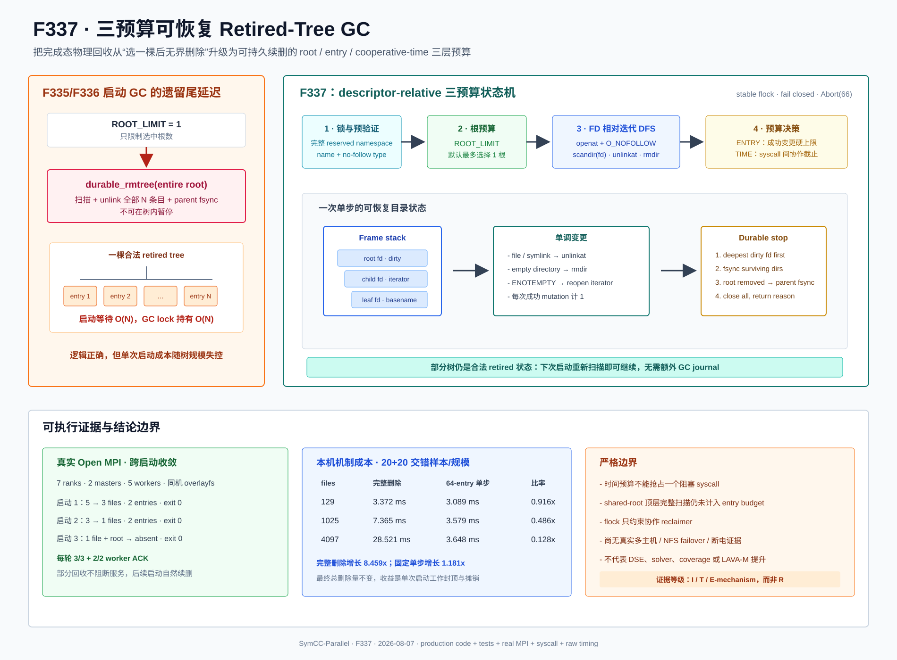

# F337：三预算可恢复 Retired-Tree GC

> 日期：2026-08-07  
> 状态：生产路径已实现，达到 I/T/E-mechanism；不是公开 benchmark 的 R 级效果结论  
> 代码：`util/distributed_state.py`、`util/mpi_concolic_execution.py`  
> 测试：`test/test_distributed_state.py`、`test/test_mpi_lifecycle.py`  
> 图示：[`resumable-budgeted-retired-gc-2026-08-07.svg`](../diagrams/resumable-budgeted-retired-gc-2026-08-07.svg)  
> 原始证据：[`f337-resumable-budgeted-retired-gc-2026-08-07/`](../evidence/f337-resumable-budgeted-retired-gc-2026-08-07/)

> 后续更新：F338 已把本报告第 14 节第 2 项的全量 `DirEntry`/候选暂存改为完整预验证下的流式有界
> Top-K；完整 namespace 枚举时延仍未被硬预算约束。参见
> [`F338 研究报告`](Streaming_Bounded_Memory_Retired_Discovery_F338_2026-08-07.md)。

## 1. 研究问题

F335/F336 已把完成 epoch 的逻辑提交从递归删除升级为：

```text
active epoch -- renameat2(RENAME_NOREPLACE) + parent fsync --> retired epoch
```

因此所有 MPI rank 不再等待整个状态树删除后才能 `Finalize`。但是旧启动 GC 仍有一个未解决的尾延迟：

```python
for retired_root in candidates[:root_limit]:
    durable_rmtree(retired_root)
```

`SYMCC_RETIRED_WORK_STATE_GC_LIMIT=1` 只限制“一次选几棵树”，没有限制选中树内的文件数、目录数和删除
系统调用数。一棵含数十万条目的 retired tree 仍可能长时间持有全局 GC lock，并把下一次服务启动阻塞在
`shutil.rmtree`。这不破坏恢复正确性，却使 F335 将尾延迟从完成边界转移到了不可控的启动边界。

F337 的目标是同时满足：

1. 每次启动成功的 `unlink/rmdir` 数量有严格上限；
2. 到预算时保留一个合法、下一次可继续删除的 retired tree；
3. 已执行的部分删除在返回前经过目录 `fsync`；
4. 不递归、不跟随符号链接，不把部分完成误报为根已回收；
5. 单个不可抢占的存储调用仍可能阻塞，因此不虚构硬实时保证。

## 2. 原语与文档约束

实现依赖三个可核查的接口事实：

- Python `os.scandir()` 在 Unix 上可直接接收目录 file descriptor，结果顺序任意；枚举期间目录发生变化时，
  新增或删除条目是否仍被返回是未指定的。[Python 3.12 `os.scandir`](https://docs.python.org/3.12/library/os.html#os.scandir)
- `openat`/Python `dir_fd` 允许子路径相对已经打开的父目录解析；`O_NOFOLLOW` 使 final component 为符号链接时
  打开失败。[Linux `open(2)` / `openat(2)`](https://man7.org/linux/man-pages/man2/openat.2.html)
- `unlinkat` 可相对目录 descriptor 删除文件或以 `AT_REMOVEDIR` 删除目录；文件内容同步不能代替目录项
  持久化，目录变化仍需同步相应目录。[Linux `unlink(2)` / `unlinkat(2)`](https://man7.org/linux/man-pages/man2/unlinkat.2.html)、
  [Linux `fsync(2)`](https://man7.org/linux/man-pages/man2/fsync.2.html)

这些是系统接口约束，不等价于真实 NFS/Lustre/GPFS 多客户端和 server failover 已经验证。

## 3. 总体架构



F337 不改变 F336 完成态提交，只替换后续启动期的物理回收：

```text
完成作业
  active --NOREPLACE rename + shared-root fsync--> retired
  MPI post-cleanup gate --> exit 0

下一次持久 output 启动
  stable no-follow flock
  -> 完整预验证 reserved retired namespace
  -> 最多选择 ROOT_LIMIT 个根
  -> 对每棵树执行 descriptor-relative iterative DFS
  -> 达到 ENTRY_BUDGET 或 TIME_BUDGET 时同步脏目录并保留部分树
  -> 释放锁、广播结构化结果、进入服务
```

retired 根本身就是恢复游标：每次只做单调的 unlink/rmdir，不需要另写一个可能与目录树失配的 GC journal。
崩溃或正常预算停止后，下一次启动重新扫描现存目录即可继续。

## 4. 三层预算

| 层次 | 配置 | 默认值 | 保证 |
| --- | --- | ---: | --- |
| 根预算 | `SYMCC_RETIRED_WORK_STATE_GC_LIMIT` | 1 | 最多选择多少个合法 retired 根；0 禁用自动 GC |
| 目录项预算 | `SYMCC_RETIRED_WORK_STATE_GC_ENTRY_BUDGET` | 4096 | 一次启动成功的 `unlink/rmdir` 总数硬上限；根自身也计 1 |
| 时间预算 | `SYMCC_RETIRED_WORK_STATE_GC_TIME_BUDGET_SECONDS` | 0.05 s | 在文件系统调用之间检查的协作式截止时间 |

锁等待另由 `min(30 s, SYMCC_SHARED_STATE_CLUSTER_PROBE_TIMEOUT)` 限制，不计入 GC 时间预算。时间预算从
取得锁后、reserved namespace 扫描前开始；但实现允许至少完成一次目录项变更后再因时间停止，避免深树在
每次启动都只下降到同一层而永不产生进展。

**时间预算不是硬 wall-clock 上限。** `openat/getdents64/unlinkat/fsync` 中任意单次调用都可能在远端存储或
故障恢复期间阻塞，Python 无法在不取消线程或隔离进程的前提下抢占它。F337 约束的是用户态可决定的继续
派发，不声称约束内核或存储服务器的单调用尾延迟。

## 5. Descriptor-Relative Iterative DFS

`durable_rmtree_step()` 使用显式 frame stack，而不是 Python 递归：

```text
frame = {directory fd, scandir iterator, basename, dirty bit}

open real parent directory
open root relative to parent with O_DIRECTORY | O_NOFOLLOW
push root frame

while stack and budgets permit:
  next entry
  directory -> open relative to current fd with O_NOFOLLOW; push frame
  other     -> unlink relative to current fd; mark frame dirty; count += 1
  EOF       -> rmdir relative to parent fd; mark parent dirty; count += 1

sync dirty surviving frames deepest-first
if root was removed, sync its surviving parent
close every iterator and fd
```

符号链接的 `is_dir(follow_symlinks=False)` 为 false，因此被当作普通目录项 unlink，不会进入链接目标；被识别
为目录的 child 还必须再次通过 `O_NOFOLLOW|O_DIRECTORY` 打开。路径前缀由已经打开的 descriptor 固定，减少
长路径重复解析和 final-component 替换风险。

## 6. 枚举变化与 `ENOTEMPTY` 恢复

边扫描边删除时，`scandir` 可能因目录实现和迭代 offset 调整跳过尚未返回的条目。旧式直觉“迭代器 EOF
等于目录为空”不成立。F337 在 EOF 后尝试 descriptor-relative `rmdir`：

- 成功：目录确实为空，计入一次目录项变更；
- `ENOTEMPTY`：关闭并重开同一目录 descriptor 上的 iterator，继续当前 frame；
- 其他错误：失败关闭，由 MPI 启动路径 `Abort(66)`。

测试确定性注入第一次 `rmdir -> ENOTEMPTY`，第二轮重开后完成，防止这一分支退化为偶然依赖本地 ext4/
overlayfs 的枚举顺序。

## 7. 耐久性与失败语义

每个 frame 有 `dirty` 位。部分步骤结束时：

1. 仍存在且发生过 unlink 的目录从最深层向根执行 `fsync(fd)`；
2. 若子目录已被 rmdir，只需把其仍存在的父目录标为 dirty；
3. 若 retired 根被删除，最终同步 shared root；
4. 即使某个 `fsync/close` 失败，也继续尽力同步并关闭所有 descriptor，最后抛出第一个异常；
5. MPI rank 0 将任何扫描、删除、同步或锁异常广播为 GC 失败并 `Abort(66)`，不报告启动成功。

可见删除后 `fsync` 失败仍意味着崩溃后的持久性未知；实现不伪装回滚。保留下来的名字仍属于 retired
namespace，恢复器不会把它当作 active epoch 执行。

## 8. 结构化结果与可观测性

底层单步返回：

```text
DurableRmtreeStepResult(removed_entries, complete, stop_reason)
```

MPI 聚合层返回 completed roots、partial root、总变更数和停止原因。启动日志同时打印：

```text
Retired GC:     0 root(s) reclaimed, 2 entry(s) removed, stop=entry-budget
Retired budget: roots=1, entries=2, time=1s
Retired partial: .retired-standalone-work-<epoch>-<id>
```

`complete`、`entry-budget`、`time-budget`、`root-limit`、`empty`、`disabled` 与 `temporary-output` 被明确区分，
方便线上诊断正常预算停止和异常中断。

## 9. 自动化验证

新增或扩展的测试覆盖：

- 8-entry 嵌套树以 2-entry 硬预算执行四步，严格为 `2+2+2+2`，最后一步才 complete；
- 快进 monotonic clock 证明时间预算到期后仍恰好产生一次进展，随后可恢复完成；
- 目录内 symlink 只删除链接，外部 marker 字节保持；
- `O_NOFOLLOW` 不可用时删除前失败；
- 删除可见后目录 fsync 失败向上传播，留下空根可在下一次完成；
- 第一次 EOF/rmdir 注入 `ENOTEMPTY` 后重开 iterator 并完成；
- MPI GC 在完整 reserved namespace 预验证后才删除，畸形名和 retired symlink 保留合法候选；
- 单棵 retired 嵌套树跨四次调用按 2-entry 预算收敛；
- root/entry/time 环境变量进行严格范围、NaN/Inf 和整数语法校验。

回归结果：

| 范围 | 结果 | 时间 |
| --- | ---: | ---: |
| distributed + lifecycle + filesystem 定向 | 204 passed + 43 subtests | 18.39 s |
| 六个 MPI/distributed/hybrid 相关模块 | 321 passed + 51 subtests | 18.33 s |
| `pytest -q -W error test/test_*.py` | 717 passed + 71 subtests | 99.48 s |

Ruff、内存 `compile()` 和 `git diff --check` 另行通过。

## 10. 真实 Open MPI 跨启动收敛

实验使用真实 Open MPI transport、7 ranks、2 masters、5 workers，同一物理主机、local overlayfs，预先创建
含 5 个文件的旧 retired 根。配置为 root limit 1、entry budget 2、time budget 1 s，连续运行三次相同
persistent output：

| 启动 | GC 结果 | 旧根状态 | Worker ACK | 作业 |
| --- | --- | --- | --- | --- |
| 1 | 0 roots / 2 entries / entry-budget | 保留，5→3 files | 3/3 + 2/2 | exit 0，3.749 s |
| 2 | 0 roots / 2 entries / entry-budget | 保留，3→1 files | 3/3 + 2/2 | exit 0，3.732 s |
| 3 | 1 root / 2 entries / root-limit | 1 file + root 均删除 | 3/3 + 2/2 | exit 0，3.703 s |

每次成功运行仍按 F336 生成自己的 retired epoch；第三次后旧根消失、三个新根存在，content-addressed seed
摘要与字节保持。该实验说明部分删除不会被误解为失败服务，也不会妨碍下一次从剩余树继续；它不是多主机
部署证据。

## 11. Syscall 证据

最小驱动在 4-file 根上执行 entry limit 2。相关 trace 显示：

```text
openat(parent_fd, "f337-retired-root",
       O_RDONLY|O_NOFOLLOW|O_CLOEXEC|O_DIRECTORY) = tree_fd
getdents64(scandir_fd, ...) = ...
unlinkat(tree_fd, "f337-entry-3", 0) = 0
unlinkat(tree_fd, "f337-entry-0", 0) = 0
fsync(tree_fd) = 0
```

机器可读结果为 `removed_entries=2`、`complete=false`、`stop_reason=entry-limit`，且仍有两个文件。测试夹具
退出前先把剩余对象改为 `fixture-cleanup-*`，因此 relevant trace 中没有第三次 F337 `unlinkat`。

## 12. 本机机制成本

环境为 Linux 7.0、glibc 2.39、Python 3.12.3、local overlayfs。每个规模先 2 次 warm-up，再交错、交替
执行 20 次完整 `durable_rmtree` 和 20 次固定 64-entry 单步；计时区只包含删除及所需目录 fsync，树构造和
单步后的夹具清理不计入。

| 文件数 | 完整删除中位 | 64-entry 单步中位 | 单步 / 完整 | 完整 / 单步 |
| ---: | ---: | ---: | ---: | ---: |
| 129 | 3.372 ms | 3.089 ms | 0.916x | 1.092x |
| 1025 | 7.365 ms | 3.579 ms | 0.486x | 2.058x |
| 4097 | 28.521 ms | 3.648 ms | 0.128x | 7.818x |

从 129 到 4097 文件，完整删除中位增长 8.459x，固定 64-entry 单步只增长 1.181x。4097 文件用生产默认
`4096 entries / 50 ms` 完整收敛需要两步：第一步 4096 entries / 27.042 ms，第二步 2 entries /
2.945 ms，总计 4098 entries / 30.032 ms；相对同规模完整删除中位为 1.053x。

这说明 F337 的价值是**把单次启动工作封顶并跨启动摊销**，不是减少最终必须执行的总删除量。本机默认时间
预算未触发，停止原因为 entry limit；远端存储结果必须另测。

## 13. 先进性、创新性与挑战

- **逻辑完成与物理回收进一步解耦**：F335/F336 缩短完成 critical path，F337 再控制后续启动 critical
  path，形成 `active -> retired -> partially retired -> absent` 的显式生命周期；
- **目录树本身作为单调恢复状态**：无需额外 GC cursor 或 journal，就能从任何已持久化部分状态继续；
- **三预算而非单根计数**：root budget 控制公平批次，entry budget 提供可测试硬界，time budget 控制用户态
  派发，并诚实保留不可抢占 syscall 的边界；
- **描述符相对、非递归遍历**：降低路径重解析，拒绝 final-component symlink，并避免 Python 递归深度成为
  删除正确性的隐含限制；
- **把 iterator 语义纳入恢复协议**：显式处理目录变更下 EOF 不可靠与 `ENOTEMPTY` 重开，而不是依赖某一
  本地文件系统的枚举偶然行为；
- **可执行证据闭环**：单元故障注入、真实 MPI 三次收敛、syscall 轨迹和多规模 raw timing 分别证明语义、
  集成、系统调用和成本，不用一种证据替代另一种结论。

## 14. 已知限制与下一步

1. 时间预算不能抢占单个阻塞 syscall，也不能替代存储层 I/O timeout；
2. 为保持“畸形 reserved 对象在任何删除前阻断”的不变量，shared root 顶层 namespace 仍完整扫描并暂存，
   其条目数和内存暂未纳入 entry budget；
3. GC lock 只串行化协作进程；外部非协议写者仍能在扫描期间改变树；
4. lexical candidate 顺序稳定但不是严格到达时间公平；持续产生更小名称理论上可延迟后续根；
5. 没有独立后台维护进程、磁盘水位策略、全局空间配额或长期无重启时的主动回收；
6. 尚未在真实 NFS/Lustre/GPFS 多客户端、server failover、断电和极端深目录上验证；
7. 机制与 worker solver、coverage、DSE throughput、bug discovery 和 LAVA-M 无直接收益结论。

后续优先审查 shared-root namespace 的有界发现与公平游标，再设计独立、可观测的 maintenance mode；任何
升级仍需保留 reserved namespace 预验证和失败关闭语义。
