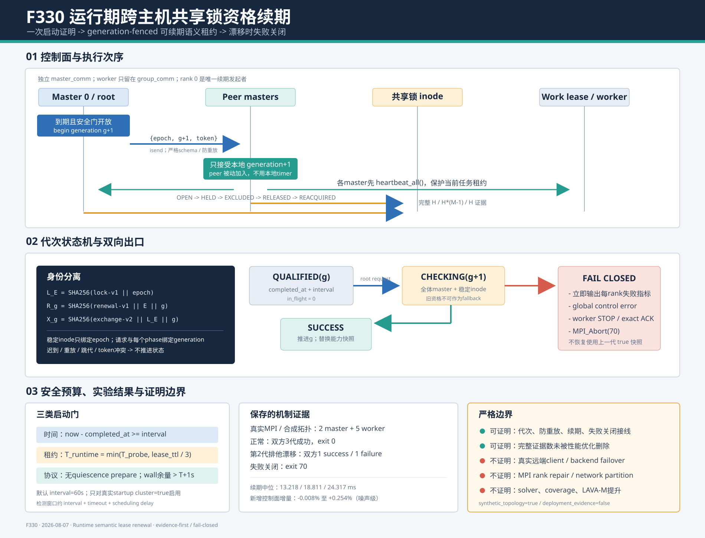

# F330：运行期跨主机共享锁资格续期与代次防重放

> 日期：2026-08-07  
> 状态：机制已实现；单元、关联、完整回归和真实MPI合成拓扑实验已通过；真实多client后端待验证  
> 范围：standalone多master共享状态；不扩张到hybrid跨作业拓扑

> **历史快照说明（2026-08-10）**：本文保留F330首次实现时的续期协议与实验记录。F351已把资格
> 提交升级为identity-closed v2 proof；现行续期控制器只接受v3 capability、
> `cross-host-mpi-lock-v2`和等于master数的identity checks，legacy v1证据会计入续期失败。参见
> [F351报告](Identity_Closed_Cluster_Lock_Qualification_F351_2026-08-10.md)。
> F352又关闭了result completion的旧代重放与字段拼接边界，现行生产路径还要求generation-bound
> transcript、live ordered ranks和client-local startup capability一致；参见
> [F352报告](Generation_Bound_Lock_Proof_Transcript_F352_2026-08-10.md)。

## 1. 研究问题

F329在任何work epoch元数据和符号执行结果发布之前，由真实MPI master共同验证共享文件系统的
跨client `flock`排他与close-release语义。它解决了“同机子进程能互斥，是否能推出远端client也
互斥”的启动时证明缺口，但保留了典型的time-of-check/time-of-use问题：

```text
t0: NFS/SMB/Lustre client A/B通过启动litmus
t1: 作业持续运行，fenced lease依赖同一锁域
t2: remount、server/lock-manager restart、网络或client状态变化
t3: 进程仍持有t0的cluster_lock_verified=true快照
```

`t2`后的共享存储可能没有立即返回I/O错误，却已经静默改变排他语义。若框架把`t0`的证明视为永久
事实，两个master就可能同时修改同一lease record，令后续fencing token失去单赢家前提。F330研究：

> 如何把一次性文件系统资格变成可续期、代次隔离、失败关闭的运行时语义租约，同时不与work lease
> heartbeat、全局quiescence或MPI关闭协议形成新的死锁？



## 2. 技术依据与定位

### 2.1 从一次性测试转向运行时语义断言

Oathkeeper对9个大型分布式系统的109个静默语义失败进行了研究，并把测试隐含的语义规则部署到
运行时；论文报告平均1.27%的目标系统吞吐开销。这说明“测试曾经通过”不能替代运行时语义检查，
而低频、针对关键不变量的断言可以具有可接受成本。
[OSDI 2022：Demystifying and Checking Silent Semantic Violations](https://www.usenix.org/conference/osdi22/presentation/lou-demystifying)

F330没有复刻Oathkeeper的规则推断器，而是采用其更基础的研究思想：把F329已经明确的
`held -> excluded -> released -> remote reacquired`语义从startup test提升为周期性production
assertion。这里的创新在于将该思想适配到并行符号执行的master-only MPI控制面、稳定inode和fenced
work lease，而不是声称提出了通用运行时验证理论。

### 2.2 有限期限与续期

Gray和Cheriton的经典lease机制用有限期限避免永久相信缓存一致性授权，并通过续期在一致性与通信成本
之间取舍。F330不使用物理时钟决定共享写权限，也不把本地时间戳当作跨机共识；它借鉴的是“资格只在
有限时间内可依赖、到期后必须重新验证”的结构。
[SOSP 1989：Leases](https://web.stanford.edu/class/cs240/readings/leases.pdf)

调度使用各进程本地monotonic clock，权限仍来自每次真实反事实lock litmus。因此wall clock skew
不会直接制造双写权限；其影响只可能是某个master稍晚进入续期，最终由有界MPI协议等待或失败关闭。

### 2.3 为什么仍需主动探测

Linux文档明确指出，NFS的`local_lock=flock`可使锁只排除同一client上的进程；SMB/NFS语义还会随
内核、协议、mount option和server实现变化。因此类型名或一次成功记录都不是持续证明。
[flock(2)](https://www.man7.org/linux/man-pages/man2/flock.2.html)、
[nfs(5)](https://man7.org/linux/man-pages/man5/nfs.5.html)

MPI 5.0基本错误模型也不为永久失联进程提供通用恢复机制，并说明错误MPI调用后的计算状态未必可继续
依赖。F330因此选择“有界等待后终止当前作业”，不伪装成MPI rank repair或共识成员替换。
[MPI 5.0 Error Handling](https://www.mpi-forum.org/docs/mpi-5.0/mpi50-report/node49.htm)

## 3. 资格租约模型

### 3.1 三种身份分离

F330刻意分离三类身份：

1. **work epoch** `E`：标识本次可恢复standalone状态；
2. **稳定锁身份** `L_E`：只绑定epoch，不随每次续期改写inode内容；
3. **资格代次** `g`：启动为0，运行期严格递增为1、2、3……

定义：

```text
L_E = SHA256("symcc-cluster-lock-v1\0" || E)
R_g = SHA256("symcc-cluster-lock-renewal-v1\0" || E || u64be(g))
X_g = SHA256("symcc-cluster-lock-exchange-v2\0" || L_E || u64be(g))
```

`L_E`写入`.cluster-filesystem.lock`，保证同一恢复epoch复用完全相同的稳定对象；`R_g`只授权root发起
第g代；`X_g`绑定该代每一个MPI phase envelope。这样既不因周期检查不停改写锁记录，也不允许上代
迟到消息进入下代。

### 3.2 状态机

每个master维护：

```text
generation              最后完成的代次
in_flight_generation    当前代次，正常态为0
completed_at            上次成功的本地monotonic时刻
attempts/successes/failures
total_elapsed/last_elapsed
```

root只生成`generation+1`；peer只接受精确的`generation+1`。以下请求均被拒绝：

- epoch不一致；
- schema字段缺失或多余；
- generation重复、回退或跳跃；
- token长度、字符集或摘要不匹配；
- 当前已有in-flight代次。

拒绝一条坏消息不会推进generation，因此随后到达的正确请求仍可被接受；若坏消息来自本轮真实root，
root会在资格exchange deadline到期后失败关闭。

## 4. 完整执行流程

### 4.1 启动阶段

1. `MPI.COMM_WORLD`确定standalone master/worker角色；
2. `group_comm`隔离每个master与其worker，`master_comm`只包含master；
3. rank 0选择64位十六进制work epoch并广播；
4. 各master在隐藏work root和真实publication root执行九项本机能力探测；
5. F329以`qualification_generation=0`执行完整跨client lock litmus；
6. 若真实processor少于2个，保留本机scope并立即释放`master_comm`；
7. 只有`cluster_lock_verified=true`且续期间隔大于0，才保留`master_comm`进入主循环。

因此配置不能在同机作业上强制制造跨机证明，hybrid单master-per-job也不会误用standalone communicator。

### 4.2 rank 0发起续期

当本地monotonic时间超过`completed_at + interval`时，root还要同时满足：

- 没有已在执行的代次；
- 全局quiescence probe/commit尚未prepare；
- generation未耗尽63位非负范围；
- 若设置wall timeout，剩余时间必须大于有效资格timeout加1秒。

满足后root构造`{schema, epoch, generation, token}`，以独立tag向所有peer master执行`isend`，然后
自身进入同一代资格状态机。若发生部分发送失败，root仍进入有界状态机，因为已经收到请求的peer不能
被遗留在协议中；缺失peer最终由共同deadline变成全局失败。

### 4.3 peer加入

peer在每次master事件循环中非阻塞`iprobe`续期tag。没有消息时不进入collective，不增加同步屏障；
收到请求后先执行精确schema、epoch、generation和token校验，再加入该代litmus。root authority解决了
“各master本地timer略有偏差导致不同代次同时开始”的问题。

### 4.4 续期前保护现有work lease

每个参与master在进入lock litmus前强制执行一次`heartbeat_all()`：

1. 按shard分组预验证当前token；
2. 续期该master持有的work leases；
3. 记录丢失lease，后续worker结果仍须通过原token fence；
4. heartbeat I/O失败作为本地失败证据进入全体membership exchange。

运行期资格的有效timeout为：

```text
T_runtime = min(SYMCC_SHARED_STATE_CLUSTER_PROBE_TIMEOUT,
                SYMCC_STANDALONE_WORK_LEASE_TTL / 3)
```

因此health probe本身不能合法占满整个work lease窗口。默认lease 120秒、cluster timeout 30秒时，
`T_runtime=30s`。

### 4.5 重新执行跨client反事实证明

每一代重新调用F329完整协议，不使用抽样替代：

```text
membership -> prepare ->
for each processor representative:
    all descriptors OPEN
    representative HELD
    every other master EXCLUDED
    every descriptor CLOSED / RELEASED
    next different-processor representative REACQUIRED
```

H个processor、M个master仍必须得到：

```text
holder rounds      = H
contention checks  = H * (M - 1)
release checks     = H
```

续期时重新读取`MPI.Get_processor_name()`。若processor membership变化但仍有至少两个真实identity且所有
证据成立，能力快照更新为新membership；若退化为单processor，运行期控制器把“clean但unverified”视为
失败，而不是降级继续运行。

### 4.6 成功与失败出口

成功：

- generation推进；
- in-flight清零；
- 更新completed_at；
- 替换`work_coordinator.filesystem_capabilities`；
- 累加可机器读取的成本与成功计数。

失败：

- generation仍记为已经尝试过的代次，禁止重放；
- 立即在每个完成判定的master输出失败指标；
- 设置global work control error；
- 执行当前group的有界STOP/exact-ACK worker shutdown；
- standalone主流程以`MPI_Abort(70)`非零终止；
- 绝不恢复使用上一代`cluster_lock_verified=true`快照。

## 5. 与quiescence和关闭协议的组合

F330最困难的部分不是重复调用`flock`，而是避免两个控制协议交叉：

1. root一旦发起全局quiescence probe，peer可能冻结新work发现等待COMMIT/ABORT；
2. 若此时某个peer独立timer进入资格续期，而root继续等待quiescence ACK，就会互相等待；
3. 若root已经退出master loop，迟到peer再进入续期也会等待永远不会参与的root。

解决方法是root-authorized scheduling：只有root能发请求，而且`probe_prepared=true`时root禁止发起；peer
从不依据自己的timer主动开始。wall-time同理：root在剩余时间不足时不启动新代次。成功结束后保留的
`master_comm`先由全部master释放，再进入最终`COMM_WORLD`有界barrier；本机或禁用场景仍在startup
立即释放，不增加长期资源。

## 6. 实现映射

| 模块 | 实现 |
| --- | --- |
| `util/mpi_filesystem_qualification.py` | 代次控制/请求摘要、`ClusterLockRenewalController`、root广播、peer poll、generation-bound exchange |
| `util/mpi_concolic_execution.py` | communicator保留、timer与wall/quiescence gate、续期前heartbeat、能力替换、失败关闭和指标 |
| `test/test_mpi_filesystem_qualification.py` | 连续代次、防重放、代次分歧、语义漂移、部分发送与deadline测试 |
| `docs/Configuration.txt` | 默认值、有效timeout、启用条件和严格证明边界 |
| `docs/codex/evidence/f330-*` | 真实MPI合成拓扑、故障注入、微基准和完整回归原始数据 |

本轮还通过真实MPI故障实验修复了一项可观测性错误：失败master可能在peer到达循环尾部前执行
`MPI_Abort`，若只在正常尾部打印指标，部分参与者的失败代次会丢失。现在失败判定完成后立即、每rank
至多一次输出metrics；正常结束仍统一输出。

## 7. 正确性不变量与测试

### 7.1 关键不变量

1. **单发起者：** 只有master communicator rank 0能广播续期请求；
2. **连续代次：** peer只接受本地`generation+1`；
3. **双重绑定：** 请求token和phase exchange token都包含generation；
4. **稳定对象：** lock record只绑定epoch，续期不更换inode身份；
5. **全体证据：** 不减少F329的H/H*(M-1)/H基数；
6. **不重叠：** in-flight代次完成前不能开始下一代；
7. **租约预算：** runtime timeout不超过work lease TTL的1/3；
8. **静止隔离：** prepare quiescence期间不发起续期；
9. **失败不降级：** unverified、timeout、malformed、transport或semantic failure均不复用旧资格；
10. **证据先于abort：** 完成失败判断的rank立即输出本代metrics。

### 7.2 保存的测试结果

| 层次 | 结果 | 覆盖重点 |
| --- | ---: | --- |
| 定向协议/故障 | 13 passed，1.22 s | 连续代次、不同代失败、语义漂移、same-host反误报、缺失rank、部分send |
| 关联回归 | 292 passed + 21 subtests，16.34 s | distributed state、MPI lifecycle、hybrid/AFL profile |
| 完整Python回归 | 688 passed + 41 subtests，95.24 s | warnings-as-errors全套件 |

所有生产、测试和证据Python文件通过Ruff与AST解析，`git diff --check`通过。原始输出与复现驱动保存在
[`f330-runtime-lock-qualification-renewal-2026-08-07`](../evidence/f330-runtime-lock-qualification-renewal-2026-08-07/README.md)。

## 8. 实验结果

### 8.1 真实MPI生命周期、合成processor拓扑

由于当前环境只有一个实际host，实验包装器将两个master的processor名称注入为不同值，以触发生产
续期分支。以下部分是真实的：Open MPI 4.1.6、7个rank、2 master + 5 worker、master communicator、
主循环、work lease heartbeat、group shutdown和本机overlayfs `flock`。以下部分不是实际的：多个
物理host、远端client、网络和远端lock manager。

JSON显式记录：

```text
synthetic_topology=true
deployment_evidence=false
actual_mpi_transport=true
actual_multi_host=false
```

结果：

| 场景 | master指标 | 退出码 | 结论 |
| --- | --- | ---: | --- |
| 正常运行 | 两个master均attempts=3, successes=3, failures=0 | 0 | communicator保留、3代续期和正常关闭完成 |
| 第2代排他漂移 | 两个master均generation=2, successes=1, failures=1 | 70 | contender错误获得held lock被全体phase捕获并失败关闭 |

第2个场景不是直接伪造失败返回，而是把第2代的锁观察改为“所有尝试都acquired”，完整执行真实MPI
membership/held/excluded exchange。两个master都报告`remote master acquired a held cluster lock`，说明
失败传播依赖生产协议而非测试捷径。

### 8.2 generation控制面增量成本

微基准在同机thread消息bus和overlayfs上，为2/3/4-master分别执行2次warm-up和20次交错测量。
baseline与renewal执行完全相同的代次绑定F329 lock litmus；renewal只增加root请求、peer验证和controller
记账。本机九项probe与续期前work-lease heartbeat均不计时。

| master | 证据round/contention/release | 直接资格中位 | 续期中位 | 中位增量 | 续期P95 |
| ---: | ---: | ---: | ---: | ---: | ---: |
| 2 | 2/2/2 | 13.210 ms | 13.218 ms | +0.008 ms / +0.062% | 13.358 ms |
| 3 | 3/6/3 | 18.764 ms | 18.811 ms | +0.048 ms / +0.254% | 18.967 ms |
| 4 | 4/12/4 | 24.319 ms | 24.317 ms | -0.002 ms / -0.008% | 24.557 ms |

20次均零失败。4-master的负增量远小于调度噪声，只能解释为“新增控制面成本在本实验分辨率内接近
零”，不能解释为性能提升。真实MPI合成拓扑在0.2秒激进间隔下，每代约0.3秒，明显包含Open MPI
progress、主循环poll和进程调度；生产默认60秒间隔，但本轮没有长时间真实多机负载，因此不外推
DSE吞吐开销。

## 9. 先进性、创新性与挑战性

1. **Renewable executable assumption。** 把部署假设从一次startup pass升级为可过期、可续期、可失败
   的运行时契约；
2. **Generation-fenced semantic monitoring。** 锁对象保持稳定，而控制请求和每个phase都绑定代次，
   解决周期协议中迟到消息和重放问题；
3. **Composed lease safety。** 存储资格检查不是孤立health check，而是在进入前续期已有work lease，
   并把协议deadline约束到lease TTL的1/3；
4. **Quiescence-aware coordination。** 单root调度把周期timer与两阶段全局静止协议组合为一个有序控制面；
5. **Counterexample-driven failure。** 每代仍要求held时全部远端失败、close后不同host成功，避免“服务
   一直拒绝锁”被误判为健康；
6. **Auditable negative evidence。** semantic drift实验保留双方generation/success/failure计数和非零
   退出，不用一条手写`probe failed`日志代替协议证据。

挑战在于三种时间尺度同时存在：work lease TTL、资格interval/timeout和quiescence idle/freshness。
简单地让每个master按本地timer调用collective会产生代次分裂；简单地在关闭前检查又不能约束运行中
陈旧窗口；简单地提高probe频率则可能反过来让worker lease过期。F330通过root request、monotonic
completion-based schedule、heartbeat-before-probe和TTL预算共同解决，而不是依赖时钟同步。

## 10. 局限与有效性威胁

1. 当前没有第二台真实共享文件系统client，生产续期机制尚无NFS/SMB/Lustre/CephFS true evidence；
2. 默认60秒意味着语义漂移到检测之间仍有窗口；在所有master持续被调度时，近似上界为
   `interval + runtime timeout + scheduling delay`，不是零窗口；
3. MPI rank进程若永久失败，标准MPI环境可能直接终止或阻塞，F330只做deadline + fail-stop，未实现ULFM
   communicator shrink/repair；
4. server restart后若锁语义在下一代前恢复，周期抽样可能看不到瞬态破坏；
5. 不验证data-cache coherence、rename visibility、close-to-open、fsync掉电耐久性或非协作writer；
6. hybrid coordinator属于不同MPI job，没有共享master communicator，仍需membership service或
   intercommunicator；
7. 真实MPI实验注入processor名称，只证明控制路径；微基准使用线程bus，只证明机制增量；
8. 本轮未运行真实target、LAVA-M、solver、coverage campaign，不能声称符号执行覆盖率提高；
9. 高频配置会阻塞master事件循环并增加storage/MPI负载，需要在真实集群校准interval；
10. 资格失败后选择终止整个job而非在线修复，优先保证lease单赢家，不保证服务可用性。

## 11. 后续研究

1. 在至少两台真实client和NFSv4、SMB3、Lustre/CephFS之一运行长时续期，保存mount option、server
   identity、kernel、每代延迟和true snapshot；
2. 受控执行lock-manager/server restart与remount，测量从故障注入到F330失败关闭的实际检测延迟；
3. 研究随机抖动或分层representative调度，避免大规模job的所有master周期性同步突发；
4. 将跨client publication visibility/rename ordering建成独立可续期litmus，但不把可见性证明混同
   掉电耐久性；
5. 调研MPI Sessions/ULFM可用实现，在保持fenced epoch的前提下研究rank replacement，而不是直接在
   损坏communicator上继续；
6. 将续期代次、失败原因和延迟接入长期benchmark dashboard，再测实际DSE吞吐/coverage影响。

## 12. 结论

F330把F329的跨client锁资格从一次启动快照提升为运行期可续期语义租约。只有真实startup跨processor
证明成立时才保留master communicator；随后rank 0以epoch和严格递增generation发起续期，所有master
先保护现有work lease，再完整重演H/H*(M-1)/H排他与释放反事实证明。旧代消息不能重放，quiescence
和wall-time关闭窗口不会启动新协议，任何unverified或协议失败都不会退回上一代快照。

13项定向测试、292项相关回归和688项完整回归通过；真实MPI合成拓扑完成双方3代成功续期，并在第2代
排他语义漂移时由双方记录失败后以70退出。合成微基准显示generation请求/校验/记账相对同一资格状态机
的中位增量在-0.008%至+0.254%范围。严格结论是“运行期续期机制和失败关闭接线已验证”，不是“真实
多机存储后端、MPI rank恢复或符号执行覆盖率已经验证”。
