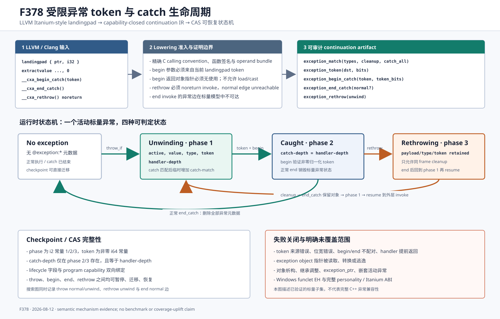

# F378：受限异常 token 与可恢复 catch 生命周期

- 日期：2026-08-12
- LLVM lowering：`compiler/ContinuationLowering.cpp`
- 执行器：`util/live_continuation.py`
- 搜索图：`util/live_state_search.py`
- 产物审计：`util/check_live_continuation_lowering.py`
- 测试：`test/live_continuation_lowering.ll`、`test/test_live_exception_lifecycle.py`
- 能力：`bounded-exception-catch-lifecycle`
- 成熟度：I/T/E-mechanism；Itanium-style、单活动标量异常子集，不等价于完整 C++ ABI

## 1. 问题与实现边界

F375 能逐 frame 保存和恢复 cleanup-only unwind，F376 能用稳定 selector 做精确 typeinfo identity
匹配，但二者把“正在传播”和“已经被 catch 接管”编码为同一个 active 状态。原实现也拒绝
`extractvalue landingpad, 0`，因而无法表示 exception structure token，不能验证
`__cxa_begin_catch`、`__cxa_end_catch` 和重抛之间的生命周期次序。

LLVM 的异常处理文档说明，Itanium-style `landingpad` 产生 exception structure reference 与 selector；
catch 正文由 `__cxa_begin_catch`/`__cxa_end_catch` 包围，重抛通过 `__cxa_rethrow` 后继续 unwind。
Itanium C++ ABI 进一步规定 begin 增加 handler count 并把异常放入 caught stack，end 减少计数并在最后一个
非重抛 handler 退出时销毁对象。参考：[LLVM Exception Handling](https://llvm.org/docs/ExceptionHandling.html)、
[Itanium C++ ABI: Exception Handling](https://itanium-cxx-abi.github.io/cxx-abi/abi-eh.html)。

F378 没有伪造平台 exception header 或对象地址，而是实现一个可证明的**单活动标量异常**子集：异常仍由
`__symcc_continuation_throw[_typed]_if` 提供 1–64 bit payload；landingpad index 0 只产生不可解引用的
provenance token；begin 的返回值必须无使用。由此可以执行 catch-all、精确类型但不读取 catch 参数的
Clang 优化后控制流，以及 begin/end/rethrow 的暂停恢复，同时对对象读取、析构和继承调整失败关闭。

## 2. LLVM lowering 的精确准入

新增识别的 ABI 入口为 `__cxa_begin_catch(ptr) -> ptr`、`__cxa_end_catch() -> void` 和
`__cxa_rethrow() -> void`。它们必须是 direct external declaration、C calling convention、非 varargs、
无 operand bundle 且声明/调用签名完全一致；begin 的声明、调用、参数和返回值均须使用默认 address
space。额外条件如下：

1. `__cxa_begin_catch` 必须是可证明 nounwind 的普通 call；唯一参数经 pointer-cast stripping 后必须是
   当前 landingpad 的 index-0 `extractvalue`；该 extract 只能被这一次 begin 消费；begin 返回的对象
   pointer 必须无使用。
2. `__cxa_rethrow` 必须带 `noreturn` 语义并以 invoke 表示；normal destination 的 terminator 必须是
   `unreachable`。lowering 仅保留 unwind edge。
3. `__cxa_end_catch` 可为 call，也可为 invoke。由于受信异常源只有无析构器的标量 payload，end 在该
   子集内是 total operation；invoke 的异常/terminate edge 从 continuation 可达图中删除，normal edge
   显式保存在 artifact 中。
4. landingpad index 0 仅在上述 begin provenance 成立时降为 `exception_token`；任何 `load`、
   `ptrtoint`、store、PHI、返回或多消费者都会使整个函数拒绝，不能把 token 当成对象 pointer。
5. artifact 只有实际出现生命周期操作时才声明 `bounded-exception-catch-lifecycle`；该能力依赖
   `bounded-cleanup-exception-unwind`，运行时再次独立校验，不能只信任 compiler 标志。

lowering 产生四个新操作：

| 操作 | 语义 | 关键字段 |
| --- | --- | --- |
| `exception_token` | 暴露当前 matched catch 的不可解引用 token | `dst`, `bits` |
| `exception_begin_catch` | 验证 token 并从 unwinding 进入 caught | `token`, `token_bits` |
| `exception_end_catch` | 正常销毁，或重抛 cleanup 后恢复传播 | 可选 `normal` |
| `exception_rethrow` | 标记重抛并进入同 frame cleanup | `unwind` |

## 3. 运行时状态机与执行次序

F378 为 checkpoint 增加 `@exception:phase`、`@exception:token`、`@exception:catch-match` 和
`@exception:catch-depth`。phase 是 i2 常量：1 为 unwinding，2 为 caught，3 为 rethrowing。

### 3.1 正常 catch

执行次序固定为：

1. `throw_if` 的 throw 分支写入 active、payload、可选 type、稳定 site token、phase=1 与当前 depth；
2. cleanup 可执行后用 `throw`/resume 逐 frame 查找 caller invoke 的 unwind target；
3. `exception_match` 先判断 catch clause；只有 type/catch-all 真正匹配时才写入 `catch-match=1`，单纯
   cleanup 不获得 begin 权限；
4. `exception_token` 要求 phase=1、catch-match=1 且当前 depth 等于 handler-depth；token 按目标 pointer
   width 截断，截断为零时规范化为 1，避免与 null 混淆；
5. `exception_begin_catch` 精确比较 token 与位宽，设置 phase=2、catch-depth=handler-depth，并消费
   catch-match；
6. handler 可调用其他内部函数，catch-depth 保持指向拥有 handler 的 frame；
7. 正常 `exception_end_catch` 删除所有 `@exception:*` 元数据；之后 handler 才能 return/halt。

### 3.2 重抛

`exception_rethrow` 只接受 phase=2 且当前 frame 等于 catch-depth 的状态，转换为 phase=3 并跳到 invoke
的 cleanup landingpad。phase=3 只允许同 frame cleanup，禁止重新进入该 frame 的 catch clause，以免在
未实现 handler-count stack 时伪造嵌套 catch。cleanup 中的 `exception_end_catch` 保留 payload、type、
token，删除 catch-depth 并回到 phase=1；随后的 `throw` 才能弹出当前 frame，转到外层 invoke handler。

正常 end 与重抛 end 的差异是本实现最重要的不变量：前者销毁标量异常状态，后者保留同一异常身份继续
传播。handler 未执行 end 就 return，或 phase=3 未先 end 就 resume，均立即报错，而不是隐式修复。

## 4. Checkpoint、迁移与搜索图

每次 commit 仍通过 `LiveStateStore` 的 content-addressed symbolic store 保存状态。恢复时先检查字段组合：

- active 缺失时任何生命周期字段都是 orphan；
- active 存在时 phase/token 必须同时存在，且与 program capability 双向一致；
- phase 只能为 1/2/3，token 必须是非零 i64 常量；
- catch-match 只允许出现在 phase=1；catch-depth 只允许出现在 phase=2/3；
- catch-depth 必须是有效 i64 frame depth，并与 handler-depth 相同；
- payload 仍为 1–64 bit expression，type 若存在仍必须是非零 i32 常量。

因此 unwinding、matched-before-begin、caught、rethrowing 和 rethrow-cleanup 后五个位置都可以安全暂停。
`LiveProgramGraph` 同步加入 `throw_if.normal/unwind`、`exception_rethrow.unwind` 与带 normal 的
`exception_end_catch` 控制边，避免新操作执行正确但调度距离图漏边。

## 5. 多轮 review 与修复

1. **活动异常与 caught 状态混淆**：引入三相状态机，旧 artifact 不声明新能力时继续使用 F375/F376 的
   handler-return 隐式清理，避免无版本迁移回归。
2. **同名函数被过度信任**：加入 calling convention、签名、bundle、nounwind/noreturn 与 token
   provenance 约束；错误返回值使用被 lowering 直接拒绝。
3. **checkpoint 只验证字段自身**：新增 state 与 program capability 双向绑定，伪造 legacy active state
   不能进入生命周期 program。
4. **宽松 operand schema**：begin token 改为精确键集合，拒绝 bool、`var+const` 双义对象、空变量和
   常量位宽错配。
5. **32 位截断为 null**：对目标 pointer width 做非零规范化，并在 token 产生与 begin 比较两端使用同一
   规则。
6. **搜索图漏边**：补齐 throw、rethrow 和 end normal 边，并以邻接集合回归验证。
7. **review 修复本身的字段误放**：一次补丁曾把 `doesNotReturn()` 条件错误放在 end helper；LLVM
   rethrow 集成测试立即暴露为 external-call rejection，随后移至 rethrow helper，并在 LLVM 17/18 重建。
8. **Clang 风格 end invoke 未覆盖**：测试改为 end invoke + normal resume + pruned terminate landingpad，
   验证 lowering、可达图和运行时 normal transfer 的完整链路。

## 6. 验证结果与结论边界

定向测试覆盖：正常 begin/end 后状态销毁、caught checkpoint 恢复、内层重抛到外层、capability 依赖与
空声明、错误/歧义/窄位宽 token、缺失 begin/end、未完成 handler 返回、cleanup 冒充 catch、伪造 phase
组合、搜索图边，以及 LLVM 对对象 pointer 物化的拒绝。LLVM 集成同时执行 false 正常路径与 symbolic
throw 路径，并审计 artifact 是否包含全部生命周期操作。

最终可复现结果见
[`evidence/f378-exception-catch-lifecycle-2026-08-12/`](../evidence/f378-exception-catch-lifecycle-2026-08-12/)。
本项证明的是实现存在、状态转换和失败关闭语义；它没有独立 benchmark，因此不报告 throughput、coverage、
求解速度或漏洞发现提升。新增能力扩大了可保真 continuation 化的异常控制流子集，但实际覆盖收益仍需后续
公开 benchmark 的多重复对照实验。

## 7. 仍未实现的异常语义

- `__cxa_allocate_exception`、`__cxa_throw`、exception header、对象内存和 catch 参数 load；
- 对象析构、handler reference count、caught-exception stack、`exception_ptr` 与 foreign exception；
- C++ RTTI inheritance、multiple inheritance adjusted pointer 和 personality phase-1 search；
- 同时活动的嵌套异常，以及 cleanup 抛出新异常所要求的 terminate 语义；
- Windows `catchswitch`/`catchpad`/`cleanuppad` funclet 模型；
- filter clause 和完整 Itanium/ARM EH ABI 差分。

下一步应先实现带对象所有权证书的 bounded exception arena，再用 Clang 生成的 exact-type、catch-all、
reference catch、destructor、nested rethrow 语料与本机执行做逐事件差分；在此之前不能把 F378 描述为
“完整 C++ 异常支持”。
