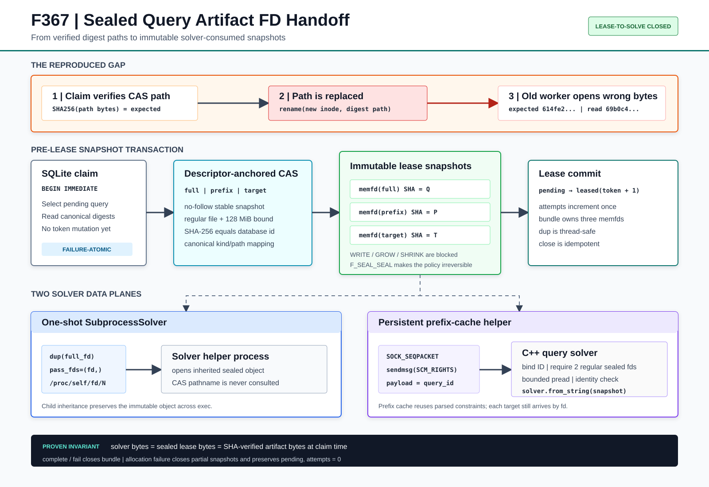

# F367：Sealed Query Artifact FD Handoff 与 Lease-to-Solve 完整性闭环

> 日期：2026-08-11  
> 状态：实现完成，本地能力闭合门禁与真实 helper 回归通过  
> 范围：QueryStore worker lease、一次性 solver、持久化 prefix-cache solver 的 SMT2 数据面



## 1. 研究背景

F366 已把三个 SMT2 artifact 接入 descriptor-anchored CAS，并要求 query、prefix、target 在 lease token 提交前通过
普通文件、稳定身份、SHA-256 和规范路径验证。该机制解决了“摘要名称不等于内容证明”和“失败后错误消耗
attempt”的问题，但 `WorkLease` 仍只保存路径：worker 在验证完成后把路径交给子进程，solver 再执行一次独立
`open()`。因此，验证和实际消费之间仍有 pathname TOCTOU：同一摘要路径在这两个时刻之间被 `rename()`替换时，
数据库和 lease 标识旧公式，solver 却可能消费新 inode 的字节。

这类错误比普通 I/O 失败更危险。solver 可以正常返回 SAT、UNSAT 或 UNKNOWN，结果结构完全合法，却对应错误公式；
错误结果随后可能进入 prefix cache、UNSAT subset pruning、候选输入物化和覆盖反馈。F367 的目标不是继续缩短竞态
窗口，而是让“领取时验证的对象”和“solver 实际读取的对象”成为同一个不可变内核对象。

## 2. 可执行反例

生产 `QueryStore.claim()` 返回 lease 后，将 `lease.smt2_path` 原子语义替换为 `(assert false)`，再按旧的 path-only
worker 行为读取该路径。结果为：

| 观察项 | SHA-256 |
|---|---|
| 领取时验证的完整 SMT2 | `614fe277…9eb9c305` |
| worker 随后按路径读取 | `69b0c4d9…e922e3c4` |
| 是否消费错误对象 | `true` |

反例不依赖概率调度；替换发生在 claim 返回和 helper 启动之间，因而可确定重放。F367 证据驱动器保留了旧读取
路径作为 counterfactual，同时对新的一次性和持久化数据面执行同样的三路径替换。

## 3. 正确性目标与不变量

F367 建立六个可检查不变量：

1. **Claim-time content identity**：三个快照字节分别满足数据库记录的 full、prefix、target SHA-256；
2. **Immutability**：快照具备 `F_SEAL_WRITE | F_SEAL_GROW | F_SEAL_SHRINK | F_SEAL_SEAL`，创建后不能修改、
   扩缩或移除 seal；
3. **Object continuity**：solver 消费 lease 所持内核对象的副本，不重新解析 CAS pathname；
4. **Protocol binding**：持久化 helper 的 descriptor 消息与文本请求使用同一 `query_id`，拒绝错序或拼接；
5. **Failure atomicity**：任一摘要验证、memfd 创建、写入或加 seal 失败时，已创建 fd 全部关闭，查询保持
   `pending, attempts=0`；
6. **Bounded lifecycle**：`complete()`和 `fail()`幂等关闭 bundle；并行 portfolio 只获得 `dup()`，不会争用所有权。

核心关系为：

```text
solver bytes
    = sealed lease snapshot bytes
    = SHA-verified CAS bytes observed before lease commit
```

CAS 的公开路径随后如何变化，不再影响已领取任务的公式语义。

## 4. 方案设计

### 4.1 稳定读取后生成 sealed memfd

`claim()`在 `BEGIN IMMEDIATE` 内按 F366 的 canonical `(kind, digest, relative_path)`映射定位对象，并调用 CAS
`snapshot(retain_content=True)`。该读取使用 no-follow、descriptor-relative regular-file 快照，限制为 128 MiB，
结束前复核文件和目录身份。QueryStore 再显式比较 `snapshot.sha256 == digest`，而不是依赖 pathname 或缓存命中。

每个通过验证的字节串写入单独的 `memfd_create(MFD_CLOEXEC | MFD_ALLOW_SEALING)`对象；完成全写、`fsync`和
回读比较后，加入四个 seal：

```text
F_SEAL_WRITE   禁止任何写入
F_SEAL_GROW    禁止扩大对象
F_SEAL_SHRINK  禁止缩小对象
F_SEAL_SEAL    禁止继续修改 seal 集合
```

`F_GET_SEALS` 必须观察到完整位集，缺少 Linux memfd/seal 能力时 fail closed。三个对象都成功后才执行
`pending -> leased` 更新；第二个对象分配失败的故障注入证明第一个 fd 被关闭，SQLite 状态没有前进。

### 4.2 WorkLease 句柄所有权

`WorkLease` 新增不参与相等比较和 repr 的 `_SealedArtifactBundle`。bundle 使用锁保护三类角色映射：

```text
full   -> 一次性完整 SMT2
prefix -> 持久化 context 基础公式
target -> 单次 push/pop 的目标公式
```

solver 只能通过 `duplicate_artifacts()`取得非继承的 `dup`，不能转移或关闭原始所有权。`close()`是幂等操作，
`complete()`、`fail()`和析构兜底共同限制句柄生命周期。portfolio 中多个 solver 可以并发复制同一不可变对象；
关闭 lease bundle 不会撤销已经由子进程继承或经 `SCM_RIGHTS`传递的副本。

### 4.3 一次性 solver：exec-time fd inheritance

`SubprocessSolver` 对 `full` 描述符执行 `dup()`，通过 `subprocess.Popen(pass_fds=(fd,))`继承给 helper，并将参数
改为 `/proc/self/fd/<N>`。helper 即使仍使用传统“文件名”接口，解析的也是其 fd table 中已继承的 sealed memfd，
而不是 CAS 目录中的摘要路径。`Popen`失败、超时、取消和正常返回均在 `finally`关闭父进程副本。

生产 QueryStore lease 总是走 fd 分支。仅为已有单元测试和外部代码手工构造、且没有 bundle 的 `WorkLease`
保留原路径协议；该兼容分支不具备 F367 完整性保证，文档和证据均不把它计入生产闭环。

### 4.4 持久化 solver：SCM_RIGHTS 控制面

持久化 helper 在 QueryStore claim 之前已经启动，无法靠 `pass_fds`为每个新请求追加描述符。F367 为
`PersistentSubprocessSolver` 增加独立的 Unix `SOCK_SEQPACKET` channel：父子启动时继承 channel fd，每个请求将
prefix/target 两个 `dup`通过 `sendmsg(SCM_RIGHTS)`发送，并以 `query_id`作为数据报 payload。原有 tab-separated
协议只传两个无歧义 marker：

```text
@symcc-fd:prefix    @symcc-fd:target
```

采用 `SOCK_SEQPACKET`而不是字节流，保证一次请求的 descriptor 集和 request-id payload 保持消息边界；Python 侧
又使用 `_io_lock`串行化请求，使文本行与 fd 数据报具有一致顺序。

### 4.5 C++ helper 准入与解析

`symcc-query-solver --server`看到完整 marker 对后才调用 `recvmsg(MSG_CMSG_CLOEXEC)`，并依次检查：

1. 数据报未发生 payload/control truncation；
2. payload 与文本行 `request_id`逐字节一致；
3. ancillary data 恰好包含两个 `SCM_RIGHTS` fd；
4. 两者都是不超过 128 MiB 的 regular data；
5. `F_GET_SEALS`包含全部四个必需 seal；
6. `pread`完成有界读取，前后 device、inode、size 和 mtime 一致，内容不含 NUL。

prefix cache miss 时通过 `solver.from_string(prefix_snapshot)`建立 context；每次请求都用 target fd 执行
`from_string`后再 check-sat。cache hit 仍接收并关闭本请求的 prefix fd，从而保持协议一一对应；目标公式始终来自
本次 lease 的 sealed fd。异常路径由 RAII 关闭已经收到的 fd，malformed ancillary data 也不会泄漏已解析句柄。

## 5. 端到端执行次序

```text
1. BEGIN IMMEDIATE
2. select pending/expired query
3. stable-read full CAS object -> verify SHA -> create and seal full memfd
4. stable-read prefix object  -> verify SHA -> create and seal prefix memfd
5. stable-read target object  -> verify SHA -> create and seal target memfd
6. conditional lease token / owner / TTL / attempts update
7. COMMIT and return WorkLease(bundle)
8a. one-shot: dup(full) -> pass_fds -> helper opens /proc/self/fd/N
8b. persistent: dup(prefix,target) -> SCM_RIGHTS(query_id) -> recv/validate/pread
9. solver returns structured result
10. complete or fail closes bundle and applies fenced state transition
```

步骤 3-5 任一失败直接离开事务；已经创建的 memfd 在异常清理中关闭，步骤 6 不执行。步骤 8 以后 CAS path 的
rename、删除或内容替换只影响未来 claim，不影响当前 lease。

## 6. 实现范围

| 文件 | 实现 |
|---|---|
| `util/query_store.py` | stable CAS snapshot、sealed memfd、bundle ownership、pre-commit cleanup、一次性 `pass_fds`、持久化 socketpair/`SCM_RIGHTS` |
| `runtime/src/backends/qsym/query_solver.cpp` | descriptor marker、request-id binding、ancillary 准入、seal/type/size gate、bounded `pread`、`from_string` |
| `test/test_query_store.py` | 确定性路径替换、seal/write gate、部分分配回滚、一次性 helper、Python SCM receiver、关闭后拒绝 |
| `test/query_prefix_reuse.py` | 真实 C++ helper 在两轮路径替换下的 cache miss/hit 回归 |
| `docs/codex/evidence/f367-*` | 旧反例、新数据面、故障注入、真实构建/helper、lit、完整门禁和边界声明 |

pytest 测试仍保持 787 个规范 node ID；新断言扩展在原有 20 个 QueryStore 测试身份内。lit 的
`query_prefix_reuse.py`也保持原测试身份，只增强路径替换 oracle。

## 7. 实验与验证结果

### 7.1 可执行故障注入

| 场景 | 结果 |
|---|---|
| 旧 path-only consumer，claim 后替换 full path | 消费错误摘要 `69b0c4…`，反例成立 |
| sealed full/prefix/target，随后替换三个 CAS path | 三个 fd 摘要仍分别等于原期望摘要 |
| 对 full memfd 执行 `pwrite` | `EPERM(1)` |
| 观察 seal 位集 | 三个对象均为 `15`，完整四位存在 |
| 一次性 Python helper 按 argv 路径读取 | 读取 `614fe2…` sealed 对象，不读取被替换路径 |
| 持久化 Python receiver | 收到 2 个 fd、正确 marker、正确 query-id 和两个期望摘要 |
| 第二个 memfd 分配失败 | 第一个 fd 为 `EBADF`，查询保持 `pending, attempts=0` |
| bundle 关闭后再次 duplicate | 显式拒绝 `query artifact lease is closed` |

### 7.2 真实 C++ solver

本地以 C++17、`-Wall -Wextra -Werror`通过语法门禁，并重建 `symcc-query-solver`。对目标值 `0x41`的 SAT 查询，
在 claim 后把 full、prefix、target 三个 CAS pathname 全部替换为 `(assert false)`：

| 模式 | status | assignments |
|---|---|---|
| one-shot | `sat` | `{"0": 65}` |
| persistent | `sat` | `{"0": 65}` |

真实 prefix-cache lit 又连续求解两个具有相同 prefix 的 UNSAT 查询；每轮均在 helper 调用前替换全部路径，第一轮
`prefix_cache_hit=false`，第二轮仍为 `true`且结果正确。query/string 相关 10 个 lit 测试全部通过。

### 7.3 回归门禁

| 范围 | 结果 |
|---|---|
| QueryStore 定向 | 20 passed + 2 subtests（3.34 秒） |
| QueryStore + QF_BV + semantic proposals + distributed state | 227 passed + 20 subtests（29.32 秒） |
| query/string LLVM lit | 10 passed / 226 discovered，216 按 filter 排除（3.87 秒） |
| 规范 node ID 重建 | 787，清单字节完全相同 |
| 完整能力闭合门禁 | 787 passed + 127 subtests（114.93 秒） |
| 能力闭包 | 10 commands + 5 Python modules + libz3，零缺失 |
| 负面结果 | 0 fail / skip / xfail / xpass / deselection / collection error |

规范 node-id 集合摘要保持
`18596f8387a8df5af2a1ead7cc829e9c95c1bb9e699f26d916e0f1a0de833c00`。

## 8. 先进性与创新性

memfd、file sealing、`SCM_RIGHTS`和 Z3 `from_string`都是已有 Linux/POSIX/solver 能力，F367 不宣称发明这些原语。
本项目的技术贡献在于将它们组合成并行符号执行查询生命周期的可验证数据面：

1. **从路径完整性推进到对象连续性**：调度器验证、worker 传输和 solver 解析共享同一不可变对象链；
2. **数据面与控制面共同 fencing**：lease token 约束数据库状态，`query_id`绑定 descriptor 消息，二者分别防止
   stale completion 和跨请求 fd 拼接；
3. **兼顾一次性与长期 solver**：exec inheritance 和 `SCM_RIGHTS`覆盖两种完全不同的进程生命周期，而不是禁用
   prefix cache 来换取简单性；
4. **对 portfolio 友好的所有权模型**：原始 bundle 只负责生命周期，solver 获得独立 dup，允许并行竞速与取消；
5. **故障原子性跨越 SQLite 与内核资源**：不仅回滚行状态，还证明部分创建的匿名对象不会泄漏；
6. **公式身份可作为实验前提**：后续比较 solver、调度器或 cache 的性能时，可以排除“不同 worker 实际读取不同
   SMT2”这一隐藏混杂因素。

挑战性来自 SQLite transaction、descriptor-anchored CAS、匿名 shmem、fd table、exec inheritance、Unix ancillary
message、C++ RAII、Z3 parser 和 portfolio 线程生命周期的联合状态机。任何单层测试都不足以证明 lease-to-solve
闭环，因此本轮同时保留 Python 故障注入、真实 C++ helper、cache-hit lit 和完整项目门禁。

## 9. 性能解释

F367 优先选择强语义而非零复制。每次 claim 对三个 artifact 执行稳定读取、SHA-256、memfd 全写、`fsync`、seal 和
回读；持久化 C++ helper 又把 prefix/target 读入字符串交给 Z3。理论开销与三份 SMT2 总字节数线性相关，并延长
`BEGIN IMMEDIATE`持锁时间。收益是彻底移除正常并发 CAS replacement 对当前 solver 的影响，并保留 prefix cache。

本轮只报告正确性和回归时间，不把测试运行时当作生产吞吐基准。没有测量 claim p50/p95/p99、RSS/shmem、每秒
queries、solver wall time 或覆盖率，因此不提供性能提升百分比。后续可将 sealed snapshot 移出 SQLite 写锁：先在
读快照中准备，再用 digest/token 条件重新验证并提交，以减少持锁时间，但必须保留失败原子性证明。

## 10. 局限与有效性威胁

1. F367 明确依赖 Linux `memfd_create`、file seals、`/proc/self/fd`、Unix `SOCK_SEQPACKET`和 `SCM_RIGHTS`；非 Linux
   平台会 fail closed，尚未提供等价实现；
2. 手工构造且不含 sealed bundle 的兼容 `WorkLease`仍使用路径，不属于生产 QueryStore 保证；
3. 每个活动 lease 持有三个 memfd，尚未对 128 MiB 上限、大 worker 数和 shmem 压力进行资源实验；
4. SQLite 写锁覆盖稳定读取和快照创建，冷对象或大 SMT2 可能增加 claim tail latency；
5. C++ 子进程不重新计算 SHA-256；其信任链来自父进程摘要验证、memfd 回读和不可撤销 seal，当前威胁模型不包含
   已完全控制 coordinator 进程的攻击者；
6. F366 遗留的 unreachable CAS object GC、其他 query/result/generator/candidate 文件发布协议仍未在本轮处理；
7. 未执行 hosted CI、真实跨主机 MPI、NFS/Lustre/BeeGFS、vendored QSYM/PIN tracer、公开 benchmark、LAVA-M 或覆盖
   campaign；
8. 本轮没有性能、覆盖率或漏洞发现提升结论。

## 11. 证据与复现

- 可执行驱动：`docs/codex/evidence/f367-sealed-query-artifact-fd-handoff-2026-08-11/run_sealed_query_fd_checks.py`；
- 结构化反例与生产结果：同目录 `adversarial-cases.json` / `.log`；
- 真实 C++ 构建和求解：`native-helper.log`；
- 真实 prefix-cache / query-string 回归：`lit-tests.log`；
- Python 回归：`directed-tests.log`、`affected-tests.log`；
- 规范清单和完整门禁：`inventory-rebuild.log`、`full-gate.json`、`full-gate.log`；
- 架构图：`docs/codex/diagrams/sealed-query-artifact-fd-handoff-2026-08-11.svg`；
- 完整性清单：证据目录与 `docs/codex`各自的 `SHA256SUMS.txt`。

## 12. 后续工作

1. 对 SQLite 可达 artifact 集合和 CAS namespace 实现 report-only mark phase，再加入 grace-period sweep；
2. 建立 claim 冷/热、artifact size、worker 数、portfolio 宽度的 factorial microbenchmark，报告 p50/p95/p99 与 RSS；
3. 研究“锁外 sealed prepare + 锁内 digest/token revalidation”的两阶段 claim，降低长事务争用；
4. 将 verified immutable handoff 扩展到 query/result/generator/candidate 等其他 worker 消费对象；
5. 在真实多节点共享文件系统和公开符号执行 benchmark 上验证端到端可移植性与吞吐影响。

## 13. 结论

F367 关闭了 F366 明确保留的最后一个 lease-to-solve pathname 窗口：QueryStore 不再把“已经验证过的路径”当作
公式，而是在 lease commit 前生成三个摘要匹配、不可修改且不可解除 seal 的匿名内核对象；一次性 helper 通过
exec fd inheritance 消费 full 对象，持久化 helper 通过 query-id-bound `SCM_RIGHTS`消费 prefix/target 对象。确定性
路径替换、部分分配失败、Python receiver、真实 C++ solver、prefix cache hit 和 787 项完整门禁共同证明本轮的
正确性边界。性能、跨主机和公开 benchmark 仍保持为未验证事项。
