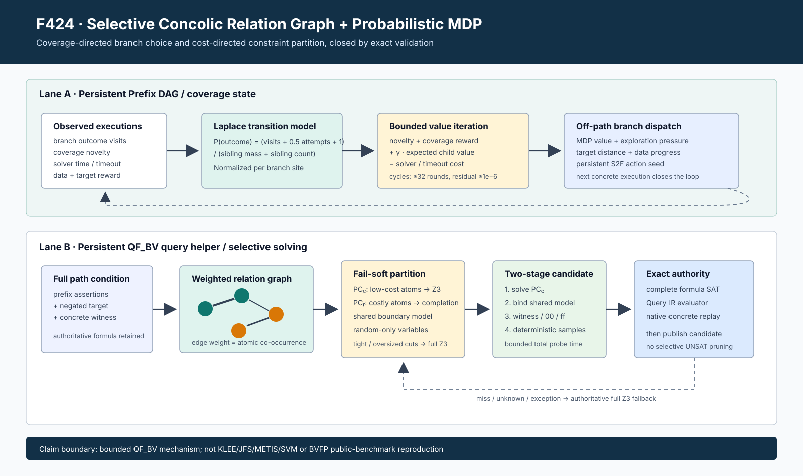

# F424：Selective Concolic Relation Graph 与概率 MDP

- 日期：2026-08-17
- 功能编号：F424
- 状态：I/T/E-mechanism；公开目标 R 级实验未完成
- 主要实现：`runtime/src/backends/qsym/query_solver.cpp`、`util/hybrid_feedback.py`、
  `util/query_store.py`

## 1. 研究问题

[FM 2026 Selective Concolic Testing](https://link.springer.com/chapter/10.1007/978-3-032-26220-2_14)
把“哪些输入变量交给随机生成、哪些交给 SMT”表述为带成本 MDP 的策略问题。论文的实用近似包含
两部分：一是用运行路径更新程序转移概率，以未覆盖语句收益选择 off-path branch；二是建立变量共现
关系图，把 path condition 分为随机侧 `PC_r` 与 SMT 侧 `PC_c`，并用 timeout predictor 判断子约束
应由哪类求解器处理。

本项目在 F188/F189 已有 disconnected-byte selective probe 和 contextual bandit，但仍有三个实质缺口：

1. target dependency closure 只能剥离完全不相连的 byte，无法表达 `PC_r` 与 `PC_c` 共享边界变量；
2. helper 直接在完整公式上固定 witness，没有先求 `PC_c` 再把共享模型传给随机侧；
3. Prefix DAG 的 `mdp_value` 是单次启发式 backup，没有论文式 Laplace 转移概率和循环图收敛判据。

F424 关闭这三个**当前 QF_BV 支持域内**的机制缺口。它没有引入未经验证的 UNSAT 剪枝，也没有把
静态 operator-risk classifier 冒充论文的离线 SVM。

## 2. 生产执行流程

### 2.1 概率分支选择

`PrefixDAG` 对同一 `(parent_id, site_id)` 下的候选结果维护访问数。对结果 `i` 使用 Laplace 平滑：

\[
P_i=\frac{visits_i+0.5\,attempts_i+1}
          {\sum_j(visits_j+0.5\,attempts_j)+|siblings|}.
\]

未访问的 active/open frontier 获得 1.0 novelty，已尝试但仍 active 的 frontier 获得 0.35；实际
coverage reward、data/backsolver/path-cover reward、directed feasibility 和 solver cost 共同进入
Bellman 更新。对每个 branch site 的后继分布分别求期望，多个后继 site 取最大可达期望，避免把顺序
路径误当成互斥概率相加。循环 DAG 使用同步 value iteration，默认最多 32 轮、残差阈值 `1e-6`；
因此循环不会依赖节点遍历顺序，也不会递归溢出。

持久状态保存每个节点的 `mdp_value`、`mdp_cost`、Laplace 概率和 novelty reward；恢复后重新计算，
而不是信任陈旧派生值。`selective_mdp_last_iterations/residual/transition_groups` 提供收敛审计。

### 2.2 加权关系图与 `PC_r/PC_c`

query helper 对每个 Z3 assertion 独立收集 8-bit input offsets 与 operator Bag-of-Words 的高成本节点：
`bvmul`、有/无符号 div/rem 和符号 shift。变量 `u,v` 的边权为共同出现于原子 assertion 的次数：

\[
w(u,v)=|\{C_k\mid u\in C_k\land v\in C_k\}|.
\]

当前分类器把达到 `SYMCC_SELECTIVE_QUERY_GRAPH_MIN_COSTLY` 的原子分到 `PC_r`，其余原子分到
`PC_c`。同时属于两侧的变量是 shared boundary；只属于 `PC_r` 的变量是 random-only。图切分只有在
两侧非空、random-only 数量满足 fixed/symbolic 预算、witness 覆盖全部随机变量且 cut weight 不超过
总边权的 75% 时才接纳。全图最多 65,536 条 assertion、4,096 个变量，单 assertion 最多 256 个
变量，并限制为 262,144 条唯一边和 1,048,576 次pair observation；超限直接回退，阻止重复共现或
宽原子使优化器自身产生二次爆炸。

### 2.3 两阶段求解与精确裁决

接纳后的执行次序固定如下：

1. 新建独立 QF_BV solver，只加入 `PC_c`，预算最多为 selective timeout 的三分之一；
2. `PC_c=SAT` 时提取其模型，shared boundary 和 SMT-only byte 作为确定赋值；
3. random-only byte 依次尝试 witness、全零、全 `0xff` 和 query-ID 确定性随机 completion；
4. 每个 completion 都在**原完整 prefix+target solver**的新 frame 中加入 `PC_c` 模型与随机赋值；
5. 只有完整 solver 返回 SAT 才发布 `z3-selective-graph` 模型；随后 QueryStore 仍执行 Query IR
   evaluator，最终测试输入还必须经过原程序 concrete replay；
6. `PC_c` UNSAT/UNKNOWN、completion miss、异常或预算耗尽均回到原 full Z3。子查询 UNSAT 从不进入
   UNSAT cache，也不造成路径剪枝。

这里的“异常”包括partial solver构造、参数设置、`check`和model extraction抛出的Z3或标准异常；
它们在子阶段被捕获并标记为`partial_status=unknown`，不能越过fallback边界把完整查询误报为
`unknown`。QueryStore还反向要求任何`selective_query_hit=true`的graph telemetry必须归属于
`solver=z3-selective-graph`。

这与论文“先解 `PC_c`、再随机求 `PC_r`、合并解”的数据流相同，但本项目以完整公式 SAT recheck
换取更强的 fail-soft 正确性。代价是机制可能少获得一部分论文实现的速度收益。

## 3. 协议与可观测性

结果新增以下严格有界字段：

| 字段 | 含义 |
| --- | --- |
| `selective_query_partition_mode` | `none` 或 `relation-graph-v1` |
| `relation_edges/cut_weight` | 关系图规模与跨区耦合权重 |
| `smt_assertions/random_assertions` | `PC_c/PC_r` 原子数 |
| `shared_variables` | 两侧共享边界变量数 |
| `partial_elapsed_us/partial_status` | `PC_c` 子求解成本与状态 |

QueryStore 拒绝未知 mode/status、负数或超界计数、`none` 携带图指标、无 assertion 的图分区，以及
缺失 `hit=true`/`partial_status=sat` 的 `z3-selective-graph` 结果。统计面增加 graph attempts、graph hits
与 partial unknown；这些是机制计数，不是 coverage 提升。

## 4. 测试与独立 oracle

定向集覆盖：

- 真实 persistent query helper 的 `PC_c` 模型传递、shared variable 与完整 SAT recheck；
- 错误 random completion 只能形成 miss，full Z3 仍找到 SAT，不能伪造 UNSAT；
- QueryStore telemetry 类型、范围和跨字段一致性反例；
- Laplace 概率归一化、未访问 frontier novelty、循环图 value-iteration 收敛与持久恢复；
- self-config provider、冻结 schema 与 query-service 生命周期路由。

独立四位源级 oracle 穷举 65,536 个 `(x,y,z,w)` 赋值。约束

\[
y=w+2,\quad y=z,\quad z=2w,\quad x^3\bmod16>y
\]

有 10 个完整模型、唯一 `PC_c` 模型 `(y,z,w)=(4,4,2)`。16 个 witness 配置经有界 completion 全部
得到完整公式真模型，`false_sat=0`、`false_unsat=0`。关系图为 4 条边、cut weight 1、1 个 shared
变量和 1 个 random-only 变量。独立解析式还验证两节点循环的固定点：

\[
V=0.44+0.22\times0.82V=0.5368472425573451.
\]

迭代值为 `0.5368472425572233`，17 轮后残差 `5.54e-13`。完整 Python、LLVM 17/18 与交付门禁的
最终数字记录在 F424 evidence 目录。定向Python为2/2；选择性求解、Prefix DAG、QueryStore和
self-config关联集合为135 passed加25 subtests；完整能力闭合Python门禁为1,130 passed加253
subtests，零skip/xfail/xpass/deselection与node-ID漂移。LLVM 18全量为305 passed加1个预期
unsupported，LLVM 17为304 passed加2个预期unsupported，两套均发现306项且无其他状态；上述
均为正确性/回归证据，不是性能声明。

## 5. 配置

- `SYMCC_SELECTIVE_QUERY_GRAPH_PARTITION=0|1`：默认 1，启用关系图两阶段求解；
- `SYMCC_SELECTIVE_QUERY_GRAPH_MIN_COSTLY=N`：默认 1，范围 1--64；
- `SYMCC_SELECTIVE_MDP_ITERATIONS=N`：默认 32，范围 1--128；
- `SYMCC_SELECTIVE_MDP_TOLERANCE=X`：默认 `1e-6`，有效范围 `1e-12--0.1`。

原 F188/F189 的 fixed/symbolic/completion/timeout/learning 参数继续控制总预算。关闭 graph partition 时
恢复 disconnected dependency-closure 路径；关闭 dynamic coloration 时不运行 MDP 更新。

## 6. 科研声明边界

F424 可以声明：当前 persistent QF_BV helper 已具有共享边界的关系图 `PC_r/PC_c` 两阶段执行，所有
候选由完整公式裁决；Prefix DAG 已具有 Laplace 转移估计和对循环收敛的 cost-aware value iteration。

F424 不能声明：

- 已复现 FM 2026 的 KLEE/JFS/METIS/LIBSVM 实现；
- 已支持论文核心评价域的 QF_BVFP、535 个 GSL/Cephes 函数或 41 个 FDLIBM 函数；
- operator-risk 阈值等价于论文 91.1% 准确率的离线 SVM；
- 当前有限 oracle 证明论文报告的 36.89% coverage 或 12.08x time-to-coverage 提升；
- 当前机制已形成不少于 20 次等 CPU 的确认性实验。

下一步仍需完成 BVFP/JFS backend、可版本化 predictor artifact、公开目标 branch-selection/solver 消融；
在此之前 W10 的 R 级状态保持未完成。
