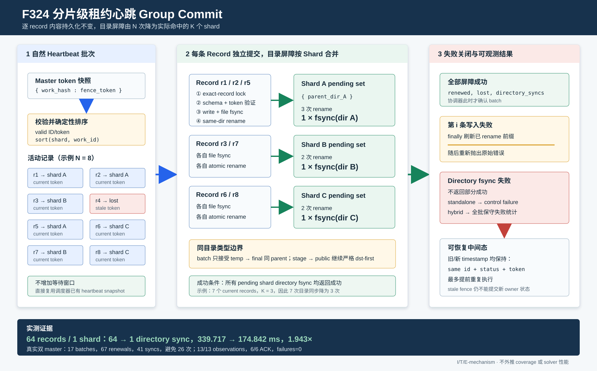

# F324：分片级租约心跳 Group Commit

- 日期：2026-08-07
- 功能编号：F324
- 成熟度：I/T/E-mechanism
- 代码范围：共享租约持久化、standalone MPI、hybrid MPI/AFL协调器、target-group续租
- 证据范围：9项定向故障/同步次数测试、636项完整Python回归、64-record微基准、真实双master Open MPI

## 1. 研究问题

F323为每次关键record替换增加了严格目录屏障：临时文件先完成file `fsync`，同目录
`rename`后再对parent directory执行`fsync`。这关闭了掉电后final name丢失的窗口，但本机
overlayfs实测每次directory barrier增加约2.88 ms中位成本。原standalone heartbeat流程为：

```text
for each active lease:
    lock(record)
    write + fsync(temp)
    rename(temp, record)
    fsync(record shard directory)
    unlock(record)
```

当一个master同时持有`N`条活动lease时，每个heartbeat周期执行`N`次目录同步；即使多条record
都位于同一shard目录，这些屏障仍重复刷新相同目录。默认work lease TTL为
`max(120, 4 * target_timeout)`，续期间隔为`max(0.1, min(30, TTL/3))`，因此默认间隔最长是30秒，
而不是40秒。长任务、多worker或高延迟共享存储会持续累积该固定成本。

F324要回答的是：**能否保留F323“每条内容先落盘、final entry未持久化就不确认成功”的语义，
同时把同一自然heartbeat批次内的目录同步次数从record数降为实际受影响的shard数？**

## 2. 技术来源与差异

数据库中的group commit会让多个已到达提交点的事务共享一次持久化flush。PostgreSQL官方文档
说明，一次WAL flush可以覆盖多个并发commit；它也明确提醒人为`commit_delay`可能增加延迟，
设置过高反而降低总吞吐。
[PostgreSQL WAL Configuration](https://www.postgresql.org/docs/current/wal-configuration.html)

RocksDB官方架构文档同样记录了内部batch-commit：多个事务可以通过一次`fsync`提交到日志。
[RocksDB Overview](https://github.com/facebook/rocksdb/wiki/RocksDB-Overview)

F324借鉴的是“让一个持久化屏障覆盖此前已完成的多个更新”，但并不复制数据库事务：

| 维度 | PostgreSQL/RocksDB常见group commit | F324 |
| --- | --- | --- |
| 批次对象 | WAL/log中的多个事务 | 同一heartbeat周期内的lease JSON record |
| 共享屏障 | WAL file flush | shard directory `fsync` |
| 数据写入 | 先写共享日志 | 每条record仍独立file `fsync`和atomic rename |
| 等待策略 | 可等待更多并发提交者 | 不等待兄弟任务，直接使用调度器已有heartbeat快照 |
| 原子性 | 数据库定义的事务/WAL恢复 | 不提供多record原子可见，只提供逐record fencing和批次失败关闭 |

Linux `fsync(2)`指出，file `fsync`不保证containing-directory entry已经持久；目录本身仍需显式
同步。[Linux fsync(2)](https://man7.org/linux/man-pages/man2/fsync.2.html) 因此F324不能简单删除
directory barrier，只能改变屏障的**覆盖范围和批次边界**。

## 3. 核心设计



### 3.1 自然批次边界

`heartbeat_all()`本来就会在一个调度周期中续期当前master持有的全部token。F324对该快照执行
一次`heartbeat_many()`，没有新增timer、`commit_delay`或“等待更多记录”的尾延迟：

1. 复制当前`work_hash -> token`映射，避免循环期间字典变化；
2. 校验work ID/token，并按`(shard, work_id)`确定性排序；
3. 每条record仍单独获取exact-work lock；
4. 在锁内重读record，验证schema、authoritative ID、状态和current token；
5. 写临时JSON，flush并执行file `fsync`；
6. 同目录atomic rename到final record，只登记该shard目录为pending；
7. 所有可续租record处理后，每个pending shard只执行一次directory `fsync`；
8. 全部目录屏障成功后才返回`LeaseHeartbeatBatch`。

返回值明确区分：

- `renewed`：current token已写入同一批次且全部目录屏障成功；
- `lost`：ID/token非法、record不合法、状态已完成或token已被替换；
- `directory_syncs`：本批次实际完成的唯一目录屏障数。

### 3.2 两层持久化不变式

对record集合`R`和实际命中的shard集合`S(R)`，成功路径为：

```text
for r in sorted(R, key=(shard, id)):
    lock(r)
    validate(current token)
    write temp(r)
    fsync(temp(r))                 # 每条内容独立持久
    rename(temp(r), final(r))      # 每条可见性独立原子
    pending_dirs.add(shard(r))
    unlock(r)

for d in pending_dirs:
    fsync(d)                       # 每个shard一次名称持久化

return success
```

一次directory `fsync(d)`覆盖在它之前对目录`d`执行的全部record-entry更新。因此目录屏障数由
`N = |R|`降为`K = |S(R)|`，但file `fsync`数仍为`N`。该选择没有把JSON内容重新变成易失数据。

### 3.3 同目录类型约束

内部`_DirectorySyncBatch.replace()`只接受source和destination parent完全相同的替换，并在
执行`os.replace`之前拒绝跨目录输入。原因是多个交叉rename可能形成目录顺序环；用一个去重集合
无法普遍保持F323对每条跨目录移动要求的“destination先于source”屏障顺序。

因此：

- lease temp和final位于同一shard，可安全进入batch；
- `stage/H -> public/H`继续使用`durable_replace()`，严格执行public-dir先、staging-dir后；
- 测试验证跨目录误用在rename发生前即失败，原文件仍留在source。

## 4. 失败语义

### 4.1 stale token

stale token只进入`lost`，不会改写record，也不会增加目录同步。standalone协调器仅在批次成功返回后
删除相应本地token，因此不会把I/O错误误分类为ownership丢失。

### 4.2 中途record写失败

若第`i`条record在open/write/file-fsync/rename阶段失败，前`i-1`条可能已经rename。实现使用
`finally`执行pending-directory flush，再重新抛出原始错误：

```text
r1 rename --+
r2 rename --+--> fsync(shard) --> raise r3 write error
r3 ERROR ----+
```

这保证调用方收到失败时，已经公开的前缀不会因为“后续record失败”而跳过其原本应有的目录屏障。

### 4.3 目录屏障失败

directory `fsync`失败时整个batch抛错，不产生成功结果。rename后的新timestamp可能在当前命名空间
可见，但持久性未知；重启后可看到旧或新record。两者具有同一work ID、status和fencing token，
差别只是lease expiry时间：旧版本可能导致额外的fenced重复执行，但不会授权stale token提交新
owner状态。

standalone MPI把该错误升级为control failure，并累计`heartbeat_failures`；hybrid MPI/AFL入口
把整个work batch保守计为续租失败并输出统计，不把失败批次中的任意成员宣称为成功。

### 4.4 target-group续租

`FencedTargetLeaseTable.heartbeat_group()`也使用同一目录批次。它仍先按digest顺序持有整个target
group的所有锁，验证全组token一致后再写；成功时每个命中shard只同步一次。若任一写或目录屏障
失败，保持原F312语义：在仍持有全组锁时best-effort恢复旧timestamp，并返回`False`。

本轮同时修复两项相关正确性问题：

1. `claim_group()`和`heartbeat_group()`统一使用有限、非负时间验证，拒绝NaN/Infinity；
2. 已存在但schema/ID/token/timestamp不合法的target record不能被当作空闲状态覆盖。

## 5. 接入范围与可观测性

### 5.1 Standalone MPI

`_SharedWorkCoordinator.heartbeat_all()`从逐条`heartbeat()`改为单次`heartbeat_many()`，并记录：

- `heartbeat_batches`；
- `heartbeat_renewals`；
- `heartbeat_directory_syncs`；
- `heartbeat_failures`；
- `directory_syncs_avoided = renewals - directory_syncs`。

非空统计在master有界关闭后输出，便于真实MPI实验确认优化是否实际进入热路径。

### 5.2 Hybrid MPI/AFL

`_heartbeat_fenced_leases()`检测共享work table的批量API，将各worker的active work lease合并为
一次调用；兼容只实现scalar `heartbeat()`的旧/测试对象。batch抛出OSError时，所有成员失败关闭，
target lease仍独立处理，避免伪造部分成功。

### 5.3 Target-group

一个action seed可能包含primary branch及多个`solve/sample`目标。其续租原来每个target record
执行一次目录屏障；现在仍保持全组锁和统一expiry point，但按实际target-record shard合并屏障。

## 6. 正确性不变量

| 编号 | 不变量 | 实现约束 |
| --- | --- | --- |
| G1 | 每条record内容先于其final name屏障 | temp write/flush/file-fsync在rename之前 |
| G2 | 每条record可见性切换仍为原子 | 每条使用独立same-directory `os.replace` |
| G3 | 成功batch覆盖所有已rename目录 | pending shard集合全部fsync后才返回 |
| G4 | 同shard只执行一个目录屏障 | ordered set按绝对parent path去重 |
| G5 | 后续写失败不遗失已发布前缀屏障 | `finally`无条件flush pending目录 |
| G6 | barrier失败不返回部分成功 | OSError传播；无`LeaseHeartbeatBatch`结果 |
| G7 | stale token不产生写或屏障 | 锁内current-token验证先于写入 |
| G8 | 跨目录发布不进入batch | replace前强制source parent等于destination parent |
| G9 | target组保持统一token/expiry语义 | 全组锁、全组预验证、失败时旧record回写 |

锁在batch末尾目录屏障前逐条释放。另一协调器若随后修改同一record，它自己的耐久写或本批次稍后的
shard fsync都会覆盖此前目录更新；返回成功只说明本批次rename已经被目录屏障覆盖，不承诺record在
返回后不会立刻被另一个合法current operation改变。这与原scalar heartbeat的并发语义一致。

## 7. 成本模型

令：

- `N`为本批次成功续租record数；
- `K`为这些record命中的唯一shard数，`1 <= K <= min(N, shard_count)`；
- `F`为每条temp file write + file fsync成本；
- `R`为每条rename/锁/JSON成本；
- `D`为一次directory fsync成本。

则近似为：

```text
scalar: N * (F + R + D)
batch:  N * (F + R) + K * D
saving: (N - K) * D
```

目录系统调用理论减少比例为`1 - K/N`。收益上界取决于shard聚集度和底层directory flush成本；
file fsync仍占主要成本时，墙钟加速不会等于目录调用减少倍数。

## 8. 测试与实验

原始日志、可执行微基准和SHA-256清单位于
[`F324 evidence`](../evidence/f324-shard-heartbeat-group-commit-2026-08-07/)。

### 8.1 自动化

| 门禁 | 结果 |
| --- | --- |
| `py_compile` | 通过 |
| Ruff | 通过 |
| `git diff --check` | 通过 |
| F324定向测试 | 9 passed，0.67秒 |
| distributed state | 102/102 |
| AFL profile orchestration | 55/55 |
| MPI lifecycle | 22/22 |
| 完整`pytest -q test` | 636 passed + 38 subtests，91.15秒 |

定向测试覆盖：同/跨shard同步次数、stale token、后续record失败后的前缀flush、目录屏障失败、
跨目录batch拒绝、target-group分片同步、非有限时间/损坏record拒绝、standalone批次指标和hybrid
入口批量调用。

### 8.2 64-record微基准

环境为本机overlayfs；每个场景预热后交错运行scalar与batch各7轮。两种路径都对64条record执行
独立JSON写入、file fsync和rename，只改变directory barrier次数。

| 64条record分布 | scalar目录sync | batch目录sync | 调用减少 | scalar中位 | batch中位 | 中位加速 |
| --- | ---: | ---: | ---: | ---: | ---: | ---: |
| 1个shard | 64 | 1 | 98.438% | 339.717 ms | 174.842 ms | 1.943x |
| 8个shard | 64 | 8 | 87.500% | 338.188 ms | 173.314 ms | 1.951x |

8-shard本次样本中位数略低于1-shard属于7轮小样本噪声，不能解释为更多directory fsync更快。
可以成立的结论只有：调用计数精确符合`K`，且在这台机器上两种分布均显著减少该持久化热路径
墙钟时间。它不是DSE吞吐、coverage、solver或真实目标benchmark。

### 8.3 强制heartbeat的真实Open MPI

普通短测在默认120秒TTL下可能不发生heartbeat。实验显式设置：

```text
processes=8, masters=2, workers=6
seeds=12
SYMCC_STANDALONE_WORK_LEASE_TTL=1
SYMCC_STANDALONE_WORK_LEASE_SHARDS=4
target sleep=1.2s
```

结果：

| 指标 | 观测 |
| --- | ---: |
| 成功heartbeat批次 | 17 |
| record续租 | 67 |
| 实际directory sync | 41 |
| 避免directory sync | 26（38.8%） |
| heartbeat失败 | 0 |
| analysis/generated observations | 13 / 13 |
| master分布 | 7 / 6 |
| worker shutdown ACK | 6 / 6 |
| campaign后epoch目录 | 0 |

13次分析是12个初始seed加1个按SHA-256去重的新child。目标中的1.2秒sleep是为了强制覆盖续租
周期，因此日志中的2.6 tc/s没有性能比较意义；该实验只证明真实双master控制流使用了group
commit、统计守恒、任务无漏失并正常清理。

## 9. 创新性与挑战性

F324的算法构件来自成熟group-commit思想，单独的directory fsync去重不构成新数据库算法。
项目中的研究价值在于把它放进并行DSE的fencing/redo协议，并保留以下组合语义：

1. **双层持久化。** file data仍逐record同步，directory metadata按shard合并；
2. **无额外等待。** 用调度器已有heartbeat快照形成批次，不增加人为commit delay；
3. **失败前缀闭合。** later-record错误也必须先稳定此前已经rename的目录项；
4. **安全类型边界。** same-directory batch与cross-directory public-first promotion不能混用；
5. **多入口统一。** standalone work、hybrid active work和target group共享同一持久化原语；
6. **可测量性。** 控制面直接输出renewal/sync/avoided/failure，而不是只以总吞吐猜测是否命中。

难点不是删除`fsync`，而是证明哪些更新可以由同一个屏障覆盖、错误发生时哪些rename已经可见，
以及调用方何时才允许把批次视为成功。

## 10. 已知边界

1. 未执行物理断电；故障注入证明错误传播，不能证明具体存储控制器在成功flush后不丢数据。
2. 未测试NFS、Lustre、FUSE或对象网关；共享文件系统的directory fsync语义和成本必须单独验证。
3. 批次不提供多record原子可见。其他进程可以在最终目录屏障前读到某些新timestamp。
4. 屏障失败后重启可能看到旧timestamp并提前恢复任务；fencing保证旧token不能提交，但可能增加
   重复执行和solver开销。
5. 微基准只有本机7轮，每轮64 records；不构成跨机器统计推断，也不证明fuzzing覆盖提升。
6. 真实MPI使用可控sleep目标，不是LAVA-M、Magma或真实应用性能实验。
7. 当前批次边界固定为heartbeat快照，没有根据I/O队列深度、shard热度或tail latency自适应。
8. 同epoch并发作业、网络分区、共识membership和全局exactly-once仍不在共享文件lease表保证内。

## 11. 后续研究

1. 在ext4/XFS/NFS/Lustre分别执行kill/restart与真实reboot campaign，比较旧/new timestamp恢复分布；
2. 记录每批`N/K`、file-sync latency、directory-sync latency和P50/P95/P99，建立自适应shard模型；
3. 研究不牺牲`leased -> committing`立即持久化的前提下，对低风险heartbeat timestamp使用
   sequence/checkpoint压缩；
4. 将真实LAVA-M/Magma等额CPU campaign中的控制面I/O、solver利用率和coverage AUC分开归因；
5. 对共享存储故障注入EIO、ENOSPC、rank pause和master restart，验证fenced duplicate work上界。

## 12. 结论

F324把F323暴露的“严格但逐条昂贵”的heartbeat目录屏障改造为分片级group commit。每条record
仍独立file-fsync并原子rename；同一自然批次中，每个受影响shard只执行一次directory fsync，
任何中途写或最终屏障错误都不会产生成功确认。跨目录publication被类型约束排除，继续保留F323
的public-first顺序。

本机64-record测试将目录同步从64次降为1或8次，持久化热路径中位约提升1.94--1.95倍；真实双
master MPI实际避免26/67次目录同步并完成全部任务、ACK和状态清理。证据支持“降低了租约续期
持久化开销且保持既有失败边界”，不支持“符号执行覆盖率已提升”或“已完成物理掉电验证”。
