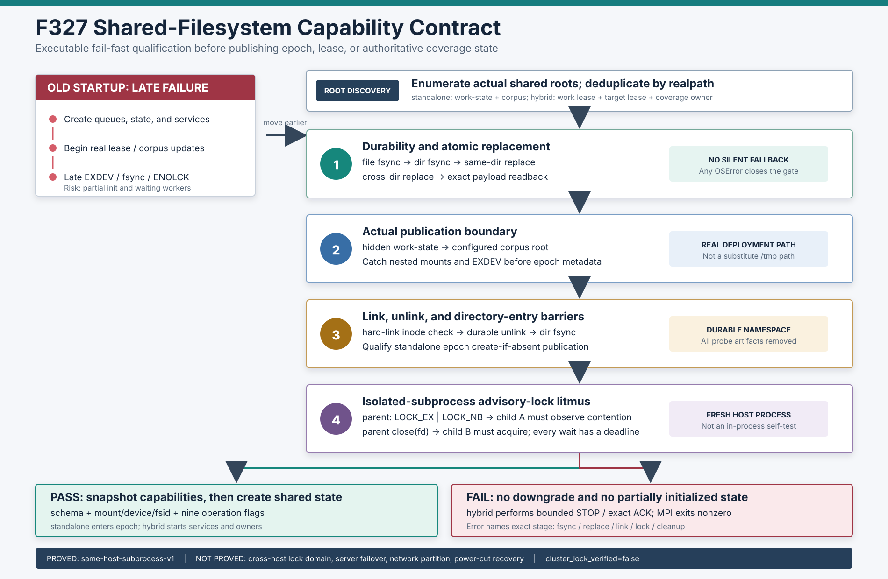

# F327：共享文件系统能力契约与启动前失败关闭

- 日期：2026-08-07
- 功能编号：F327
- 成熟度：I/T/E-mechanism
- 代码范围：分布式状态原语、standalone MPI frontend、hybrid MPI frontend
- 证据范围：故障注入、隔离 subprocess、60 次串行/并发探针、真实单/双 master MPI、
  warnings-as-errors 完整 Python 回归

## 1. 研究问题与深度审查结论

F323-F326 已建立 file/目录双层持久化屏障、原子 publication、分片 group commit 和随进程
崩溃自动释放的 kernel advisory lock。但这些保证此前仍有一个部署前提：承载共享状态的文件系统
必须真正支持目录 `fsync`、原子 `replace`、hard link、durable unlink 和跨进程 `flock`。若 NFS、
CIFS、Lustre、容器 bind mount 或嵌套 mount 的实际语义不满足协议，旧流程通常要等第一次真实
lease/corpus 更新才暴露错误，此时队列、epoch、query service 或 worker 已经启动。

本轮审查又发现 hybrid frontend 的共享根探测位于初始化后半段：它可能先启动异步 query service、
创建 object store 与本地状态，再探测 work/target/coverage 共享根；探针异常还会穿出 `master()`，
依赖 MPI launcher 被动收敛。这与“fail fast before shared state”目标不一致。

F327 将隐含部署假设升级为**可执行能力契约**：在任何 epoch metadata、共享 lease、coverage-owner
heartbeat 或辅助服务发布前，对真实配置路径执行有限、可清理的 litmus；任何阶段失败均关闭初始化，
不降级为无锁、无目录屏障或非原子更新。



## 2. 技术依据与科研定位

### 2.1 为什么不能只看文件系统名称

Pillai 等在 OSDI'14 对应用层 crash-consistency protocol 的研究表明，不同 Linux 文件系统的
atomicity 与 persistence ordering 属性差异显著，应用正确性依赖这些细粒度属性，而不只是“POSIX
兼容”标签。[All File Systems Are Not Created Equal, OSDI'14](https://www.usenix.org/system/files/conference/osdi14/osdi14-paper-pillai.pdf)

因此 F327 记录 mount point/type/source 只用于诊断；`overlay`、`nfs4` 或 `cifs` 名称本身既不
自动通过，也不自动证明失败。准入取决于对真实根目录执行的 operation-level observations。

### 2.2 `fsync`、`rename` 与锁分别回答不同问题

- Linux `fsync(2)`文档明确区分文件内容/元数据与目录项：同步文件本身不保证包含该文件的目录项
  已持久化，因此协议必须显式打开并同步 parent directory。
  [Linux `fsync(2)`](https://man7.org/linux/man-pages/man2/fsync.2.html)
- `rename(2)`在同一支持的文件系统内提供 pathname 原子替换，但跨挂载边界返回 `EXDEV`；这正是
  hidden work-state 到 corpus 的真实发布边界必须在启动时执行的原因。
  [Linux `rename(2)`](https://man7.org/linux/man-pages/man2/renameat2.2.html)
- `flock(2)`锁关联 open file description，最后一个相关 descriptor 关闭时释放；`LOCK_NB`允许
  应用实现 monotonic deadline。但 NFS/SMB 映射会随 kernel、mount option 与 server 改变，
  同机 child 成功不能证明远端 client 加入同一锁域。
  [Linux `flock(2)`](https://man7.org/linux/man-pages/man2/flock.2.html)

### 2.3 这不是断电一致性测试

CrashMonkey/B3 在 OSDI'18 通过记录 I/O、构造 crash states、重新挂载并检查恢复结果来测试真实
crash consistency。F327 没有 block-level I/O replay、power-cut injection 或 recovery mount，
因此只能证明调用期能力和本机进程语义，不能声称物理掉电后状态必然恢复。
[Finding Crash-Consistency Bugs with Bounded Black-Box Crash Testing, OSDI'18](https://www.usenix.org/conference/osdi18/presentation/mohan)

项目贡献不是发明新的 filesystem primitive，而是把分布式符号执行的具体持久化前提变成可执行、
有证据且明确标注证明范围的 startup contract。

## 3. 能力快照与探针协议

`probe_shared_state_filesystem(root, timeout, publication_root)`返回不可变
`SharedFilesystemCapabilities`，其 schema 为
`symcc-shared-filesystem-capabilities-v1`。快照包含：

| 类别 | 字段 |
| --- | --- |
| 路径身份 | canonical root、canonical publication root |
| 存储身份 | root/publication `st_dev` 与 `statvfs.f_fsid` |
| mount 诊断 | deepest mount point、filesystem type、source、distributed classification |
| 操作能力 | file/dir fsync、same/cross-dir replace、publication replace、hard link、unlink |
| 互斥能力 | advisory-lock exclusion、descriptor-close release |
| 证明边界 | `probe_scope=same-host-subprocess-v1`、`cluster_lock_verified=false` |

### 3.1 严格执行次序

1. 将 timeout 解析为有限数，直接 library 调用也夹到 0.001--60 秒；规范化 state 与
   publication root；
2. 在两个真实根下建立带 PID、monotonic timestamp 和随机 nonce 的私有 probe tree；所有新目录
   同步自身和 parent directory；
3. 写入并 file-fsync `current`/temporary object；执行 same-directory durable replace，回读精确
   bytes；
4. 在 probe tree 的两个子目录间执行 cross-directory durable replace，按 destination-first 次序
   同步目录并回读；
5. 将 state probe object 移动到**配置的真实 publication root**，回读后 durable unlink；
6. 创建 hard link，比较 inode identity，再执行 durable unlink；
7. 以 `O_RDWR|O_CREAT|O_CLOEXEC|O_NOFOLLOW`打开稳定普通 lock file，parent 取得
   `LOCK_EX|LOCK_NB`；
8. 启动 `python -I -c ...`全新解释器，child A 必须以专用 exit 73 报告 contention；parent
   descriptor 关闭后，child B 必须 exit 0；每个 child 有独立 timeout；
9. 采集 root/publication device、fsid 与 `/proc/self/mountinfo` 的 deepest matching mount；
10. 无论成功失败都删除两个私有 tree 并同步 parent。cleanup 自身失败会把本次探针转为失败。

这里没有“unsupported 时继续”的分支。内容回读、return code 和结构清理都参与成功判定，避免把
“系统调用没有立即报错”误当作完整契约。

### 3.2 mountinfo 与 distributed classification

parser 处理 mountinfo 中的八进制转义，并以最长路径前缀选择嵌套最深的 mount。已知 NFS/CIFS/
Lustre/Ceph/GlusterFS/GPFS/OCFS2/SSHFS 等类型被标为 distributed；普通 `fuse.*` 不被一概分类，
避免把本地 FUSE 和远端锁域混为一谈。分类只进入日志，不改变 capability flags，也绝不会把
`cluster_lock_verified`置真。

## 4. 前端集成与失败传播

### 4.1 Standalone MPI

`_SharedWorkCoordinator`在 `_ensure_work_state_metadata()`之前调用探针，并把实际共享 corpus
作为 `publication_root`。因此：

```text
probe(state root, actual corpus root)
  → PASS: publish immutable epoch metadata → create fenced work table
  → FAIL: master_loop returns false → existing MPI Abort(70) path
```

它不仅验证 state root 内部操作，还会提前捕获 state/corpus 间嵌套 mount 导致的 `EXDEV`。

### 4.2 Hybrid MPI

新增 `_shared_filesystem_preflight_roots()`按启用功能枚举：

1. multi-master work lease root；
2. 可选 target lease root；
3. 可独立启用的 coverage-owner root。

路径按 canonical realpath 去重；同一进程后续 constructor 复用已取得的 snapshot，不重复启动 child。
更关键的是，这段 preflight 已前移到 queue/hang/crash 基本目录之后、async query service、object
store、scheduler 与所有共享 owner **之前**。失败时 master 先运行既有 bounded STOP/exact ACK，
打印 acknowledged/pending/elapsed，再返回 false，由 `main()`执行 `Abort(70)`保留非零配置失败。

### 4.3 Library opt-in

`FencedWorkLeaseTable`、`FencedTargetLeaseTable`与`CoverageOwnerShardGossip`保留
`verify_filesystem=True` constructor gate，供独立 library caller 使用。两个 MPI frontend 在顶层
统一探测，避免每个 table 重复付出 subprocess 成本。

## 5. 正确性不变量

| 编号 | 不变量 | 实现与证据 |
| --- | --- | --- |
| P1 | 共享状态发布前已验证依赖的 filesystem operations | standalone epoch 前置；hybrid service 前置测试 |
| P2 | 探针必须作用于真实配置路径 | state root 与实际 corpus boundary；hybrid exact lease/coverage roots |
| P3 | lock 测试必须跨进程 | 两个 `python -I` child 分别证明 exclusion 与 release |
| P4 | 所有等待都有上界 | finite 0.001--60 秒 timeout；child timeout 失败关闭 |
| P5 | 不支持的操作不能静默降级 | 任意 fsync/replace/link/flock 错误终止初始化 |
| P6 | 成功不遗留测试对象 | 私有随机 tree + finally cleanup + parent directory sync |
| P7 | mount 名称不能扩大证明范围 | diagnostic-only classification；cluster flag 永远 false |
| P8 | 重合根只探测一次 | canonical path cache；root enumeration 单元测试 |
| P9 | hybrid 失败仍收敛 worker 生命周期 | bounded STOP/exact ACK 后 nonzero Abort |

## 6. 故障矩阵

| 故障 | 新行为 | 当前证据 |
| --- | --- | --- |
| same-dir replace `EIO` | 报精确 stage，清理 probe | 故障注入 |
| state → corpus `EXDEV` | epoch metadata 前失败 | 故障注入 + ordering test |
| child 在 parent 持锁时也取得锁 | `ENOLCK`语义失败 | return-code 注入 |
| parent close 后 child 仍受阻 | release capability 失败 | return-code 注入 |
| child 卡死 | bounded `TimeoutExpired` → capability error | 故障注入 |
| NaN/Infinity timeout | 根目录无副作用地拒绝 | 单元测试 |
| 超大 direct-library timeout | 夹到 60 秒 | 单元测试 |
| mountinfo 有空格与嵌套 mount | 解转义并选择 deepest mount | parser 单元测试 |
| hybrid 首个 root 探针失败 | service/object store 未创建；调用 shutdown | master 级故障注入 |
| 探针进程并发 | unique tree，无互相覆盖和残留 | 5×8 进程真实实验 |
| 远端 NFS client 不共享锁 | 当前探针无法判定 | 明确未验证，禁止外推 |
| 运行中掉电 | 当前探针无法判定恢复状态 | 明确未验证，需 CrashMonkey 类方法 |

## 7. 配置与运维行为

新增配置记录于 [`docs/Configuration.txt`](../../Configuration.txt)：

- `SYMCC_SHARED_STATE_FS_PROBE=0/1`，默认 1；
- `SYMCC_SHARED_STATE_FS_PROBE_TIMEOUT=SECONDS`，默认 5，范围 0.001--60。

关闭探针只用于受控兼容实验，不会让真实状态操作改为 best effort：后续 `fsync`、replace 与 flock
仍会传播错误。关闭的代价是错误回到运行期首次状态更新时才出现，运维方必须自行承担部署资格验证。

## 8. 自动化验证结果

完整证据位于
[`F327 evidence`](../evidence/f327-shared-filesystem-capability-contract-2026-08-07/)。

| 门禁 | 结果 |
| --- | ---: |
| capability/ordering/fault 定向 | 13 passed，142 deselected |
| distributed state + MPI lifecycle + AFL profile | 211 passed + 21 subtests |
| 完整 `pytest -q -W error test` | 668 passed + 41 subtests，93.21 s |
| Ruff / `py_compile` / `git diff --check` | 全部通过 |
| 配置唯一名 / 顶层测试文件 | 407 / 245 |

F327 相对 F326 新增 14 项测试。除了 mocked errno/return code，还包括真实 subprocess probe、真实
state/corpus 两根执行、constructor opt-in 和 master 初始化顺序，避免只验证 helper 内部代码。

## 9. 并发能力实验与启动成本

`verify_filesystem_capabilities.py`在本机 Linux 7.0、Python 3.12.3、overlayfs 上执行 20 次串行
探针，以及 5 个 campaign×8 个同时启动的独立进程：

| 指标 | 结果 |
| --- | ---: |
| 总探针 | 60 / 60 成功 |
| failed result / nonzero child | 0 / 0 |
| invalid capability snapshot | 0 |
| probe residue | 0 |
| 串行中位 / 经验 P95 / 最大 | 54.315 / 57.678 / 80.647 ms |
| 8进程并发单进程中位 / P95 / 最大 | 97.736 / 112.716 / 115.419 ms |

一次探针内部会启动两个隔离 child 并执行多个同步写，因此约 54 ms 是可见的启动成本。它只在每个
distinct shared root 的 master 初始化时支付，不进入每条 query、lease heartbeat 或 result commit
热路径。该数字不能表述为加速，也没有测量 NFS latency 或高并发 metadata server 压力。

## 10. 真实 MPI 集成结果

Open MPI 4.1.6 以 `/bin/true`作为目标执行两条健康 smoke：

| case | ranks / 布局 | analysis observations | shutdown | finalize residue |
| --- | --- | ---: | --- | ---: |
| single-master | 3：1 master + 2 workers | 2 | `acked=2/2`，exit 0 | 0 |
| two-master | 8：2×(1 master + 3 workers) | 2 | 每组`acked=3/3`，global quiescence，exit 0 | 0 |

两条日志都包含 state root、actual publication root、device/fsid、overlay mount、九项 true operation
flags、`same-host-subprocess-v1`与`cluster_lock_verified=false`。finalize 后没有 hidden epoch tree 或
probe residue。

这是 orchestration smoke，不执行真实符号约束，也不支持“coverage/solver/DSE 吞吐提升”的结论。

## 11. 先进性、创新性与挑战性

1. **把部署假设变为 executable contract。** 传统配置检查只比较路径或 filesystem type；F327
   对框架实际依赖的 operation sequence 做可失败的黑盒 litmus，并在状态发布前完成。
2. **验证真实跨根发布边界。** 不是在单个临时目录内自测 rename，而是让 hidden state 与配置 corpus
   都参与，能发现嵌套 mount 这一部署中常见但源码测试难覆盖的问题。
3. **锁能力使用双 child 反事实。** 第一个 child 必须失败、第二个 child 必须成功；只测“能调用
   flock”无法发现不排斥或 close 后不释放。
4. **跨 frontend 初始化顺序治理。** standalone 与 hybrid 采用同一 capability schema；hybrid 的
   服务启动被前移 gate 控制，失败进入现有有界 MPI 生命周期而非异常泄漏。
5. **proof scope 是机器可读数据。** `cluster_lock_verified=false`不是报告脚注，而是每个 snapshot 的
   固定字段，降低运维或论文写作把本机证据误外推为集群证明的风险。
6. **证据分层。** errno fault injection 回答分支，60 次并发回答清理/隔离，真实 MPI回答集成，
   文献边界回答尚未证明什么；任何一层都不冒充另一个层级。

实现挑战主要在失败顺序与证据边界：探针本身也会修改 filesystem，必须用不可碰撞命名、`finally`
清理和目录同步；同时，看到 `nfs4`不能直接判定远端锁正确，看到本机 child 成功也不能设置 cluster
flag。相比激进声称“支持所有共享文件系统”，F327选择可执行但保守的准入结论。

## 12. 局限、有效性威胁与下一步

1. 当前 child 与 parent 位于同一 host/kernel，未验证第二个 NFS/CIFS/Lustre client；
2. 未执行 server restart、lock-manager failover、network partition 或 client cache coherence 测试；
3. 未做 power-cut/kernel-panic crash-state recovery，成功 `fsync`只证明调用返回；
4. 探针验证有限 operation trace，不是所有可能并发 interleaving 的形式化证明；
5. `flock`仍是 advisory，非协作 writer 可绕过协议直接改文件；
6. distributed-filesystem type 表不穷尽所有 vendor/FUSE filesystem，且明确不承担准入判断；
7. hybrid 失败路径已有 master 级 fault test，但尚未保存真实 MPI 注入失败的 launcher 日志；
8. 60 次本机实验不足以估计极低概率 metadata race，也未测大规模并发 master 的 metadata cost；
9. 当前 universal contract 包含 hard link，即使某条 hybrid-only 路径本身不使用它也会保守拒绝；未来
   可在不削弱 standalone 契约的前提下引入带 schema 的 requirement profile；
10. 下一阶段应实现协调式 cross-host probe：由不同 hostname 的 parent/contender 对同一 inode
    交叉持锁并记录 mount options，再以 server failover 和 bounded crash-recovery campaign 封闭
    `cluster_lock_verified`的升级条件。

## 13. 结论

F327 将 F323-F326 的持久化和互斥协议从“代码在支持的文件系统上正确”推进为“程序启动时先证明当前
配置路径具备所需调用期能力”。它修复了 hybrid 探测过晚与异常泄漏的实际实现问题，统一 standalone/
hybrid/library 三类入口，并以 14 项新测试、60 次真实探针、两类真实 MPI topology 和完整 668 项
Python 回归建立证据闭环。当前结论严格限定在同机进程与调用期 filesystem 行为；跨节点锁域和断电
恢复仍是下一阶段必须独立完成的高挑战验证，而不是由本机成功快照推断。
