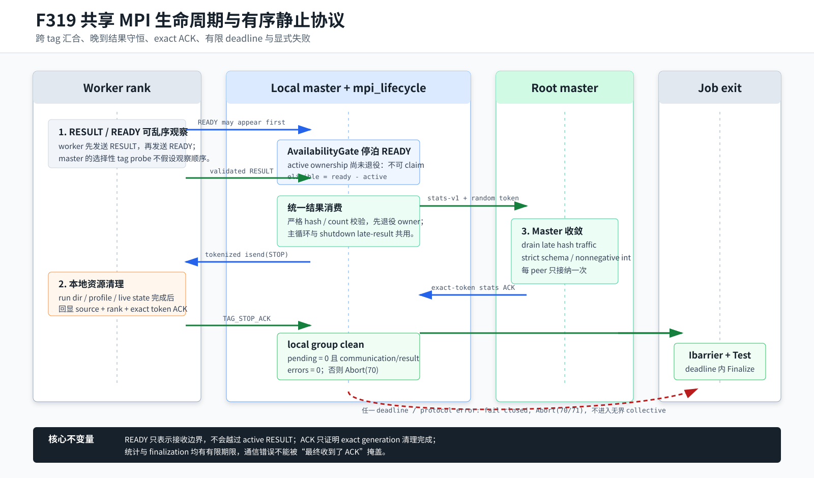

# F319：共享 MPI 生命周期与有序静止协议

- 日期：2026-08-07
- 实现范围：`util/mpi_lifecycle.py`、`util/mpi_concolic_execution.py`、
  `util/mpi_fuzzing_helper.py`
- 测试范围：`test/test_mpi_lifecycle.py`、`test/test_afl_profile_orchestration.py`
- 当前证据等级：I/T/E-mechanism

## 1. 研究问题

F318 已为 AFL 协同入口建立 READY -> tokenized STOP -> cleanup ACK 和有界
`Ibarrier`，但独立入口 `mpi_concolic_execution.py` 仍保留四个生命周期缺口：

1. worker 停止、跨 master 最终统计和全局 `Barrier()` 含阻塞调用，静默 rank 可使作业
   永久等待；
2. 两个 MPI 前端分别维护消息 tag 和关闭逻辑，协议修复可能发生语义漂移；
3. master 先选择性接收 `TAG_READY` 并立即派发，再接收 `TAG_RESULT`。worker 虽按
   RESULT 后 READY 的程序顺序发送，接收端按不同 tag 探测时仍可能先观察 READY，导致新
   active ownership 被旧 RESULT 错误清除；
4. wall-time/signal 退出时，关闭协调器会排空晚到 RESULT，但原实现丢弃其中的生成数和
   新 hash，最终统计不守恒。

此外，`--max-idle` 原先用 5 秒轮次的整数除法近似 deadline，并在 sleep 前递增计数。
配置 1 秒会立即退出却打印等待 5 秒，配置 60 秒通常只实际等待约 55 秒。

## 2. 设计目标与不变量

本轮把“任务完成、worker 静止、master 统计收敛、全作业退出”分为四个可验证阶段：

1. **READY 不越过 active RESULT**：提前观察到的 READY 只能停泊，直到该 rank 的 active
   ownership 被结果消费函数退役；
2. **晚到结果仍守恒**：主循环和 shutdown drain 复用同一严格结果消费逻辑；
3. **完成必须被确认**：本地 worker cleanup 与跨 master stats 都使用随机代次 token 的
   exact ACK，不把本地 send completion 当作远端完成；
4. **所有等待均有限**：worker shutdown、master stats 和最终 collective 都受 deadline
   约束；pending、通信错误或结果错误均 fail closed；
5. **失败先于 collective free**：master 发现不完整生命周期时先在全局 communicator 上
   `Abort(70)`，不进入可能要求失联进程参与的 `group_comm.Free()` 或最终 barrier。



## 3. 实现细节

### 3.1 单一共享生命周期实现

新增 `util/mpi_lifecycle.py`，集中维护 `TAG_RESULT/TAG_STOP/TAG_READY/TAG_STOP_ACK`、
shutdown token、ACK 分类、有界 worker shutdown 和有界 `Ibarrier`。两个前端通过相对导入
及脚本执行 fallback 导入同一函数对象，测试直接断言对象同一性，避免复制实现再次分叉。

`_cooperative_shutdown_workers()` 逐 rank、逐 tag 以每轮最多 16 条的批次排空消息：

- RESULT 可交给调用方 `result_callback`；回调拒绝或抛错记入 `result_errors`；
- READY 使该 rank 获得 STOP 发送资格；
- STOP 仅用 `isend` 发送一次，并按 `(source, payload rank, exact token)` 接纳 ACK；
- `pending`、`communication_errors` 或 `result_errors` 任一非空，`clean` 都为 false。

最后一条修复了“轮询曾发生 MPI 异常，但之后碰巧收到 ACK 仍报告 clean”的假成功。

### 3.2 跨 tag 的 READY/RESULT 汇合

standalone runner 新增 `_WorkerAvailabilityGate`。它把 READY 记录为集合而不是立即派发：

```text
available(worker) := READY(worker) and worker not in active_workers
```

主循环先排空 READY，再排空 RESULT，最后只从 `ready - active` 认领 worker。若 READY 先被
观察，rank 会留在 gate 中；旧 RESULT 到达并退役 active ownership 后，它才可接收下一份工作。
重复 READY 被集合幂等吸收，未知 group rank 不进入调度。

结果由 `_worker_result_payload()` 严格解析：`new_hashes` 必须是 64 字节小写十六进制摘要
序列，`num_generated` 必须是非布尔、非负整数且不小于成功读取的 hash 数。结果消费先按
source rank 退役 active ownership，再更新生成数、interesting hash、待执行队列和跨 master
同步列表。未拥有或畸形结果计数并使本轮生命周期失败；对应 rank 不再被
availability gate 认领，但已观察 READY 仍保留给 shutdown gate 完成有序清理，避免在
最终 Abort 前又向已知异常的 worker 派发新任务。

### 3.3 关闭期晚到结果

进入关闭协议时，master 把已停泊 READY 作为 `initial_ready`，并把主循环的
`consume_worker_result` 作为 shutdown callback。busy worker 可以先完成 RESULT、发送 READY，
再接收 tokenized STOP；其结果不会因为 wall timeout 或信号关闭而丢失。ACK 仍必须发生在
worker 本地临时目录清理之后。

### 3.4 有界跨 master 统计收敛

`_bounded_master_stats_exchange()` 用 schema `symcc-master-stats-v1` 和每个 submaster 的
随机 256-bit token 替换阻塞统计 send/recv：

- submaster 以 `isend` 发送非负整数统计，同时继续排空 root 的晚到 hash broadcast；
- root 按已知 peer source 接收，每个 peer 只接纳一个严格 schema，畸形或重复消息隔离；
- root 在所有 peer stats 与先前 hash `isend` 都完成后，回传包含 peer rank 与 exact token
  的 stats ACK；
- submaster 必须同时观察 exact ACK 和所有本地 pending send 完成；任一 deadline 或通信
  异常返回不完整状态，调用方随后 `Abort(70)`。

最终所有 rank 在 `group_comm.Free()` 后执行有界 `Ibarrier()+Test()`；超时使用
`Abort(71)`，不再进入无期限阻塞 barrier。

### 3.5 精确 idle deadline

`_idle_time_remaining()` 用 monotonic 起点、当前时刻和秒级配置直接计算剩余时间。idle 状态
在新输入、hash sync 或 active work 出现时重置；sleep 最长 5 秒，但最后一次只睡剩余时间。
退出日志报告实测 idle elapsed 与配置 limit，不再用轮次数推测。

## 4. 代码与测试映射

| 能力 | 权威实现 | 直接测试 |
| --- | --- | --- |
| 共享 STOP/ACK 与有界 barrier | `util/mpi_lifecycle.py` | 两前端函数身份、silent rank、deadline |
| READY 停泊与 active join | `_WorkerAvailabilityGate` | READY-first、duplicate、unknown rank、claim |
| worker 结果可信边界 | `_worker_result_payload` | hash、bool count、count 下界、缺字段 |
| 关闭期 RESULT callback | `_cooperative_shutdown_workers` | RESULT -> READY -> STOP -> exact ACK |
| fail-closed 通信错误 | shutdown outcome | ACK 完成但曾出现异常仍 `clean=false` |
| stats exact ACK | `_bounded_master_stats_exchange` | root 聚合、畸形 peer、stale ACK、submaster exact ACK |
| idle deadline | `_idle_time_remaining` | 1 秒、部分流逝、到期、负值与 NaN |

## 5. 验证结果

### 5.1 自动化门禁

| 验证项 | 结果 |
| --- | --- |
| `ruff check` 与 `py_compile` | 通过 |
| MPI lifecycle + AFL profile 编排 | 63 passed + 13 subtests（0.55 秒） |
| 七个相关 Python 模块 | 268 passed + 17 subtests（13.22 秒） |
| 完整 `pytest -q test` | 605 passed + 37 subtests（83.07 秒） |

### 5.2 真实 Open MPI 健康路径

环境为 Open MPI 4.1.6、mpi4py vendor `Open MPI (4, 1, 6)`，目标 `/bin/true`，输入为一个
非空 seed，`SYMCC_FINALIZE_GRACE_SEC=3`。

| 拓扑 | 观测 |
| --- | --- |
| 1 master + 2 workers，`--max-idle 1` | idle 精确 1.000 秒；2/2 ACK；shutdown 0.010 秒；exit 0；进程总墙钟约 1.585 秒 |
| 2 masters + 6 workers，`--workers-per-master 3` | 两组均 3/3 ACK、各 0.010 秒；stats exact-ACK 完成；exit 0；进程总墙钟约 1.636 秒 |

这些是协议可执行性和 deadline 语义证据，不是吞吐 benchmark。进程总墙钟包含 Python/MPI
启动、固定 1 秒 idle window、关闭与 finalization。

### 5.3 静默 master 故障注入

三 rank stats 协议中令 rank 2 睡眠且不发送 stats，grace 设为 0.15 秒，外层 watchdog 为
5 秒。root 得到：

```text
clean=False, received=(1,), pending=(2,), elapsed=0.150484s
```

rank 1 因 root 无法在缺失 peer 时发出 exact ACK，于 0.150385 秒返回 `pending=(0,)`。
Open MPI 最终返回错误码 70，不是外层 timeout 的 124。这证明缺失 peer 被显式分类且等待
有界；它不证明 communicator 能在硬 rank failure 后继续计算。

## 6. 审查中发现的下一项优化

双 master 健康运行对一个输入报告 `Total analysis observations=2`，而共享目录只有一个内容
寻址文件。这是可复现的效率缺口：当前 hash broadcast 使每个 master group 复制探索相同 seed，
并非全局唯一所有权的任务分片。F319 不在生命周期补丁中仓促改变探索语义；下一轮应实现
deterministic owner 或带租约的全局 work routing，并以 redundant executions、coverage AUC 和
worker utilization 做消融。此观察是后续基线，不是 F319 的性能收益。

## 7. 科研边界

- F319 提供应用层有界退出与消息相关性，不是 ULFM `revoke/shrink`、成员变更或 rank 替换；
- standalone 的 READY gate 解决可靠 MPI 中的跨 tag 观察顺序，不等价于 F315/F316 的完整
  per-dispatch token 恢复协议；
- worker RESULT/ACK 仍使用小消息阻塞 send；master deadline 与 `Abort` 保证作业级有界失败，
  但不能让失去 master 的 worker 独立恢复；
- 多 master 进入统计阶段仍可能有相位偏差，当前由有限 grace 约束，不是分布式终止检测；
- 单次本机健康/静默测试不能推导故障率、覆盖率、吞吐、扩展性或最优 timeout。

相关 API 与错误模型边界参见 [mpi4py communicator 文档](https://mpi4py.readthedocs.io/en/stable/reference/mpi4py.MPI.Comm.html)、
[MPI 5.0 标准](https://www.mpi-forum.org/docs/mpi-5.0/mpi50-report.pdf) 和
[Open MPI ULFM 文档](https://docs.open-mpi.org/en/v5.0.9/features/ulfm.html)。
