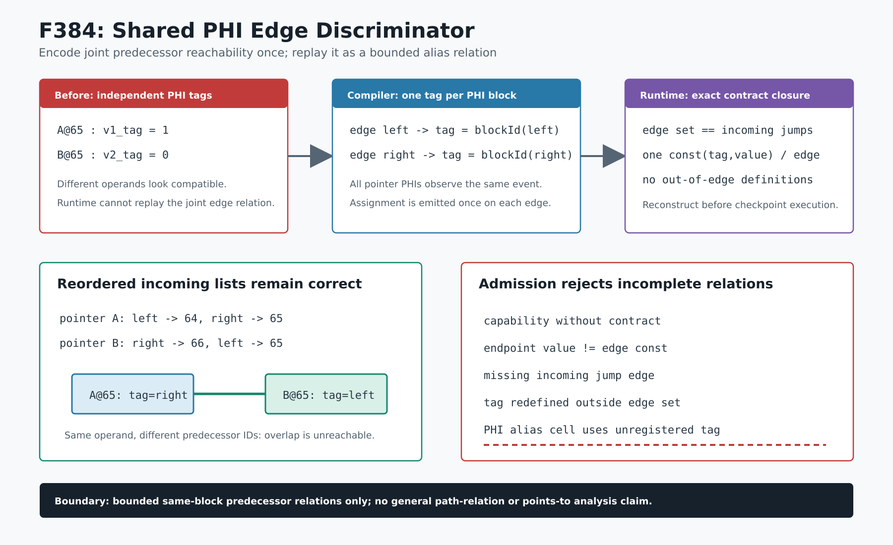

# F384：共享 PHI Edge Discriminator 与联合别名关系证书

- 日期：2026-08-13
- 编译器：`compiler/ContinuationLowering.cpp`
- artifact 准入与执行器：`util/live_continuation.py`
- 独立检查器：`util/check_live_continuation_lowering.py`
- 测试：`test/live_continuation_lowering.ll`、`test/test_live_shared_phi_edge_discriminator.py`
- 能力：`bounded-shared-phi-edge-discriminator`
- 成熟度：I/T/E-mechanism；有界 CFG edge 关系，不等价于一般 relational pointer analysis

## 1. 为什么 F383 仍保守排除 PHI correlation

F383 已能从每个 load 的有限地址、select guard 和 symbolic-index 精确映射重建 cell 图。然而两个独立 pointer
PHI 原先各自使用 `v1_pointer_tag`、`v2_pointer_tag`。当地址 65 只分别出现在组合
`(v1_tag=1, v2_tag=0)` 时，load-local 元数据看起来仍然相容；真正使组合不可达的是同一 CFG predecessor
会同时选择两个 PHI 的 incoming。旧 artifact 没有携带这条联合关系，运行时不能独立复核，因而 F383
正确地不为该证明生成图边。



F384 利用一个更直接的语义事实：**同一 PHI block 中的所有 PHI 在一次进入事件上共享同一个 predecessor**。
因此不再为每个 pointer PHI 建立彼此无关的 incoming 下标，而是给整个 PHI block 一个共享 edge
discriminator。两个 load 的 alias case 随即使用同一个 guard operand，F383 已有的 guard-conflict oracle 可以
直接复核其互斥性，无需在恢复端重新实现 LLVM PHI 分析。

## 2. 编译器实现

### 2.1 predecessor identity，而不是 incoming 列表下标

`FunctionContext` 为每个 basic block 分配稳定的函数内 `blockId`，并为包含 pointer PHI 的 block 分配一个
`bbN_pointer_edge_tag`。每个 pointer/function-pointer PHI 的 alternative guard 使用其 incoming predecessor 的
`blockId`：

```text
guard(phi alternative from predecessor P)
    = (bbN_pointer_edge_tag == blockId(P))
```

这一点不能简化为 `getIncomingValue(index)` 的 index。LLVM 允许不同 PHI 以不同文本顺序列出 incoming；F384
新增 reordered fixture，故意让第二个 pointer PHI 的 `%right` 项排在 `%left` 前面，仍得到正确关系：

```text
pointer_a: address 64 -> tag 1, address 65 -> tag 2
pointer_b: address 66 -> tag 2, address 65 -> tag 1
```

若错误地共享“incoming index”，第二个 PHI 会把 predecessor 关系反转，既可能误拒绝，也可能伪造互斥。

### 2.2 每条 edge 只赋值一次

`addPhiEdgeBlocks` 对一个 PHI block 的共享 tag 去重。无论该 block 有多少 pointer PHI，每个 synthetic edge
block 只发出一条 32-bit `const`：

```text
edge_left_initialize : bb3_pointer_edge_tag = blockId(left)
edge_right_initialize: bb3_pointer_edge_tag = blockId(right)
```

随后仍按原有两阶段 PHI copy 顺序暂存并提交每个 pointer 值，不改变 simultaneous PHI assignment 语义。

### 2.3 function-level 可执行合同

artifact 新增 `phi_edge_discriminators`：

```json
{
  "block": "bb3",
  "tag": "bb3_pointer_edge_tag",
  "bits": 32,
  "incoming": [
    {"edge": "edge_bb1_bb3", "predecessor": "bb1", "value": 1},
    {"edge": "edge_bb2_bb3", "predecessor": "bb2", "value": 2}
  ]
}
```

它不是提示信息：声明新 capability 时必须存在合同；合同存在时也必须声明 capability。数据指针 PHI 依赖
`bounded-pointer-union`，函数指针 PHI 则允许以 `bounded-indirect-call-dispatch` 作为上层能力。

## 3. 恢复端独立准入

runtime 在执行 checkpoint 前复核：

1. block、tag、edge、predecessor 名称存在，tag 固定为 32 bit；
2. 每个 edge/value/predecessor 唯一且总量不超过 256；
3. 每个 edge 中恰有一条匹配 tag/bits/value 的 `const` 定义，terminal 必须 jump 到声明的 PHI block；
4. tag 不得在声明 edge 之外重定义；
5. 所有 jump 到该 PHI block 的 edge 集必须与合同精确相等，不能同时删掉 endpoint 和赋值来逃避检查；
6. 新式 `phi_correlated_pointer_domains` 必须携带 F383 对称图边；每个相关 load 的所有有限 cell 都必须由
   已注册的共享 tag guard 约束。

完成上述闭包后，地址区间重叠只在同一个 tag 需要同时等于两个不同 predecessor ID 时被判为不可达。普通
disjoint pair 仍按区间处理；任意 guard 相容重叠仍失败关闭。

## 4. 三轮审查与修复

### Review 1：生产/消费闭包

- LLVM 17/18 均以 Werror 重建；
- ordered PHI fixture 生成一条 discriminator 合同与一条 alias graph 无向边；
- 删除 capability、删除合同、修改 endpoint value、在 edge 外重定义 tag、让 load 使用未注册 tag 均拒绝。

### Review 2：跨子系统 capability

首次大型 lowering 回归在 `indirect_phi` 暴露依赖错误：函数指针 PHI 会生成共享 tag，但不必声明数据指针的
`bounded-pointer-union`。准入规则改为 pointer-union 或 indirect-call-dispatch 二者至少存在一个；原函数指针
dispatch 的结果 6/7 保持。

### Review 3：顺序无关性与完整 edge 集

- reordered fixture 证明 discriminator 值来自 predecessor block identity，而非各 PHI 的列表 index；
- runtime 从“已声明 edge 正确”收紧为“全部 incoming jump edge 与合同集合完全相等”；
- `live_continuation_lowering.ll` 整文件回归在修复后 1/1 通过，覆盖 470 余条 RUN pipeline。

完整 LLVM lit 为 241 passed、1 unsupported；canonical Python capability gate 为 888 passed + 229
subtests，skipped/xfailed/xpassed/deselected 与 missing/unexpected node ID 均为 0。LLVM 17/18 Werror 构建、
ordered/reordered/function-pointer artifacts、Ruff、py_compile、diff whitespace、图形/链接/计数 verifier 和
SHA-256 manifest 均进入证据闭环。这些数字证明当前快照的机制与回归门禁通过，不是性能提升结论。

## 5. 研究价值与边界

F384 将 LLVM CFG 中隐含的“多 PHI 同步选择同一 predecessor”变成 portable、可执行复核的关系证书。它
解决的不是更多地址枚举，而是多个符号指针之间的**联合可达性**，使原本只能由 producer 信任的
PHI-correlated multi-cell 证明进入恢复端的 proof-carrying alias graph。

严格边界如下：

1. 只覆盖同一函数、同一 PHI block 的有界 predecessor 集；
2. 不处理任意跨 block/path 的关系推理、一般 SMT guard 等价或概率 alias；
3. 不证明 unbounded heap、递归对象图、任意 int-to-ptr 或完整 points-to relation；
4. artifact 准入证明内部合同与 continuation 语义一致，不替代原程序 native replay；
5. 本功能当前只提供 mechanism correctness，不提供 coverage、吞吐、漏洞数或公开 benchmark 提升结论。

下一步是在相同 proof-carrying 原则下把图节点扩展到 overlapping byte-lane writers 与 poison/definedness transfer，
而不是把“multi-cell marker 更多”误当成内存模型完整性。
