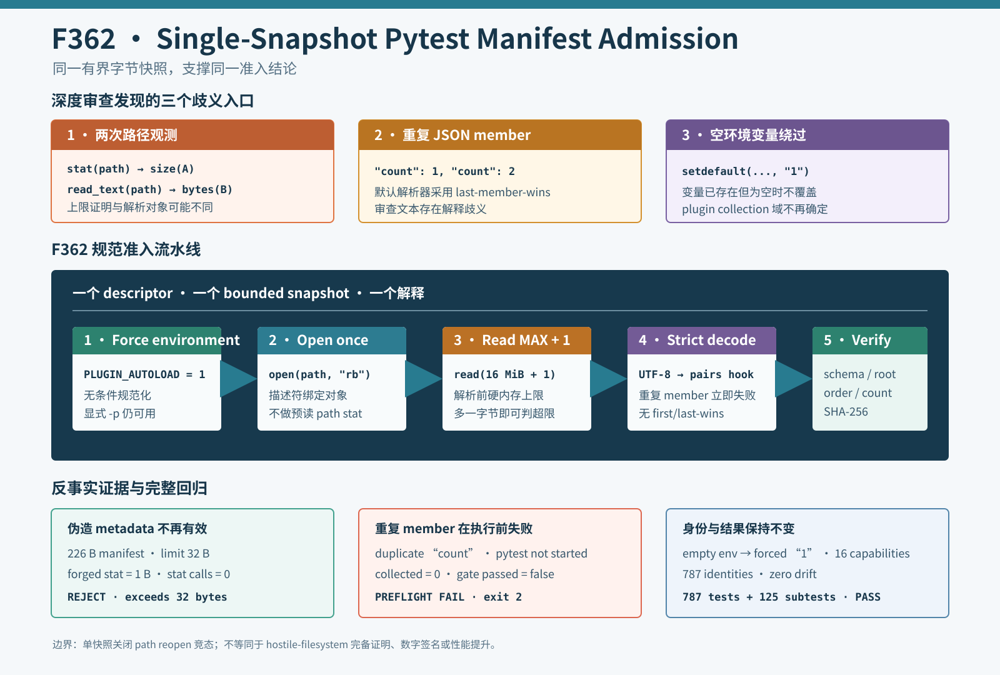

# F362：Single-Snapshot Pytest Manifest Admission

- 功能编号：F362
- 日期：2026-08-11
- 状态：已实现、已完成三类反事实与完整回归
- 范围：pytest 身份清单读取边界、JSON 规范性、插件环境隔离



## 1. 深度审查发现

F361 用规范 nodeid 清单封堵了“测试数量不变但身份被替换”的缺口。继续审查其可信输入边界时发现三个更底层问题：

1. `load_nodeid_manifest()` 先用 `path.stat().st_size` 检查 16 MiB 上限，再调用
   `path.read_text()` 重新按路径打开文件。若两次访问之间目录项被替换，大小证明与实际读取对象并不相同；
2. Python 标准 `json.loads()` 默认采用 last-member-wins，`{"count": 1, "count": 2}` 不会报错。
   这与“字段集合精确匹配”的文档语义不一致，也会让不同 JSON 解释器对同一审查文件产生歧义；
3. 生成器和 gate 使用 `os.environ.setdefault("PYTEST_DISABLE_PLUGIN_AUTOLOAD", "1")`。如果父环境已经定义
   该变量但值为空，`setdefault` 不会覆盖；工具却宣称默认建立了 hermetic plugin boundary。

这些问题不会改变正常的 787 项清单，却削弱了 F361 的失败关闭不变量。

## 2. 修复目标与不变量

F362 增加六条准入不变量：

1. 大小上限和被解析字节来自同一个已打开描述符；
2. 读取量在 JSON 解析前硬限制为 `MAX + 1`，超限输入不会被完整物化；
3. UTF-8 解码、JSON 解析、schema 和摘要验证消费同一内存快照；
4. 任意 JSON object 层级中的重复 member 必须失败，不能采用 first/last-member-wins；
5. 生成器和 gate 无条件把 `PYTEST_DISABLE_PLUGIN_AUTOLOAD` 规范为字符串 `1`；
6. gate 的机器可读字段只在环境值精确为 `1` 时报告隔离已启用。

## 3. 单描述符有界读取

旧流程是两个彼此无绑定的路径观测：

```text
path.stat() -> size(A) <= limit
path.read_text() -> bytes(B) -> JSON
```

F362 改为：

```text
open(path, "rb") -> fd(A)
read(fd(A), limit + 1) -> bounded snapshot
len(snapshot) <= limit -> UTF-8 -> strict JSON -> schema/digest
```

读取 `limit + 1` 而不是恰好 `limit`，可以在固定内存上界内区分“正好达到上限”和“至少超出一个字节”。路径在
`open()` 后被替换不会改变该描述符指向的对象，因此长度、文本和摘要共享同一对象身份。原子提交继续由 writer 的
临时文件加 `os.replace()` 保证。

该实现不是 hostile filesystem 或 in-place concurrent writer 的形式化证明：已打开 inode 若被原地并发修改，读取结果仍可能
是变化中的字节流；但 UTF-8、JSON、排序/count 和 SHA-256 仍必须对最终读取快照全部成立。版本化仓库文件的正常更新路径
使用原子替换，不依赖原地写入。

## 4. 重复 JSON member 拒绝

新增 `_object_without_duplicate_keys()` 作为 `json.loads(..., object_pairs_hook=...)`。hook 在 dict 构造前按输入顺序
观察所有 `(key, value)`，任何已存在 key 立即抛出 `ManifestError`。因此重复 `count` 即使两个值相同也会失败；
这避免“语义看似相同所以接受”的模糊规则，并适用于未来可能加入的嵌套对象。

错误发生在 pytest 调用之前。gate 仍原子生成 v2 JSON，其中 `pytest.exit_code=null`、`collected=0`、
`manifest_error="duplicate JSON object member 'count'"`，进程返回 2，清楚区分 preflight 错误与测试失败。

## 5. 强制插件隔离

两个生产入口现在都执行：

```python
os.environ["PYTEST_DISABLE_PLUGIN_AUTOLOAD"] = "1"
```

这不是对用户输入的可选默认，而是清单可重复性的协议条件。若未来需要第三方插件，应在依赖清单中固定版本并以
`-p <plugin>` 显式启用；不能通过继承环境隐式改变 nodeid 集合。gate JSON 使用精确比较 `value == "1"`，避免把任意
非空字符串误报为本工具所建立的规范状态。

## 6. 三类生产反事实

`run_adversarial_manifest_checks.py` 使用生产 reader/gate 重放：

| 反事实 | 观测 | 结果 |
|---|---:|---|
| 226 B 合法 manifest，测试上限 32 B，伪造 path `stat=1 B` | loader 的 `Path.stat` 调用为 0 | 读取 33 B 后拒绝 |
| 合法清单插入第二个 `count` | pytest exit 为 null，collected=0 | preflight exit 2 |
| 父环境把插件隔离变量设为空串 | collected=1，passed=1 | 强制为 1，gate PASS |

第一项不是仅检查错误文本：驱动器对 `Path.stat` 安装 mock 并确认调用数为零，证明新 reader 没有重新依赖可伪造的
预读路径元数据。第二、三项通过真实 gate 子进程验证完整状态和返回码。

## 7. 防回退测试设计

F362 有意不新增 pytest test function，而是在 F361 的 9 个既有测试身份内部扩展断言：

- capability-closed fixture 额外从空插件环境启动 gate；
- tampered-digest 契约额外验证重复 member 在 pytest 前拒绝；
- 同一契约直接调用生产 reader，以 32 B 上限和伪造 1 B `stat` 验证单快照硬上限。

因此 `test/pytest-nodeids.json` 仍为 787 项且字节完全一致。这也提供了一个重要实例：F361 能证明测试身份未漂移，
但无法证明测试体没有增强或弱化；代码审查、断言和 F362 专项证据仍不可替代。

## 8. 验证结果

| 验证层 | 结果 |
|---|---:|
| 三类 adversarial production checks | 3/3 PASS |
| F362 定向测试 | 9 passed（1.58 秒） |
| inventory 重建（初始环境变量为空） | 787 项，字节一致 |
| Ruff / `py_compile` / actionlint 1.7.7 | PASS |
| 完整 capability + identity gate | 787 passed + 125 subtests（97.69 秒） |
| capability 缺失 | 0 / 16 |
| 结果退化 | 0 failed/skip/xfail/xpass/deselected/collection error |
| 身份退化 | 0 missing/unexpected/duplicate，摘要精确相同 |

完整运行同样从空的 `PYTEST_DISABLE_PLUGIN_AUTOLOAD` 环境开始，生产 gate 将其规范为 `1` 后执行。测试数不变是预期
结果；F362 改变输入准入边界，不新增符号执行算法或测试身份。

## 9. 实现与证据位置

- `util/python_test_inventory.py`：单描述符有界读取和 duplicate-member hook；
- `util/python_test_gate.py`：强制插件隔离及精确状态记录；
- `test/test_python_test_gate.py`：三类反事实断言；
- `docs/Testing.txt`：operator 语义和失败边界；
- `docs/codex/evidence/f362-single-snapshot-pytest-manifest-2026-08-11/`：驱动器、JSON、日志和哈希；
- `docs/codex/diagrams/single-snapshot-pytest-manifest-admission-2026-08-11.svg`：准入流程图。

## 10. 工程价值与先进性边界

F362 把 manifest admission 从“先验 metadata 检查后再读路径”提升为 bounded single-snapshot parsing，并把 JSON
规范性和 pytest 插件域一起纳入显式协议。它采用的是内容寻址系统、编译器 manifest 和可重复构建中常见的原则：
同一决策只能消费同一不可歧义字节快照，环境能力必须显式而不能靠继承默认。

这是科研基础设施的正确性加固，等级为 I/T/E-mechanism，不是符号执行算法 SOTA。97.69 秒是一次回归耗时，不能与
F361 的 96.38 秒形成性能结论；两次单样本差异包含机器噪声。

## 11. 局限与后续工作

1. SHA-256 仍是内容一致性摘要而非签名；有仓库写权限者可以同时修改代码和清单；
2. 单描述符读取不阻止同一 inode 被原地并发写入，只保证大小检查和解析不因路径重开而指向不同对象；
3. nodeid 仍不证明测试体、fixture 或 oracle 语义；后续可研究测试源与依赖的 semantic fingerprint；
4. 当前没有触发 GitHub 托管 runner，也没有执行 LLVM lit、QSYM/PIN、真实 MPI、solver/coverage campaign、公开
   benchmark 或 LAVA-M；
5. 后续可将严格 duplicate-key 和 bounded snapshot reader 抽为共享的 manifest codec，减少不同证据协议重复实现。

## 12. 结论

F362 修复了 F361 清单准入中的三处真实实现偏差：大小证明和解析不再跨两次路径打开，重复 JSON member 不再被
静默覆盖，插件隔离不再受空继承变量绕过。三类生产反事实、字节一致的 787-node 重建和完整
`787 passed + 125 subtests` 门禁共同证明修复成立且没有身份或结果退化。证据支持本地 manifest 准入正确性与
可重复性结论，不支持 hostile-filesystem 完备证明、远端 CI 通过或符号执行性能提升。
