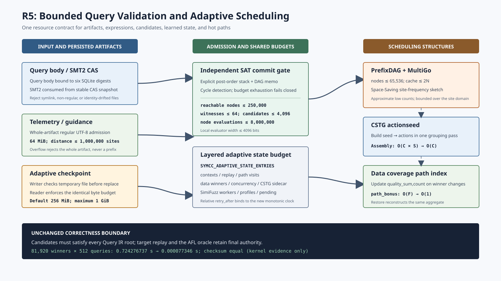

# 并行符号执行框架六轮深度审查与整改记录

## 1. 审查目标与方法

本轮不是以“测试仍为绿色”替代代码审查，而是从六个彼此独立的可信边界构造可执行反例：

1. CAS命名空间、物理身份和可达性观察；
2. QueryStore关系模型、事务与故障原子性；
3. 持久化solver的协议、deadline和资源生命周期；
4. 分布式调度、租约、MPI控制面和恢复；
5. 约束复用、调度算法、时间/空间复杂度；
6. 测试身份、配置、研究证据和交付一致性。

每轮必须记录旧行为、最小反例、根因、生产修复、定向/关联回归以及未被证据覆盖的边界。发现不确定时按“未证明”
处理，不把机制测试外推为coverage、求解吞吐或漏洞发现提升。

## 2. 进度总览

| 轮次 | 审查面 | 状态 | 已确认结果 |
| --- | --- | --- | --- |
| R1 | CAS与F373 reachability | 完成 | 修复主对象size漂移仍被报告为closure=true |
| R2 | QueryStore事务与关系模型 | 完成 | 修复artifact绑定分裂、query body准入、永久租约并优化publication锁 |
| R3 | solver双通道协议 | 完成 | 修复无界输出、stderr反压、宽松JSON、后代泄漏与未验证SAT提交 |
| R4 | 并行调度与MPI | 完成 | 修复journal身份、非有限控制值、结果先验准入与遥测能力漂移 |
| R5 | 算法与资源复杂度 | 完成 | 修复递归求值、无界sidecar、跨重启时钟、非有限学习状态与调度热路径复杂度 |
| R6 | 测试、配置、证据、文档 | 完成 | pytest身份精确闭合，配置零遗漏，证据摘要/链接/图形通过机器检查 |

## 3. R1：CAS命名空间与可达性

### 3.1 可执行反例

正常Query产生一个数据库期望尺寸为78 B的reachable primary。审计锁内把物理leaf追加到107 B后，修复前报告为：

```json
{"database_size":78,"metadata_mismatch_field_present":false,"missing_primary_count":0,"namespace_reference_closure":true,"physical_size":107,"safe_to_sweep":false,"scan_complete":true}
```

`safe_to_sweep=false`避免了删除，但`namespace_reference_closure=true`错误地把“路径存在”提升成关系闭包，削弱了审计
作为后续mark协议输入的可信度。

### 3.2 根因与修复

`audit_artifacts()`原先只连接query digest、规范artifact row和物理`(kind,digest)`集合。scanner已经从no-follow
descriptor取得稳定metadata size，但join没有消费它。修复新增：

- `primary_size_mismatch_count`；
- `candidates.primary_size_mismatches`，同时保存实际`size`与row的`expected_size`；
- size漂移的主对象不计入`reachable_primary_objects_observed`；
- 完整扫描中任一主对象size漂移都会令`namespace_reference_closure=false`。

该修复刻意不散列内容：同尺寸篡改仍由F366/F367的稳定SHA-256和sealed memfd消费门检测，F373继续固定
`content_digests_verified=false`。

### 3.3 回归结果

| 层次 | 结果 |
| --- | --- |
| 扩展后的既有QueryStore identity | 1 passed + 5 subtests，1.07 s |
| QueryStore模块 | 20 passed + 17 subtests，5.93 s |
| distributed-state + QueryStore | 183 passed + 35 subtests，22.46 s |
| Ruff | PASS |

新测试还验证同一envelope重新ingest会修复物理对象，随后size mismatch归零且closure恢复为true。

### 3.4 剩余边界

- 这是metadata关系证明，不是内容散列；
- 不合作writer仍可在协作锁协议外改变leaf；
- 当前audit仍把所有观察对象保存在内存，资源复杂度留给R5；
- audit锁只与publisher互斥；publisher间共享锁并行化已在R2完成。

## 4. R2：QueryStore事务、关系模型与租约

### 4.1 同一query ID的artifact绑定分裂

`query_id`只由规范表达式prefix/target生成。旧路径在判断query已存在之前先发布incoming SMT2；如果原query JSON
缺失，携带不同SMT2字节的重复envelope会以同一ID返回`created=false`，SQLite仍指向旧三摘要，但重建JSON写入新三摘要，
artifact rows从3增加到6。实测核心结果是：

```json
{"artifact_rows_after_conflict":6,"created":false,"db_file_hashes_equal":false,"same_query_id":true}
```

修复先计算incoming三摘要，并在任何CAS/row副作用前读取既有绑定；不同则抛出`QueryAdmissionError`。相同摘要继续走
CAS验证/修复，因此损坏对象恢复语义不变。测试证明冲突后query JSON仍缺失、SQLite三摘要和artifact row数均不变；
原envelope重试才按旧绑定重建JSON。

### 4.2 派生query body的pre-lease准入

新增有界稳定reader验证最多256 MiB的query body：no-follow regular file、读后身份、strict ASCII/JSON、无重复member、
规范编码、精确字段集合、由prefix/target重算query ID与prefix key、target hash和三artifact digest的SQLite一致性。
ingest发现缺失/漂移时以规范字节atomic replace；claim必须在sealed artifact创建、token及attempt变化前通过该门。
故障注入把`smt2_hash`改成另一规范digest，claim失败且保持`pending, attempts=0`；同一envelope修复后才能租出。

### 4.3 publication读写锁

原F373用exclusive flock覆盖每个ingest，正确但把互不冲突publisher也串行化。公共锁新增显式shared模式：publisher持
shared，audit持exclusive。真实双线程barrier证明两个publisher同时进入受保护提交区并最终产生2个query；既有audit
阻塞publisher测试继续通过。SQLite仍是写事务仲裁者，未据此宣称端到端吞吐提升。

### 4.4 永久租约拒绝

旧`lease_seconds=inf`会成功写入`lease_until=inf, attempts=1`，失联worker之后任务永不过期。当前owner要求非空、
无NUL、有效UTF-8且编码后不超过256 B；duration拒绝bool、NaN、Infinity及超过604800秒的值，并复核最终deadline
有限。八类非法输入都保持`pending, attempts=0`，随后正常1秒租约可成功。

### 4.5 回归结果

| 层次 | 结果 |
| --- | --- |
| 扩展后的既有QueryStore identity | 1 passed + 8 subtests，1.50 s |
| QueryStore模块 | 20 passed + 20 subtests，6.15 s |
| distributed-state + QueryStore | 183 passed + 38 subtests，20.84 s |
| Ruff | PASS |

### 4.6 边界

- artifact表仍以digest为全局主键；相同内容跨role的primary选择不影响字节正确性，但其规范化模型继续审查；
- query body父目录尚未提升为逐组件descriptor capability；
- shared flock的跨主机语义必须由F327/F329资格协议证明；
- 本轮没有测量publisher吞吐、audit饥饿或SQLite竞争分布。

## 5. R3：solver协议、deadline与SAT语义

### 5.1 无界one-shot输出与persistent stderr反压

一次性helper原先调用`communicate()`，会把stdout/stderr完整装入内存；其timeout限制时间，却没有限制空间。持久
helper虽然把stdout按16 MiB读取，却把stderr设置为`PIPE`后从不消费。helper只要输出超过管道容量的诊断，就会阻塞
在write，表现成求解超时并丢失本可复用的prefix context。

修复后的one-shot reader用selector并发排空两条pipe，stdout限制16 MiB、stderr限制1 MiB，二者共享一个absolute
deadline且使用strict UTF-8。持久模式的stderr明确不属于line protocol，因此接到`DEVNULL`；需要保留的诊断必须放入
有界JSON `reason`。定向测试分别把两个上限缩到32 B触发确定性失败，并让持久helper连续写2 MiB stderr，后者在1 s内
正常返回SAT，证明不存在诊断pipe反压。这里证明的是有界性和活性，不是求解吞吐提升。

### 5.2 严格响应语法与generation恢复

旧客户端直接调用Python宽松`json.loads`，因此`{"status":"sat","status":"unsat"}`会静默采用最后一个字段，
`NaN`也会变成非标准浮点值。当前one-shot和persistent共用严格parser：拒绝duplicate member、`NaN`、`Infinity`、
非对象顶层和非法UTF-8。持久模式中任一解析失败都会污染当前调用关联，因此整代失效；测试证明重复`request_id`和
非有限数均被拒绝，下一合法请求在不同PID的冷代中恢复。

### 5.3 leader退出后的process-group回收

另一个可执行反例让helper leader启动一个继承stdio的30 s子进程后立即退出。旧中断函数看到leader已有return code便
返回false，后代继续持有pipe。新实现无论leader是否存活都会向其独立session/process group发送TERM，短grace后检查
group并升级KILL。测试观测到leader退出时子PID仍存在，中断后`/proc/<pid>`在界内消失。该保证依赖helper由
`start_new_session=True`启动；它不宣称能回收主动创建新session的逃逸进程。

### 5.4 所有SAT结果的独立Query IR提交门

审查发现QF_BV adapter已有双重模型检查，但普通JSON helper没有。claim之后删除query JSON，再提交伪造SAT，旧代码仍
会把query置为`done`；materializer在Query IR缺失时还会写出同时带有`solver_verified=true`和
`query_ir_verified=false`的候选。更隐蔽的是，若Query IR存在但模型违反target，completion仍成功，只是候选被静默跳过。

当前顺序是：

1. 关闭当前lease的sealed副本，并快速检查`query_id/owner/token/status`；stale completion直接返回false；
2. 严格归一化solver结果及generator，并稳定读取规范query body，核对SQLite中的六项身份；
3. 加载最多250,000个表达式节点，逐节点重算content hash；
4. 对最多4,096个witness应用主模型与verified generator models；generator-only结果最多生成64个确定性验证样本；
5. 至少一个候选必须满足所有prefix roots及target root，才进入最终`BEGIN IMMEDIATE` fenced update；
6. 成功结果记录`store_model_verified=true`，失败保持leased且没有result/candidate副作用。

测试先删除query body，completion因稳定验证失败且保持`leased, results=0`；重新ingest修复后，错误字节65仍被完整Query IR
拒绝，正确字节66才提交并产生候选`B`。原来若干portfolio/transport测试使用prefix要求`A`、target要求`B`的UNSAT
fixture却伪造SAT，本轮同步把它们改为真实可满足Query IR，而没有为测试放宽生产门。

### 5.5 回归结果

| 层次 | 结果 |
| --- | --- |
| QueryStore + QF_BV backend + executor portfolio + conformance | 43 passed + 22 subtests，15.02 s |
| distributed-state + QueryStore | 187 passed + 40 subtests，21.64 s |
| Ruff | PASS |

### 5.6 边界

- 独立检查证明模型满足框架持久化的Query IR，不等价于目标二进制重放；
- UNSAT仍依赖solver/portfolio证据，本轮没有实现通用proof certificate检查；
- generator验证固定最多64个样本，合法但未命中样本的生成器会保守拒绝；
- 主动脱离helper process group的新session不在当前回收范围；
- 4,096 witness乘以大型表达式DAG的最坏复杂度将在R5审查，当前结果没有吞吐或coverage数据。

## 6. R4：并行调度、工作租约与MPI结果事务

### 6.1 WorkLeaseJournal的身份与时间域

旧journal可接受`lease_ttl=inf`、`now=inf`和与payload不匹配的work ID；`complete()`还会为从未存在的ID追加`done`。
严格JSON loader同样没有拒绝重复member与`Infinity`。这使恢复状态可能永久不超时、把一份payload拼接到另一身份，或由
孤立完成记录抑制未来合法工作。

当前TTL、时间戳和worker在任何状态变化前通过有限/范围门，`work_id`以`allow_nan=false`规范编码；加载和新增lease均
从payload重算精确ID。`done`只对当前active lease有效，complete/abandon必须匹配记录的worker。JSONL采用duplicate-member
和nonfinite拒绝器，append先在内存完成完整JSON编码再打开文件，因此编码错误不生成partial record。零TTL显式恢复仍保留，
但NaN/Infinity不再通过比较偶然改变回收语义。

### 6.2 控制面整数和派发时间

`_normalize_s2f_actions(((inf,"solve"),))`、包含`inf` target的work tuple和lease payload原先都会在`int(inf)`处抛出
`OverflowError`。现在target、S2F、target group、state/agentic hint和恢复路径共用正uint64规范器；bool、非有限数、
零、负数及越界值统一成为无目标`0`。派发事务拒绝非有限/负时间，watchdog对非有限`now/timeout`失败关闭；work和
跨master target lease TTL固定在1..86400秒的有限区间。

### 6.3 RESULT的validate-before-consume顺序

旧master只检查dispatch token，随后立即retire generation并`pop`工作、输入、lease、target、state和策略状态；畸形
`strategy`、`total_generated`、bitmap、hint、schedule trace或continuation在后续转换/遍历中抛错时，补偿所需上下文已经
丢失。当前事务顺序为：

1. 仅分类dispatch token，不改变rank-owned状态；
2. 以master独立配置复核candidate对象/总字节、单对象、hint、稀疏coverage edge、proposal和预算错误；
3. 复核返回码、有限elapsed、strategy/engine/executor、S2F、schedule prefix、parameter override与标识字符串；
4. 复核timeout sites、schedule trace、canonical SolverTelemetry和content-addressed continuation frontier；
5. 全部成功后才retire generation并消费工作/lease/state；失败则把精确当前代标为invalid，等待同token READY后走原补偿、
   有界重试或deferred journal。

worker侧同步以`MAX+1`读取timeout-site文件和schedule trace，超限整批丢弃而不消费截断记录；未被master使用、与frontier
重复的完整`continuation_result`已从协议移除。live step/state配置也进入有硬上限的整数解析。

### 6.4 能力遥测的往返一致性

可执行反例把一个`capabilities=("execution",)`的`SolverTelemetry`经`asdict`后交给`from_mapping`。旧结果会因为完整
mapping含有所有零值字段而扩张成`backsolver/branch_trace/comparison_taint/data_coverage/.../solver`。调度器可能据此把
“字段存在”误当成worker真实观测能力。修复只对没有显式capability contract的partial observation做presence inference；
物化对象信任并规范化显式集合。新增round-trip测试要求完整dataclass值和三项负能力断言保持不变。

### 6.5 回归结果

| 层次 | 结果 |
| --- | --- |
| 新增RESULT/timeout artifact/telemetry测试 | 3 passed + 23 subtests，0.48 s |
| MPI orchestration + lifecycle + filesystem qualification + distributed state + hybrid feedback | 382 passed + 136 subtests，18.57 s |
| Ruff | PASS |

回归只有两条Python 3.12关于多线程父进程使用`fork()`的`DeprecationWarning`，没有skip或测试失败。

### 6.6 边界

- master准入发生在mpi4py已经反序列化Python对象之后，不能阻止pickle/MPI接收时的首次内存分配；
- 超限schedule trace在worker读取时丢弃，但运行时在此之前仍可能生成更大的磁盘文件；
- malformed current RESULT的恢复仍要求worker最终发出同代READY；真正死亡的rank需要ULFM revoke/shrink或作业重启；
- work journal是单文件append/replay协议，不是复制日志或跨master共识；
- 本轮没有campaign、求解吞吐、coverage、漏洞发现或LAVA-M提升数据。

## 7. R5：约束复用、调度算法与资源复杂度



### 7.1 Query IR递归栈和SAT验证乘法爆炸

合法的6000层`lnot` Query IR在旧实现中会触发Python `RecursionError`。这不是表达式非法，而是宿主语言调用栈成为了
符号表达式深度的隐式限制。与此同时，SAT独立检查会遍历结果模型、所有数据库witness和generator样本，却没有一个跨三者
共享的工作预算；大型DAG使“候选数 × 节点数”成为未封顶乘积。

当前求值器改为显式post-order栈、共享memo和active-cycle集合。SAT提交门最多读取64个witness，所有直接模型和generator
回调共享4096个候选尝试及8,000,000次DAG节点求值；预算耗尽、缺失节点和循环均保守返回不满足。测试构造6000节点链，
精确预算求值得到1且memo包含6000节点；10节点预算和二节点环都返回`None`。随机生成的499个非循环布尔DAG还与独立递归
reference逐一相等，该项是审查期交叉检查，不作为固定测试数统计。

公共`load_query_ir()`原先仍用无界`Path.read_text()`，joint path/schedule求解也先验证CAS路径再重新按路径读SMT2。两者
现已分别收敛到SQLite六摘要绑定的稳定query-body准入和CAS stable snapshot。symlink query body被拒绝，原envelope重入修复
为普通文件后才能恢复；joint测试把`artifact_path()`替换成必抛异常仍可求解，证明该路径不再参与内容消费。

### 7.2 有主表上限、无sidecar上限

旧反例在`PrefixDAG(max_nodes=128)`旁写入20,000个constraint summaries和20,000个不同site frequency；
`AdaptiveHybridScheduler.contexts`、data-coverage winners、concurrency records、CSTG node visits、SimiFuzz workers/seeds/
active assignments也可独立增长。主图的`max_nodes`因而不能代表coordinator的真实空间上界。

整改建立分层预算：

- `SYMCC_ADAPTIVE_STATE_ENTRIES`统一约束context、replay、path visits及派生feedback表，范围128..1,000,000；
- PrefixDAG constraint cache上限为节点数两倍；MultiGo频率改为带lazy min-heap的有界Space-Saving sketch；
- data coverage比较/static赢家分别上限16,384/65,536，concurrency、CSTG node visits、SimiFuzz seed/worker/profile均有独立硬界；
- worker-local site/path/region集合及pending feedback分别限制32,768/16,384/4,096/65,536；
- directed/static guidance和telemetry只接收有界普通UTF-8文件；自适应checkpoint读写共享256 MiB默认预算，超限临时文件
  不替换旧状态。

边界测试把各cap压到128后写入256个不同对象，验证旧项被淘汰、最近项保留、恢复后仍不越界；FIFO telemetry立即拒绝，
不会因打开特殊文件阻塞。固定种子的1000个畸形嵌套checkpoint探索性用例未造成构造器异常；这项fuzz结果用于审查，
尚未冒充形式证明。

### 7.3 时间域与学习状态污染

constraint retry原来直接持久化`time.monotonic()`绝对值。该时钟只在一次boot内有意义，重启后可能造成过早重试或长时间
错误抑制。新schema保存`retry_after`相对时长，恢复时绑定新generation的monotonic now，并把旧schema非有限或超过1小时
未来值重置为立即可用。

LinUCB旧restore先赋矩阵再解析`b`，后半失败会留下混合代状态；NaN/Infinity反馈也可能污染矩阵或portfolio计数。当前先在
局部变量中完整验证维度、有限性、正对角和对称性，再原子替换；runtime向量/奖励非有限时不学习。StrategyPortfolio恢复要求
三数组等长、pull为非布尔非负整数、reward/cost有限且与pull守恒；无效result仍释放pending reservation，避免worker槽永久
占用，但不增加pull。

### 7.4 热路径复杂度

三处保持语义不变的算法整改为：

1. CSTG actionseed原先对每个新seed重新扫描整个candidate数组，最坏`O(C × S)`；现在一次构建`seed -> candidates`分组，
   排序之后的动作组装为`O(C)`；
2. data-coverage `path_bonus(path)`原先每次扫描全部comparison/static赢家，候选评分为`O(P × F)`；现在赢家替换/淘汰时
   增量维护每路径`(quality_sum,count)`，查询为`O(1)`；
3. CSTG、EdgeDependence和PrefixDAG只需淘汰`k`项时，完整`sorted(N)`改为`heapq.nsmallest(k,N)`，常见小`k`从
   `O(N log N)`降到`O(N log k)`，仍在每次调用结束时满足硬cap。

同一进程的确定性kernel microbenchmark填充81,920个data winners，对512个路径各评分一次并校验新旧checksum完全相等。
五轮CPU time中，旧全表扫描中位数0.724276737 s，增量索引中位数0.000077346 s，比值9364.11。该数字隔离的是Python
评分kernel，不是端到端campaign加速、coverage提升或solver吞吐；原始数组、环境、source hash和边界见
[`benchmark/evidence/deep_review_r5_scheduler_kernel_2026-08-11.json`](../../../benchmark/evidence/deep_review_r5_scheduler_kernel_2026-08-11.json)。

### 7.5 当前回归

| 层次 | 结果 |
| --- | --- |
| QueryStore + adaptive feedback定向/既有模块 | 94 passed + 22 subtests，7.07 s |
| QueryStore + adaptive + MPI lifecycle/orchestration + filesystem qualification + distributed state | 416 passed + 158 subtests，24.64 s |
| 固定深DAG/预算/循环、sidecar cap、相对时钟、非有限状态、stable CAS测试 | 全部PASS |
| Ruff（4个生产/测试文件） | PASS |

关联回归只有两条Python 3.12多线程父进程调用`fork()`的`DeprecationWarning`，没有skip或失败。

### 7.6 仍然成立的边界

- 4096 bit是独立Python evaluator的资源界；QueryStore可保存更宽Query IR，外部solver也可处理，但SAT结果会被本地提交门
  保守拒绝；
- Space-Saving保存高频近似值，不提供低频site的精确计数；淘汰可能改变MultiGo概率细节，这是有界流式算法的显式取舍；
- FIFO/non-regular和超限状态失败关闭；当前checkpoint JSON仍是单文件atomic replace，不是并发多writer日志；
- `heapq.nsmallest`优化不消除EdgeDependence构造branch-pair矩阵本身的`O(B^2)`语义成本，`SYMCC_EDGE_DEP_TRACE`
  仍是该维度的关键边界；
- kernel microbenchmark不能外推为LAVA-M、Magma或真实多节点campaign的覆盖/时间提升。

## 8. R6：测试身份、配置、证据与文档一致性

### 8.1 规范pytest身份不是简单计数

本轮开始时`test/pytest-nodeids.json`仍记录787个node ID。重新collect得到805项，差集正好是R3-R5新增的18项，旧集合没有
任何删除；配置审查新增alpha边界测试后最终为806项。版本化manifest已更新为摘要
`bf5cb4b3defda959fc81f920ac93383dcaf87141d94a4bc2b29f161f2ee62ec1`。这意味着不是用新增测试“补足”被删除测试的
计数，而是证明旧787项仍是新806项的严格子集。

与CI相同的capability-closed gate要求cc、Z3、cvc5、Bitwuzla、AFL、MPI、LLVM、OpenSSL、五个parser/MPI Python模块和
libz3全部存在，并以`-W error`、禁用第三方plugin autoload运行。结果为：

| 指标 | 结果 |
| --- | --- |
| collected / passed | 806 / 806 |
| subtests passed | 178 |
| skipped / xfailed / xpassed / deselected | 0 / 0 / 0 / 0 |
| missing / unexpected / duplicate node IDs | 0 / 0 / 0 |
| collection errors / failures | 0 / 0 |
| wall time | 136.64 s |

机器原始结果见
[`python-test-gate.json`](../evidence/deep-review-six-rounds-2026-08-11/python-test-gate.json)。

### 8.2 代码默认值与配置文档闭包

AST枚举`hybrid_feedback.py`中39个直接`os.environ.get()`配置后，旧文档缺少`SYMCC_CSTG`、
`SYMCC_CSTG_TRANSITIONS`和`SYMCC_SIMIFUZZ_ALPHA`。三项现已补齐默认值、范围、状态上限和消融语义；再次枚举的未记录集合
为空。审查alpha时进一步发现有限的`1e308`虽不通过nonfinite门，却会在评分乘法中溢出。LinUCB及SimiFuzz入口现统一限制
`alpha ∈ [0,10]`，Infinity回退默认0.55；回归覆盖直接构造和环境配置两条路径。

配置文档还修正了SAT提交门曾写成“4096个witness”的错误：真实实现是最多64个witness、4096次共享candidate尝试和
8,000,000次共享节点求值。PrefixDAG上限、constraint cache、Space-Saving、guidance文件字节上限以及adaptive checkpoint
读写预算均与生产常量逐项对齐。

### 8.3 证据和图形的可消费性

R5 kernel JSON绑定四个生产/测试源文件SHA-256；加入alpha修复后，机器检查准确发现两项摘要陈旧，更新后四项全部匹配。
三份本轮文档的相对链接解析结果为零缺失，两个JSON通过严格语法解析，新SVG通过XML parser。机制图还实际转换为1600×900
PNG检查：首版依赖CJK字体显示方框，第二版英文标签过长发生跨列覆盖；最终版缩短标签并统一字号后，所有文字保持在容器内，
箭头、预算和正确性边界均清晰可读。


### 8.4 双测试运行器契约与跨LLVM门禁

首次执行LLVM 18全量lit时发现226项，其中224项通过、1项按预期Unsupported，但
`test_pytest_discovery_contract.py`因缺少lit的`RUN`入口成为Unresolved。该文件在pytest中可发现并通过，因此这是一个真实的
“Python门禁覆盖、编译器门禁漏测”不一致，而不是产品逻辑失败。

修复为文件增加隔离第三方plugin的pytest `RUN`入口，并在既有pytest节点中扫描`test/test_*.py`，要求每个文件至少含一条
lit指令。检查器流式逐行读取，且把自身的标记字符串拆分，避免lit把Python字符串字面量误解析为第二条命令。定向pytest
`2/2`与定向LLVM 18 lit `1/1`均通过，规范pytest身份仍为806项、摘要不变。最终双版本结果为：

| 工具链 | discovered | passed | unsupported | failed / unresolved | 时间 |
| --- | ---: | ---: | ---: | ---: | ---: |
| LLVM 18.1.3 | 226 | 225 | 1（`simple_out_of_order_input.c`） | 0 / 0 | 211.73 s |
| LLVM 17.0.6 | 226 | 224 | 2（另含跨版本replay能力门） | 0 / 0 | 206.44 s |

LLVM 17额外Unsupported的是`cross_llvm_transform_replay.ll`：该测试需要不同于当前build的另一主版本工具链参与，因此在
LLVM 17单build配置中按feature表达式跳过。Unsupported没有被计作Passed，但两套门禁均以exit 0完成。

### 8.5 静态和交付检查

Ruff覆盖本轮四个生产模块及四个直接测试模块，`compileall`覆盖生产模块；pytest manifest、kernel evidence和full gate JSON
均通过`json.tool`，`git diff --check`无空白错误。相对链接、SVG XML和证据source hash复核也全部通过。该层证明交付
元数据与当前工作树一致，不替代目标程序campaign实验。

仓库级`verify_delivery.py`初次复核报告14项不一致：F361生产重建仍硬编码787项，F363-F373把历史测试文件方法数固定为
20/163，配置名固定为421，顶层摘要也未包含本轮变化。修复保留历史证据中的787项冻结事实，但让生产重建精确比较当前
806项manifest；旧功能族检查改为“不得低于其历史基线且关键oracle仍存在”，而不是禁止后续增加测试；配置名同理要求至少
保留421个已审计名称。更新四个真实漂移文件的顶层摘要后，完整交付验证器以零失败结束，reviewed ZIP仍通过CRC和其内部
冻结manifest。该调整没有重写历史证据或归档内容。

最终命令摘要见[`checks.txt`](../evidence/deep-review-six-rounds-2026-08-11/checks.txt)，交付对象摘要见
[`SHA256SUMS.txt`](../evidence/deep-review-six-rounds-2026-08-11/SHA256SUMS.txt)。

### 8.6 边界

- capability-closed gate完整覆盖仓库默认Python域，不包含vendored QSYM需要PIN runtime的独立测试域；
- 图形的PNG只用于视觉检查，权威交付仍是可缩放SVG；
- 文档链接检查验证本地目标存在，不验证外部论文URL在未来持续可访问；
- Python与双LLVM门禁证明当前测试oracle覆盖的行为，不构成形式化正确性证明；
- 本轮没有运行新的LAVA-M、Magma或多节点campaign，因而没有新增coverage、漏洞数或time-to-bug提升结论。

## 9. 六轮闭环结论

六轮从存储关系、事务、求解协议、并行状态机、算法复杂度到证据身份逐层推进，最终不是仅得到“更多测试通过”，而是建立了
以下可执行不变量：

1. artifact必须以规范路径、稳定descriptor身份、数据库摘要关系和有界读取共同准入；
2. lease、RESULT和SAT completion必须先完整验证，再在唯一提交点消费状态；
3. 所有外部数值、JSON、solver输出和恢复状态必须有限、严格、资源有界且失败关闭；
4. Query IR求值不再依赖Python递归栈，候选/节点预算跨所有SAT验证来源共享；
5. 自适应调度主图与sidecar状态都有显式空间上限，关键评分路径由全表扫描降为增量索引；
6. pytest身份、lit入口、LLVM 17/18矩阵、配置文档和机器证据由相互独立的门禁交叉约束。

最终验证基线为Python `806 passed + 178 subtests`、LLVM 18 `225 passed + 1 unsupported`、LLVM 17
`224 passed + 2 unsupported`，三者均零失败、零未决。调度kernel的9364.11倍比值仅代表固定数据上的Python评分热路径；
真实并行campaign的覆盖、吞吐和time-to-bug仍必须用固定预算、多随机种子、基线/消融和统计检验单独回答。
