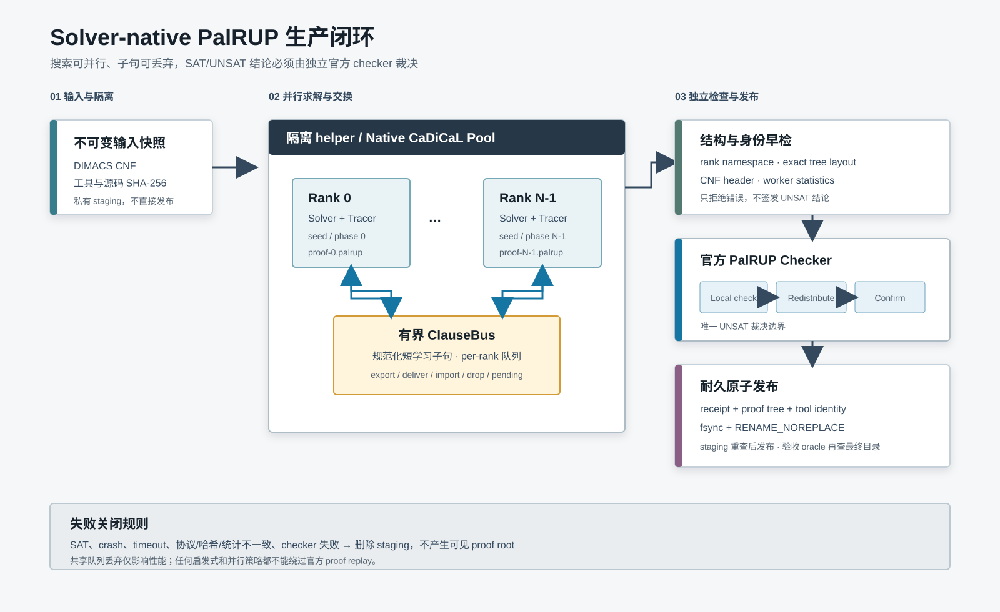

# F454：Solver-native 子句共享与 PalRUP 生产闭环

## 1. 研究问题与结论

F439 已定义 PalRUP 交换证明线协议，F440 已接入论文作者提供的官方检查流水线，但此前生产端仍由测试
夹具或外部文件驱动：系统不能直接从并行 SAT solver 的 proof callback 生成可全局确认的多 rank 证明。
F454 补上了这条关键链路。它在隔离 helper 中运行多个 CaDiCaL rank，通过 solver 原生 proof tracer 导出
PalRUP 片段，经有界 ClauseBus 共享短学习子句，再由官方 `palrup-local-check`、`palrup-redistribute` 和
`palrup-confirm` 三阶段检查后原子发布结果。

本项结论等级为 **I/T/E-mechanism**：真实 solver-native 导出、跨 rank 导入、官方全局确认、失败关闭与
持久化恢复已经实现并经过 1/2/4 rank 多轮机制实验。实验没有证明 SAT 求解加速、混合模糊测试覆盖率
收益或多节点扩展性；相反，数据明确暴露了证明体积和官方复核随 rank 增长的成本。



## 2. 执行流程

1. Parent 对 DIMACS 输入、wrapper、helper 和三项官方 checker 做 SHA-256 身份固定，并把输入复制到
   私有 staging 目录；solver 不直接操作最终发布目录。
2. 隔离 helper 加载固定 commit 构建的 CaDiCaL pool wrapper，创建 `N` 个 rank 线程。StartGate 保证
   所有 rank 完成初始化后同时开始；rank 使用稳定 ID、seed 和 phase 配置形成确定性多样性。
3. 每个 rank 通过 CaDiCaL `Tracer` 接收原生 proof 事件，并只写自己的 PalRUP fragment。fragment 文件
   不被其他 solver 修改，避免交错写入破坏 proof 顺序。
4. `SharingTracer` 从学习事件中筛选长度不超过配置上限的非空子句。ClauseBus 将 literal 按整数顺序
   规范化，并拒绝零、`INT_MIN`、重复 literal 和重言式；随后按目标 rank fan-out 到有界队列。
5. 每个 rank 的 `LearnSource` 从自己的队列导入其他 rank 的子句。系统记录 exported、delivered、
   imported、dropped 和 pending，检查 `delivered + dropped = exported × (N - 1)`；所有线程 join 后
   再统一采样终态 pending。
6. native pool 返回后，parent 严格解析 canonical JSON，核对 rank ID、DIMACS 变量/子句数、worker
   统计、fragment 数量和 exact tree layout。内置 parser 只承担结构早检，不形成可信结论。
7. 官方流水线依次执行 local-check、redistribute 和 confirm。只有全局 confirm 成功，parent 才生成绑定
   公式、工具身份、proof tree 和统计的 receipt；SAT、crash、超时、结构差异或 checker 失败均不发布。
8. receipt 与 artifacts 逐一 `fsync` 后，producer 从完整 staging tree 再执行一次 receipt 与官方 proof
   重放；通过后使用 `renameat2(RENAME_NOREPLACE)` 一次性发布。验收 oracle 还会从最终目录做第三次
   官方检查，验证发布对象未漂移。

## 3. 模块与通信关系

| 模块 | 进程/线程边界 | 输入 | 输出与通信 |
| --- | --- | --- | --- |
| Parent producer | 服务进程 | DIMACS、工具路径、rank 数 | 启动 helper；校验 JSON；驱动 checker；原子发布 |
| Isolated helper | 独立子进程 | 私有快照、pool `.so` | 通过 stdout 返回一条 canonical JSON；异常只污染 staging |
| Native solver pool | helper 内 N 个线程 | 同一 CNF、不同 rank/seed/phase | 共享内存 ClauseBus；每 rank 独占 proof fragment |
| ClauseBus | pool 内同步对象 | 规范化短学习子句 | 有界 per-rank 队列、fan-out 计数与 backpressure 丢弃 |
| Official checker | 三个独立进程 | CNF、rank fragments、交换证据 | local receipt、重分布 tree、全局 confirm receipt |
| Durable publisher | parent | 已确认 staging tree | no-replace 最终目录和可重放 receipt |

ClauseBus 是性能通道，不是正确性根：丢弃共享子句只会失去潜在求解收益，不能把错误结论变成正确结论；
每个 UNSAT 结论仍必须由官方 PalRUP checker 从原始 CNF 和完整 proof tree 重放确认。

## 4. 关键正确性合同

- **固定供应链**：checker 固定到 PalRUP SAT 2026 artifact commit
  `d9382fb4b0acf094034ee91e2ed0a22b1b479c1d`；producer 固定到 Mallob CaDiCaL fork commit
  `be7a0f84190b3216c589696b2010e8cbf8a8252e`。安装脚本拒绝 dirty tracked source，并记录编译器、
  source commit 和安装文件 SHA-256。
- **稳定命名空间**：rank 必须恰为 `[0,N)`，fragment、receipt 和统计必须一一对应。不能用文件枚举顺序
  推断 rank。
- **交换子句规范化**：PalRUP checker 对 communication clause 使用半排序查找；因此总线在 fan-out 前
  做数值排序。这不是展示层格式化，而是与官方 checker 的语义前提对齐。
- **严格统计绑定**：公式 SHA-256、DIMACS header、worker 报告与 parent 重算三方一致；Python 中
  `bool` 不能冒充整数计数，per-rank pending 不能超过配置队列容量。unexpected artifact、重封
  receipt 后的元数据篡改也会被拒绝。
- **隔离与失败关闭**：native 崩溃、signal、非 UNSAT、JSON 协议差异、工具身份漂移、proof 失败均只
  删除 staging，不创建可见 proof root。C++ impossible state 在 helper 内终止，不伪造子句。
- **耐久发布**：检查成功不等于发布成功；目录和文件落盘、完整 staging 官方 recheck 与 no-replace
  rename 共同构成生产完成条件；验收 oracle 另做发布后官方 recheck。

## 5. 工程实现

主要文件如下：

- `util/qfbv_cadical_palrup_pool.cpp`：多 rank solver pool、proof tracer、ClauseBus 与导入源；
- `util/qfbv_palrup_native_pool_worker.py`：隔离 C ABI、严格结果解码与 canonical JSON；
- `util/qfbv_palrup_native_producer.py`：快照、身份校验、official pipeline、原子发布与重放；
- `benchmark/install_cadical_palrup_sat2026.sh`：固定源码安装和可审计构建 manifest；
- `benchmark/check_qfbv_native_palrup_oracles.py`：1/2/4 rank、多轮、SAT negative 机制 oracle；
- `test/test_qfbv_palrup_native_producer.py`：协议、崩溃、篡改、backpressure 和真实 checker 测试。

典型机制检查命令：

```bash
python3 benchmark/check_qfbv_native_palrup_oracles.py \
  --rounds 3 \
  --output docs/codex/evidence/f454-native-palrup-production-2026-08-26/oracle.json
```

## 6. 测试与多轮审查

测试覆盖成功发布、发布后 recheck、SAT negative、helper 非零退出、真实 `SIGSEGV`、错误 rank 命名空间、
错误公式统计、`bool` 计数、`max_parallel` 上限、fragment/receipt 篡改、重封元数据攻击、额外 artifact、
队列容量 1 的 backpressure，以及安装版 producer/checker 的端到端运行。专项为
`13 passed + 7 subtests`，F439/F440/F454 耦合回归为 `34 passed + 26 subtests`；Python lint、shell
syntax 和两个 C++ wrapper 的 `-Wall -Wextra -Werror` 构建
均通过。完整 capability-closed Python gate 为 `1496 passed + 317 subtests`；16 项命令、模块与动态库
能力全部存在，node ID `1496/1496` 精确一致，且 skip、xfail、xpass、deselect、collection error 为零。

ASan/UBSan 检查覆盖项目 wrapper 与 C ABI 边界，2-rank 运行导入 68,289 条子句且无 address/undefined
diagnostic。由于测试宿主是未插桩 Python，LeakSanitizer 被显式关闭；固定 upstream CaDiCaL static
archive 也未插桩，因此该结论不外推为全栈 sanitizer 或 leak qualification。

审查过程修复的主要问题包括：通信子句未排序导致官方 confirm 失败；`max_parallel` 未约束实际 solver
数；witness rank 的非确定性被错误纳入 exact recheck；公式统计只信任 worker；硬崩溃残留 staging；
wrapper 安装跨文件系统替换不原子；以及 Python `bool` 通过整数类型检查。
最终源码审查还发现 per-rank `pending` 采样时刻不同；实现改为所有线程 join 后统一采样终态 inbox，
并重跑安装、官方 oracle、sanitizer 与回归。随后又把 pending 的配置容量上限加入首次解析和持久
receipt 复验，拒绝不可能的遥测值。

## 7. 多轮机制实验

公式为确定性 pigeonhole(9,8)，72 variables、549 clauses；队列容量 65,536，最大共享子句长度 32。
每种 rank 数执行 3 轮，所有样本均通过首次官方检查、完整 staging recheck 和发布后 recheck。

| rank | 样本 | pool 中位 | 端到端中位 | exported 中位 | imported 中位 | proof 中位 | 结论 |
| ---: | ---: | ---: | ---: | ---: | ---: | ---: | --- |
| 1 | 3 | 0.264 s | 3.218 s | 37,909 | 0 | 2.29 MB | 单 rank 原生证明基线成立 |
| 2 | 3 | 0.224 s | 6.974 s | 62,074 | 53,695 | 4.45 MB | 跨 rank 导入和全局确认成立 |
| 4 | 3 | 0.273 s | 9.760 s | 81,645 | 135,504 | 7.04 MB | fan-out 扩展成立，证明成本成为主导 |

主实验所有样本满足 fan-out 守恒且 `dropped=0`。所有 solver thread join 后的统一终态快照中，1/2/4
rank 的 pending 中位为 0/1,002/10,192，单样本最大为 10,441；该 residue 被显式记录，不参与 proof
正确性判断。容量 1 的独立测试又验证了发生丢弃时
官方证明仍然有效。2/4 rank 的 pool 求解阶段只比 1 rank 略慢，但端到端时间明显增长，说明当前瓶颈
主要位于 proof 体积、重分布和三次 official checking，而不是 solver thread 本身。该短小 UNSAT 公式
用于验证机制，不适合据此评价并行求解收益。

原始数据和工具哈希见 `evidence/f454-native-palrup-production-2026-08-26/oracle.json`。

## 8. 创新性、局限与下一步

F454 的工程贡献不是发明 PalRUP，而是将论文 artifact 的全局证明语义接入持续运行的并行符号执行服务：
solver-native proof 事件、实时子句共享、有界背压、独立官方裁决和 durable publication 被统一到一个可
审计事务中。它使后续并行 QF_BV 优化可以积极改变搜索策略，同时不扩大 SAT/UNSAT 信任根。

当前局限为单 helper 共享内存，不是 MPI/RDMA 多节点总线；只共享有界长度子句；没有 proof 压缩或
checker 流水并行；机制实验仅为短时合成 UNSAT。后续公开 R-track 必须使用预注册 benchmark、等 CPU
预算、多 seed 和 6h/24h 窗口，分别报告 solver time、proof/check time、coverage AUC 与失败率。实现路线
上的下一项是 F455 结构化 LLM concolic 闭环，其后为 F456 POSE 风格 heap 语义。

## 9. 研究依据

- PalRUP 的协议、检查流程与实验 artifact：
  [PalRUP: Proofs for Parallel SAT Solving](https://drops.dagstuhl.de/entities/document/10.4230/LIPIcs.SAT.2026.17)，
  SAT 2026。
- F439 线协议：[`LIDRUP_PalRUP_Proof_Wire_Interoperability_F439_2026-08-18.md`](LIDRUP_PalRUP_Proof_Wire_Interoperability_F439_2026-08-18.md)。
- F440 官方流水线：[`PalRUP_Global_Confirmation_Pipeline_F440_2026-08-18.md`](PalRUP_Global_Confirmation_Pipeline_F440_2026-08-18.md)。
