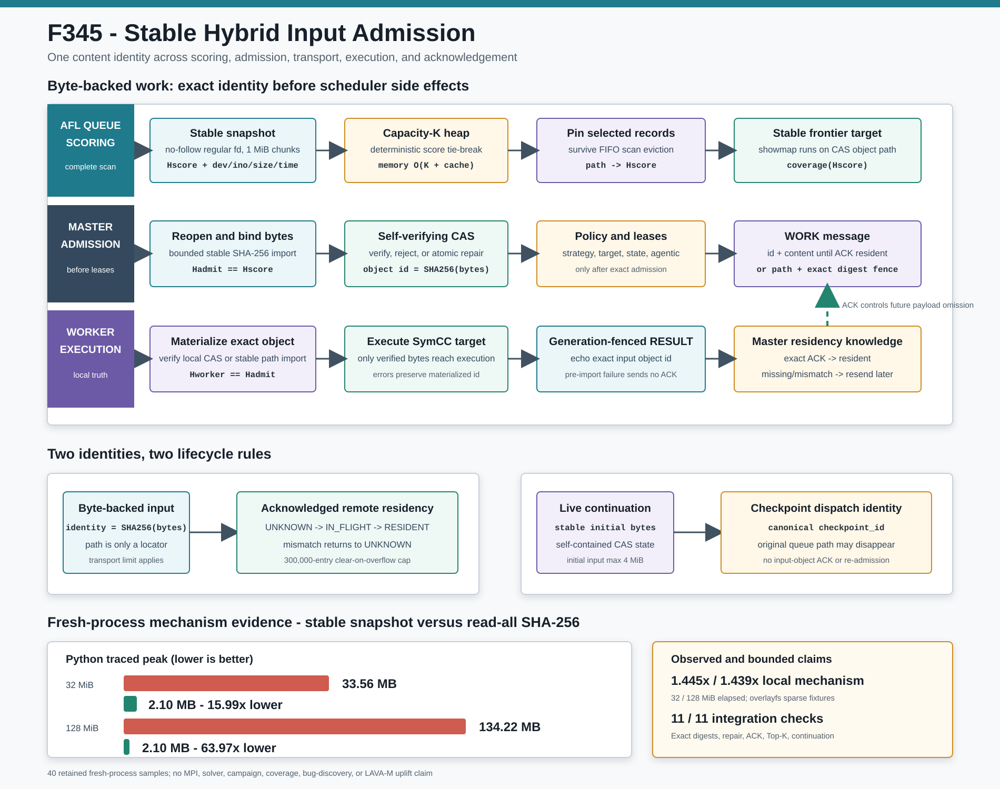

# F345：稳定 Hybrid 输入准入、CAS 自校验与确认式 Worker 驻留

> 功能编号：`F345`  
> 日期：`2026-08-10`  
> 状态：已实现、已验证、已归档  
> 范围：hybrid master/worker 输入数据面、AFL queue 选择、content-addressed input store 与 live-continuation 派发



## 1. 研究问题

F344 已经把 hybrid worker 的**输出**收集改为完整预算预检和稳定两遍读取，但反向的
master-to-worker 输入路径仍保留若干互相叠加的问题：

1. AFL queue 摘要通过 `sha256(f.read())` 计算，输入大小直接成为 Python 临时堆大小；
2. `_file_cache` 只按路径缓存，默认假设同名 queue entry 永不变化；
3. 缓存只在扫描开始前逐出，一次大扫描仍可把缓存临时扩展到 `O(N)`；
4. master 先收集全部候选再做 `nlargest(K)`，即使本轮只消费 K 项也保留 `O(U)` 候选；
5. frontier showmap 对可变原路径执行，而摘要可能来自另一次读取，评分对象与执行对象可能不同；
6. worker 的 path compatibility mode 使用 `copy2`，没有把本地字节绑定到 master 摘要；
7. CAS 仅用 `isfile` 判断已有对象，损坏内容或 symlink cache entry 可能被直接复用；
8. master 在 `send()` 成功后立即假定 worker 已缓存对象；worker 尚未物化或已失败时，后续消息可能错误省略内容；
9. worker 驻留集合和 CAS 验证状态没有独立硬上限；
10. live-continuation 初始化从可变路径读入，且自包含 checkpoint 后仍可能因原始 AFL 路径消失而被 master 二次拒绝。

这些问题不会直接改变约束求解器本身，却会破坏并行符号执行依赖的基本实验对象：
“被评分、被租约标识、被 worker 执行并被结果归因的是否为同一组输入字节”。如果这个前提不成立，
覆盖收益、solver telemetry、target lease 奖励和 agentic policy observation 都可能被归到错误输入。

## 2. 目标与形式化不变量

F345 将 byte-backed work 与 self-contained continuation 明确区分。

### 2.1 稳定 regular-file snapshot

对路径 `p` 和上限 `L`，生产原语：

```text
S(p, L) -> (H, I, B?)
```

其中：

- `H = SHA256(bytes)`；
- `I = (device, inode, size, mtime_ns, ctime_ns)`；
- `B` 仅在调用方确实需要 transport payload 时保留；
- 实际读取字节数、读前 fd、读后 fd 和最终 no-follow path 必须共同闭合到同一 `I`；
- `size <= L` 且实际读到的字节数等于声明 size。

因此成功返回意味着摘要绑定到一个读取期间未变化、最终仍由该路径指向的 regular inode。

### 2.2 评分、准入与执行摘要相等

对于 AFL queue 候选：

```text
H_score == H_master_admit == H_worker_materialized
```

- `H_score` 来自稳定 queue scan；
- `H_master_admit` 在任何 strategy、lease、state-task 或 agentic 副作用前重新建立；
- `H_worker_materialized` 由 worker 本地 CAS 或共享路径稳定导入得到。

若 score record 仍存在而摘要不同，master 删除旧记录并拒绝本次派发。有限 Top-K 选择会把最终
选中记录固定到受限 cache 尾部，避免“早枚举、高得分”的记录在同一扫描中被 FIFO 逐出，从而失去
评分栅栏。

### 2.3 CAS 复用必须先证明内容地址

对象 `o` 的复用条件不再是“路径存在”，而是：

```text
regular_no_follow(path(o))
and stable_SHA256(path(o)) == o
```

CAS 写入使用同目录临时文件、完整写循环、file `fsync` 和 durable replace。若已有路径是损坏
regular file 或 symlink：

- 无 payload 的 contentless reuse 失败；
- 带精确 payload 的重传执行原子修复；
- symlink 指向的外部文件不会被修改。

已验证身份缓存只在 `device/inode/size/mtime/ctime` 完全不变时跳过重哈希，并在 300,000 项时
清空，避免长期 campaign 无界增长。

### 2.4 Worker 驻留是 RESULT 确认后的知识

master 的 `worker_objects[rank]` 表示“已经被当前 generation 的 RESULT 确认存在”，而不是
“曾尝试发送”。状态转换为：

```text
UNKNOWN --send(content)--> IN_FLIGHT
IN_FLIGHT --current RESULT echoes exact object id--> RESIDENT
IN_FLIGHT --missing/mismatch/error--> UNKNOWN
RESIDENT --future dispatch--> send(id only)
RESIDENT --failed verification / missing ACK--> UNKNOWN
```

只有通过既有 dispatch-generation gate 的 current RESULT 才能建立驻留。每 worker 集合上限为
300,000；溢出时清空再记录当前对象，代价只是未来重传，不会错误省略 payload。

### 2.5 Continuation 使用 checkpoint 身份

live continuation 是自包含的 CAS 状态，不是需要 worker 重新打开原始 seed 的 byte work：

- 初始 concrete input 仍通过稳定 no-follow snapshot 创建，且受 transport limit 与 executor 4 MiB
  能力上限共同约束；
- checkpoint 创建后，以 canonical descriptor 的 `checkpoint_id` 作为 dispatch identity；
- master 不再为 continuation 重开原始 AFL locator；
- checkpoint 不进入 analyzed-input digest 集合，也不参与 input-object ACK cache。

这保证原始 queue 文件被 AFL 删除后，已经完整持久化的 continuation 仍可恢复和执行。

## 3. 执行流程

### 3.1 AFL queue 扫描与 Top-K

1. 以 context-managed `scandir` 流式遍历 queue；
2. `entry.stat(follow_symlinks=False)` 只接受 regular entry；
3. 建立 metadata identity；与缓存身份不同则执行稳定分块 SHA-256；
4. 计算静态分数、历史 edge yield、frontier 与可选 contextual score；
5. `batch_size=K` 时维护容量 K 的 min-heap，tuple tie-break 消除同分枚举顺序；
6. 每次插入后立即执行 `MAX_FILE_CACHE` 上限；
7. 排序最终 Top-K；当 `K <= cache_limit` 时把选中 digest record 固定到缓存尾部。

候选选择额外空间由旧式 `O(U)` 降为：

```text
O(K + cache_limit)
```

其中 U 是未处理候选总数。扫描和必要的哈希工作仍为 `O(N + bytes_hashed)`，F345 没有声称
消除完整 namespace 检查。

### 3.2 Master 派发前准入

对普通 byte input：

1. 用稳定 snapshot 读取，受 `SYMCC_MAX_TRANSPORT_INPUT` 限制；
2. 将精确内容放入 master CAS；
3. 若 queue score cache 中有摘要，要求它与 CAS object id 相同；
4. 只有上述步骤成功后，才选择 solver strategy、申请 target/work/state lease、建立 parameter
   assignment 和 agentic task；
5. 所有下游身份使用相同 SHA-256。

这将“输入拒绝”放在可撤销派发事务的最前端，避免一个失稳路径留下错误 lease 或在线学习样本。

### 3.3 两种 Worker 输入模式

**Content-object mode（默认）**

- WORK 始终携带 `sha256` 与 `object_id`；
- master 只有在 worker 未确认驻留时才附加 `object_content`；
- worker 要求 `object_id == sha256`；
- 已有对象先自校验，缺失/损坏时只有精确 payload 才能物化或修复。

**Path-digest compatibility mode**

- WORK 携带共享路径 locator 与 master 的 `sha256`；
- worker 不再直接 `copy2`；
- worker 对 locator 做稳定、有界、no-follow 导入到本地 CAS；
- observed digest 与 master fence 不同则拒绝，不运行目标。

因此关闭 object transport 只改变内容如何到达 worker，不改变“执行字节必须等于 master 准入字节”的
语义契约。

### 3.4 结果确认与后续复用

1. worker 成功物化后保存 `materialized_object_id`；
2. 正常结果或后续执行错误的 RESULT 都回显该 ID；物化前失败不回显；
3. master 先验证 dispatch token/generation；
4. current RESULT 的 ID 与 active input SHA 精确相等才记录 `RESIDENT`；
5. 缺失或不匹配会移除该 worker 的同对象驻留假设；
6. 下一次派发只有在确认驻留时才省略 bytes。

该协议优化了重复种子、focus partition、target replay 等会把同一内容多次发给同一 rank 的场景，
同时把错误省略 payload 的风险转化为可恢复的冗余重传。

## 4. 实现位置

### 4.1 稳定文件与 CAS

[`util/distributed_state.py`](../../../util/distributed_state.py)：

- `StableRegularFileIdentity`；
- `StableRegularFileSnapshot`；
- `stable_regular_file_snapshot`；
- `ContentAddressedInputStore._verified_object`；
- 加固后的 `put/import_path/materialize`。

### 4.2 Hybrid 编排

[`util/mpi_fuzzing_helper.py`](../../../util/mpi_fuzzing_helper.py)：

- `AflConfig.best_new_testcases`：identity-aware digest cache、容量 K heap 与 selected-record pin；
- `_frontier_score`：对稳定 CAS 路径运行 showmap；
- `_profile_density`：使用有界稳定 snapshot；
- `_admit_hybrid_master_input`：byte input 的前副作用摘要栅栏；
- `_admit_hybrid_master_work`：区分 byte object 与 self-contained checkpoint；
- `_materialize_hybrid_worker_input`：object/path 两模式统一摘要栅栏；
- `_acknowledge_worker_input_object`：RESULT 后确认驻留；
- master/worker WORK-RESULT 接线及 live-continuation 初始化。

配置语义记录在 [`docs/Configuration.txt`](../../Configuration.txt)，测试位于
[`test/test_distributed_state.py`](../../../test/test_distributed_state.py) 和
[`test/test_mpi_lifecycle.py`](../../../test/test_mpi_lifecycle.py)。

## 5. 正确性验证

新增测试覆盖：

1. import 对 symlink、超限与读取期间原子 path replacement 的拒绝；
2. CAS 正常复用时的 identity fast path；
3. 已缓存 regular object 被破坏后的 contentless rejection 与 payload repair；
4. CAS 路径被替换为 symlink 后拒绝，修复不修改 symlink target；
5. AFL 同名 replacement 在评分与 dispatch 间被识别；
6. 超限与 symlink queue entries 不进入候选；
7. 有限 Top-K 顺序确定，缓存始终受界；
8. 高分候选即使早枚举并在扫描中被逐出，最终 score fence 仍被固定；
9. worker 首次传内容、确认后无内容复用、损坏拒绝与重传修复；
10. missing/mismatched ACK 驱逐驻留，exact ACK 才建立驻留；
11. worker residency cap 的 clear-on-overflow 行为；
12. path mode 在 master 准入后替换源时被 digest fence 拒绝；
13. self-contained continuation 对不存在的原始路径不做二次输入读取。

定向两模块回归：

```text
205 passed, 58 subtests passed in 17.43s
```

相关六模块 warnings-as-errors 回归：

```text
349 passed, 74 subtests passed in 18.38s
```

完整 warnings-as-errors Python 回归：

```text
742 passed, 94 subtests passed in 100.85s
```

## 6. 本地生产原语集成

集成驱动在真实临时文件系统上直接调用生产 queue/CAS/master/worker primitives，不使用 mock
文件内容。保存的 11 项检查全部为 true：

| 检查 | 结果 |
|---|---|
| 首次 queue snapshot 内容摘要精确 | 通过 |
| 同名 replacement 使旧 score 失效 | 通过 |
| rescore 后 master 准入第二版精确内容 | 通过 |
| 首次 content transfer 与 exact ACK | 通过 |
| contentless cache reuse 前自校验 | 通过 |
| corruption rejection 与 ACK 驱逐 | 通过 |
| payload resend 原子修复 | 通过 |
| path mode 由 master digest fencing | 通过 |
| oversize 与 symlink 输入拒绝 | 通过 |
| Top-K score fence 经缓存逐出仍保留 | 通过 |
| continuation 以 checkpoint identity 派发且不读缺失 path | 通过 |

关键内容身份为：

```text
first  = cb8f3a160bdac8da0606d2dd85d50284f5034f935846cd5746cda83d61574ebe
second = a78d986a5010b4f0a1390092180a3282c448619ad4a2833be5688524f98efada
checkpoint = 2cf497146993db3cdbf58cfc77e416ec6de27d9cc5caeec1a29122ee5dc45822
```

这证明本地生产原语接线和状态转换，不证明真实 MPI serialization、多节点共享文件系统、
afl-showmap、目标执行、solver 或 campaign 性能。

## 7. Fresh-process 机制实验

### 7.1 实验设计

比较两个摘要机制：

- `legacy`：`open().read()` 整体物化后执行 SHA-256；
- `stable`：调用生产 `stable_regular_file_snapshot`，固定 1 MiB chunk、no-follow、摘要-only，
  并闭合 fd/path identity。

在 Linux overlayfs 上分别使用 32 MiB 和 128 MiB sparse regular input。每个 scale/mechanism 先
2 次 warm-up，再以固定种子 `0xF345` 逐轮交错保留 10 个 fresh Python process 样本，共 40 个
retained samples。所有样本必须报告正确 size，并且两机制的 SHA-256 集合严格相等。

### 7.2 结果

| 输入 | 指标 | Legacy 中位数 | F345 中位数 | 变化 |
|---:|---|---:|---:|---:|
| 32 MiB | traced Python peak | 33,559,002 B | 2,098,278 B | **降低 15.994x** |
| 32 MiB | `ru_maxrss` | 60,104 KiB | 27,816 KiB | **降低 2.161x** |
| 32 MiB | elapsed | 23,306.0485 us | 16,127.0705 us | **本机机制 1.445x** |
| 128 MiB | traced Python peak | 134,222,298 B | 2,098,278 B | **降低 63.968x** |
| 128 MiB | `ru_maxrss` | 158,374 KiB | 27,816 KiB | **降低 5.694x** |
| 128 MiB | elapsed | 91,090.9805 us | 63,279.571 us | **本机机制 1.439x** |

F345 的 traced peak 在输入扩大 4 倍时保持 2,098,278 B，表明 digest-only 读取的 Python
payload 峰值由输入总长解耦。该主机上分块摘要还比 read-all 更快，主要反映大 `bytes` 分配、
tracemalloc 与 sparse/page-cache 条件下的本地机制差异；不能据此推断真实 campaign、NFS/Lustre
或 MPI 吞吐必然加速。

## 8. 先进性、创新性与工程挑战

F345 不是新的求解算法，而是面向并行混合符号执行的数据一致性与资源基础设施。其先进性体现在：

- **端到端内容身份**：调度评分、master 准入、worker 物化和结果确认共享同一 SHA-256；
- **前副作用准入**：输入完整性失败发生在 lease、策略学习和状态任务之前；
- **确认式缓存一致性**：master 不把“send 成功”等同于“远端对象存在”，以 generation-fenced
  RESULT 建立正向知识；
- **自校验 CAS**：缓存命中是经过 regular/no-follow/摘要验证的事实，不是路径存在性猜测；
- **有界在线调度元数据**：完整扫描同时把候选选择内存限制为 `O(K)`，并修复 cache cap 只在
  扫描前生效的瞬时越界；
- **执行对象一致的 frontier**：showmap 针对稳定 CAS 路径，避免评分摘要与动态覆盖来自不同版本；
- **状态任务与路径解耦**：self-contained continuation 以 checkpoint identity 存活，不被临时
  queue locator 生命周期绑架；
- **失败偏向可恢复冗余**：驻留信息不确定时重传，而不是在缺失 payload 时执行错误输入。

实现难点是同时兼容 object transport、共享 path mode、旧 worker error result、dispatch generation
gate、target/work/state lease、在线 solver/parameter policy、focus partition 和 continuation 恢复。
仅在单个 `open()` 周围加锁无法解决跨主机路径可见性，仅依赖内容摘要又无法证明被哈希期间路径没有
换代；因此实现组合了 bounded snapshot、metadata closure、CAS verification 和 acknowledged residency。

## 9. 与 F341/F344 的边界

- F341 处理 standalone runner 的 external seed 导入、owner 发布和 worker 输入复制；
- F344 处理 hybrid worker-to-master 的生成结果收集；
- F345 处理 hybrid master-to-worker 的输入队列、输入 CAS 和远端驻留知识。

三者共享稳定 regular inode 和固定窗口思想，但位于不同协议方向和进程拓扑，不能互相替代。

## 10. 局限与有效性威胁

1. final-component `O_NOFOLLOW` 不等于 `openat2(RESOLVE_BENEATH)`；父目录替换或 Byzantine
   filesystem 不在当前模型内。
2. master 为 object transport 仍需在 admission 时保留一个受
   `SYMCC_MAX_TRANSPORT_INPUT` 限制的完整 payload，峰值是 `O(max_input)` 而非严格常数。
3. queue 仍完整遍历，首次或 identity 变化的对象仍需完整哈希；F345 只限制选择 heap/cache，
   不把扫描复杂度描述为 `O(K)`。
4. identity fast path 假设普通本地/共享文件系统不会在保持
   dev/inode/size/mtime/ctime 全部不变时静默改变内容，不提供远端证明。
5. worker residency set 超限时整体清空，会形成短期重复传输峰值；它保持正确性但不是精确 LRU。
6. 本地集成没有运行真实 MPI、afl-showmap、目标或 solver；没有 coverage、throughput、bug、
   LAVA-M 或多节点提升结论。
7. fresh-process 基准使用 sparse file、overlayfs 和热 page cache；`tracemalloc` 不包含 native、
   kernel 或 MPI buffer，`ru_maxrss` 是进程峰值。
8. 当前 ACK 随普通 RESULT 携带；worker 在物化后长时间执行时，master 在该段时间内仍会重传同一
   内容给其他 dispatch generation。单独的早期 object ACK 可降低延迟，但会增加协议状态。
9. 300,000 项的 clear-on-overflow 上限是工程默认值，尚未通过超长真实 campaign 调优。

## 11. 后续方向

1. 设计带 generation 的早期 object-residency ACK，与最终执行 RESULT 分离；
2. 用分块 MPI payload 或 RDMA/object-store pull 避免 master 保留完整 transport bytes；
3. 将 queue discovery 拆为增量事件日志加周期性全量校验，减少超大 corpus 重扫；
4. 在真实 Open MPI 多 rank 环境验证首次传输/复用/worker cache loss/重传闭环；
5. 在本地 SSD、NFS、Lustre 和对象存储代理上分层测量 snapshot/CAS 成本；
6. 在 AFL++ + SymCC campaign 中报告 bytes transmitted、cache hit、revalidation、reject rate、
   exec/s、coverage 和 solver telemetry，并与 F344 的结果数据面共同消融。

## 12. 证据索引

- 证据目录：[`evidence/f345-stable-hybrid-input-2026-08-10/`](../evidence/f345-stable-hybrid-input-2026-08-10/)
- 机制 raw data：[`hybrid-input-snapshot-cost.json`](../evidence/f345-stable-hybrid-input-2026-08-10/hybrid-input-snapshot-cost.json)
- 本地集成：[`hybrid-input-integration.json`](../evidence/f345-stable-hybrid-input-2026-08-10/hybrid-input-integration.json)
- 定向测试：[`directed-tests.log`](../evidence/f345-stable-hybrid-input-2026-08-10/directed-tests.log)
- 相关回归：[`integration-tests.log`](../evidence/f345-stable-hybrid-input-2026-08-10/integration-tests.log)
- 完整回归：[`full-tests.log`](../evidence/f345-stable-hybrid-input-2026-08-10/full-tests.log)
- 机制图：[`stable-hybrid-input-admission-2026-08-10.svg`](../diagrams/stable-hybrid-input-admission-2026-08-10.svg)
