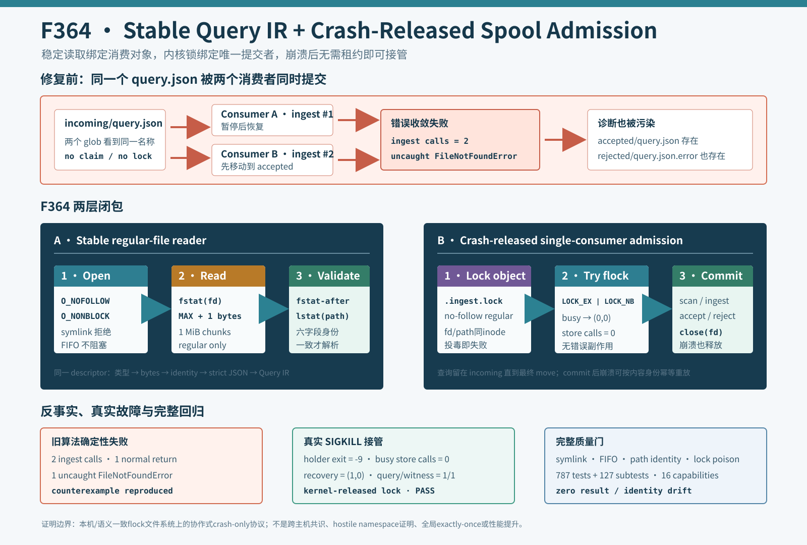

# F364：Stable Query IR and Crash-Released Spool Admission

- 功能编号：F364
- 日期：2026-08-11
- 状态：已实现、已完成竞争/崩溃/文件类型反例与完整回归
- 范围：Query IR 稳定文件读取、query spool 协作式单消费者准入、崩溃恢复



## 1. F363 之后仍存在的边界

F363 关闭了 `stat(path) -> reopen(path)` 的大小证明分裂，并拒绝重复 JSON member 与非有限数。继续沿生产调用链审查时
发现，单个 reader 的严格 JSON 仍不足以保证整个 spool 服务正确：

1. `ingest_spool()` 没有消费者 claim。两个服务可以同时枚举同一 `incoming/query.json`，都调用
   `QueryStore.ingest_file()`，再竞争移动同一个源文件；
2. `Path.open("rb")` 仍会跟随最终 symlink。名为 `*.json` 的 FIFO 还可能在打开时阻塞服务；
3. reader 在读取后没有复核 descriptor 与当前 path 身份，路径被替换或 inode 被原地修改时不能失败关闭；
4. 即使新增锁，如果锁对象本身允许 symlink/FIFO，也可能形成不同消费者锁住不同 inode 或阻塞在锁打开阶段。

这些问题属于并行求解控制面的正确性，而不是攻击功能：生产者和多个服务实例在崩溃、重启或配置重叠时可能自然触发。

## 2. 修复前的确定性竞争反例

证据驱动器保存并执行旧消费算法。第一个线程在 `ingest_file()` 内暂停，第二个线程完成入库并把文件移动到
`accepted/`，随后第一个线程继续：

```text
consumer A: list query.json -> ingest call #1 -> pause
consumer B: list query.json -> ingest call #2 -> move accepted -> return (1, 0)
consumer A: move accepted -> ENOENT -> write rejected/query.json.error
            move rejected -> ENOENT escapes
```

实测不变量为：`ingest_calls=2`、只有一个正常 `(1,0)` 返回、另一个未处理 `FileNotFoundError`，并残留一个把并发竞争
误报为坏查询的 `.error`。这证明问题不只是重复的幂等数据库写入，还会中断 polling loop 并污染诊断。

## 3. 稳定 regular-file Query IR 读取

### 3.1 打开与类型门

`_load_query_envelope()` 改用：

```text
os.open(path, O_RDONLY | O_NOFOLLOW | O_NONBLOCK | O_CLOEXEC)
  -> fstat(fd)
  -> require S_ISREG
```

`O_NOFOLLOW` 拒绝最终 symlink；`O_NONBLOCK` 让 FIFO 打开不会挂住进程，随后 regular-file 门立即拒绝。平台缺少
`O_NOFOLLOW` 时失败关闭，而不是降级为跟随链接。

### 3.2 有界读取与身份闭包

reader 仍保持 F363 的 `MAX+1` 原始字节上限，但改为最多 1 MiB 的 `os.read()` 块，并处理 `InterruptedError`。读取前记录：

```text
(st_dev, st_ino, st_mode, st_size, st_mtime_ns, st_ctime_ns)
```

读取结束后同时比较 `fstat(fd)` 与 `stat(path, follow_symlinks=False)`。只有 descriptor-after、path-after 与读前身份完全
相同，才对保留的 bytearray 做 UTF-8、严格 JSON 和 Query IR 语义验证。路径替换、截断/追加、chmod 或可观测的原地改写
全部失败，坏输入不会进入 SQLite。

这是稳定读取证明，不是文件系统事务快照：恶意或特权 writer 若能制造元数据 ABA 仍超出当前模型；父目录组件也尚未逐层
no-follow 锚定。

## 4. Crash-Released Spool Admission

### 4.1 稳定锁对象

每个 spool 使用固定 `.ingest.lock`。服务以 `O_NOFOLLOW | O_NONBLOCK | O_CLOEXEC | O_CREAT` 打开，要求 descriptor 与
当前 path 都是同一个 regular inode，再尝试：

```text
flock(fd, LOCK_EX | LOCK_NB)
```

锁忙时返回 `(0,0)`，不枚举输入、不调用 QueryStore，也不制造错误文件。持锁者覆盖完整的 `incoming` 扫描、入库和
accepted/rejected 移动，因而所有遵循协议的消费者对同一 spool 串行提交。

### 4.2 崩溃恢复语义

descriptor 在 `finally` 中关闭；`KeyboardInterrupt` 等 `BaseException` 同样释放。若进程被 `SIGKILL`，内核关闭 fd 并
释放 flock，不依赖清理 handler 或 wall-clock lease。

查询在成功移动前始终保留在 `incoming/`：

- 入库前崩溃：下一消费者正常处理；
- SQLite commit 后、move 前崩溃：下一消费者按内容身份幂等重放，再完成移动；
- move 后崩溃：输入已位于 accepted/rejected，不会再次被 incoming 枚举。

本轮单元测试用 `KeyboardInterrupt` 在 successful ingest 后、accepted move 前中断；恢复调用得到 `(1,0)` 并形成单一
query/witness。独立证据则对真实持锁子进程发送 `SIGKILL(-9)`，证明锁由内核释放。

## 5. 生产反例与结果

| 场景 | 关键观测 | 结果 |
|---|---|---|
| 旧双消费者算法 | ingest=2、正常返回=1、未处理 ENOENT=1 | 反例成立 |
| 子进程持锁，竞争服务轮询 | `(0,0)`、QueryStore calls=0、输入仍在 incoming | 忙锁无副作用 |
| 持锁进程 `SIGKILL(-9)` | 新服务 `(1,0)`，query=1、witness=1 | 自动接管 |
| good + symlink + FIFO | 1 accepted / 2 rejected，耗时小于1秒 | 不跟随、不阻塞 |
| 读后 path inode 改变 | identity error，stored queries=0 | 失败关闭 |
| `.ingest.lock` 为 symlink/FIFO | store calls=0、输入保留、外部目标不变 | 锁对象失败关闭 |

## 6. 测试与完整门禁

| 验证层 | 结果 |
|---|---:|
| 可执行 production/counterfactual checks | 6 组性质全部 PASS |
| `test/test_query_store.py` | 20 passed + 2 subtests（2.25秒） |
| QueryStore/QF_BV/schedule/semantic proposal | 124 passed + 2 subtests（15.22秒） |
| canonical nodeid 重建 | 787 项，SHA-256 与文件字节一致 |
| 完整 capability + identity gate | 787 passed + 127 subtests（98.85秒） |
| 能力缺失 | 0 / 16 |
| 结果退化 | 0 failed/skip/xfail/xpass/deselected/collection error |
| 身份退化 | 0 missing/unexpected/duplicate |

两个新增 subtest 检查 symlink/FIFO 锁对象，因此 pytest nodeid 仍为 787，但 subtest 从 125 增至 127。完整 gate 的终端输出
与机器可读 JSON 对此保持一致。

## 7. 工程价值与研究定位

F364 把 Query IR 准入从“每个 reader 自己严格”扩展为“文件身份稳定、同一 spool 单消费者、崩溃后可恢复”的组合协议。
它采用三个互补机制：descriptor-bound observation 防止消费对象漂移，strict JSON 防止解释漂移，kernel lock 防止提交者
并发。任一层失败都发生在持久求解任务被错误接纳之前。

该设计属于 crash-only、cooperative concurrency 模型，接近数据库 ingest queue 和内容寻址流水线常用的 admission
discipline；它不是分布式共识、exactly-once execution 或新的符号执行算法 SOTA。QueryStore 的内容身份与幂等 mutation
让“at-least-once recovery + unique query identity”收敛，但不把求解器外部副作用升级为全局 exactly-once。

## 8. 局限与有效性威胁

1. `flock` 是 advisory lock，只约束遵守同一协议的消费者；不合作进程仍可修改 incoming 或锁路径；
2. 当前没有把 query spool 的文件系统绑定到 F327/F329 的跨主机锁资格证明；真实 NFS/Lustre/CephFS 多主机部署前必须
   验证 flock 语义，不能从本机结果外推；
3. 全 spool 锁会串行化入库扫描，虽然 solver workers 仍并行；本轮未测 backlog 吞吐、公平性或长查询入库延迟；
4. 锁 inode 在准入时校验，但不提供外部路径替换下的持续 namespace capability 或 ABA 历史证明；
5. Query IR 只对最终 leaf 使用 `O_NOFOLLOW`，父目录组件和 mount 切换尚未逐层锚定；
6. raw-byte 上限仍不等于完整 JSON/QueryStore RSS 上限；
7. `(0,0)` 同时表示空 spool 与忙锁，当前调用者无需区分，但遥测还不能直接观测 contention；
8. 未触发 GitHub 托管 runner，也未运行 LLVM lit、QSYM/PIN、真实 MPI、solver/coverage campaign、公开 benchmark 或
   LAVA-M；98.85秒仅是一次回归耗时，不支持性能结论。

## 9. 实现与证据索引

- 稳定 reader：`util/query_store.py`；
- spool 锁与消费：`util/symcc_query_service.py`；
- 单元/并发/恢复测试：`test/test_query_store.py`；
- 生产证据驱动器：`docs/codex/evidence/f364-stable-query-spool-admission-2026-08-11/`；
- 机制图：`docs/codex/diagrams/stable-query-spool-admission-2026-08-11.svg`；
- 配置语义：`docs/Configuration.txt`。

## 10. 后续方向

1. 把 spool root 逐组件打开为 no-follow directory capability，并让 lock、incoming、accepted、rejected 全部使用 dirfd 相对 I/O；
2. 将 cross-host query service 启动与 F327/F329 filesystem/flock qualification 绑定；资格不足时限制为单 owner；
3. 引入机器可读 `busy_scans`、`lock_wait_ns`、`ingest_latency` 和 backlog 指标，再决定全局锁是否需要按 shard 拆分；
4. 若按 shard 并行，必须以 query filename/content identity 做确定性分片并保持同一文件唯一 owner；
5. 增加 crash point matrix，覆盖 error sidecar 写入、accepted/rejected rename 和 SQLite commit 的每个边界。

## 11. 结论

F364 修复了一个已由真实竞争重现的并发错误：旧算法会对同一文件入库两次，随后产生未处理 `FileNotFoundError` 和误导性
错误文件。稳定 regular-file reader、失败关闭的锁对象和 crash-released flock 共同建立了协作式单消费者准入。真实
`SIGKILL` 接管、文件类型/身份反例和完整 `787 passed + 127 subtests` 门禁支持本地机制正确性与无回归结论，但不支持
跨主机锁语义、全局 exactly-once 或符号执行性能/覆盖率提升主张。
