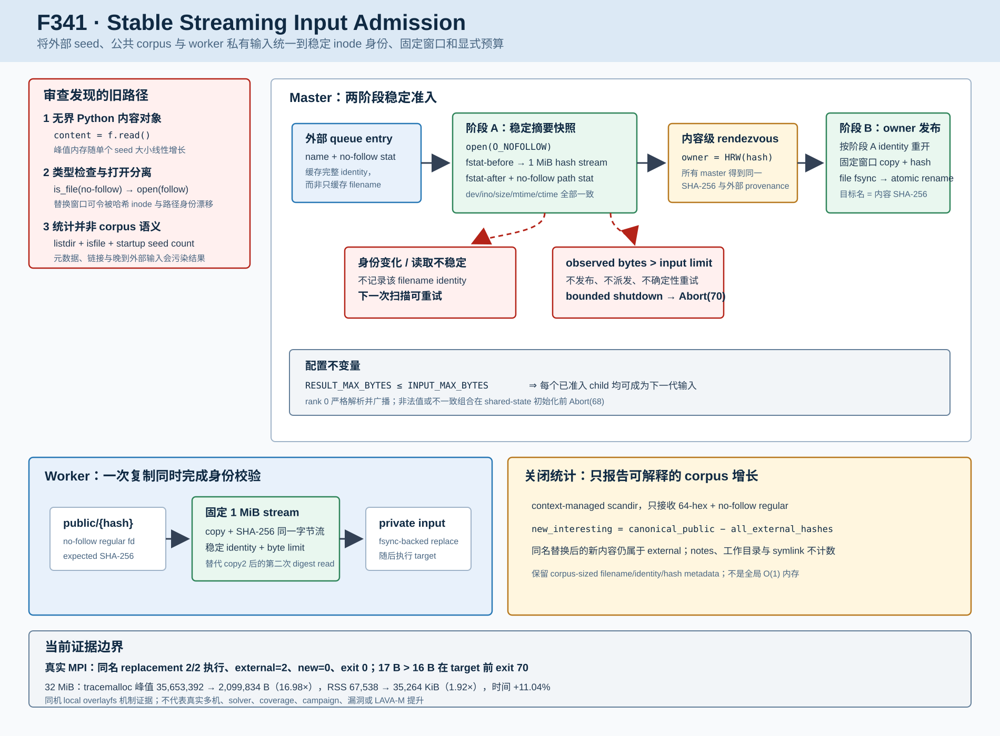

# F341：Stable Streaming Input Admission 与可解释 Corpus 统计

> 日期：2026-08-10  
> 状态：已实现，真实 MPI 与机制成本已验证  
> 范围：standalone `mpi_concolic_execution.py` 的外部输入导入、公共 corpus 扫描、worker 输入复制与最终统计

## 1. 研究问题

F339/F340 已把符号执行结果的发现、暂存和 master 准入改为 expected-first、no-follow、固定窗口与双预算，
但反向的数据流仍不对称：外部 seed 进入公共 corpus 时使用 `f.read()` 构造完整 Python `bytes`；worker 先
`shutil.copy2`，随后再完整读取一次计算 SHA-256；类型判断与普通 `open()` 分离；最终统计用
`os.listdir + os.path.isfile` 物化全目录并跟随链接。代码审查进一步发现，运行中晚到的 AFL queue 输入虽然
加入 `external_hashes`，最终却只减去启动时 seed 数，会把外部供给错误报告成符号执行产生的新增样例。

这些问题不会直接改变 solver 语义，却会破坏实验的三项基础条件：

1. **资源可控性**：一个超大 seed 可以在 master 中制造与文件大小线性相关的 Python 峰值；
2. **内容身份**：`is_file(no-follow)` 与后续 follow-open 之间的替换窗口可能令目录项与实际读取 inode 不同；
3. **指标可解释性**：非 corpus 元数据、symlink 和晚到外部输入会污染“New interesting”结论。

F341 的目标不是宣称覆盖率提升，而是让输入数据面与 F339/F340 的结果数据面具有相同的身份、预算和失败边界。



## 2. 设计不变量

### 2.1 配置不变量

rank 0 严格解析并广播：

```text
SYMCC_STANDALONE_INPUT_MAX_BYTES ∈ [1, 2^40]
RESULT_MAX_BYTES <= INPUT_MAX_BYTES
```

默认输入上限为 256 MiB。第二个关系不是任意约束：单个 child 的大小不可能超过一个 parent 的 result logical
byte total，因此它保证所有通过 F340 result admission 的 child 都可以成为下一代输入。非法整数、越界值或
不一致组合在 shared-state 初始化前 `Abort(68)`，避免不同 rank 执行不同 live policy。

输入预算是 live admission policy，不写入历史 commit identity。恢复时不可逆 committing manifest 仍先按 F322/F340
完成 redo；如果其公共对象超过后来降低的输入上限，系统随后拒绝派发并失败关闭，而不是回滚已经发生的发布。

### 2.2 稳定文件身份

F341 用以下五元组描述一次 regular-file snapshot：

```text
I = (st_dev, st_ino, st_size, st_mtime_ns, st_ctime_ns)
```

摘要或复制必须满足：

```text
open(path, O_RDONLY | O_NOFOLLOW | O_NONBLOCK | O_CLOEXEC)
fstat_before(fd) == I
read/hash/copy in chunks <= 1 MiB
fstat_after(fd) == I
lstat_equivalent(path) == I
bytes_read == I.size
```

这同时约束“同一 descriptor 的内容稳定”和“当前路径仍指向该 descriptor”。final-component symlink、FIFO、device、
目录、读取中 append/truncate、原地修改以及路径 replacement 均不能静默跨过准入。这里的 `O_NONBLOCK` 用于避免在
类型确认前被特殊文件阻塞；真正接受的 inode 仍必须是 regular file。

## 3. Master 输入导入流程

### 3.1 阶段 A：摘要与 owner 选择

每次外部扫描使用 context-managed `os.scandir`，不构造名称列表。`imported_files` 从 `set[filename]` 改为
`dict[filename, identity]`：未变化的名称只做一次 no-follow stat；同名文件被原子替换或原地修改后 identity
不同，会重新进入准入，而不会因旧名称永久丢失新内容。

每个 master 对新 identity 做固定窗口稳定摘要，得到 SHA-256 后继续使用既有 HRW/rendezvous
`designated_owner(hash)`。所有 master 都记录该 hash 的 external provenance；非 owner 不发布，owner 进入阶段 B。
这保持多 master 对“initial/generated”的一致分类，但当前仍有每个 master 都读取一次新外部输入的放大，见限制。

### 3.2 阶段 B：owner 二次稳定发布

owner 不能复用阶段 A 的完整内容，因为 F341 明确不保留无界 `bytes`。它按阶段 A 的 exact identity 重新打开源文件，
在公共目录生成随机非规范临时名，并用同一个字节流完成 SHA-256、partial-safe `os.write` 和 file fsync。只有 digest、
size 和 identity 全部仍一致，临时文件才通过 durability-backed atomic replace 发布为 `shared_dir/{sha256}`，随后再次
验证公共对象。

这比旧路径多一个 owner source pass，但将 Python 内容峰值从 `O(seed_size)` 变为 `O(1 MiB)`，并阻止“hash 的是
旧内容、发布的是新内容”。如果阶段 A/B 之间或复制期间 identity 改变，临时文件被删除、名称不进入 imported cache，
下一次扫描可以重试；这类外部生产者并发不是 fatal corruption。

超过输入上限则不同：它是确定性 policy violation。master 不发布、不 claim、不派发，进入 bounded worker shutdown，
保留未完成 epoch 并 `Abort(70)`。静默截断会改变测试输入，自动重复扫描同一超大对象则只会形成无意义循环。

## 4. Worker 一次通过的输入复制

旧 worker 对 `shared_dir/{hash}` 执行 `copy2`，再调用 `_file_sha256(current_input)`，形成一次复制加一次完整 digest read，
而且 `copy2` 本身没有 F339 式 no-follow identity contract。

F341 的 `_stream_copy_verified_input` 在一次固定窗口循环中同时：

1. no-follow 打开并确认 public regular inode；
2. 限制实际读取字节不超过 authoritative input budget；
3. 写入 worker 私有临时文件并同步计算 expected SHA-256；
4. 比较读前/读后 descriptor 与最终 path identity；
5. fsync 后原子替换 `current_input`，随后才运行 target。

因此正常 worker 路径由“两次完整输入读取”降为一次。worker 防御性发现超限时发送结构化
`input-budget-exceeded(observed, limit)`；master 绑定当前 assignment、核对精确 limit，直接进入 fatal control path，
不把确定性超限任务轮流重试到所有 worker。

## 5. 公共 Corpus 与统计语义

`scan_shared_corpus` 现在显式关闭 `scandir`，并对 owner 所属的每个规范 hash 使用相同稳定、受限摘要；恢复中的
pre-commit lease 也在重新排队前执行该检查。这样旧 epoch、外部注入和正常 child 对象使用同一 input contract。

最终统计不再执行 `listdir/isfile`：root 单遍扫描，只计数名称为 64 位小写十六进制且 no-follow 类型为 regular 的
目录项。F341 当时的新增量定义为：

```text
new_interesting = max(0, canonical_public_objects - len(all_external_hashes))
```

这里使用关闭时完整 external content set，而不是启动时快照。它修复了 late external 的误报，但仍隐含
`all_external_hashes` 是 `canonical_public_objects` 子集。两阶段 owner admission 允许源在阶段 A 观察后、
阶段 B 发布前消失，因此该前提并不总成立。F342 已将权威公式纠正为：

```text
present_external = canonical_public_objects intersection all_external_hashes
new_interesting = |canonical_public_objects| - |present_external|
```

完整反例、真实 MPI 验证和成本见
[`F342研究报告`](Public_Provenance_Intersection_F342_2026-08-10.md)。在 F342 修正后：

- 同名 queue 文件替换后的新内容仍属于 external；
- 多个外部文件内容相同只扣除一次，与 content-addressed corpus 一致；
- metadata、`.standalone-work-*`、临时名、目录和 canonical-looking symlink 不计数；
- 观察到但从未发布的 phantom external 不会抵消 generated object；
- 如果最终 `scandir/stat` 失败，root 返回 lifecycle failure，不用推测值伪造成功统计。

## 6. 复杂度与工程权衡

设一个 seed 大小为 `B`，窗口 `C=1 MiB`，外部目录已观察名称数为 `N`，master 数为 `M`。

| 项目 | 旧路径 | F341 |
| --- | --- | --- |
| master 单 seed Python 内容峰值 | `O(B)` | `O(C)` |
| owner source read | 1 遍 | 2 遍（摘要 + exact-identity 发布） |
| worker public input read | copy + digest，共 2 遍 | copy/hash 合一，共 1 遍 |
| 单次外部目录名称物化 | 无列表，但 iterator 未显式关闭 | context-managed 单遍 |
| imported cache | `O(N)` filename | `O(N)` filename + identity |
| 多 master 新 seed 摘要 | `M × B` | 仍为 `M × B` |
| 最终计数 | `O(N)` 名称列表，follow 类型 | `O(N)` 流式、规范、no-follow |

因此 F341 是**单文件缓冲有界**，不是 campaign 总内存 `O(1)`。它也不能抢占一个已经阻塞的同步 filesystem syscall。
owner 第二遍读取换取阶段 A owner 决策与阶段 B 发布之间的身份闭合；后续可研究 durable external provenance manifest，
把每个 seed 的 M 次摘要降为单 reader 发布后 owner 消费。

## 7. 自动化验证

新增测试覆盖：

- 1 MiB+137 B 输入的 snapshot、owner publish 和 worker copy，观测所有 `os.read` 请求不超过 1 MiB；
- byte limit 精确拒绝与结构化 payload；
- final-component symlink 不能成为输入；
- 阶段 A 后同名 path replacement 使 owner publish 失败且无临时/public 残留；
- worker 读取中 path replacement 即使旧 descriptor 仍可读，也不能生成 private input；
- corpus 计数忽略非规范文件、canonical-looking directory 和 symlink，并证明不调用 `listdir`；
- input/result 配置边界和不变量；
- worker input-budget control record 的 input/limit/空结果严格验证；
- F339/F340 暂存、重放、重复计费与清理不确定性回归保持通过。

冻结结果如下；所有 pytest 都使用 `-W error`，避免以 warning 掩盖接口漂移。

| 范围 | 结果 | 时间 |
| --- | ---: | ---: |
| 生命周期定向 | 49 passed + 40 subtests | 0.91 s |
| 六个 MPI/distributed/hybrid 关联模块 | 338 passed + 67 subtests | 16.06 s |
| `pytest -q -W error test/test_*.py` | 731 passed + 87 subtests | 96.11 s |

Ruff、`py_compile`、`git diff --check` 和 Codex delivery verifier 另行通过。Python 回归不等于 LLVM lit、
真实多机共享存储或 fuzzing campaign 证据。

## 8. 真实 Open MPI 验证

环境为 Linux 7.0、Python 3.12.3、Open MPI 4.1.6、local overlayfs；每个 case 使用真实 `mpirun -np 2`，
1 master + 1 worker，目标只记录收到的输入 SHA-256，不调用 SymCC solver。

| Case | 关键操作 | 结果 | Public / epoch | 统计语义 |
| --- | --- | --- | --- | --- |
| same-name replacement | 首个 seed 执行后原子替换同一文件名 | 两个内容各执行 1 次，exit 0 | 2 个 exact hash；active/retired=0/1 | external=2，new=0；noise/symlink 不计数 |
| input overflow | 17 B seed，input/result limit=16 B | target 未运行，exit 70，1/1 worker ACK | 0 public/stage；active/retired=1/0 | 明确 `observed=17, limit=16` |

replacement case 为 2.735 s，overflow case 为 0.467 s；时间只用于证明有界终止，不作性能比较。该实验直接覆盖 MPI
transport、真实 worker ACK、同名 identity cache 失效、最终 provenance 统计与可恢复失败边界。

## 9. Fresh-process 机制成本

基准对比旧 `read-all → hash → atomic write → destination hash` 与生产 F341
`stable hash snapshot → fixed-window owner publish → destination hash`。输入为 local overlayfs 上的 sparse zero regular
file；每个样本使用全新 Python 进程，每尺度 2 次 warm-up，旧/新各保留 10 个交错样本。

| Scale | 指标 | Legacy 中位 | F341 中位 | 旧/新或代价 |
| ---: | --- | ---: | ---: | ---: |
| 8 MiB | tracemalloc peak | 10,487,568 B | 2,099,834 B | 4.994× |
| 8 MiB | max RSS | 42,360 KiB | 35,586 KiB | 1.190× |
| 8 MiB | elapsed | 32,077.323 us | 35,155.091 us | 新路径慢 9.595% |
| 32 MiB | tracemalloc peak | 35,653,392 B | 2,099,834 B | 16.979× |
| 32 MiB | max RSS | 67,538 KiB | 35,264 KiB | 1.915× |
| 32 MiB | elapsed | 66,374.264 us | 73,704.299 us | 新路径慢 11.043% |

tracemalloc 峰值在两个尺度保持约 2.10 MB，符合固定窗口设计；RSS 也不再随 32 MiB source 等比例增长。时间回退来自
owner 的二次稳定 source pass 与 Python chunk/write 循环，是当前为身份闭合支付的成本。样本是 page-cache/local
overlayfs 机制证据，不代表 NFS/Lustre/GPFS、多机 storage contention 或端到端 DSE throughput。

## 10. 先进性、创新点与挑战

F341 不是简单把 `read()` 改成循环：

- **跨阶段身份承诺**：阶段 A 的内容摘要、HRW owner 决策和阶段 B 的发布由 exact inode identity 串联；
- **双向数据面统一**：result admission、public validation、seed import 和 worker copy 共享 fixed-window、no-follow、
  same-descriptor 思路；
- **可执行配置关系**：用 `RESULT_MAX_BYTES <= INPUT_MAX_BYTES` 把一代输出准入与下一代可执行性连接成系统不变量；
- **动态 queue 语义**：filename cache 升级为 identity cache，支持同名原子替换而不重复处理稳定项；
- **实验指标修复**：晚到 external provenance 进入最终等式，避免把 fuzzer 供给伪装为 DSE coverage gain；
- **失败分类**：外部并发 mutation 可重试，确定性 byte overflow 非重试且保留 epoch，corpus digest drift 失败关闭。

挑战主要在于同时满足流式内存、内容寻址、owner-before-publish、动态输入目录和 crash/recovery 语义。保留完整内容最容易，
却破坏内存边界；只做一次 owner copy 又无法在 hash owner 已知前避免无界缓存。F341 显式选择二次稳定读取，并用数据量化
其成本，而不是隐藏权衡。

## 11. 限制与后续研究

- `imported_files`、`external_hashes` 和 corpus work set 仍为 `O(N)`；没有 campaign-wide object/storage quota；
- 每个 master 仍读取每个新 external input 来计算 content HRW，存在 `M×B` 读放大；
- final-component no-follow 和 path identity 不替代受控父目录、mount namespace 或 Byzantine storage 模型；
- identity 使用纳秒 metadata 与 inode；极端恶意文件系统可违反普通 POSIX 稳定性假设；
- 同步 `open/read/write/fsync/scandir` 不能被字节预算抢占；
- 没有真实多机、NFS/Lustre/GPFS、断电、solver、coverage、campaign、bug 或 LAVA-M uplift 证据。

后续优先方向是 durable external provenance manifest + single-reader ingestion：由一个 reader 一次稳定发布 seed 和 provenance，
内容 owner 通过公共 manifest 消费，从而消除多 master 重复摘要；同时为外部扫描增加可恢复游标和每轮 entry/time budget，
避免超大 AFL queue 的周期性 O(N) stat 峰值。

## 12. 依据与证据索引

实现依据包括 POSIX `open/stat` 身份语义、Linux `O_NOFOLLOW`、内容寻址 SHA-256、HRW rendezvous 与既有
F322/F323/F339/F340 durability/admission 协议。F341 不把这些已有机制本身表述为原创；创新在于把它们组合成跨
external queue、owner publication、worker copy 和统计 provenance 的可执行不变量。

- 生产实现：`util/mpi_concolic_execution.py`
- 测试：`test/test_mpi_lifecycle.py`
- 配置：`docs/Configuration.txt`
- 图：`docs/codex/diagrams/stable-streaming-input-admission-2026-08-10.svg`
- 原始证据：`docs/codex/evidence/f341-stable-streaming-inputs-2026-08-10/`
- 真实 MPI：`stable-input-mpi.json` / `stable-input-mpi.log`
- 成本原始样本：`input-admission-cost.json` / `input-admission-cost.log`
