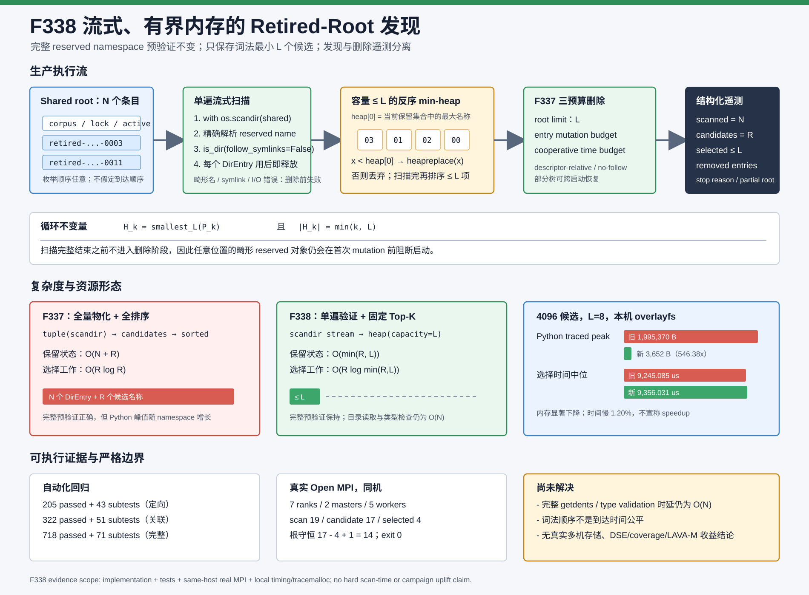

# F338：完整预验证的流式有界内存 Retired-Root 发现

> 日期：2026-08-07  
> 状态：生产路径已实现并达到 I/T/E-mechanism；不是 DSE/coverage/bug benchmark 的 R 级效果结论  
> 代码：`util/mpi_concolic_execution.py`  
> 测试：`test/test_mpi_lifecycle.py`  
> 图示：[`streaming-retired-discovery-2026-08-07.svg`](../diagrams/streaming-retired-discovery-2026-08-07.svg)  
> 原始证据：[`f338-streaming-retired-discovery-2026-08-07/`](../evidence/f338-streaming-retired-discovery-2026-08-07/)

## 1. 研究问题

F337 已把 retired tree 的物理删除从“一旦选中就完整递归删除”改为 root、成功目录项变更数和协作式时间
三重预算。然而候选发现仍使用：

```python
entries = tuple(os.scandir(shared))
candidates = []
for entry in entries:
    validate(entry)
    candidates.append(entry.name)
selected = sorted(candidates)[:limit]
```

若 shared root 含 `N` 个条目、合法 retired root 有 `R` 个，该路径同时保留全部 `N` 个 `DirEntry`、最多
`R` 个名称，并全量排序。其 Python 保留状态为 `O(N+R)`，选择成本为 `O(R log R)`。F337 虽然封顶了
删除量，却没有封顶发现阶段的对象数量；大量历史 epoch 或同目录 corpus 元数据仍可能在启动期形成峰值。

F338 的研究问题是：**在不放弃“完整 reserved namespace 预验证先于任何删除”这一失败关闭不变量的前提
下，能否只保存最终需要的词法最小 `L` 个候选？** 其中 `L=SYMCC_RETIRED_WORK_STATE_GC_LIMIT`。

## 2. 接口事实与设计约束

实现依据 Python 官方接口语义：

- [`os.scandir`](https://docs.python.org/3.12/library/os.html#os.scandir) 返回迭代器，条目顺序任意；迭代器支持
  context manager，应显式关闭；`DirEntry.is_dir(follow_symlinks=False)` 不把 symlink 当作目录；
- [`heapq`](https://docs.python.org/3.12/library/heapq.html#heapq.heapreplace) 的普通堆是 min-heap，
  `heapreplace` 在一次操作中替换堆顶且容量不变，适合固定大小选择；
- [`tracemalloc.get_traced_memory`](https://docs.python.org/3.12/library/tracemalloc.html#tracemalloc.get_traced_memory)
  给出 Python memory allocator 所跟踪块的 current/peak，不等价于 RSS、内核缓存或远端文件系统内存。

系统必须继续满足：

1. 任一以 reserved retired prefix 开头但名称畸形的对象，在删除发生前失败；
2. 合法名称指向 symlink、文件或不可读类型时，在删除发生前失败；
3. `scandir` 任意枚举顺序不能改变最终选择；
4. 选择仍与 F335-F337 一致，即词法序最小的 `L` 个根；
5. `limit=0` 继续完全禁用自动 GC，不为扫描创建额外工作；
6. 扫描异常仍通过 MPI 启动门广播并 `Abort(66)`。

## 3. 总体机制



F338 只替换候选发现与选择，不改变 F337 的 descriptor-relative 增量删除：

```text
stable no-follow GC flock
  -> 单遍 scandir(shared)
  -> 对每个 reserved 对象解析名称并 no-follow 类型验证
  -> 反序比较器维护容量最多 L 的 min-heap
  -> 扫描完成后排序 heap 中最多 L 个名称
  -> F337 三预算 durable_rmtree_step
  -> 广播 scan/candidate/selected 与删除结果
```

反序比较器使普通 min-heap 的 `heap[0]` 表示“当前保留集合中词法最大的名称”。新候选 `x` 到来时：

- 堆未满：插入 `x`；
- 堆已满且 `x >= heap[0]`：丢弃 `x`，因为它不可能进入全局词法最小 `L`；
- 堆已满且 `x < heap[0]`：用 `x` 替换当前集合中最大的名称。

包装对象只在实际插入或替换时创建。首轮原型为每个候选都创建包装对象，基准显示无必要的时间开销；实现
在保存证据前已将分配移动到两个真正改变 heap 的分支。

## 4. Top-K 正确性不变量

设已经处理的候选前缀为 `P_k`，heap 中的名称集合为 `H_k`。循环维持：

```text
H_k = smallest_L(P_k)
|H_k| = min(k, L)
```

归纳证明：

- `k=0` 时二者均为空；
- 若 `|H_k|<L`，加入新元素后所有已见元素都应保留；
- 若 heap 已满且新元素不小于 `max(H_k)`，它不属于 `smallest_L(P_k U {x})`；
- 若新元素更小，唯一应被淘汰的是 `max(H_k)`，`heapreplace` 恰好完成这一变化。

因此扫描结束后 `sorted(H_N)` 与旧算法 `sorted(all_candidates)[:L]` 完全相同，且与 `scandir` 的任意枚举
顺序无关。单元测试以反向创建的 33 个候选、`L=4` 检查选择身份，并跟踪 heap 峰值严格为 4。

## 5. 完整预验证与失败顺序

不能为了提前删除而在 heap 得到 `L` 个名称后停止扫描。后续条目可能是：

- reserved prefix 下的畸形名称；
- 合法名称对应的 symlink 或普通文件；
- `is_dir(follow_symlinks=False)` 无法读取的对象。

F338 因而仍把扫描与删除分成严格两阶段：完整 iterator 正常结束，才把 heap 结果交给
`durable_rmtree_step`。测试构造一个合法 retired 根和一个畸形/符号链接 reserved 对象，验证异常发生后
合法根的 marker 仍存在。流式化改变内存形态，不降低命名空间完整性约束。

这一不变量也解释了当前优化的边界：在没有受协议保护的持久索引或可验证目录 generation 的情况下，既要
发现任意位置的畸形对象，又要把 `getdents` 数量限制在固定常数，两者不能同时由一次无状态扫描实现。

## 6. 实现与可观测性

生产实现新增：

- `_ReverseLexicalRetiredName`：只定义反向 `<`，使 Python 3.12 普通 min-heap 表现为按名称的 max-heap；
- `_select_retired_work_states(shared, limit)`：单遍验证并返回 selected names、scanned entries 和 candidate
  roots；`with os.scandir(...)` 保证 iterator 及时关闭；
- `_RetiredWorkStateGcResult.scanned_entries/candidate_roots`：不把发现成本混入删除计数；
- MPI status 与启动日志新增：

```text
Retired scan: entries=<N>, candidates=<R>, selected=<min(R,L)>
```

三类计数语义不同：

| 指标 | 含义 | 是否消耗 F337 entry budget |
| --- | --- | --- |
| scanned entries | shared root 中 iterator 实际返回的所有条目，包括非 retired 对象和 GC lock | 否 |
| candidate roots | 名称与 no-follow 类型均合法的 retired 根 | 否 |
| removed entries | 成功的 `unlink/rmdir`，包含 retired 根自身 | 是 |

这使线上能够区分“扫描大但没有候选”“候选多但 root limit 小”和“选中树内部删除量大”。

## 7. 复杂度变化

令 `N` 为 shared root 条目数，`R<=N` 为合法候选数，`L` 为 root limit：

| 阶段 | F337 materialized | F338 streaming top-k |
| --- | --- | --- |
| namespace/type validation | `O(N)` | `O(N)` |
| candidate selection | `O(R log R)` | `O(R log min(R,L))` |
| retained Python candidate state | `O(N+R)` | `O(min(R,L))` |
| final selected sort | 已含于全排序 | `O(L log L)` |

当默认 `L=1` 或较小常数时，选择附加状态与候选总数解耦；但目录读取和类型验证仍是 `O(N)`，F338 不把
“有界内存”误写成“有界启动时间”。

## 8. 自动化验证

新增测试 `test_retired_work_state_gc_streams_a_bounded_lexical_top_k`，并扩展原有 F335-F337 测试检查扫描与
候选统计。验证范围：

| 范围 | 结果 | 时间 |
| --- | ---: | ---: |
| distributed/lifecycle/filesystem 定向 | 205 passed + 43 subtests | 16.56 s |
| 六个 MPI/distributed/hybrid 关联模块 | 322 passed + 51 subtests | 16.70 s |
| `pytest -q -W error test/test_*.py` | 718 passed + 71 subtests | 96.07 s |

Ruff、`py_compile` 和 `git diff --check` 另行通过。

## 9. 真实 Open MPI 集成

实验使用真实 Open MPI transport、7 ranks、2 masters、5 workers、同一物理主机和 local overlayfs。启动前
反向创建 17 个合法空 retired 根，配置 root limit 4、entry budget 32、time budget 1 s。

生产日志报告：

```text
Retired GC:    4 root(s) reclaimed, 4 entry(s) removed, stop=root-limit
Retired scan:  entries=19, candidates=17, selected=4
```

状态核查结果：

- 词法序最小 4 个 fixture 根全部消失；
- 未选择的 13 个 fixture 根全部保留；
- 本次正常完成的 epoch 新增 1 个 retired 根；
- 最终根数满足 `17 - 4 + 1 = 14`；
- content-addressed seed 字节和 SHA-256 保持；
- 两组 worker ACK 为 3/3 和 2/2，return code 0，耗时 3.709 s。

这是同机生产路径集成证据，不是实际多主机部署证明。

## 10. 本机时间与内存实验

环境为 Linux 7.0、glibc 2.39、Python 3.12.3、local overlayfs。每个规模包含 16 个非 retired 条目；选择
limit 为 8。每种算法每规模先 3 次 warm-up，再采集 30 个交错、交替 timing 样本和 10 个交错、交替
`tracemalloc` peak 样本。目录构造不计入，两个算法均执行完整扫描、名称解析、no-follow 类型验证和相同
结果核对。

| 候选数 | 旧 traced peak | 新 traced peak | 旧/新内存 | 旧时间中位 | 新时间中位 | 新/旧时间 |
| ---: | ---: | ---: | ---: | ---: | ---: | ---: |
| 128 | 66,130 B | 3,586 B | 18.44x | 299.475 us | 318.804 us | 1.0645x |
| 1,024 | 502,762 B | 3,652 B | 137.67x | 2,195.427 us | 2,284.486 us | 1.0406x |
| 4,096 | 1,995,370 B | 3,652 B | 546.38x | 9,245.085 us | 9,356.031 us | 1.0120x |

候选规模增长 32x 时，旧 traced peak 增长 30.17x，新 traced peak 仅增长 1.018x，符合有界 heap 的设计；
但新算法中位时间仍分别慢 6.45%、4.06% 和 1.20%。原因包括 Python 层分支、反序包装和 heap 维护，而旧
全排序主要在 C 实现中执行。随着 `N` 增大，目录枚举/类型检查成为主导，时间差缩小。

因此可支持的结论是：**F338 显著约束了 Python traced allocation，且未观察到时间收益。** 不能把渐进
复杂度改进直接当成当前规模的 wall-clock speedup。

## 11. 先进性、创新性与挑战

- **正确性约束下的流式选择**：不是简单提前截断扫描，而是在完整预验证后才允许任何删除；
- **选择状态与 namespace 规模解耦**：默认 `L=1` 时候选保存量为常数，同时保持旧版确定性语义；
- **可证明的 Top-K invariant**：测试覆盖反向输入、固定容量和精确选择身份，不依赖目录枚举偶然顺序；
- **发现/删除遥测解耦**：扫描、候选和物理变更分别计数，为下一阶段索引或维护模式提供基线；
- **负结果诚实保留**：报告并保留 1.2%–6.5% 的时间回退，不用 18x–546x traced-memory 比率暗示端到端
  性能提升；
- **证据分层**：单元测试证明不变量，真实 MPI 证明生产集成，raw timing/tracemalloc 证明本机机制成本，
  三者不互相替代。

## 12. 已知限制与下一步

1. shared root 仍完整执行 `getdents/is_dir`，扫描时延和 syscall 数没有硬上限；
2. `tracemalloc` 不测 RSS、内核 buffer/page cache、所有 native allocation 或远端存储服务端内存；
3. GC lock 只排除协作 reclaimer，不能阻止外部非协议写者在扫描期间改变 namespace；
4. 词法顺序确定但不等于到达时间公平，持续出现更小名称可延迟较大名称；
5. root limit 最大可配到 1,000,000，用户主动配置大 `L` 时 heap 仍会按 `L` 占用内存；
6. 没有真实 NFS/Lustre/GPFS 多客户端、server failover、remote power loss 或长期 churn 证据；
7. 本功能不直接改变 worker DSE、solver、coverage、bug discovery 或 LAVA-M 指标。

下一阶段应研究**受协议保护的退休索引或分片命名空间**，使 discovery I/O 也能增量化，同时解决索引与
`RENAME_NOREPLACE + parent fsync` 的提交顺序、崩溃重放、未知 reserved 对象审计和到达时间公平。没有这些
协议前提时，简单持久化一个扫描 cursor 既无法证明目录未在两次启动间变化，也无法保持完整预验证语义。
