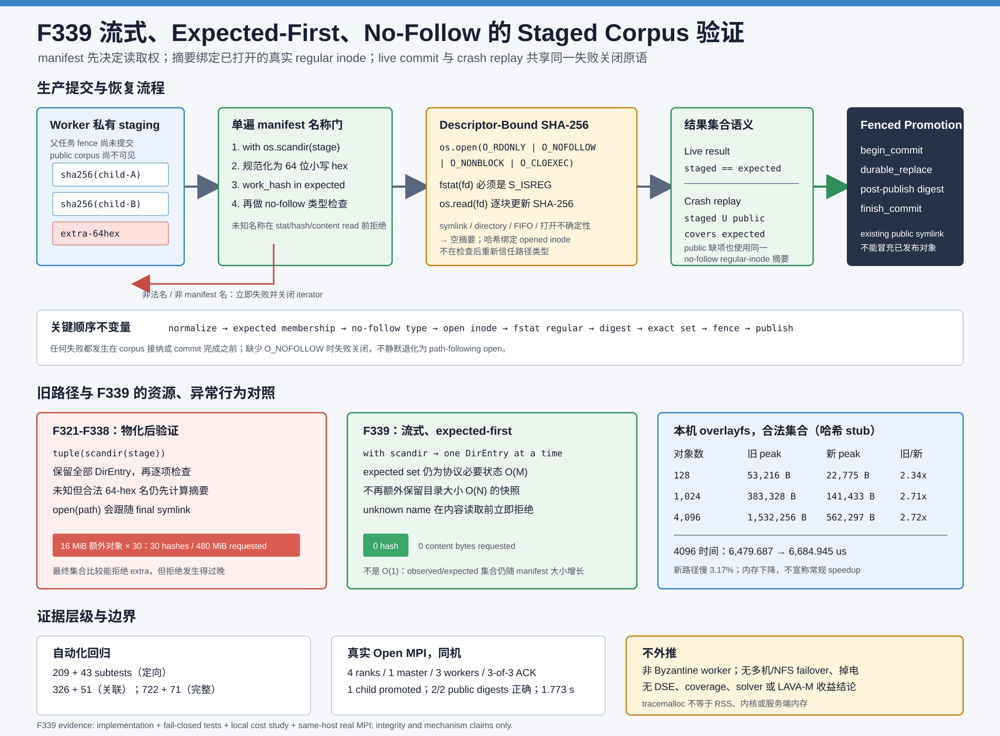

# F339：流式 Expected-First、No-Follow 的 Staged Corpus 完整性验证

> 日期：2026-08-07  
> 状态：生产路径已实现并达到 I/T/E-mechanism；不是 DSE、coverage 或 bug benchmark 的 R 级效果结论  
> 代码：`util/mpi_concolic_execution.py`  
> 测试：`test/test_mpi_lifecycle.py`  
> 图示：[`streaming-nofollow-staging-2026-08-07.svg`](../diagrams/streaming-nofollow-staging-2026-08-07.svg)  
> 原始证据：[`f339-streaming-nofollow-staging-2026-08-07/`](../evidence/f339-streaming-nofollow-staging-2026-08-07/)

## 1. 研究问题

F321-F323 已建立 worker 私有 staging、父任务 fence、持久 commit manifest 与幂等 promotion：worker 只把
child hash 和 staging identity 发给 master，master 验证 child 后才令其进入 public corpus；崩溃恢复则允许
一个 manifest 的对象分布在 staging 和 public 两处。该协议解决了“未提交 child 过早可见”和“部分发布如何
redo”，但 F339 审查发现验证原语仍有三个实现缺口：

```python
entries = tuple(os.scandir(stage))
for entry in entries:
    validate_shape(entry)
    digest(entry.path)
return observed == expected
```

1. `tuple(os.scandir(...))` 在 manifest 集合之外，又保留与目录条目数 `N` 成正比的全部 `DirEntry`；
2. live verifier 直到所有摘要完成后才用 `observed == expected` 拒绝额外对象，因此一个名称格式合法但不在
   manifest 内的大对象仍会被完整读取和哈希；
3. `_file_sha256` 使用 `open(path, "rb")`，会跟随最后一级符号链接。于是名称恰为目标内容摘要的 symlink
   可被误当作 content-addressed regular object，且 promotion 的 existing/post-move 检查复用了同一原语。

F339 的研究问题是：**能否让 manifest 在任何对象内容 I/O 之前决定读取授权，同时把摘要绑定到一次打开的
真实 regular inode，并保持 live exact-set 与 crash replay 的既有语义？**

## 2. 接口依据与可信边界

实现依据如下官方接口语义：

- Python [`os.open`](https://docs.python.org/3.12/library/os.html#os.open) 暴露 Unix open flags；
- POSIX [`open()`](https://pubs.opengroup.org/onlinepubs/9799919799/functions/open.html) 定义
  `O_NOFOLLOW`：若路径最后一级为 symlink，打开失败；
- Python [`os.fstat`](https://docs.python.org/3.12/library/os.html#os.fstat) 对**已打开 descriptor**取元数据；
- Python [`os.scandir`](https://docs.python.org/3.12/library/os.html#os.scandir) 返回支持 context manager 的
  iterator，`DirEntry.is_file(follow_symlinks=False)` 可在不跟随 symlink 时检查目录条目类型。

`O_NOFOLLOW` 只约束最后一级路径。本实现依赖 staging/public 根由既有 F321-F328 协议创建、资格验证和拥有；
它不声称抵御能任意替换全部父目录的 Byzantine 管理员。worker/coordinator 也是 crash-fault、非 Byzantine
模型：若一个已打开 regular file 被有意并发原地改写，摘要可能失败或反映某个读序列；系统不提供不可变文件
系统 snapshot。不过 content hash 不匹配会失败关闭，验证后 promotion 的摘要也会再次检查 public 对象。

## 3. 总体机制



新生产顺序严格为：

```text
normalize manifest
  -> with os.scandir(stage)，一次消费一个 DirEntry
  -> normalize entry.name
  -> entry hash 必须先属于 expected manifest
  -> is_file(follow_symlinks=False)
  -> os.open(O_RDONLY | O_NOFOLLOW | O_NONBLOCK | O_CLOEXEC)
  -> fstat(fd) 且 S_ISREG
  -> os.read(fd) 计算 SHA-256
  -> live: staged == expected
     replay: staged U verified_public covers expected
  -> begin_commit fence
  -> durable promotion + no-follow post-publish digest
  -> finish_commit
```

名称准入先于 `is_file` 和 `_file_sha256`。因此一个格式正确的 64-hex 额外名称也在 metadata/content I/O 前
拒绝；`with os.scandir` 在正常结束、异常或函数提前返回时都会关闭 iterator。

## 4. Descriptor-Bound 摘要

`_file_sha256` 不再使用会跟随路径别名的高层 `open()`，而是：

```python
fd = os.open(path, O_RDONLY | O_NOFOLLOW | O_NONBLOCK | O_CLOEXEC)
if not stat.S_ISREG(os.fstat(fd).st_mode):
    reject
while chunk := os.read(fd, 1024 * 1024):
    sha256.update(chunk)
```

关键点如下：

1. `O_NOFOLLOW` 缺失时返回空摘要，不静默退化到可跟随 symlink 的实现；
2. `O_NONBLOCK` 防止在“类型检查与 open 之间对象变成 FIFO”等竞争中无限等待，打开后仍以 `fstat` 判定；
3. `fstat` 和读取使用同一 descriptor，类型身份与被哈希字节绑定到同一个 opened inode；
4. `finally` 在 `fstat`、读取或摘要异常时关闭 descriptor，测试注入 metadata 错误并核对 `close`；
5. symlink、目录、FIFO、打开/读取不确定性都返回空摘要，所有调用方继续以“摘要必须等于文件名”失败关闭。

这一次修改覆盖 initial import 回验、shared scan、过期 work 恢复、active input 回验、worker staged output、
replay public object 和 promotion 前后回验，而不是只修 staged helper 的一个调用点。

## 5. Live 与 Replay 语义保持

### 5.1 Live result

worker 刚返回时，父任务尚未进入 commit。manifest 中每个 child 都必须存在于该 worker/result 的私有 stage，
且 stage 不能包含 manifest 外对象：

```text
verified_staged == expected
```

stage 缺失返回空集合，因此非空 expected 会失败；空结果仍沿用“无 hashes 则 staging_id 也必须为空”的协议。

### 5.2 Crash replay

`begin_commit` 已持久化后可能只提升了一部分对象。恢复路径允许 expected 被两处共同覆盖：

```text
verified_staged U verified_public covers expected
```

stage 不存在并非错误，所有 expected 会转而在 public corpus 中用同一 no-follow regular-inode 摘要验证；stage
若存在任何未知名称、symlink、类型/摘要不匹配则整体失败。promotion 遇到已存在 public object 时也必须通过
该摘要，故“指向正确外部内容的 public symlink”不能被当作幂等成功。

## 6. 复杂度与内存边界

设 staging 目录有 `N` 个条目，manifest 有 `M` 个唯一 hash。正常协议中 `N=M`，异常目录可能 `N>M`。

| 项目 | F321-F338 | F339 |
| --- | --- | --- |
| 目录枚举 | 先 `tuple(scandir)` | context-managed 单遍 iterator |
| manifest membership | 最终集合比较 | 每个名称读取前检查 |
| 额外 `DirEntry` 保留 | `O(N)` | `O(1)` |
| expected/observed 集合 | `O(M)` | `O(M)` |
| 合法目录总时间 | `O(N + bytes)` | `O(N + bytes)` |
| 首个未知名称后的内容读取 | 仍可能哈希 | 0，立即返回 |

因此 F339 的准确表述是“去掉目录快照的额外 `O(N)` Python 状态”，不是把整个验证器变为 `O(1)` 内存。
manifest 和 replay 所需的 observed 集合仍随 `M` 增长；完整合法集合仍必须读取每个对象内容，不能通过流式化
消除 SHA-256 成本。

## 7. 自动化验证

新增或扩展测试覆盖：

- regular file 摘要成功，指向相同内容的 symlink 和目录返回空摘要；
- 平台缺少 `O_NOFOLLOW` 时 open 不被调用；`fstat` 故障后 descriptor 精确关闭；
- staged symlink、replay public symlink 和 promotion existing symlink 全部失败；
- 仅存在一个合法 64-hex 但非 expected 的对象时，`_file_sha256` 调用次数严格为 0；
- 合成 iterator 在第一个未知名称后若继续迭代就抛错，生产 helper 只消费 1 项并执行 context exit；
- 正常 child promotion 与部分 public/stage replay 继续成功且幂等。

| 范围 | 结果 | 时间 |
| --- | ---: | ---: |
| distributed/lifecycle/filesystem 定向 | 209 passed + 43 subtests | 18.06 s |
| 六个 MPI/distributed/hybrid 关联模块 | 326 passed + 51 subtests | 19.56 s |
| `pytest -q -W error test/test_*.py` | 722 passed + 71 subtests | 101.45 s |

Ruff、`py_compile` 和 `git diff --check` 另行通过。

## 8. 合法集合机制成本

环境为 Linux 7.0、glibc 2.39、Python 3.12.3、local overlayfs。为隔离目录枚举和 Python 控制结构，合法
集合实验把两条路径的内容摘要统一替换为“返回 basename”的 stub；真实摘要正确性由单元测试、异常实验和
MPI 集成另证。每个规模先对每种机制 warm-up 3 次，再采集每种机制 30 个交错、交替 timing 样本与 10 个
交错、交替 `tracemalloc` peak 样本。目录构造和 expected set 构造不计入。

| 合法对象 | 旧 traced peak | 新 traced peak | 旧/新内存 | 旧时间中位 | 新时间中位 | 新/旧时间 |
| ---: | ---: | ---: | ---: | ---: | ---: | ---: |
| 128 | 53,216 B | 22,775 B | 2.34x | 197.923 us | 205.474 us | 1.0382x |
| 1,024 | 383,328 B | 141,433 B | 2.71x | 1,569.597 us | 1,620.724 us | 1.0326x |
| 4,096 | 1,532,256 B | 562,297 B | 2.72x | 6,479.687 us | 6,684.945 us | 1.0317x |

内存下降与移除 `tuple(DirEntry)` 一致，但新路径时间中位慢 3.17%–3.82%。原因包括 Python context/逐项
控制流，且旧 tuple 构造和迭代大量工作在 C 层完成。F339 因而不宣称正常合法提交变快；它以较小 Python
allocation 和更早异常拒绝换取约 3% 的本机控制结构开销。

`tracemalloc` 只覆盖 Python allocator 跟踪的分配，不是 RSS、内核目录缓冲、page cache、native MPI/文件
系统库或远端服务端内存。

## 9. Expected-First 异常成本

实验建立一个 16 MiB regular file，名称是其真实 SHA-256，但 expected manifest 只包含另一个不存在的合法
hash。两条路径交错、交替运行 30 次，先各 warm-up 3 次；该实验使用生产 descriptor/no-follow 摘要并统计
被请求摘要的文件字节数。文件已在本机 page cache 中，因此时间只代表本机热缓存机制成本。

| 路径 | digest calls | requested content bytes | 时间中位 |
| --- | ---: | ---: | ---: |
| 旧 materialized/final-set | 30 | 503,316,480 B（480 MiB） | 6,597.133 us |
| F339 streaming/expected-first | 0 | 0 B | 4.692 us |

本机中位比率为 1406.04x，但它取决于 16 MiB fixture、page cache、CPU SHA-256 和单条目目录，不能外推为真实
campaign speedup。强结论仅是协议层面的：**未知名称不再触发内容摘要，测得 30 次均为 0 call/0 byte。**

## 10. 真实 Open MPI 全链路

集成使用真实 Open MPI transport、4 ranks、1 master、3 workers、同一物理主机和 local overlayfs。一个确定性
synthetic target 实现 SymCC output-directory 契约：仅初始 `F339-stage` seed 产生 `F339-child`，child 再执行
时不产生输出，故作业能够自然静止而不依赖随机 mutation。该目标不调用求解器。

结果如下：

- worker 实际产生 1 个 child，master 通过生产 verifier 接纳并持久 promotion；
- 最终 public corpus 恰有 seed 与 child 两个 content-addressed regular file，2/2 名称均等于实际内容 SHA-256；
- 没有 staged file/symlink 残留，完成 epoch 正常退役一次；
- worker shutdown ACK 为 3/3，return code 0，耗时 1.773135 s。

这是生产调用链与真实 MPI 消息传输证据，不是实际多主机/NFS/Lustre/GPFS、存储 failover 或 solver 输出证明。

## 11. 先进性、创新性与挑战

- **授权先于成本**：manifest 从事后集合断言提升为逐对象 I/O capability，异常对象不能消耗哈希带宽；
- **path identity 收紧为 opened-inode identity**：no-follow open、same-fd fstat/read 和 promotion 后复核形成统一
  内容地址边界，避免“正确目标内容的路径别名”冒充对象；
- **live/replay 复用一套验证原语**：没有为 crash recovery 保留弱化的 path-following 分支，减少正常与恢复
  语义漂移；
- **资源形态可解释**：移除额外 DirEntry 快照，但明确保留协议所需 `O(M)` 集合，不把优化包装成常数内存；
- **正负结果同时保存**：记录 2.34x–2.72x traced-memory 降低，也记录约 3% 正常路径时间回退；
- **证据分层**：单元测试证明失败关闭，微基准量化 Python 资源形态，真实 MPI 证明生产链路，三者不互相替代。

## 12. 已知限制与下一步

1. 完整合法 manifest 仍需逐字节 SHA-256；超大 child 或大量正常 child 的 I/O 没有时间预算；
2. expected/observed set 为 `O(M)`；超大 result manifest 仍应增加协议级数量/总字节上限或流式 Merkle inventory；
3. no-follow 只约束最后一级，父目录身份依赖既有受控 root 和非 Byzantine 部署模型；
4. 验证与 rename 之间不是不可变 snapshot；非协作 writer 仍可制造竞态，虽然 post-publish digest 会拒绝错误内容；
5. `_file_sha256` 返回空串合并了 symlink、类型错和 I/O 错误，诊断可继续细分但不得改变失败关闭行为；
6. 当前无真实多机共享存储、远端掉电、长期 churn、DSE throughput、coverage、solver、bug discovery 或
   LAVA-M 提升数据。

下一轮应优先审查：对 staged result manifest 增加可配置的对象数/总字节 admission budget；把 public scan 与
worker input copy 也统一到 descriptor-relative identity；并评估在不增加两次完整读取的条件下，是否可把
worker 已计算摘要与 master verification 结合成可重放的 chunk/Merkle proof。任何缩短 master 内容回验的方案
都必须先定义 crash、non-Byzantine worker 和 shared-storage 可见性模型，不能以性能为由取消独立验证。
