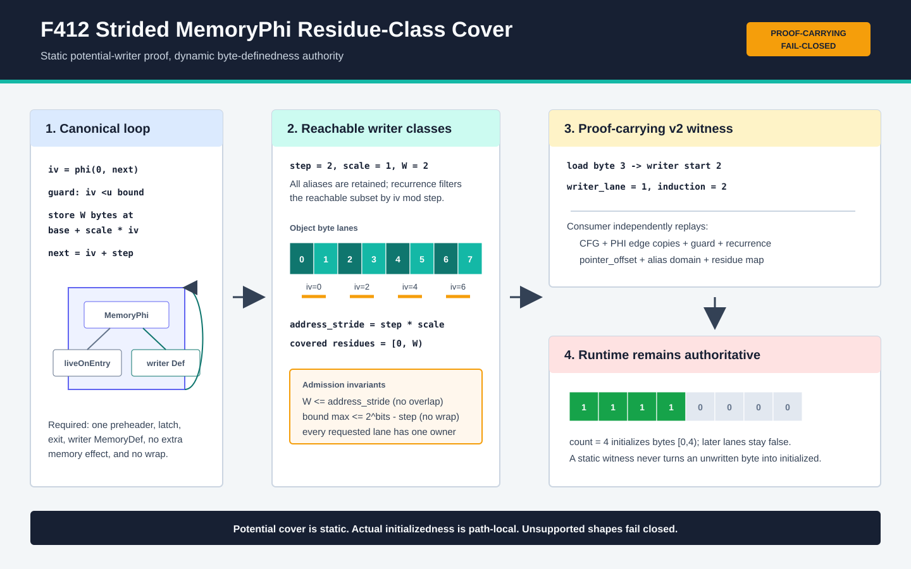

# F412：常量步长 Loop MemoryPhi 同余类 Byte-Lane 证书

> 日期：2026-08-16  
> 定位：F411 单位步长逐字节循环之后的 affine stride / residue-class 扩展  
> 等级：I/T/E-mechanism（生产实现、双 LLVM、严格重放、有限域 oracle 与机制实验）

## 1. 研究问题

F411 只接受 `iv = 0, 1, 2, ...` 和一字节 writer。真实程序常按元素宽度或分块宽度推进：

```c
for (size_t i = 0; i < symbolic_bound; i += 2)
  *(uint16_t *)(object + i) = 0x4241;
return *(uint16_t *)(object + symbolic_index);
```

这里不能简单把 `step == 1` 放宽为任意常数。producer 枚举的 store alias 域仍包含索引
`0,1,2,...`，但循环真正可达的 writer 只有 `0,2,4,...`；若 consumer 继续把完整 alias 域当成
可达迭代，就会把奇数索引 writer 伪造成初始化来源。多字节 writer 还带来 lane 归属、重叠写和
跨 writer 边界 load，而窄位宽 `iv += step` 可能在 `iv < bound` 仍为真时回绕。

F412 将上述问题闭合为版本化 proof-carrying contract：完整 alias 域保留用于绑定真实 store，
再按归纳同余关系导出可达 writer 子域；每个 load byte lane 必须映射到唯一
`(writer start, writer lane, induction value)`。静态证书只证明潜在覆盖，当前路径是否实际写过
该字节仍由 runtime byte-init bitmap 决定。

主要依据：

- [LLVM MemorySSA](https://llvm.org/docs/MemorySSA.html)：`MemoryPhi` 表示控制流合流处可能到达的
  memory definition，不是必然写入事实；
- [LLVM Loop Terminology](https://llvm.org/docs/LoopTerminology.html)：preheader、latch、backedge、
  dedicated exit 与自然循环边界；
- [LLVM ScalarEvolution](https://llvm.org/doxygen/ScalarEvolution_8h_source.html)：affine add recurrence
  与 no-self-wrap 条件；
- [LLVM InductionDescriptor](https://www.llvm.org/docs/doxygen/classllvm_1_1InductionDescriptor.html)：
  常量步长 induction 的标准识别边界；
- [Array-Carrying Symbolic Execution for Function Contract Generation (2026)](https://arxiv.org/abs/2602.23216)：
  以数组片段 invariant/assigns 表达循环内存效应的近期方向。

F412 没有声称复现完整 ScalarEvolution、数组不变量生成或一般 loop summarization；它实现的是
当前 continuation/MemorySSA/byte-definedness 架构中可独立重放的有界切片。

## 2. 精确语义

设归纳变量位宽为 `b`，seed 固定为 0，正步长为 `s`，writer 地址 scale 为 `d`，单次写宽度为
`W`：

\[
i_k = k s,\qquad p_k = p_0 + d i_k,\qquad
M[p_k,p_k+W) := v_k
\]

地址步距为 `D = s d`。F412 要求 `1 <= W <= D`，因此不同迭代的 writer interval 不重叠。
完整 store alias 集 `A_store` 由真实 pointer contract 给出；可达子域为：

\[
A_{reach}=\{(p,i)\in A_{store}\mid i\ge0\land i\bmod s=0\}.
\]

对 load 地址域 `A_load`、宽度 `L`，每个 byte lane 必须有唯一 owner：

\[
\forall a\in A_{load},\forall \ell\in[0,L),\exists!(p,i,r):
(p,i)\in A_{reach}\land 0\le r<W\land a+\ell=p+r.
\]

这一定义同时覆盖两类情况：

1. `s=2,d=1,W=2`：两个 residue 都覆盖，任意相邻两字节 load 可跨 writer 边界；
2. `s=2,d=1,W=1`：只覆盖偶数 residue，只有 load alias 域也限定为偶数地址时才接纳。

### 2.1 无回绕条件

若 bound 来源的无符号最大值为 `Bmax`，最后一次可能执行的 `iv` 最大为 `Bmax-1`。为保证
`next = iv + s` 在 `b` 位上不回绕，producer 和 consumer 都验证：

\[
B_{max}-1+s\le 2^b-1\quad\Longleftrightarrow\quad B_{max}\le2^b-s.
\]

例如 `i8 iv`、`i8 bound`、`step=2` 会失败关闭，因为 `255 > 256-2`；`i8 bound` 先 `zext`
到 `i64 iv` 则满足该条件。该检查独立于 IR 是否带 `nuw`：证书只接纳对全部声明输入都不会
产生回绕的 recurrence。

### 2.2 动态已初始化性

静态 witness 不会设置初始化位。第 `k` 次实际 store 执行后，runtime 才更新：

\[
I'[p_k+r]=1,\quad 0\le r<W.
\]

load 候选仍要求其全部 lane 在当前 continuation state 中满足 `I[a+l]=1`。因此 zero-trip、
early exit、bound 尚未到达 witness iteration 的状态仍不可读。



## 3. 支持域与拒绝域

F412 继承 F411 的 CFG/MemorySSA 边界，并新增：

- 单 preheader、三块 loop body、单 latch、单 exit，exit load 的唯一前驱为 header；
- `MemoryPhi = {liveOnEntry, unique writer MemoryDef}`，loop 内无第二个 memory access；
- `seed = 0`、`ult(iv,bound)`、常量正向 `add` step，`1 <= step <= 64`；
- bound 为 argument 或一次严格 `zext(argument)`，既能表示最大需要 writer，又满足无回绕式；
- writer pointer 为 `object_base + constant + positive_scale * iv`；
- writer 为 simple、非 atomic/volatile 的 1--8 byte scalar store；
- `writer_bytes <= step * scale`，可达 writer interval 互不重叠；
- load 和 writer 属于同一 stack/heap allocation identity；
- 最多 256 个 alias 和 2,048 个 load-address × lane witness。

以下情况失败关闭：负/零/大于 64 的 step、非零 seed、descending recurrence、潜在无符号回绕、
writer interval 重叠、load lane 落入未覆盖 residue、多 writer/MemoryUse、conditional writer、多
latch、多 block body、嵌套循环、pointer union、跨过程 loop effect、atomic/volatile 或未知内存效应。

## 4. Producer 执行流程

`ContinuationLowering.cpp` 在 F411 入口上按以下次序扩展：

1. 从 dynamic load 取得有限 alias/index 域和真实 `MemoryUse -> MemoryPhi`；
2. 用 `LoopInfo` 验证 canonical header/body/latch/exit 和两个 MemoryPhi incoming；
3. 绑定 scalar PHI、`ult` guard、常量 step 与 bound argument provenance；
4. 用 bound source domain 证明 writer 容量，并用 `Bmax <= 2^b-step` 证明无回绕；
5. 从 writer GEP 恢复正向 affine scale，计算 `address_stride = step * scale`；
6. 枚举真实 store 的完整 alias/index 域，不丢弃 runtime 地址合同；
7. 过滤出 `index mod step == 0` 的可达 writer 子域；
8. 将每个可达 writer 展开为 `W` 个 byte lane，重复 owner 立即拒绝；
9. 对 load alias 笛卡尔积逐 lane 查找唯一 owner，缺失 residue 立即拒绝；
10. 单位步长/单位 scale/一字节 writer 继续输出 v1；广义情形输出 v2 并声明扩展 capability。

生产接线仍位于 load initialization admission 的真实路径；没有证书时回到原有 dominating-store
判断并最终拒绝未初始化 load，不存在只供测试调用的旁路 API。

## 5. v2 Proof-Carrying Artifact

基础 capability 为 `bounded-loop-memoryphi-byte-lane-induction`，v2 还必须声明
`bounded-strided-loop-memoryphi-byte-lane-induction`。核心增量为：

```json
{
  "schema": "symcc-loop-memoryphi-byte-lane-induction-v2",
  "induction": {"seed": 0, "step": 2, "bits": 64},
  "writer": {
    "bytes": 2,
    "scale": 1,
    "address_stride": 2,
    "addresses": [64, 65, 66, 67, 68, 69, 70],
    "index_values": [0, 1, 2, 3, 4, 5, 6],
    "reachable_addresses": [64, 66, 68, 70],
    "reachable_index_values": [0, 2, 4, 6],
    "residue_origin": 64,
    "covered_residues": [0, 1]
  },
  "witnesses": [{
    "load_address": 65,
    "lane": 1,
    "writer_address": 66,
    "writer_lane": 0,
    "induction_value": 2
  }]
}
```

`addresses/index_values` 是完整 alias 合同，`reachable_*` 是 recurrence 过滤结果，两者不能互相
替代。显式 `writer_lane` 允许 load 跨 writer 边界，并让 consumer 检查 target byte 是否确实
位于声明 store interval 内。

## 6. Consumer 独立重放

`LiveContinuationExecutor._loop_memoryphi_byte_lane_initialization` 不依赖 LLVM 对象，独立完成：

- v1/v2 精确字段集合与 capability 闭合；
- direct CFG、两个 PHI edge-copy、header guard 和 latch `add(iv,step)`；
- 实际 `pointer_offset` 的 base、index、scale、index bits 和 pointer bits；
- store 的完整 aliases/index values/min/max 与 transcript 精确相等；
- `reachable_*` 必须等于按 seed/step 从完整域重新过滤的有序子集；
- 全域 affine 地址关系、相邻可达 writer 的 index/address stride；
- writer interval 唯一 byte owner map、load lane 笛卡尔积和逐 witness 重建；
- bound source 的 input/parameter/identity/zext provenance、容量和无回绕不等式；
- stack/heap owner 与所有 writer/load interval 的对象内归属。

所有整数合同显式排除 Python `bool`。缺基础/扩展 capability、只声明 capability 无 v2 use point、
改变 stride/reachable set/residue/writer-lane/pointer scale 均在 `create()` 阶段拒绝。

## 7. 测试设计与结果

### 7.1 LLVM 生产 fixture

`test/live_strided_loop_memoryphi_byte_lane_induction.ll` 覆盖：

- `step=2, scale=1, i16 writer` 的完整 residue cover，并实际执行 continuation；
- `step=1, scale=2, i16 writer` 的 typed-element affine scale；
- `step=2, writer=1 byte` 与偶数 load alias 域的部分 residue 正例；
- residue gap、overlapping writer、窄 `i8` recurrence 回绕三类 source negative；
- 基础/扩展 capability、stride、reachable addresses/indices、covered residues、布尔 residue、
  writer-lane 和 pointer/store 重排的 artifact mutation；
- 64-byte object、8-byte stride/writer/load 的生产边界。

LLVM 17 与 LLVM 18 对同一 fixture 和 F411 回归均通过。实际执行正例产生返回
`0, 16961, 16961, 16961`，并观察到 infeasible 状态，证明未写 lane 没有被静态证书放行。
完整 Python identity gate 为 `1,061 passed + 250 subtests`，skip、xfail、deselection、collection
error、missing/unexpected node ID 均为零；manifest SHA-256 为
`79e009242ed5cdea20e39e914abd7267e512cd073b095d65521573004bda1d31`。

### 7.2 独立有限域 oracle

oracle 不调用 C++ producer 或生产 consumer，独立枚举 object size、step、scale、writer width、
load width/domain、seed 和 bound width：

| 指标 | 结果 |
|---|---:|
| 总参数组合 | 24,744 |
| 严格支持域接纳 | 2,906 |
| unsupported / partial 拒绝 | 21,838 |
| lane checks | 199,836 |
| runtime bitmap / residue formula 等价 | 80,404 |
| structured certificate mutations | 15 / 15 拒绝 |

完整性恒等式 `cases = accepted + rejected` 成立；partial residue 只有在 load alias 域完全落入已
覆盖 residue 时才接纳。

### 7.3 机制边界实验

64-byte object、`step=8`、8-byte writer/load 的边界包含：

- 57 个完整 writer aliases；
- 8 个 recurrence-reachable writers；
- 64 个潜在覆盖 writer bytes；
- 57 个 load aliases、456 个 byte-lane witnesses、2 个 MemoryPhi incoming。

11 轮、每轮 1,000 次的 Python reference-validator batch 最小/中位/最大为
`94,483,740 / 95,151,368 / 105,103,552 ns`，折算中位 `95,151 ns/certificate`。该计时不包含
LLVM 分析、continuation 执行、SMT 或 fuzzing，只用于记录证书尺寸下的参考验证成本。

## 8. 多轮 Review 结论

1. **语义 review**：拒绝把完整 alias 域直接当成可达 writer，明确区分 recurrence subset；
2. **算术 review**：增加 bound-domain no-wrap，不依赖 `nuw` 猜测；
3. **内存 review**：用 `writer_bytes <= address_stride` 保证唯一 lane owner，overlap 失败关闭；
4. **跨层 review**：consumer 绑定实际 `pointer_offset`，即使单 alias 也不能伪造 scale；
5. **artifact review**：v2 capability/use-point 双向闭合，整数拒绝布尔伪装；
6. **声明 review**：所有数字限定为有限域 oracle、fixture 或 Python reference cost，不外推覆盖率、
   solver throughput、漏洞/错误发现率或端到端加速。

## 9. 先进性、创新性与挑战性

- **先进性**：把 LLVM MemorySSA、affine recurrence/no-wrap、有限 alias、byte-lane definedness 和
  proof-carrying replay 组合为统一生产链，与数组片段和循环内存摘要研究方向对齐；
- **框架创新**：在 artifact 中并列封存完整 alias 域与 recurrence-reachable 子域，并显式给出
  writer-lane witness，解决“地址可能别名”与“循环迭代实际可达”两个不同问题；
- **挑战性**：同一 stride 事实跨 LLVM GEP、scalar PHI、MemoryPhi、JSON、consumer CFG 和 runtime
  bitmap 六种表示，且要同时处理 load 跨 writer 边界与窄位宽回绕；
- **可证伪性**：source negatives、artifact mutation、双 LLVM、独立数学 oracle 与实际 runtime
  infeasible 状态共同约束结论。

## 10. 未完成边界与下一步

F412 本身仍不支持 conditional writer、multiple MemoryUse、多个 latch、multi-block body、nested
loops、descending recurrence、overlapping writer 的 last-write priority、pointer union、多对象、
跨过程 loop effect 或一般数组 segment invariant。其中精确五块、单层 `icmp`、single-latch
conditional writer 已由 F413 的 v3 guard-carry 证书关闭；multi-latch SCC fixed point 仍是下一缺口。

按既定风险顺序，下一切片应是 single-latch conditional writer guard-carry certificate：证书必须把
writer 执行 guard 一直携带到每个 lane witness，runtime 仍以路径条件和 byte bitmap裁决。之后才
进入 multi-latch SCC fixed point，避免在 guard 语义未闭合前扩大循环拓扑。

## 11. 复现

```bash
cmake --build build -j2
cmake --build build-llvm17 -j2
python3 /usr/lib/llvm-18/build/utils/lit/lit.py -sv build/test \
  --filter live_strided_loop_memoryphi_byte_lane_induction
python3 /usr/lib/llvm-17/build/utils/lit/lit.py -sv build-llvm17/test \
  --filter live_strided_loop_memoryphi_byte_lane_induction
pytest -q test/test_strided_loop_memoryphi_byte_lane_induction.py
python3 benchmark/check_strided_loop_memoryphi_byte_lane_oracles.py
python3 benchmark/benchmark_strided_loop_memoryphi_byte_lane.py
```

实验结论只在相同 schema、fixture、边界参数和环境下可复现；机制微基准不能外推为公开目标上的
覆盖、吞吐、solver time、bug yield 或端到端 speedup。
