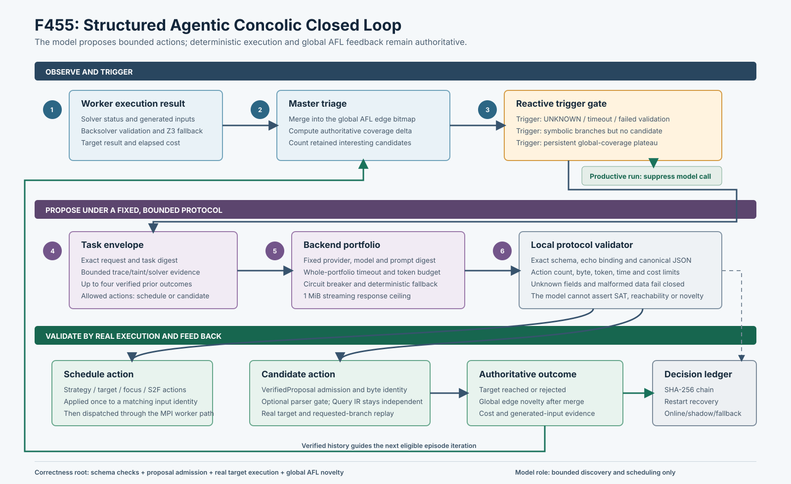

# F455：结构化 Agentic Concolic 闭环

- 日期：2026-08-26
- 结论等级：I/T/E-mechanism
- 代码范围：`util/structured_agentic_concolic.py`、`util/agentic_concolic_hooks.py`、
  `util/mpi_fuzzing_helper.py`
- 测试与 oracle：`test/test_structured_agentic_concolic.py`、
  `test/test_structured_agentic_oracle.py`、`test/test_agentic_concolic_hooks.py`、
  `test/test_afl_profile_orchestration.py`、`benchmark/check_structured_agentic_oracles.py`

## 1. 解决的问题

项目此前已经有异步 agent backend、确定性内置 planner 和有界 proposal 接口，但还不是可用于严谨实验的
闭环：模型、提示词和传输实现没有形成统一身份；请求次数、token、时间、费用和候选字节没有跨重启的总
预算；模型响应与真实执行结果之间缺少完整可追踪绑定；online、shadow 和无模型 fallback 也不能证明使用
了相同任务集。更重要的是，每次执行都调用模型既浪费预算，也会让正常求解路径受到不必要干预。

F455 将这组松散接口收束为一个结构化、反应式、可回放的控制平面。模型只在求解受阻或覆盖停滞时提出
调度动作或具体输入；所有正确性结论仍由本地协议检查、候选准入、真实目标执行和 master 合并后的 AFL
全局覆盖增量决定。

## 2. 研究依据与本地取舍

F455 不是对单篇论文逐行移植，而是把四类互补思想适配到已有 MPI/SymCC 控制面：

| 研究工作 | 可复用思想 | F455 的适配 | 没有宣称的内容 |
| --- | --- | --- | --- |
| [Cottontail, IEEE S&P 2026](https://github.com/Cottontail-Proj/cottontail) | 面向高度结构化输入的 LLM 求解、历史获种与迭代 concolic | `history_acquisition`、`solve_complete` 候选动作；同 episode 的已验证执行历史返回下一轮 | 不是其编译器、提示词和公开 benchmark 的逐项复现 |
| [HyLLfuzz](https://arxiv.org/abs/2412.15931) | 在覆盖 roadblock 处对执行证据切片，再让模型修改输入 | 只在受阻/停滞时触发；向模型提供有界 branch、comparison-taint、Backsolver 与 solver 摘要 | 当前不是源码级动态 backward slice，也未复现论文性能数字 |
| [ConcoLixir](https://arxiv.org/abs/2606.26545) | 模型是 discovery oracle，而不是 solver 或 correctness oracle；对失败和 plateau 反应 | `reactive` 门控、具体候选、真实执行裁决和覆盖反馈 | 不把模型输出解释为 SAT、目标可达或覆盖证据 |
| [Agolic](https://arxiv.org/abs/2608.06397) | 用较早的有界执行证据配置后续执行，底层执行器保持裁决权 | episode/iteration 历史、schedule action、失败回退和跨轮账本 | 不声称复现其公开 C/C++ 评价或论文覆盖提升 |

调研时固定的公开实现 HEAD 为 Cottontail
`4efa4dcf8225040feeef8fd7017d32aaa21c9340`、HyLLfuzz
`2f784572fca67a04db4d12e17e02bb9e5e164f97` 和 ConcoLLMic
`9634e68698a2048babbf811991f1a993a897a3a2`。这些身份用于说明阅读基线，不进入本地运行时依赖。

## 3. 完整执行次序

1. worker 完成一次 SymCC 执行并返回 solver、Backsolver、目标分支和生成输入遥测。
2. master 先完成候选 triage，把候选 bitmap 合并到唯一全局 AFL edge bitmap；只有这里产生的
   `coverage_delta` 才是 F455 的权威覆盖反馈。worker 的局部“成功”不等于全局新覆盖。
3. master 组合 `solver_unknown`、Z3 timeout、Backsolver 验证失败/回退、符号分支数、生成数和全局覆盖
   增量。默认 `reactive` 仅在求解受阻、存在符号分支却没有候选，或连续零覆盖达到阈值时触发；有新覆盖
   或已到达目标会重置 plateau 计数并抑制调用。`always` 只用于诊断或完整采样实验。
4. 控制器规范化任务，生成 `episode_id`、`iteration`、`task_sha256` 和 `request_id`，附带同 episode
   最近四个经过真实执行的 outcome，形成 `symcc-agentic-task-v1`。
5. 异步 backend portfolio 在一个共享的请求级 timeout/token reservation 内尝试固定 backend。失败次数
   触发 circuit breaker；所有 provider 尝试合计计费，不能通过重试获得多份预算。
6. 响应必须严格符合 `symcc-agentic-response-v1`，原样回显请求和任务摘要。JSON 重复字段、非有限数、
   未知字段、非规范十六进制、越界 action 或错误绑定均整份失败关闭。command 与 HTTP 响应在解析前
   还有 1 MiB 流式硬上限。
7. `schedule` 动作只能调整白名单中的 strategy、target、focus、S2F actions 和 route，并且只对匹配
   源输入摘要的后续 dispatch 使用一次。若 MPI 发送失败，真实 outcome 不会被伪造。
8. `candidate` 动作只产生具体字节 proposal。它先经过 `VerifiedProposalManager` 的身份和资源准入，
   再由真实目标验证所请求分支；配置 parser 时还要通过 parser gate，最终是否保留由全局 AFL novelty
   决定。Query IR 来源的候选继续走其独立 Query IR 证据门，模型不能绕过该门。
9. dispatch 的真实结果以 decision/source/candidate 摘要回绑原始 episode。候选输入的摘要即使不同，也
   只有在已登记为该 decision 的候选时才能回馈。结果进入后续迭代 history，并追加到 hash-chain ledger。

## 4. 协议、预算与持久化

不可变 policy 同时绑定 experiment、program、schema、触发策略、backend 顺序、provider、model、精确提示
摘要、transport 摘要和全部预算。command backend 还绑定命令、可执行文件及脚本参数内容；HTTP backend
绑定 endpoint、协议和 header 值摘要。任何变化都会使旧 ledger 拒绝恢复，避免把不同实验静默拼接。

持久预算包括请求数、输入/输出 token、模型时间、费用、候选数和候选字节；每请求另有 token、时间、
action 数和单候选字节限制。provider usage、响应声明和保守字节估计取最大值，不能用声明零 token 规避
计量。ledger 使用 canonical JSONL、`O_NOFOLLOW`、regular-file/64 MiB 限制、独占文件锁、逐条 SHA-256
链和 `fsync`。重启会恢复预算、plateau、episode iteration、已知 decision、候选绑定和执行历史；未完成
请求只记录一次 recovered cancellation，不假装得到响应。

## 5. 三臂实验语义

- `online`：验证后允许 schedule 和 candidate 进入既有执行/验证通道；
- `shadow`：调用同一 backend、验证同一响应并记录同样的模型 proposal，但实际只应用确定性 fallback；
- `fallback`：执行完全相同的反应式门控和任务序列，不调用 backend，只产生确定性基线决策。

离线比较要求三臂 `base_policy_sha256` 一致，并要求
`(episode_id, iteration, task_sha256)` 多重集合完全相同。`mode` 是唯一允许从 base policy 排除的字段。
因此不能把调过 prompt、预算或任务集合的结果伪装为 paired ablation。

## 6. 测试与机制结果

专项协议组为 `28 passed + 6 subtests`；加入完整 MPI triage 文件后的耦合回归为
`88 passed + 43 subtests`。完整 capability-closed Python 门禁为
`1517 passed + 323 subtests`；16 项能力全部存在，canonical node ID `1517/1517` 精确一致，且 skip、
xfail、xpass、deselect、collection error、缺失和意外 node ID 均为零。测试覆盖 schema/binding、
duplicate/non-finite JSON、响应流上限、候选全局预算、
provider 计量、异步关闭、model/prompt/wrapper 身份漂移、账本篡改/截断/symlink、跨重启预算与 plateau、
fallback 决策唯一性、候选后继回馈、online/shadow/fallback 配对，以及重复 edge 的权威覆盖归因。

固定 command backend 的三臂 oracle 每臂评估四个触发输入：一个有真实覆盖收益的输入在三臂都被抑制，
三个带 solver barrier 的输入被触发。结果如下：

| arm | trigger / suppress | backend requests | valid responses | proposed candidates | admitted candidates | conservative input/output tokens |
| --- | ---: | ---: | ---: | ---: | ---: | ---: |
| online | 3 / 1 | 3 | 3 | 3 | 3 | 999 / 354 |
| shadow | 3 / 1 | 3 | 3 | 3 | 0 | 999 / 354 |
| fallback | 3 / 1 | 0 | 0 | 0 | 0 | 0 / 0 |

三臂有效任务数均为 3，任务集合摘要为
`3b87996b341910d17f3c515d6ae94fba59ed5faced4186685e0dc7bf0e033a51`。另一个 MPI 回归让两个 worker
提交同一 edge：master 回调得到的覆盖增量依次为 1 和 0，证明模型 history 使用合并后的全局新颖性，
而不是重复计算两个局部成功。

这些数据证明协议、门控、计量和消融隔离成立，不是 LLM 质量或覆盖提升实验。固定 backend 不具备语言
模型能力，短时 oracle 也没有公共目标、随机 seed 或统计功效；不得据此声称复现上述论文的覆盖率、速度
或费用结果。

## 7. 多轮审查发现并修复的问题

审查依次修复了：portfolio 失败尝试未纳入共享预算；候选源身份过早生成；ledger 初始化/恢复时锁泄漏；
orphan cancellation 在每次重启重复；fallback iteration 丢失及同任务 decision ID 冲突；外部 JSON 重复
字段未被拒绝；command wrapper 内容未绑定实验身份；把“可用 hint”误记成“已执行”；模型调用发生在
权威 triage 之前；候选后继 outcome 被写入错误 episode；hint 可被错误归因到其他输入；command/HTTP
读取阶段缺少硬字节上限。每项均增加或扩展了回归测试。

## 8. 创新性、边界与下一步

本地创新点不是“让 LLM 替代 Z3”，而是把反应式发现 oracle、安全的具体候选通道、MPI 全局覆盖事实、
跨轮 episode history、持久资源预算和严格三臂消融统一到现有并行混合执行框架。模型可以激进提出输入
结构和调度方案，但无法扩大正确性信任根。

当前仍缺真实模型和公共结构化 parser 目标上的等 CPU、多 seed、长时 R-track；也尚未提供 HyLLfuzz
等价的源码级动态 slice。下一项实现路线是 F456 POSE 风格 initial symbolic heap 域；F455 的真实收益
评价独立进入公开 benchmark 实验，不与机制验收混写。

## 9. 证据

原始 oracle、测试日志、环境、来源身份、源码摘要与审查记录位于
`docs/codex/evidence/f455-structured-agentic-concolic-2026-08-26/`。
