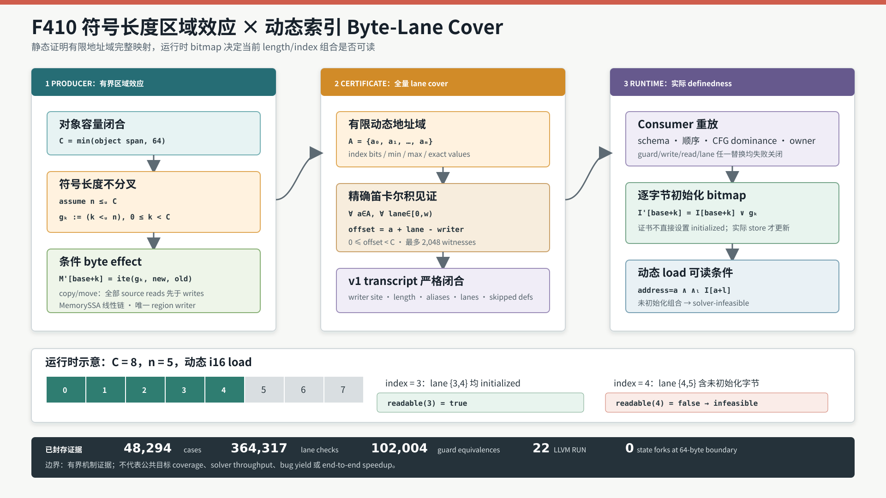

# F410：符号长度区域效应与动态索引 Byte-Lane Cover

> 日期：2026-08-16  
> 定位：F408/F409 静态区间初始化证明之后的动态索引、符号长度内存模型  
> 等级：I/T/E（生产实现、双 LLVM 测试、独立有限域 oracle 与机制实验）

## 1. 问题与研究动机

真实程序常用符号长度初始化缓冲区，随后从符号索引读取多字节值：

```c
uint8_t b[64];
memset(b, 0x5a, symbolic_length);
uint64_t value = *(uint64_t *)(b + symbolic_index);
```

旧实现只接受常量长度区域操作；F408/F409 的初始化证书也要求 load/store 区间静态。直接枚举
`symbolic_length=0..64` 会复制状态，直接假定全部 64 字节已写又会错误接受
`symbolic_index + load_width > symbolic_length` 的读取。这里必须同时解决三个问题：

1. 在不按长度分叉的情况下表示 `memset/memcpy/memmove` 的条件字节效应；
2. 证明动态地址有限域中的每个 load lane 都映射到该区域；
3. 让实际运行时初始化 bitmap，而不是静态证书，决定当前 `(index,length)` 是否可读。

FSE 2021 的 bounded symbolic-size model 指出：符号大小应受具体对象容量约束，内存效应至少按
容量线性展开。MInt（ISEC 2022）进一步针对符号地址/长度的 `memcpy/memset` 提出 memory-aware
延迟效应。F410 是这些思想在本 continuation IR 上的**有界、证明携带式适配**：它不宣称完整
复现 MInt 的惰性 tuple memory model，也不宣称一般符号内存已经解决。

主要参考：

- [A Bounded Symbolic-Size Model for Symbolic Execution（FSE 2021）](https://www.cs.tau.ac.il/~maon/pubs/2021-fse.pdf)
- [MInt: Handling Memory-Intensive Operations in Symbolic Execution（ISEC 2022）](https://doi.org/10.1145/3511430.3511453)
- [LLVM MemorySSA 官方文档](https://llvm.org/docs/MemorySSA.html)
- [LLVM Alias Analysis 官方文档](https://llvm.org/docs/AliasAnalysis.html)
- [Memory-model-parametric compositional symbolic execution（2025）](https://arxiv.org/abs/2508.15576)

## 2. 语义模型

设对象可用容量为 `C`，当前实现要求 `1 <= C <= 64`；符号长度为 `n`，位宽为 `b`。若
`2^b-1 > C`，编译器先加入无符号约束：

\[
  0 \le_u n \le_u C
\]

对区域内第 `k` 个字节，生成条件守卫：

\[
  g_k := (k <_u n), \qquad 0 \le k < C
\]

`memset` 的值语义为 `M'[base+k] = ite(g_k, byte(v), M[base+k])`；`memcpy/memmove`
先读取全部源字节快照，再执行同样的条件写，因而保留重叠 `memmove` 的读取先于写入语义。
初始化 bitmap 的更新为：

\[
  I'[base+k] = I[base+k] \lor g_k
\]

令动态 load 的有限候选地址域为 `A`，load 宽度为 `w`。静态 cover 必须满足：

\[
  \forall a \in A,\ \forall \ell \in [0,w):
  0 \le a+\ell-writer < C
\]

证书记录映射 `lane(a,l) -> region_offset`。执行 load 时，候选 `a` 只有在地址条件与全部 lane
初始化条件同时成立时才可被选中：

\[
  readable(a) := address=a \land \bigwedge_{\ell=0}^{w-1} I[a+\ell]
\]

因此证书只证明“所有候选 lane 都有对应的条件写”，不会声称它们在任意长度下都已初始化。
若实际约束要求 `n` 太短，runtime 把该 `(index,n)` 组合约束为不可行。

## 3. 支持域与失败关闭边界

当前生产域：

- LLVM intrinsic 和外部 C 声明形式的 `memset`、`memcpy`、`memmove`；
- 符号长度位宽 1--64，容量上界 64 bytes；
- 区域 writer 的对象和基址静态，动态的是后续 load 地址；
- 一个 stack object，或一个带 guard 的 ordinary heap alternative；
- 最多 256 个动态 load 地址、2,048 个 `address x lane` witness；
- load scalar 宽度由既有 continuation IR 限制，本阶段生产测试覆盖 1--8 bytes；
- 从 load `MemoryUse` 到区域 writer 的真实线性 `MemoryDef` 链；
- 中间 scalar store 仅在对象/区间不交或 LLVM AA 给出 `NoAlias` 时跳过。

以下情形主动失败关闭：

- `MemoryPhi`、循环归纳、多个符号区域 writer 或多个候选 region effect；
- 动态 writer 基址、超过 64-byte 容量、超过 alias/lane 硬上界；
- volatile/atomic 操作、未知 call、部分 lane cover、重叠 clobber；
- `memcpy` 无法证明源/目标不交；
- source 或 destination object span 无法静态定界；
- 多 heap alternatives、跨过程动态区域以及完整 lazy memory tuple。

唯一 region-effect 限制还有一个协议原因：lowered 条件 region stores 不计入普通 scalar-store
ordinal。允许同函数多个 region writer 会改变 consumer 对后续普通 store 的 ordinal 命名空间，
因此在扩展 transcript 前必须保守拒绝，而不能输出无法稳定重放的证书。

## 4. 编译期执行流程



对每个受支持 region call 和动态 load，执行顺序如下：

1. `symbolicRegionEffect` 识别 intrinsic/外部 `memset/memcpy/memmove`；
2. `boundedSymbolicRegionExtent` 从 pointer provenance 与 object span 计算 `C <= 64`；
3. 必要时生成唯一 `ule(n,C)` 比较和 `assume`；
4. 对 `k=0..C-1` 生成 `ult(k,n)` lane guard；
5. `memcpy/memmove` 在任何写之前读取全部 source bytes；
6. 生成 C 个 guarded byte stores，并附加稳定 site、kind、offset、length 与 capacity 元数据；
7. 对动态 load，`memoryAliases` 枚举有限地址/索引域；
8. 从 load 的真实 LLVM `MemoryUse` 沿 MemoryDef 链逆行到唯一 region writer；
9. 验证 writer 支配 load、对象相同、所有 `address x lane` 落入 `[writer,writer+C)`；
10. 记录允许跳过的 disjoint scalar definitions，生成 v1 proof transcript；
11. continuation consumer 做 whole-function region contract 校验和 use-point certificate 重放；
12. runtime 执行 guarded stores、更新逐字节 bitmap，并在动态 load 处施加 definedness 约束。

这个流程没有为 65 个长度值创建 65 个 continuation state。符号性保存在 guard 表达式、内存
ITE 和初始化 bitmap 中。

## 5. Proof-Carrying Artifact

成功 load 声明 capability `bounded-symbolic-length-byte-lane-cover`，并携带：

```json
{
  "schema": "symcc-symbolic-length-byte-lane-cover-v1",
  "base": 8,
  "load_bytes": 2,
  "writer": {
    "block": "bb0", "site": "...", "kind": "memset",
    "address": 8, "maximum_bytes": 8,
    "length_bits": 64, "length": {"var": "length"}
  },
  "index": {
    "bits": 64, "minimum": 0, "maximum": 6,
    "values": [0, 1, 2, 3, 4, 5, 6]
  },
  "load_addresses": [8, 9, 10, 11, 12, 13, 14],
  "lanes": [
    {"address": 8, "lane": 0, "region_offset": 0},
    {"address": 8, "lane": 1, "region_offset": 1}
  ],
  "skipped_defs": []
}
```

区域写本身使用四种严格 schema：

- `symcc-symbolic-length-region-bound-v1`：长度上界比较与 assume；
- `symcc-symbolic-length-region-guard-v1`：`offset < length`；
- `symcc-symbolic-length-region-read-v1`：copy source byte snapshot；
- `symcc-symbolic-length-region-write-v1`：条件目标 byte store。

## 6. Consumer 与信任边界

`LiveContinuationExecutor` 首先扫描整个函数并按稳定 site 分组，要求：

- schema 字段集合完全相等，offset 集合和顺序恰为 `0..C-1`；
- 每个 write 的 guard 恰好是同 offset 的 `ult(offset,length)`；
- 需要上界时恰有一对 `ule + assume`，且位于所有 guards 之前；
- destination 地址连续，copy source 地址连续；
- `memcpy/memmove` 的全部 reads 先于 writes，且逐 offset 绑定对应 store value；
- `memset` 没有 region reads，所有 byte writes 共享同一截断值；
- load alias/domain、index 位宽/上下界/值与 transcript 精确一致；
- lane 列表必须是地址域和 load lane 的精确笛卡尔积；
- writer site/kind/length/capacity、heap/stack owner、CFG dominance 和同块顺序一致；
- `allocation-noalias` skip 由 consumer 重算 object/interval，`aa-noalias` 绑定精确 operation。

LLVM producer 仍是 MemorySSA 链和 AA 数学事实的可信边界；JSON consumer 不重新运行 LLVM。
consumer 的职责是阻止证书移植到不同 operation、对象、index domain 或 region site。runtime 的
真实 live/size/byte-init 标记则是执行权威，证书本身从不直接把字节标成 initialized。

## 7. Runtime 行为

区域 byte store 使用既有 guarded-store 路径：

1. 求值 `g_k`；
2. 值更新为 `ite(g_k,new_byte,old_byte)`；
3. 初始化标记更新为 `old_init OR g_k`；
4. stack 标记绑定当前 frame owner，heap 标记同时受 live/logical-size 约束；
5. 动态 load 枚举证书允许的地址，为每个地址构造 `address_condition AND initialized`；
6. 所有候选的析取为空时，状态以 `infeasible` 停止，而不是返回未定义值。

输入文件中的 concrete bytes 只是 concolic seed，不是路径约束。实验不能把“seed 中 length=3”
误解释为 solver 固定 `length=3`；长度与索引的语义结论由独立有限域 oracle 和实际求解约束共同
验证。

## 8. 测试与实验结果

### 8.1 双 LLVM 生产链

`test/live_symbolic_length_byte_lane_cover.ll` 含 22 条 `RUN`，覆盖：

- 外部 `memset`、`memcpy` 与 LLVM `memset` intrinsic；
- stack dynamic i16 load，结果分别为 `0x4141`、little-endian `0x4443`、`0x4646`；
- 单槽 guarded heap alternative，结果 `0x4242`；
- disjoint global scalar store 的 NoAlias skip，结果 `0x4343`；
- 64-byte/1-byte 边界：64 aliases、64 lanes、index 63，结果 90；
- 64-byte/8-byte 边界：57 aliases、456 lanes、index 56，结果 `0x5a5a5a5a5a5a5a5a`；
- 两个边界工件均断言 continuation state forks 为 0；
- partial cover、overlapping post-region clobber、multiple region effects 三类 source negative；
- region/certificate capability、bound、guard offset、writer、lane offset、index maximum、skip proof
  等篡改拒绝。

LLVM 17 与 LLVM 18 聚焦测试均 1/1 文件通过；F406--F410 关联测试各 5/5 文件通过。

### 8.2 独立有限域 oracle

oracle 不调用 C++ producer 或 Python consumer，而是独立穷举 half-open interval 与 lane guard：

| 指标 | 封存结果 |
|---|---:|
| object size | 2--12 bytes |
| load width | 1--8 bytes |
| 总 cover/non-cover cases | 48,294 |
| 合法 cover 接受 | 7,525 |
| 非 cover 拒绝 | 40,769 |
| lane checks | 364,317 |
| runtime guard equivalences | 102,004 |
| 结构化证书 mutation | 10 / 10 拒绝 |

### 8.3 机制成本与基数

64-alias、1 lane/alias、11 轮、每轮 1,000 个 Python reference certificate 的封存结果：

- median：10,309 ns/certificate；
- batch minimum/median/maximum：9,995,838 / 10,309,694 / 11,218,936 ns；
- bounded length values：65；
- conditional byte writes：64；
- continuation state forks：0。

最后三项是生成边界的分析基数和运行时属性，不是 `65x` wall-clock speedup。计时只代表 Python
reference validator，不代表 LLVM construction、executor throughput、solver time、coverage、
漏洞发现数量或端到端性能。

### 8.4 回归门禁

- F410 Python：5 passed；
- F406--F410 相关 Python：10 passed；
- 完整 Python：1,051 passed 加 250 subtests，零 skip/xfail/deselection/node-ID drift；
- 完整 LLVM 17：271 discovered，269 passed 加 2 个既有 unsupported，零失败。

完整门禁的机器可读 JSON、日志、环境、源码合同、研究来源与 SHA-256 清单位于
`docs/codex/evidence/f410-symbolic-length-byte-lane-cover-2026-08-16/`。

## 9. Review 中修复的问题

1. **heap guard 保留**：单个 guarded heap alternative 必须把 alias case 原样带到 region byte
   store，不能退化为无条件静态地址。
2. **memmove 快照**：所有 source byte reads 必须发生在任何 destination write 之前，避免重叠
   区域按 `memcpy` 顺序被破坏。
3. **region ordinal 稳定性**：多个 region effects 会污染普通 scalar-store ordinal namespace；
   当前用唯一 effect 限制失败关闭。
4. **未知 call skip**：未把尚未验证的 NoModRef call skip 暴露为能力，只允许可重放的 scalar
   store NoAlias skip。
5. **seed 与约束区分**：删除把 concrete seed 当成 symbolic-length equality 的错误负测试。
6. **指标命名**：把易被理解为枚举执行的 `path_forked_length_cases` 改为
   `bounded_length_values`，并明确零状态分叉不是 65 倍性能提升。
7. **consumer 闭合**：加入 whole-function site 分组、精确字段/顺序、read-before-write、lane
   Cartesian product、orphan capability 与 transcript mutation 检查。
8. **边界真实性**：生成式 fixture 真实穿过 LLVM lowering 与 executor，覆盖 64-byte capacity、
   64 aliases 和 456 lanes，而不只在 Python 模型中声称达到上界。

## 10. 先进性、创新性与挑战性

- **先进性**：把 bounded symbolic-size、memory-aware region effect、LLVM MemorySSA/AA、
  proof-carrying continuation 和动态 byte-init checking 连接为可执行生产链。
- **框架创新**：证书证明的是动态地址域到条件区域 lane 的全覆盖映射；实际长度充分性由
  runtime bitmap 求解，而不是由静态分析冒进假设，形成静态 cover 与动态 definedness 分工。
- **挑战性**：需要同时维护 unsigned length 语义、半开区间、宽 load 的逐 lane definedness、
  memmove snapshot、stack/heap owner、LLVM 17/18 MemorySSA API 和跨层 artifact identity。
- **科研严谨性**：正例、source negative、artifact mutation、独立穷举 oracle、生成上界和严格
  claim boundary 同时封存。

这里不宣称发明 bounded symbolic size 或符号内存模型，也不宣称完整 MInt。创新性只限于该
框架中的有界组合方式、证书协议和 producer/consumer/runtime 三层闭环。

## 11. 后续状态与剩余边界

F410 当时保留的 loop-carried `MemoryPhi` 首个规范切片已由 F411 完成：单 latch、seed 0、
unit-step、unsigned input-derived bound 和唯一逐字节 writer 现在可以生成 lane-to-iteration
证书，实际 definedness 仍由 runtime bitmap 决定。详见
[`F411研究报告`](Loop_MemoryPhi_Byte_Lane_Induction_F411_2026-08-16.md)。

仍未完成的是多 region writer composition、动态 writer base、多对象 guarded heap union、跨过程
dynamic interval、lazy tuple memory、递归/间接调用 effect，以及多 latch、conditional/strided
loop writer 和 heap-heavy 公共目标上的 coverage/solver/end-to-end 对照。

## 12. 复现

```bash
ninja -C build SymCC
ninja -C build-llvm17 SymCC
lit -v --filter='live_symbolic_length_byte_lane_cover' build/test
lit -v --filter='live_symbolic_length_byte_lane_cover' build-llvm17/test
PYTEST_DISABLE_PLUGIN_AUTOLOAD=1 pytest -q -p no:cacheprovider \
  test/test_symbolic_length_byte_lane_cover.py
python3 benchmark/check_symbolic_length_byte_lane_oracles.py
python3 benchmark/benchmark_symbolic_length_byte_lane_cover.py
```

复现结果只能在相同 capability、fixture、参数和 claim boundary 下比较。微基准时间会受 CPU、
Python 版本与系统负载影响，不能脱离环境文件横向外推。
