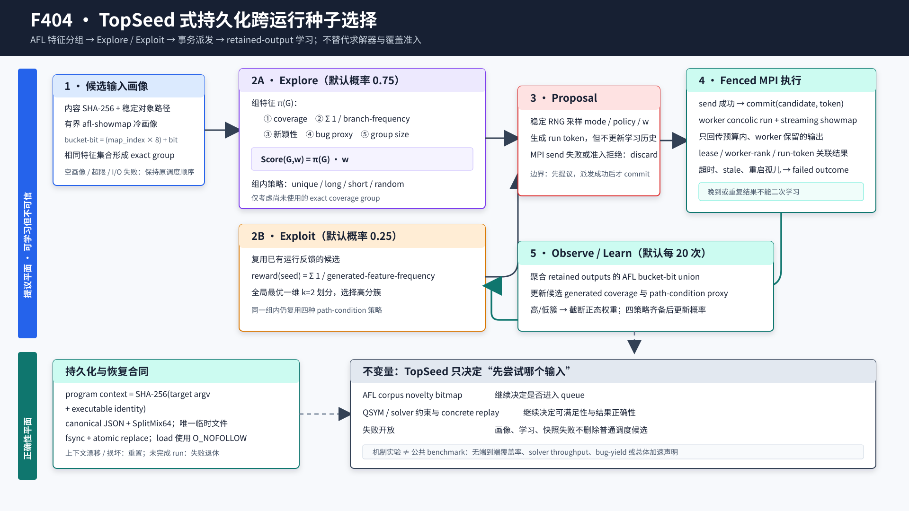

# F404：TopSeed 式持久化跨运行种子选择

## 0. 结论与边界

- 功能编号：F404
- 实现日期：2026-08-15
- 生产入口：MPI hybrid master 的 source scheduling 与 worker result triage
- 配置入口：`SYMCC_TOPSEED=0/1`，adaptive scheduler 开启时默认启用
- 交付分级：`I/T/E-mechanism`
- 证据目录：[`f404-topseed-campaign-selection-2026-08-15`](../evidence/f404-topseed-campaign-selection-2026-08-15/)

F404 落地的是**跨符号执行运行的种子选择**，不是单次运行内部的 pending-state
searcher。它将 TopSeed 的 Explore/Exploit、coverage-equivalent group、五维组特征、四种
组内策略、基于稀有覆盖的复用和在线分布学习，接入现有的 AFL/SymCC MPI campaign。
选择器只改变“哪个已有输入先获得一次 concolic 预算”，不改变约束的 SAT/UNSAT 语义，
也不绕过 AFL corpus novelty 或 concrete replay。

本次关闭的是生产可达、持久、事务化的机制切片。以下结论**没有**由当前证据支持：

1. 不宣称逐行复现作者 KLEE-2.1 工件；
2. 不宣称当前 AFL bucket-bit group 等同于作者的 gcov/KLEE branch set；
3. 不宣称 worker-retained output 等同于作者收集的全部 terminal input；
4. 不宣称论文的 35.5% 平均 branch gain 或 10 个 bug 已在本项目复现；
5. 不宣称机制微基准给出了公共目标 coverage、solver throughput、bug yield 或总体加速。

## 1. 主来源与算法身份

主来源是 Jaehyeok Lee 与 Sooyoung Cha 的 “TopSeed: Learning Seed Selection Strategies
for Symbolic Execution from Scratch”，ICSE 2025，
[DOI 10.1109/ICSE55347.2025.00095](https://doi.org/10.1109/ICSE55347.2025.00095)。
作者工件为 [Zenodo 14602979](https://doi.org/10.5281/zenodo.14602979)，代码仓库为
[`skkusal/TopSeed`](https://github.com/skkusal/TopSeed)。本次核验身份如下：

| 对象 | 身份 |
| --- | --- |
| GitHub HEAD | `2193d090a6650edc08ee30b927e65ba9e6f9e045` |
| 下载的 `TopSeed.zip` | SHA-256 `7faee4308f67ba21518935c002948b924f5ae137d5676bb329202fcd6b576d12` |
| 工件内 accepted paper | SHA-256 `dac02e44533adc16527254370c1f7f5319f15f3f88e30e9a058e9b963f3e0b13` |
| 工件归档提交注释 | `339ace19430169a91f2f1a5bb121a9cd19f365b8` |

TopSeed 的算法身份容易被误读。它不是 topological execution，也不是给当前 ready states
按 CFG 距离排序。论文把总 campaign 分成许多短 symbolic-execution slices，每轮先从此前
生成的输入中选一个 seed，再从该 seed 启动下一次 symbolic execution：

```text
Gather generated inputs and outcomes
  -> Explore a never-used coverage group OR exploit a previously useful seed
  -> run a short symbolic-execution slice
  -> append observed coverage / bug / path-condition data
  -> periodically learn weight and policy distributions
```

论文默认 `eta_time=120s`、Explore/Exploit 为 `0.75/0.25`、`eta_Learn=20`。工件
`topseed.py` 实际把 `eta_lp` 写为 10，而论文算法说明和超参数章节均写 20。本实现采用论文
默认 20，同时提供配置项，且把该论文/工件差异写入证据而不静默选择一方。

论文在 17 个开源 C 程序、4 个 KLEE 系 baseline、每目标总预算 10 小时、每实验 5 次的
设置下报告：相对 KLEE、Learch、Homi、KLEE-Array 各自 BASE，branch coverage 分别提高
33.0%、38.1%、31.6%、40.1%，四组平均为 35.5%；Table VI 合计报告 BASE 7 个、随机
seed 8 个、TopSeed 10 个可复现 bug。以上是**论文结果**，不是本项目实验数据。

## 2. 总体架构与执行次序



生产执行按以下顺序发生：

1. master 从 AFL queue、SymCC feedback 和已恢复工作中形成普通 source 候选；
2. 每轮最多对 `SYMCC_TOPSEED_PROFILE_BUDGET` 个尚未画像的候选执行 bounded
   `afl-showmap`；
3. 输入先进入 content-addressed object store，内容 SHA-256 作为候选身份；
4. showmap bitmap 被展开为稳定 bucket-bit feature set，非空画像才可 admission；
5. 选择器在可用路径与有界历史路径的并集上提出一个 proposal；
6. proposal 构造成一个 whole-input work item，并放在本轮普通/DPOR/carried item 之前；
7. target lease、state shard、参数策略和 worker bitmap 等既有准入全部成功后，master 才
   `comm.send`；
8. `comm.send` 成功后，TopSeed proposal 才 `commit` 并形成 pending run token；
9. worker 执行 SymCC、对生成输出作 streaming showmap 和预算内去重；
10. master triage 已回传输出，保持 AFL queue novelty 的原事务顺序；
11. worker-rank 绑定的 run token 消费 retained-output coverage union 与 solver telemetry；
12. `observe` 完成该 run，必要时学习分布，并原子保存 `.topseed_state.json`。

run history 已满且全是 pending 时，`propose` 提前失败开放，避免先发送再发现无安全槽位；
任何派发前拒绝或 send 失败只 `discard(proposal)`，不能把未执行提议记成一次选择。worker
超时、watchdog recovery、stale shared lease 和 shutdown orphan 形成 `failed=True` 的完成
结果；晚到或重复 token 被拒绝，不能二次学习。

## 3. Coverage 表示与候选分组

### 3.1 为什么不复用 corpus novelty bitmap 本身

本项目已有多个 bitmap，各自语义不同：

| 数据 | 空间 | F404 用途 |
| --- | --- | --- |
| AFL showmap / worker coverage | AFL map index 与 hit-count bucket | 候选画像、生成效果；也是 corpus novelty 的权威输入 |
| QSYM interest bitmap | `XXH32(pc,taken)` 的独立 131072-byte 空间 | 重复 query/branch interest；F404 不读取 |
| solver branch trace | 稳定 branch site、taken 与 query telemetry | path-condition proxy；不作为 AFL novelty |

F404 使用 AFL map 是为了让选种反馈与实际 hybrid campaign 的覆盖域一致，但不共享可变
`CoverageBitmap` 对象。画像首先产生不可变 feature tuple，再进入选择器；AFL 的 corpus
merge/claim 仍由原有事务单独执行。

### 3.2 bucket-bit 编码

对 bitmap 第 `i` 个字节 `v` 的每个置位 bucket `b`，定义：

```text
feature(i,b) = (i << 3) | b,  b in [0,7]
```

因此不同 map slot 与不同 hit-count bucket 均不会在选择器中坍缩。稠密 bytes 与稀疏
`(index,value)` 表采用同一编码；输出排序、去重并受 `max_features` 限制。输入画像的 exact
feature set 经过带域分隔符的 SHA-256 得到 group identity：

```text
group = SHA256("symcc-topseed-coverage-group-v1\0" || uint64_be(feature_0) || ...)
```

作者论文按“覆盖相同 branch set”分组；当前适配按“相同 AFL bucket-bit set”分组，包含
hit-count bucket 信息，通常比 branch set 更细。这是有意的工程适配，不应描述成作者分组
表示的等价替换。

## 4. Explore：新组选择

设候选组 `G` 覆盖特征集合为 `B(G)`，已积累候选数据为 `D`，已选择组覆盖并集为 `SB`。
本实现保留论文五项特征：

```text
pi_1(G) = |B(G)|
pi_2(G) = sum_{b in B(G)} 1 / frequency(b,D)
pi_3(G) = |B(G) \ SB|
pi_4(G) = group 中 triggers_bug 的候选数
pi_5(G) = |G|
Score(G,w) = sum_{i=1..5} pi_i(G) * w_i
```

只对未进入 `used_groups` 的组评分；最高分以 group SHA-256 确定性打破平分。权重初始从
`[-1,1]` 均匀分布采样，学习后可从截断正态采样。权重允许为负，这是论文用于学习“应
偏爱还是回避某种属性”的必要表达能力，不能把所有特征硬编码成正向奖励。

在最高分组内，四种策略为：

- `unique`：选择拥有最多组内独占 path-condition token 的输入；
- `long`：选择 path-condition token 数最多的输入；
- `short`：选择 token 数最少的输入；
- `random`：使用可持久恢复的 SplitMix64 流均匀选择。

当前 path condition 来自一次已接纳运行的 `branch_trace`，编码为
`(site << 1) | taken`；超过直接 63-bit 编码域的 site 使用带域分隔符 SHA-256 压缩。它是
hybrid telemetry proxy，不是作者 KLEE 工件保存的完整约束表达式 `Phi`。没有 telemetry
时条件为空，`long/short/unique` 依靠稳定身份平分，不制造虚假约束信息。

## 5. Exploit：复用有效 seed

对曾被执行且产生非空 retained-output coverage 的 seed `s`，令 `B_s` 为它历次生成特征
的有界并集，`TB` 为所有可复用 seed 的这些集合：

```text
frequency'(b,TB) = |{B_s in TB | b in B_s}|
Eval(s,TB) = sum_{b in B_s} 1 / frequency'(b,TB)
```

该分数奖励能生成稀有覆盖的 seed。本实现把一维得分分成两个 cluster，并选择均值较高的
一簇。初版按普通 Lloyd iteration 编写，但独立 oracle 找到了局部划分依赖初始化的问题；
最终实现对排序得分枚举全部 `n-1` 个切分点，通过 prefix sum/prefix squared sum 精确计算
两侧 SSE，选择全局最优的一维 `k=2` 划分。复杂度为 `O(n log n)`，结果确定且不依赖
scikit-learn 版本、初始化或浮点随机种子。

若没有可复用 seed，Exploit 失败开放到 Explore；若所有新组已用完，Explore 失败开放到
Exploit；两者均无候选时返回 `None`，普通 source 顺序继续执行。

## 6. Learn：从运行效果更新分布

每累计 `learn_interval` 个 fenced completion，选择器用相同 inverse-frequency reward 对已
完成 run 分群：

1. 高分 run 的每一维权重计算均值与总体标准差；
2. 若高/低组该维分布差异大于 0.1，后续在 `[-1,1]` 截断正态采样；
3. 差异不足时退化为 `[-1,1]` 均匀采样，避免从弱证据过拟合；
4. 分别合并四种 policy 产生的 coverage set，以 inverse-frequency reward 归一化为策略概率；
5. 只有四种 policy 均已有非空覆盖时才更新概率，防止早期未采样策略被永久饿死。

工件依赖 NumPy/SciPy/scikit-learn，且个别异常路径存在变量名拼写脆弱性。本实现只用标准
库，显式限定候选、运行、feature、pending proposal 与快照字节预算；这种改写提高了部署
和恢复确定性，但不是工件实现逐行一致性证明。

### 6.1 retained-output 反馈的含义

本项目 worker 在回传前已进行对象数、总字节、hint 与单对象预算检查，并用本地 coverage
去重。因此 F404 的 `generated_coverage` 是**worker 实际保留并回传的输出 feature union**，
不是 SymCC 生成目录中的全部文件，更不是 KLEE 的全部 terminal state。这样可以控制 MPI
流量并与实际可进入 campaign 的结果对齐，但对被 worker 去重或预算拒绝的输出没有观测。

`triggers_bug` 沿用现有 hybrid triage 的进程结果约定：非 timeout 且 timeout-wrapper
return code 大于 128（排除 137）视为 crash proxy。它是组特征信号，不是漏洞去重、根因
归并或原程序复现证明。

## 7. 事务、持久化与恢复

### 7.1 proposal / commit / observe 三相边界

状态机分成三相：

```text
propose: 采样并产生 token；只进入内存 pending proposal
commit:  仅在 MPI send 成功后增加 candidate.uses / selections，创建 pending run
observe: 仅接受 token 对应的第一次结果，完成 run 并更新学习数据
```

token 对 candidate、group、mode、policy、weights 与单调 serial 的 canonical JSON 作
SHA-256。快照恢复校验：

- `explore_selections + exploit_selections == selections`；
- 全部 `candidate.uses` 之和等于 selections；
- `len(runs) + evicted_runs == selections`；
- `used_groups` 恰好等于 uses 大于零的候选 group；
- pending run 不得携带 outcome；bug run 必须反映到其候选；
- feature 必须严格升序、唯一并在预算内；概率必须有限且总和为 1。

### 7.2 canonical snapshot

`.topseed_state.json` 保存：

- schema 与 program context；
- seed、SplitMix64 state 与 draw count；
- Explore 比例、学习周期和三项容量；
- 五个 weight distributions 与四个 policy probabilities；
- 选择、完成、学习、冲突、丢弃和驱逐计数；
- 有界候选、运行历史和已用 group。

保存使用同目录安全唯一临时文件、file `fsync`、`os.replace` 和 directory `fsync`。深度
review 修复了“只含 PID 的临时名遇到上次崩溃残留后永久保存失败”的问题。读取使用
`O_NOFOLLOW`、descriptor-bound `fstat`、regular-file 与最大字节检查，再严格解析 canonical
JSON；symlink、损坏、超限、非有限数、字符串布尔和多余字段均失败关闭。

program context 绑定 target command 与 executable identity。恢复时上下文不匹配或快照损坏
会创建空选择器，不污染普通 scheduler；已 commit 但 coordinator 丢失 run association 的
pending run 被显式完成为 failed，迟到结果因此不能复活旧 token。

## 8. 配置、上界与遥测

| 配置 | 默认 | 范围 | 说明 |
| --- | ---: | ---: | --- |
| `SYMCC_TOPSEED` | adaptive 时 1 | bool | 启用跨运行 proposal lane |
| `SYMCC_TOPSEED_SEED` | 0 | 0..2^63-1 | 可恢复 RNG 初始 seed |
| `SYMCC_TOPSEED_EXPLORE_RATIO` | 0.75 | 0..1 | Explore 采样概率 |
| `SYMCC_TOPSEED_LEARN_INTERVAL` | 20 | 1..1,000,000 | fenced completions 学习周期 |
| `SYMCC_TOPSEED_CANDIDATES` | 65,536 | 2..1,000,000 | 候选上限 |
| `SYMCC_TOPSEED_RUNS` | 262,144 | 2..1,000,000 | 运行历史上限 |
| `SYMCC_TOPSEED_FEATURES` | 65,536 | 1..1,000,000 | 单观察 feature 上限 |
| `SYMCC_TOPSEED_PROFILE_BUDGET` | 16 | 1..4,096 | 每轮冷 showmap 数 |

候选容量只驱逐 `uses==0` 且没有 pending proposal 的输入；运行容量只驱逐完成项。若没有
安全 victim，proposal 在派发前失败开放；防御性 commit 异常也 discard proposal，而不是
删除仍被引用的历史或泄漏 pending token。画像缓存受候选上限
与 65,536 的较小值约束，失败画像以空 tuple 缓存，避免相同坏输入每轮重复阻塞。

`telemetry()` 报告候选、组、运行、pending、Explore/Exploit、学习轮、冲突、丢弃、驱逐、
分布和 `proposal_plane_only=True`。它是策略审计数据，不是 coverage 或 SAT proof。

## 9. 实现映射

| 文件 | 责任 |
| --- | --- |
| `util/topseed_selector.py` | 有界算法、稳定 RNG、分组、Explore/Exploit/Learn、状态机、快照 |
| `util/mpi_fuzzing_helper.py` | source 画像、proposal work item、事务派发、结果栅栏、triage 反馈 |
| `test/test_topseed_selector.py` | 算法、持久化、损坏、上界、MPI triage 与恢复反例 |
| `benchmark/check_topseed_oracles.py` | 不调用生产评分/聚类/转移 helper 的独立 oracle |
| `benchmark/benchmark_topseed_selector.py` | 10,000 候选机制成本与固定权重 target-order 实验 |
| `docs/Configuration.txt` | 配置合同与论文/工件默认差异 |
| `docs/Testing.txt`、`benchmark/README.md` | 重放命令与 claim boundary |

## 10. 测试与实验结果

### 10.1 正确性门禁

最终证据包括：

- TopSeed/MPI 关联回归：`202 passed + 91 subtests`；
- capability-closed 全量 Python：`1041 passed + 250 subtests`；
- node-ID inventory：1041 expected / 1041 observed，SHA-256
  `bbcfe092ee4c0fcec74f63eb910371509b074baaeb6a25d2b886f845d61adb48`；
- LLVM 17 全量：264 discovered，262 passed，2 个既有 unsupported，零失败；
- ruff、`py_compile`、technology-index check、`git diff --check` 和交付 verifier。

独立 oracle 共执行 11,417 次判定：

| Oracle | 数量 | 结果 |
| --- | ---: | --- |
| 80 个随机 exact group × 16 权重 × 3 确定策略 | 3,840 | 全通过 |
| inverse-frequency feature 复算 | 4,344 | 全通过 |
| 全局最优 1D `k=2` 切分复算 | 1,121 | 全通过 |
| 256 个 bitmap byte × 8 bit | 2,048 | 全通过 |
| snapshot 后 next-proposal 精确重启 | 64 | 全通过 |

### 10.2 机制成本与固定目标排序

默认机制基准使用 10,000 candidates、2,500 exact groups、512 个真实
`propose -> commit -> observe` 历史和 11 次测量。最终 raw JSON 见证据目录。本机结果为：

| 操作 | 中位数 | 最小值 | 最大值 |
| --- | ---: | ---: | ---: |
| Explore proposal | 30.480 ms | 27.875 ms | 43.004 ms |
| Exploit proposal | 1.449 ms | 1.169 ms | 16.062 ms |
| 2.866 MB snapshot serialization | 5.313 ms | 4.856 ms | 10.009 ms |
| strict snapshot restore | 54.078 ms | 52.071 ms | 60.744 ms |

固定权重 `(coverage=1, frequency=0, uniqueness=1, bugs=0, size=0)` 的刻意有利模型含
500 个 distractor 和 1 个高价值 group。FIFO 第 501 次才派发该输入，选择器第 1 次派发，
dispatch count 减少 99.8004%。这只证明同一候选集合上的评分/排序机制和成本；它没有运行
目标程序、solver、MPI 或 AFL campaign，不能换算为端到端时间或覆盖提升。

## 11. 创新性、挑战性与未关闭工作

相对直接移植作者脚本，本实现的工程创新在于：

1. 将 run-level learning 变成 proposal/commit/observe 三相事务，与现有 MPI send、lease 和
   worker-rank result fencing 对齐；
2. 用 AFL bucket-bit feature 把作者机制接到真实 hybrid feedback，同时保持 corpus novelty
   bitmap 的权威边界；
3. 用可快照 SplitMix64 与严格 canonical snapshot 保证同一状态恢复后的下一提议精确一致；
4. 用全局最优一维二聚类取代初始化敏感的通用 k-means；
5. 在候选、运行、feature、画像和快照各层设置独立预算，并只安全驱逐无引用历史；
6. 对损坏、上下文漂移、send 失败、stale result、shutdown orphan 和残留临时文件建立显式
   失败原子行为。

仍未关闭的研究工作：

- 作者 `eta_time=120s` 的独立短-run orchestration 目前复用本项目现有 worker timeout/profile，
  尚未形成 TopSeed 专属总预算切片器；
- 全部 generated terminal inputs 与完整 path-condition AST 未采集，当前是 retained-output 与
  branch-trace proxy；
- 尚未完成论文 17 程序、相同 CPU、5 次或更强功效设计的公开确认性复现；
- 尚未进行与随机 seed、普通 adaptive、TopSeed 关闭三者的等预算 campaign 消融；
- 论文 bug 结果需要原程序复现与唯一根因归并，当前 crash proxy 不能替代。

因此 F404 状态为 `I/T/E-mechanism`，不能提升为 `R`。下一项 W1 工作应转向通用
heap/points-to 与 native continuation adapter；公开效果结论统一留到 W10 预注册实验。
