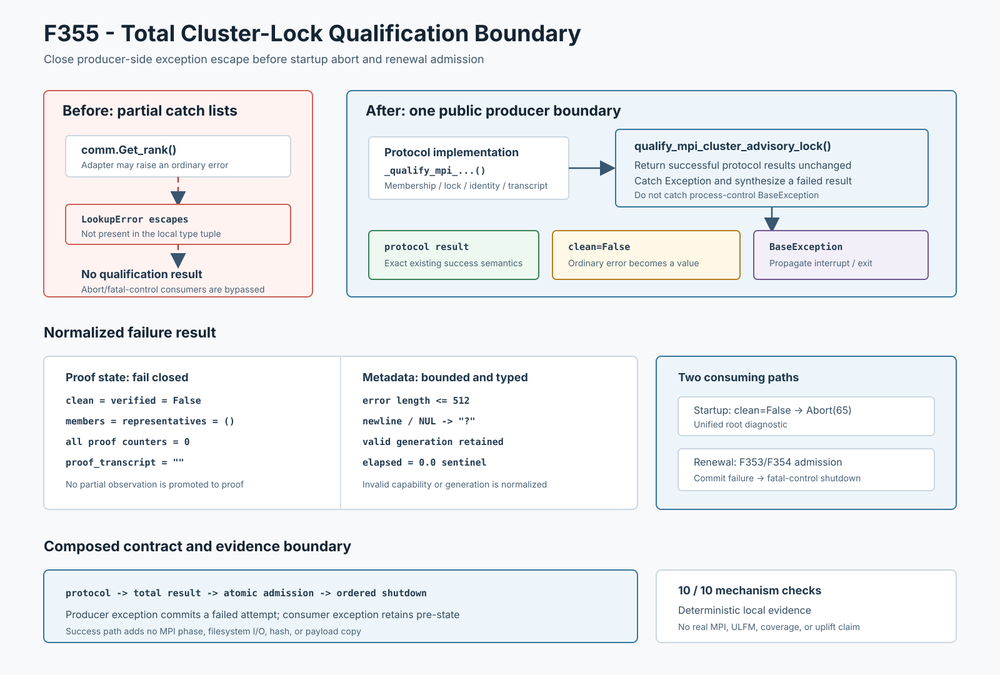

# F355：Total Cluster-Lock Qualification Boundary

- 功能编号：F355
- 日期：2026-08-10
- 状态：已实现、已进行机制验证
- 范围：MPI共享锁资格生产者的普通异常总化与失败关闭



## 1. 研究背景与真实缺陷

F351把共享锁资格绑定到当前filesystem/root/leaf身份，F352增加generation-bound proof transcript，
F353保证续期结果准入的commit-or-rollback，F354又把completion内部普通异常接入运行时fatal-control。
这条链仍有一个更早的缺口：**资格结果生产函数本身不是total function**。

`_bounded_master_exchange()`只枚举捕获`AttributeError`、MPI异常、`OSError`、`RuntimeError`和
`ValueError`。一个合法的第三方communicator adapter若从`Get_rank()`抛出未枚举的普通异常，公共
`qualify_mpi_cluster_advisory_lock()`会直接展开Python栈。可执行反例为：

```text
UnexpectedCommunicator.Get_rank()
    -> LookupError("injected communicator adapter failure")
    -> 旧 public qualification API 异常逃逸
```

该逃逸发生在`ClusterLockQualificationResult`生成之前，因此同时绕过两条生产消费链：

1. 启动期无法执行`if not qualification.clean -> comm.Abort(65)`；
2. 运行期无法把失败结果送入F353/F354 completion与`fatal_control_error`。

最坏情况下，一个master因普通Python异常单边展开，而其他master仍在有限期exchange、startup或有序
shutdown状态机内。内部协议虽然有deadline，但调用层失去了统一的失败分类和有界诊断。

## 2. 设计目标与语义区分

F355在解释器仍能分配失败结果的通常资源模型下，把公共qualification API定义为普通异常域上的total
function：对继承`Exception`的内部失败，调用者得到结构合法、失败关闭的
`ClusterLockQualificationResult`；`KeyboardInterrupt`、
`SystemExit`等直接继承[`BaseException`](https://docs.python.org/3/library/exceptions.html#exception-hierarchy)
的进程控制信号仍传播。

这里必须区分F353/F354与F355的事务语义：

| 层次 | 操作角色 | 普通异常后的状态语义 |
|---|---|---|
| F353/F354 completion | 消费一个已生成结果 | 保留已有controller pre-state，不提交attempt |
| F355 qualification | 生产一个新的资格结果 | 完成一次失败的资格尝试，返回`clean=False`结果 |

F355不能“回滚到没有返回值”，否则生产调用链仍无法收敛。它也不能伪造成功或保留部分proof计数；异常结果
必须是一个明确的、零证明负载的失败值。

## 3. 公共/内部边界重构

原协议实现重命名为私有函数：

```text
_qualify_mpi_cluster_advisory_lock(...)
    -> 执行membership、lock litmus、identity closure和transcript commit

qualify_mpi_cluster_advisory_lock(...)
    -> 调用内部实现一次
    -> 正常结果原样返回
    -> Exception转换为规范化失败结果
    -> BaseException继续传播
```

公共签名、调用参数、成功结果、MPI消息、proof transcript和磁盘schema均不变。启动期和运行期已经导入
同一公共符号，无须维护第二份异常策略，也不会出现两个调用方捕获类型列表再次漂移。

## 4. 失败结果规范化

普通异常映射到以下确定性结果：

```text
clean = False
verified = False
members = representatives = ()
rounds = contention_checks = release_checks = identity_checks = 0
proof_transcript = ""
elapsed = 0.0
error = "cluster lock qualification raised: " + bounded_detail
```

附加规则为：

1. `capability`只有在输入是精确可识别的`SharedFilesystemCapabilities`时保留，否则规范化为`None`；
2. `qualification_generation`只有在类型是`int`且位于允许区间时保留；`bool`虽然是Python的`int`子类，
   仍明确拒绝并归零；
3. 诊断删除换行和NUL，并把包含固定前缀的总长度限制为512字符；
4. 若异常对象的`__str__`本身再次抛异常，则用异常类型名替代；类型名也独立执行清洗与同一长度上限，
   防止超长或含换行的动态类名绕过边界；
5. 所有proof字段归零，避免异常发生位置被误表述为已完成的分布式证明进度。

`elapsed=0.0`表示公共边界无法可信恢复内部开始时间和失败时刻，不代表异常执行没有耗时。它是“未提供
可信测量”的哨兵值，不能用于性能统计。

## 5. 两条生产消费链

### 5.1 启动期

```text
local filesystem probe
  -> public qualification boundary
  -> clean result: retain existing startup semantics
  -> ordinary exception result: clean=False
  -> root diagnostic + comm.Abort(65)
```

因此未枚举的communicator/clock/adapter异常不会再越过启动资格门。这里仍是fail-stop作业策略，不提供
communicator repair或失败master替换。

### 5.2 运行期续期

```text
heartbeat -> public qualification boundary -> F353/F354 completion
  -> F355 exception result is admitted as a proof failure
  -> failure attempt is committed with invariant attempts=successes+failures
  -> result.error enters fatal_control_error and ordered shutdown
```

F355处理“结果生产失败”，F354处理“结果消费/记账失败”。二者串联后，普通异常无论发生在qualification
内部还是completion内部，都有明确的值化路径；两类异常的状态语义仍不同，不会把消费异常误记为一次
资格失败。

## 6. 成本、兼容性与并发属性

成功路径只增加一次Python wrapper调用和`try`正常穿越，不增加MPI phase、filesystem I/O、hash、序列化、
payload复制或solver调用。异常路径构造一个小型dataclass结果并最多规范化512字符诊断。

F355降低的是rank-local异常逃逸风险，但不改变peer等待的物理事实：某rank在进入/离开exchange附近失败时，
其他rank仍可能等待到既有deadline。边界保证本rank返回结构化失败值，不保证全体瞬时同步观察同一异常。

## 7. 测试与可重算证据

| 验证层次 | 结果 |
|---|---:|
| F355定向异常边界 | 1 passed，34 deselected |
| 资格模块 + MPI生命周期 | 94 passed + 75 subtests |
| 生产API机制集成 | 10/10 checks |
| 六模块相关回归 | 377 passed + 101 subtests |
| 完整warnings-as-errors Python | 770 passed + 121 subtests，95.48 s |

生产机制driver使用真实本地filesystem capability probe和公共qualification API，验证：

1. 单成员clean-but-unverified协议语义保持不变，成员观测按预期写入新capability；
2. 真实communicator `LookupError`被转换为失败结果；
3. generation和有效capability在异常结果中保留；
4. monotonic clock的`LookupError`被转换，`elapsed`使用零哨兵；
5. 长诊断经清洗后总长精确为512字符；
6. 异常文本格式化再次失败时使用类型名，超长且含换行的动态类型名仍受总长512字符约束；
7. 错误capability和布尔generation被规范化；
8. `KeyboardInterrupt`不被吞掉。

driver使用确定性单调时钟消除非语义计时抖动，两次JSON逐字节相同；checked-in JSON、log、测试摘要和驱动器
由目录级SHA-256清单覆盖。

## 8. 先进性、创新性与挑战性

1. **生产者与消费者双边异常闭合**：F354只覆盖result admission，F355向前闭合result construction，形成
   `protocol -> total result -> atomic admission -> fatal control`的连续失败语义；
2. **异常类型未来闭包**：公共边界依赖Python异常层次而不是人工枚举，内部新增普通异常类型不再要求所有
   调用方同步更新catch list；
3. **失败证据最小化**：异常结果不携带部分轮次或伪造elapsed，避免把不完整观察误解释为证明或性能数据；
4. **精确保留进程控制语义**：只捕获`Exception`，避免错误吞掉用户中断和解释器退出；
5. **可执行反例驱动修复**：不是基于静态猜测，真实`LookupError`先证明公共API非total，再由同一调用链验证
   containment、规范化和消费兼容性。

创新点是为现有MPI锁资格证明构造一个可审计的producer-side totalization contract，并与前两代本地事务/
rank containment组合；不声称发明异常值化、fail-stop协议或Python异常层次。

## 9. 局限与有效性威胁

1. 机制证据使用本地进程、真实本地filesystem probe和合成communicator，不是实际多机MPI/NFS/Lustre；
2. 没有验证ULFM revoke/shrink、rank replacement、跨rank异常广播或失败后继续执行；
3. peer仍依赖既有bounded timeout收敛，F355不提供同步异常共识；
4. `AssertionError`和`MemoryError`属于`Exception`，边界会尝试转为失败值；资源已经耗尽时，构造失败结果
   仍可能再次失败，因此这里的totality不覆盖无法继续分配对象的解释器状态；内部断言失败也会在公共边界
   失去原始traceback；
5. 512字符诊断可能截断深层根因，当前没有结构化跨ranktrace持久化；
6. driver的确定性时钟适合结果重算，不是运行时延迟测量；10/10是机制断言而非10次独立实验样本；
7. 没有运行target、solver、coverage、fuzzing campaign、漏洞或LAVA-M实验，不提供吞吐、覆盖率或漏洞发现
   提升结论。

## 10. 后续研究

1. 在真实双主机MPI环境分别注入startup和renewal communicator异常，核对所有rank的Abort/shutdown分类；
2. 给失败结果增加结构化stage/rank/generation诊断码，减少对截断字符串的依赖；
3. 审查`MPI.Get_processor_name()`和local filesystem probe的公共调用边界，把残余人工异常列表统一为同类
   total-result适配器；
4. 建立小型状态模型，组合F352 transcript、F353 admission、F354 consumer containment和F355 producer
   totalization，检查所有普通失败路径均不允许单rank继续工作；
5. 在有ULFM的部署中评估从fail-stop扩展到revoke/shrink后的有界恢复，但须以真实多机故障注入作为证据。

## 11. 结论

F355修复了一个已经执行复现的公共API异常逃逸：communicator adapter抛出的`LookupError`不再绕过startup
`Abort(65)`或runtime fatal-control。公共qualification函数现在对普通`Exception`返回结构稳定、失败关闭、
诊断有界的结果，对`BaseException`保留传播。该实现把F351-F354的证明与消费链向前闭合到结果生产边界；
当前证据严格支持本地机制正确性，不外推为分布式容错或符号执行性能提升。
