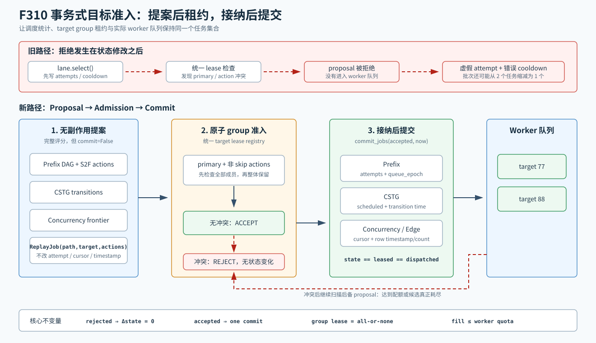

# F310：事务式目标准入与工作保持型回填

- 日期：2026-08-07
- 实现位置：`util/hybrid_feedback.py`
- 回归位置：`test/test_hybrid_feedback.py`
- 当前成熟度：I/T（实现与自动化测试）；尚无公开 target 的 R 级性能结论

## 1. 研究动机

F309 用 target group 租约解决了多个调度 lane 在 worker 返回前重复派发同一目标的问题，
但深度审查发现，候选生成与全局准入之间仍存在一个状态提交窗口：

1. Prefix DAG、CSTG 或 concurrency lane 在本地 `select()` 中先增加 `attempts`、推进游标、
   写入 `last_scheduled`；
2. scheduler 随后才在统一 target registry 上申请 group lease；
3. 如果另一 lane 已经接纳了同一 primary 或 S2F secondary target，当前候选被拒绝；
4. 被拒绝的任务虽然没有交给 worker，却已经污染尝试次数、冷却时间和轮转位置。

这不是单纯的统计偏差。Prefix 的 UCT 探索项使用 `attempts`，CSTG 和 concurrency 使用
`last_scheduled` 执行 cooldown；一次虚假提交会改变后续排序，并可能让仍未执行的目标在一个
冷却窗口内不可选。旧 target lane 还会在取得 `limit` 个**提案**后停止，再统一申请租约；若
两个提案冲突，请求 2 个 worker 最终可能只派发 1 个任务，即使候选列表中已有无冲突备选。



## 2. 相关研究与边界

- [WU-UCT](https://openreview.net/forum?id=BJlQtJSKDB)要求并行树搜索把尚未完成的工作显式纳入
  下一次选择状态。F309 已将这一原则映射为有界 target group lease；F310继续保证只有真正
  获得 lease 的工作才进入已调度统计。
- [Sparrow](https://www.istc-cc.cmu.edu/publications/papers/2013/sosp_sparrow.pdf)讨论分布式调度的
  late binding。F310只借鉴“尽量延后不可逆调度决定”的系统原则，在本地 coordinator 内把
  候选评分与资源准入分离。

F310不是 WU-UCT 公式、Sparrow 随机双选或分布式事务协议的复现，也不声称获得这些工作的
理论界限。这里的“事务式”特指一个很窄的状态不变量：**lease 成功前不修改调度统计，lease
成功后一次性提交与该任务对应的状态。**

## 3. 两阶段调度协议

### 3.1 Proposal 阶段

`ConcolicStateTransitionGraph.select()`、`PrefixDAG.select()` 和
`HierarchicalConcurrencyGuidance.select()` 新增 `commit=False` 模式。该模式仍执行完整的
评分、队列配额、seed 去重、S2F action 聚合和 cooldown 检查，但只返回不可变 `ReplayJob`，
不修改：

- Prefix node 的 `attempts`、`last_scheduled` 与 `queue_epoch`；
- CSTG transition 的 `last_scheduled` 与图级 `scheduled`；
- concurrency record 的 `last_scheduled` 与 `target_cursor`。

默认 `commit=True`，因此原有直接调用这些组件的代码保持原语义。

### 3.2 Admission 阶段

`AdaptiveHybridScheduler` 把 proposal 交给 F309 的统一 registry。`reserve_job()` 将 primary
target 和全部非 `skip` S2F action target 作为一个不可分割 group：

```text
proposal -> validate all targets are free -> reserve whole group -> accepted
                                      \---- conflict ---------> rejected
```

任一成员冲突时整个 proposal 被拒绝，不产生部分租约，也不进入提交阶段。edge-dependence lane
原本在自身选择器中直接申请租约，F310也把 `scheduled/last_scheduled/cursor` 移到租约成功之后，
消除该 lane 的同类虚假提交。

### 3.3 Commit 阶段

三个 proposal 型 lane 分别提供 `commit_jobs()`：

- Prefix 只对非 `skip` action 增加 node attempt，并在每个已接纳 job 上推进 `queue_epoch`；
- CSTG 只更新时间戳属于该 job 的 action transitions，并按已接纳 job 数增加 `scheduled`；
- concurrency 只更新已接纳 path 的时间戳，并把游标移动到实际 target 之后。

`_reserve_target_jobs()` 接受 `on_accept` 回调，只把成功获得 lease 的 job 集合交给对应组件提交。
这样调度状态、租约状态和实际 worker 队列拥有相同的任务集合。

### 3.4 Work-conserving 回填

target lane 对 Prefix 与 CSTG proposal 仍按轮次交错，保留两种模型的公平性；但不再在“看到
`limit` 个 proposal”时提前结束，而是在每次 lease 成功后才增加已接纳计数。冲突 proposal
被跳过，`seen(path,target)`也只在成功准入后记录，避免失败action group遮蔽同primary的
可行fallback。扫描继续到后备候选，直到：

- 已接纳数量达到 worker 配额；或
- 两个 lane 的本轮候选确实耗尽。

该性质是有界的工作保持：它不会绕过 cooldown、约束摘要或 target lease，也不会为了填满
worker 而派发已知冲突任务。

## 4. 正确性不变量

| 不变量 | F310 保证方式 |
| --- | --- |
| 未派发任务不计 attempt | proposal 阶段无副作用；commit 只接收 lease 成功集合 |
| 未派发任务不进入 cooldown | `last_scheduled` 仅在 `commit_jobs()` 中更新 |
| group lease 全有或全无 | `reserve_targets()` 先检查全部成员，再统一写入 |
| 实际并发度尽量达到配额 | 冲突后继续扫描 Prefix/CSTG 后备 proposal |
| 直接组件调用保持兼容 | `select()` 默认仍为 `commit=True` |
| edge lane 不产生虚假计数 | lease 成功后才推进 row 状态 |

## 5. 自动化验证

新增三项回归并加强两项已有回归：

1. 两个 edge row 指向同一 target 时只产生一个 job，且所有 row 的 `scheduled` 总和严格为 1；
2. Prefix 和 CSTG 提议同一 target 时，CSTG 被拒绝的 transition 保持
   `last_scheduled=0`、图级 `scheduled=0`，Prefix 只提交一次 attempt；
3. 请求两个 target job、首对 Prefix/CSTG proposal 冲突时，调度器继续扫描并返回
   `[77, 88]` 两个无冲突目标；
4. 两条 concurrency record 指向同一 target 时，只提交获得 lease 的 record，另一条不进入
   cooldown。
5. Prefix proposal 因 secondary action 冲突失败时，同一路径/primary但group可行的 CSTG
   fallback 仍可接纳，失败 Prefix node 不增加 attempt。

本轮定向结果：

- `pytest test/test_hybrid_feedback.py -q`：56/56；
- 调度与编排组合：92 passed 加 8 subtests；
- 完整 Python unittest：553/553（83.193 秒）；
- Ruff：通过。

文档机械校验结果同时记录在阶段研究进展和技术总账中。F310没有修改 LLVM pass，LLVM 门禁
继续沿用 F307 的最近完整结果。

## 6. 挑战性与创新点

F310的难点不在增加一个锁，而在保持四个异构调度模型的局部语义：Prefix 的 action attempt、
CSTG 的 multi-action transition、concurrency 的 round-robin target，以及 edge row 自带的
原子租约，都必须与统一 scheduler 的最终接纳集合对齐。若粗暴回滚，游标、聚合 action 和
并发到达的新反馈会使逆操作不可靠；因此实现选择了无副作用 proposal 和正向 commit。

相对于常见的“先选后去重”，本项目把 target-only/group 去重提升为一个可测试的准入协议，
同时保持 Prefix/CSTG 交错公平性与 worker 利用率。创新性位于混合符号执行的调度组合层，
而不是提出新的通用分布式事务算法。

## 7. 科研边界与下一步实验

当前测试证明状态机与回填行为，不证明覆盖率或吞吐一定提升。等 CPU 多轮消融应至少报告：

1. proposal、accepted、conflict、backfilled job 数和 batch fill ratio；
2. 虚假 cooldown 数（旧实现离线重放）与 target 等待时间；
3. unique target/CPU-hour、solver CPU、coverage AUC 和 time-to-target；
4. Prefix/CSTG/concurrency 各 lane 的接纳率与饥饿率；
5. target-only 与 seed-target 多样化租约策略的配对比较。

F310本身只保证单 coordinator 内的proposal/admission/commit一致性；其当时未完成的多
coordinator durable target lease 已由后续
[`F311`](Cross_Coordinator_Target_Fencing_F311_2026-08-07.md)实现。F311不回溯改变本文
记录的F310证据等级。
